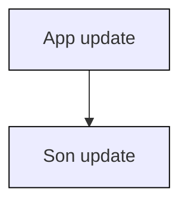

# React 组件性能优化

核心：减少渲染真实 DOM 节点的频率，减少 vDOM 比对的频率

## 组件卸载前进行清理操作

在组件中为 window 注册的全局事件,以及定时器,在组件卸载前要清理掉,防止组件卸载后继续执行影响应用性能

需求:开启定时器然后卸载组件，查看组件中的定时器是否还在运行。

```jsx
const Son = () => {
  useEffect(() => {
    let timer = setInterval(() => {
      console.log("定时器执行中");
    }, 1000);
    return () => clearInterval(timer); // 消除定时器
  }, []);
  return <div>this is Son</div>;
};
const App = () => {
  const [show, setShow] = useState(true);
  return (
    <>
      {show && <Son />}
      <button onClick={() => setShow(false)}>unmount</button>
    </>
  );
};
```

## 通过纯组件、缓存组件提升组件性能

React 组件默认的渲染机制:只要父组件重新渲染子组件就会重新渲染

作用：允许组件在 **<font color="#1565c0">Props 没有改变</font>** 的情况下跳过渲染

1. 什么是纯组件
   纯组件会对组件输入数据进行浅层比较，如果当前输入数据和上次输入数据相同，组件不会重新渲染

2. 什么是浅层比较
   比较引用数据类型在内存中的引用地址是否相同，比较基本数据类型的值是否相同

3. 如何实现纯组件
   类组件继承 PureComponent 类，函数组件使用 memo 方法

4. 为什么不直接进行 diff 操作,而是要先进行浅层比较，浅层比较难道没有性能消耗吗
   和进行 diff 比较操作相比，浅层比较将消耗更少的性能。diff 操作会重新遍历整颗 virtualDOM 树,而浅层比较只操作当前组件的 state 和 props

### 类组件中的 PureComponent

需求: 在状态对象中存储 name 值为张三，组件挂载完成后将 name 属性的值再次更改为张三，然后分别将 name 传递给纯组件和非纯组件

```jsx
import { Component, PureComponent } from "react";

class RegularComponent extends Component {
  render() {
    console.log("RegularComponent");
    return <div>{this.props.name}</div>;
  }
}

class PureChildComponent extends PureComponent {
  render() {
    console.log("PureChildComponent");
    return <div>{this.props.name}</div>;
  }
}

class App extends Component {
  constructor() {
    super();
    this.state = {
      name: "张三",
    };
  }
  updateName = () => {
    setInterval(() => {
      this.setState({ name: "张三" });
    }, 1000);
  };
  componentDidMount() {
    this.updateName();
  }
  render() {
    return (
      <div>
        <RegularComponent name={this.state.name} />
        <PureChildComponent name={this.state.name} />
      </div>
    );
  }
}
```

### 函数组件中的 memo



如果 Son 组件本身并不需要做渲染更新，是否存在浪费

```jsx
import { useState } from "react";
// 验证默认的渲染机制   子组件随父组件一起渲染

function Son() {
  console.log("我是子组件，重新渲染了");
  return <div>我是子组件</div>;
}

function App() {
  const [count, setCount] = useState(0);
  return (
    <div className="App">
      <button onClick={() => setCount(count + 1)}>+ {count}</button>
      <Son />
    </div>
  );
}
export default App;
```

#### 基础用法

```jsx
const MemoComponent = memo(function SomeComponent(props) {
  //...
});
```

经过 memo 函数包裹生成的缓存组件只有在 props 发生变化的时候才会重新渲染

```jsx
import { useState, memo } from "react";
// memo 进行缓存 只有 props 发生变化的时候
// 才会重新渲染 {context}

const MemoSon = memo(function Son() {
  console.log("我是子组件，重新渲染了");
  return <div>我是子组件</div>;
});

function App() {
  const [count, setCount] = useState(0);
  return (
    <div className="App">
      <button onClick={() => setCount(count + 1)}>+ {count}</button>
      <MemoSon />
    </div>
  );
}
export default App;
```

#### 传递自定义比较逻辑

memo 方法的第二个参数是个函数，根据该函数返回值来判断是否跳过渲染
false - 重新渲染
true - 跳过渲染
跟 shouldComponentUpdate 正好相反

```jsx
function compare(prevProps, nextProps) {
  if (
    prevProps.person.name !== nextProps.person.name ||
    prevProps.person.age !== nextProps.person.age
  ) {
    return false;
  }
  return true;
}

const ShowPerson = memo(function ({ person }) {
  console.log("render..");
  return (
    <div>
      {person.name} {person.age}
    </div>
  );
}, compare);

function App() {
  const [person, setPerson] = useState({
    name: "张三",
    age: 20,
    job: "programmer",
  });
  useEffect(() => {
    setInterval(() => {
      setPerson({ ...person, job: "coder" });
    }, 1000);
  }, []);
  return (
    <div>
      <ShowPerson person={person} />
    </div>
  );
}
```

### props 的比较机制

机制: 在使用纯组件、缓存组件之后，React 会对 **<font color="#1565c0">每一个 prop</font>** 使用 **<font color="#1565c0">Object.is</font>** 比较新值和老值，返回 true，表示没有变化

```javascript
// prop 是简单类型
Object.is(7,7)=>true
// 没有变化

//prop 是引用类型（对象/数组）
Object.is([],[])=>false
// 有变化，React 只关心引用是否变化
```

```jsx
// 1. 传递一个简单类型的 prop   prop 变化时组
// 件重新渲染

// 2. 传递一个引用类型的 prop   比较的时新值和
// 旧值的引用是否相等   当父组件函数重新执行时，
// 实际上形成的是新的数组引用

// 3. 保证引用稳定 - useMemo/useState 组件渲染的过程中缓存一个值
import { useState, memo } from "react";

const MemoSon = memo(function Son({ list }) {
  console.log("我是子组件，重新渲染了");
  return <div>我是子组件 {list}</div>;
});

function App() {
  const [count, setCount] = useState(0);
  // const list = [1,2,3]  2.
  const list = useMemo(() => {
    return [1, 2, 3];
  }, []);
  return (
    <div className="App">
      <button onClick={() => setCount(count + 1)}>+ {count}</button>
      <MemoSon list={list} />
    </div>
  );
}
export default App;
```

## shouldComponentUpdate

纯组件只能进行浅层比较，要进行深层比较，使用 shouldComponentUpdate，它用于编写自定义比较逻辑

返回 true 重新渲染组件，返回 false 阻止重新渲染

函数的第一个参数为 nextProps，第二个参数为 nextState

需求:在页面中展示员工信息,员工信息包括,姓名,年龄,职位,但是在页面中只想展示姓名和年龄,也就是说只有姓名和年龄发生变化时才有必要重新渲染组件，如果员工的其他信息发生了变化没必要重新染组件

```jsx
class App extends Component {
    state={
        person:{
            name:"张三",
            age:20,
            job:'programmer'
        }
    }
    componentDidMount(){
        setTimeout(()=>this.setState{person:{...this.state.person,job:"coder"}},1000)
    }
    shouldComponentUpdate(nextProps,nextState){
        if(this.state.person.name !== nextState.person.name || this.state.person.age !== nextState.person.age){
            return true
        }
        return false
    }
    render(){
        return <div>{this.state.person.name} {shit.state.person.age}</div>
    }
}
```

## 通过组件懒加载提升应用性能

### 基本使用

使用组件懒加载可以减少 bundle 文件大小 JS 资源只有在被访问时才会动态获取，目的是为了 **<font color="#1565c0">优化项目首次打开的时间</font>**

1. 把路由修改为由 React 提供的 **<font color="#1565c0">lazy 函数进行动态导入</font>**
2. 使用 React 内置的 **<font color="#1565c0">Suspense 组件</font>** 包裹路由中 element 选项对应的组件

```js
import {lazy} from 'react'
import {AuthRoute} from '@/components/AuthRoute'

// 1. lazy 函数对组件进行导入
const Home = lazy(()=>import('@/pages/Home'))
const Article = lazy(()=>import('@/pages/Article'))
const Publish = lazy(()=>import('@/pages/Publish'))

const router = createBrowserRouter([
  {
    path: '/',
    element: <AuthRoute><Layout/></AuthRoute>
    children:[
      {
        index:true,
        element: <Suspense fallback={'加载中'}><Home /></Suspense>
      },
      {
        path: 'article',
        element: <Suspense fallback={'加载中'}><Article /></Suspense>
      },
      {
        path: 'publish',
        element: <Suspense fallback={'加载中'}><Publish /></Suspense>
      }
    ]
  }
])
```

### 根据条件进行组件懒加载

适用于组件不会随条件频繁切换

```jsx
function App() {
  let LazyComponent = null;
  if (true) {
    LazyComponent = lazy(() => import(/* webpackChunkName: "Home" */ "./Home"));
  } else {
    LazyComponent = lazy(() => import(/* webpackChunkName: "List" */ "./List"));
  }
  return (
    <Suspense fallback={<div>Loading..</div>}>
      <LazyComponent />
    </Suspense>
  );
}
```

## 使用 Fragment 避免额外标记

React 组件中返回的 jsx 如果有多个同级元素,多个同级元素必须要有一个共同的父级

为了满足这个条件我们通常都会在最外层添加一个 div,但是这样的话就会多出一个无意义的标记,如果每个组件都多出一个这样无意义的标记，浏览器渲染引擎的负担就会加剧

为了解决这个问题,React 推出了 fragment 占位符标记,使用占位符标记既满足了拥有共同父级的要求又不会多出额外的无意义标记

```jsx
import { Fragment } from "react";

function App() {
  return (
    <Fragment>
      <div>msgA</div>
      <div>msgB</div>
    </Fragment>
  );
}
```

等价于占位符

```jsx
function App() {
  return (
    <>
      <div>msgA</div>
      <div>msgB</div>
    </>
  );
}
```

## 减少使用内联函数定义

在使用内联函数后,render 方法每次运行时都会创建该函数的新实例,导致 React 在进行 vDOM 比对时,新旧函数比对不相等，导致 React 总是为元素绑定新的函数实例，而旧的函数实例又要交给垃圾回收器处理

```jsx
const App = () => {
  const [inputValue, setInputValue] = useState("");

  return (
    <input
      value={this.state.inputValue}
      onChange={(e) => this.setState({ inputValue: e.target.value })}
    />
  );
};
```

最好的做法是在组件中单独定义函数，将函数绑定给事件，除非要额外传递自定义参数

```jsx
const App = () => {
  const [inputValue, setInputValue] = useState("");
  const inputHandler = (e) => {
    console.log("exec inputHandler");
    setInputValue(e.target.value);
  };
  return <input value={this.state.inputValue} onChange={inputHandler} />;
};
```

## 类组件中函数 this 绑定

在类组件中如果使用 fn() ひ 这种方式定义函数,函数 this 默认指向 undefined.也就是说函数内部的 this 指向需要被更正
可以在构造函数中对函数的 this 进行更正,也可以在行内进行更正,两者看起来没有太大区别,但是对性能的影响是不同的

```jsx
class App extends Component {
  constructor() {
    super();
    //方式一
    // 构造函数只执行一次，所以函数 this 指向更正也只一次
    this.handlerClick = this.handlerClick.bind(this);
  }
  handlerClick() {
    console.log(this);
  }
  render() {
    //方式二
    // 问题： render 方法每次执行时都会调用 bind 方法生成新的函数实例
    return <button onClick={this.handlerClick.bind(this)}>button</button>;
  }
}
```

## 类组件中的箭头函数

在类组件中使用箭头函数不会存在 this 指向问题，因为箭头函数本身并不绑定 this

```jsx
class App extends Component {
  handlerClick = () => console.log(this);
  render() {
    return <button onClick={this.handlerClick}>button</button>;
  }
}
```

箭头函数在 this 指向问题上占据优势,但是同时也有不利的一面

当 **<font color="#1565c0">使用箭头函数时,该函数被添加为类的实例对象属性,而不是原型对象属性</font>** ,如果组件被多次重用,每个组件实例对象中都将会有一个相同的函数实例，降低了函数实例的可重用性造成了资源浪费

综上所述,更正函数内部 this 指向的最佳做法仍是在构造函数中使用 bind 方法进行绑定

## 避免使用内联样式属性

当使用内联 style 为元素添加样式时,内联 style 会被编译为 javaScript 代码,通过 JavaScript 代码将样式规则映射到元素的身上,浏览器就会花费更多的时间执行脚本和渲染 U,从而增加了组件的渲染时间

```jsx
const App = () => {
  return <div style={{ backgroundColor: "skyblue" }}>App works</div>;
};
```

在上面的组件中,为元素附加了内联样式,添加的内联样式为 javaScript 对象,backgroundColor 需要被转换为等效的 CSS 样式规则,然后将其应用到元素，这样涉及到脚本的执行

更好的办法是将 CSS 文件导入样式组件.能通过 CSS 直接做的事情就不要通过 JavaScript 去做，因为 JavaScript 操作 DOM 非常慢

## 优化条件渲染

频繁的挂载和卸载组件是一项耗性能的操作,为了确保应用程序的性能,应该减少组件挂载和卸载的次数

在 React 中我们经常会根据条件渲染不同的组件,条件渲染是一项必做的优化操作

```jsx
const App = () => {
  if (true) {
    return (
      <>
        <AdminHeader />
        <Header />
        <Content />
      </>
    );
  } else {
    return (
      <>
        <Header />
        <Content />
      </>
    );
  }
};
```

在上面的代码中,当渲染条件发生变化时,React 内部在做 VirtualDOM 比对时发现,刚刚第一个组件是 AdminHeader,现在第一个组件是 Header,刚刚第二个组件是 Header,现在第二个组件是 Content,组件发生了变化,React 就会卸载 AdminHeader、Header、Content,重新挂载 Header 和 Content,这种挂载和卸载就是没有必要的

```jsx
const App = () => {
  return (
    <>
      {true && <AdminHeader />}
      <Header />
      <Content />
    </>
  );
};
```

## 避免重复无限渲染

当应用程序状态发生更改时,React会调用render,方法,如果在 render方法中继续更改应用程序状态,就会发生 render 方法递归调用导致应用报错

```jsx
class App extends Component{
    state = {
        name:"张三"
    }
    render(){
        this.setState({name:"李四"})
        return <div>{this.state.name}</div>
    }
}
const HooksApp =()=>{
    const [count,setCount] = useState(0)
    const inc = ()=>{
        setCount(count + 1)
    }
    return <>
        {inc()}
        <div>{count}</div>
    </>
}
```

与其他生命周期函数不同,render方法应该被作为纯函数,这意味着,在 render 方法中不要做以下事情,比如不要调用 setState 方法,不要使用其他手段查询更改原生 DOM 元素,以及其他更改应用程序的任何操作,render方法的执行要根据状态的改变,这样可以保持组件的行为和渲染方式一致

## 为组件创建错误边界

默认情况下,组件渲染错误会导致整个应用程序中断,创建错误边界可确保在特定组件发生错误时应用程序不会中断

错误边界是一个 React 组件,可以捕获子级组件在渲染时发生的错误,当错误发生时,可以将错误记录下来,可以显示备用 UI 界面

错误边界涉及到两个生命周期函数,分别为 getDerivedStateFromError和 componentDidCatch

getDerivedStateFromError 为静态方法,方法中需要返回一个对象,该对象会和state对象进行合并,用于更改应用程序状态

componentDidCatch 方法用于记录应用程序错误信息.该方法的参数就是错误对象

```jsx
import React from 'react'
class ErrorBoundaries extends React.Component {
    state={
        hasError:false,
    }
    componentDidCatch(error){
        console.log('componentDidCatch')
    }
    static getDerivedStateFromError(){
        console.log('getDerivedStateFromError')
        return {
            hasError:true
        }
    }
    render(){
        if(this.state.hasError){
            return <div>发生了错误</div>
        }
        return <App />
    }
}
```
```jsx
const App = ()=>{
    //throw new Error('error')
    return (
        <div>App</div>
    )
}
```
```js
import ErrorBoundaries from './ErrorBoundaries'
ReactDOM.createRoot(document.getElementById('root')).render(
    <ErrorBoundaries />
)
```
注意:错误边界不能捕获异步错误，比如点击按钮时发生的错误

## 避免数据结构突变

组件中的 props 和 state 的数据结构应该保持一致，数据结构突变会导致输出不一致

```jsx
const App = ()=>{
     const [employee,setEmployee] = useState({name:"张三",age:20})
    return (
        <>
            <div>{employee.name}{employee.age}</div>
            <button onClick={()=>setEmployee({...employee,age:30})}>修改</button>
        </>
    )
}

```

**<font color="#1565c0"></font>**
