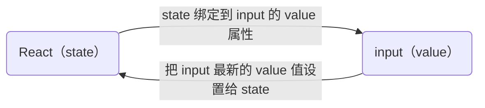

# React

## React 基础

### React 基础事件绑定

语法： **<font color="#1565c0">on + 事件名称 = { 事件处理程序 }</font>** ，整体上遵循驼峰命名

```jsx
function App() {
  const clickHandler = () => {
    console.log("button 点击了");
  };
  return <button onClick={clickHandler}>click</button>;
}
```

#### 使用事件对象参数

语法：在时间回调函数中 **<font color="#1565c0">设置形参 e</font>**

#### 传递自定义参数

语法：事件绑定的位置改造 **<font color="#1565c0">成箭头函数的写法，</font>** 在执行 clickHandler 实际处理业务函数的时候传递实参

```jsx
function App() {
  const clickHandler = (name) => {
    console.log("button 点击了", name);
  };
  return <button onClick={() => clickHandler("n1")}>click</button>;
}
```

注意：不能直接写函数调用，这里事件绑定需要一个 **<font color="#1565c0">函数引用</font>**

#### 同事传递事件对象和自定义参数

语法:在事件绑定的位置传递事件实参 e 和自定义参数，clickHandler 中声明形参，注意顺序对应

```jsx
function App() {
  const clickHandler = (name, e) => {
    console.log("button 点击了", name, e);
  };
  return <button onClick={(e) => clickHandler("n1", e)}>click</button>;
}
```

### 组件

概念:一个组件就是用户界面的一部分，它可以有自己的逻辑和外观，组件之间 **<font color="#1565c0">可以互相嵌套，也可以复用多次</font>**


组件化开发可以让开发者像搭积木一样构建一个完整的庞大的应用

#### React 组件

在 React 中，一个组件就是 **<font color="#1565c0">首字母大写的函数</font>** ，内部存放了组件的逻辑和视图 U，渲染组件只需要把组件 **<font color="#1565c0">当成标签书写</font>** 即可

```jsx
// 定义组件
function Button() {
  //组件内部逻辑
  return <button>click me</button>;
}

// 使用组件（渲染组件）
function App() {
  return (
    <div>
      {/** 自闭合 */}
      <Button />
      {/** 成对标签 */}
      <Button></Button>
    </div>
  );
}
```

### useState 基础使用

useState 是一个 React Hook(函数)，它允许我们向组件添加一个 **<font color="#1565c0">状态变量</font>** ，从而控制影响组件的渲染结果


本质:和普通 JS 变量不同的是，状态变量一旦发生变化组件的视图 Ul 也会跟着变化 **<font color="#1565c0">( 数据驱动视图 )</font>**

```jsx
const [count, setCount] = useState(0);
//1.useState是一个函数，返回值是一个数组
//2.数组中的第一个参数是状态变量，第二个参数是set函数用来修改状态变量
//3.useState的参数将作为count的初始值

//setCount 作用
//1. 用传入的新值修改 count
//2. 重新使用新的 count 渲染 UI
```

### 修改状态规则

#### 状态不可变

在 React 中，状态被认为是只读的，我们应该始终 **<font color="#1565c0">替换它而不是修改它</font>** ，直接修改状态不能引发视图更新

```jsx
let [count, setCount] = useState(0);

const handleClick = () => {
  //直接修改 无法引发试图更新
  count++;
  console.log(count);
};
//////////
const handleClick = () => {
  //作用：
  //1. 用传入的新值修改 count
  //2. 重新使用新的 count 渲染 UI
  setCount(count + 1);
};
```

#### 修改对象状态

规则:对于对象类型的状态变量，应该始终传给 set 方法一个 **<font color="#1565c0">全新的对象</font>** 来进行修改

```jsx
const [form, setForm] = useState({ name: "jack" });

const handleChangeName = () => {
  form.name = "john";
};
// 直接修改原对象，不引发视图变化

const handleChangeName = () => {
  setForm({
    ...form,
    name: "john",
  });
};
// 调用set传入新对象用于修改
```

### 受控表单绑定

概念:使用 React 组件的状态(useState)控制表单的状态



1. 准备一个 React 状态值

```jsx
const [value, setValue] = useState("");
```

2. 通过 value 属性绑定状态，通过 onChange 属性绑定状态同步的函数

```jsx
<input type="text" value={value} onChange={(e) => setValue(e.target.value)} />
```

### React 中获取 DOM

在 React 组件中获取/操作 DOM，需要使用 useRef 钩子函数，分为两步:

1. 使用 useRef 创建 ref 对象，并与 JSX 绑定

```jsx
const inputRef = useRef(null)
///
<input type="text" ref={inputRef} />
```

2. 在 DOM 可用时，通过 inputRef.current 拿到 DOM 对象

```jsx
console.log(inputRef.current);
```

### 组件通信

概念:组件通信就是 **<font color="#1565c0">组件之间的数据传递</font>** ，根据组件嵌套关系的不同，有不同的通信方法

#### 父子通信

##### 父传子

实现步骤：

1. 父组件传递数据：在子组件标签上 **<font color="#1565c0">绑定属性</font>**

```jsx
function Father() {
  const name = "this is Father name";
  return (
    <div>
      <Son name={name} />
    </div>
  );
}
```

2. 子组件接收数据：子组件通过 **<font color="#1565c0">props 参数</font>** 接收数据

```jsx
function Son(props) {
  //props 对象里面包含了父组件传递的所有数据
  console.log(props);
  return <div>this is son, {props.name}</div>;
}
```

** props 是只读对象 **

子组件 **<font color="#1565c0">只能读取 props 中的数据</font>** ，不能直接进行修改，父组件的数据只能由父组件修改

**<font color="#1565c0">特殊的 prop children</font>**

场景:当我们把内容嵌套在子组件标签中时，父组件会自动在名为 children 的 prop 属性中接收该内容

```jsx
<Son>
  <span>this is span</span>
</Son>;

/** props 属性 */
props: {
  children: <span />;
}
```

##### 子传父

核心思路：在子组件中调用父组件中的函数并将数据作为参数传递

#### 兄弟通信

**<font color="#1565c0">使用状态提升实现兄弟组件通信</font>**

实现思路:借助“状态提升”机制，通过父组件进行兄弟组件之间的数据传递

1. A 组件先通过子传父的方式把数据传给父组件 App

2. App 拿到数据后通过父传子的方式再传递给 B 组件

#### 跨层通信

**<font color="#1565c0">使用 Context 机制跨层级组件通信</font>**

实现步骤：

1. 使用 createContext 方法创建一个上下文对象 Ctx
2. 在顶层组件(App)中通过 **<font color="#1565c0">Ctx.Provider 组件</font>** 提供数据
3. 在底层组件(B)中通过 **<font color="#1565c0">useContext</font>** 钩子函数获取消费数据

```jsx
//1
const MsgContext = createContext()
//2
<MsgContext.Provider value={msg}>
  this is Father
  <A/>
</MsgContext.Provider>

//3
const msg = useContext(MsgContext)
```

### useEffect

useEffect 是一个 React Hook 函数，用于在 React 组件中创建不是由事件引起而是由渲染本身引起的操作,比如发送 AJAX 请求，更改 DOM 等等

说明:组件中没有发生任何的用户事件，组件渲染完毕之后就需要和服务器要数据，整个过程属于“只由渲染引起的操作’

#### useEffect 的基础使用

需求:在组件渲染完毕之后，立刻从服务端获取频道列表数据并显示到页面中

```jsx
useEffect(() => {}, []);
```

参数 1 是一个函数，可以把它叫做副作用函数，在函数内部可以放置要执行的操作

参数 2 是一个数组(可选参)，在数组里放置依赖项，不同依赖项会影响第一个参数函数的执行， **<font color="#1565c0">当是一个空数组的时候，副作用函数只会在组件渲染完毕之后执行一次</font>**

#### useEffect 依赖项参数

useEffect 副作用函数的执行时机存在多种情况，根据 **<font color="#1565c0">传入依赖项的不同</font>** ，会有不同的执行表现

|     依赖项     |        副作用函数执行时机         |
| :------------: | :-------------------------------: |
|   没有依赖项   |    组件初始渲染+组件更新时执行    |
|   空数组依赖   |      只在初始渲染时执行一次       |
| 添加特定依赖项 | 组件初始渲染+特性依赖项变化时执行 |

#### useEffect 清除副作用

在 useEffect 中编写的 **<font color="#1565c0">由渲染本身引起的对接组件外部的操作</font>** ，社区也经常把它叫做 **<font color="#1565c0">副作用操作</font>** ，比如在 useEffect 中开启了一个定时器，我们想在组件卸载时把这个定时器再清理掉，这个过程就是清理副作用

```jsx
useEffect(() => {
  // 实现副作用操作逻辑
  return () => {
    // 清除副作用逻辑
  };
}, []);
```

说明:清除副作用的函数 **<font color="#1565c0">最常见</font>** 的执行时机是在 **<font color="#1565c0">组件卸载时自动执行</font>**

### 自定义 Hook 函数

概念:自定义 Hook 是以 **<font color="#1565c0">use 打头的函数</font>** ，通过自定义 Hook 函数可以用来实现 **<font color="#1565c0">逻辑的封装和复用</font>**

```jsx
function useToggle() {
  //可复用的逻辑代码
  const [value, setValue] = useState(true);
  const toggle = () => setValue(!value);

  //哪些状态和回调函数需要在其他组件中使用 return
  return {
    value,
    toggle,
  };
}
```

封装自定义 hook 通用思路

1. 声明一个以 use 开头的函数
2. 在函数体内封装可复用的逻辑（只要是可复用的逻辑）
3. 把组件中用到的状态或者回掉 return 除去（以对象或者数组）
4. 在哪个组件中要用到这个逻辑，就执行这个函数，解构出来的状态和回调进行使用

### ReactHooks 使用规则

1. 只能在组件中或者其他自定义 Hook 函数中调用
2. 只能在组件的顶层调用，不能嵌套在 if、for、其他函数中

**<font color="#1565c0"></font>**
**<font color="#1565c0"></font>**
