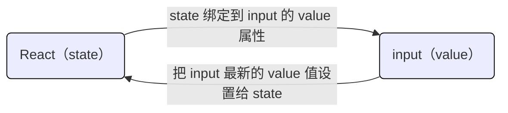
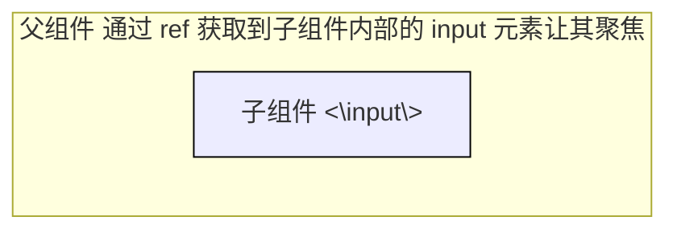
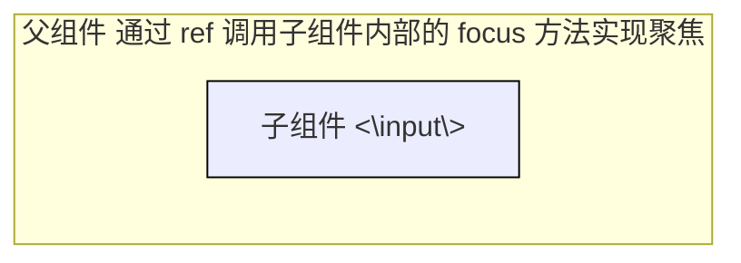
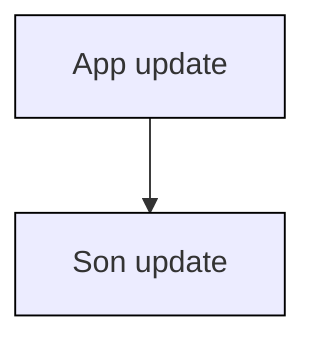

# React

## React 基础

### React 基础事件绑定

语法： **<font color="#1565c0">on + 事件名称 = { 事件处理程序 }</font>** ，整体上遵循驼峰命名

```jsx
function App() {
  const clickHandler = () => {
    console.log("button 点击了");
  };
  return <button onClick={clickHandler}>click</button>;
}
```

#### 使用事件对象参数

语法：在时间回调函数中 **<font color="#1565c0">设置形参 e</font>**

#### 传递自定义参数

语法：事件绑定的位置改造 **<font color="#1565c0">成箭头函数的写法，</font>** 在执行 clickHandler 实际处理业务函数的时候传递实参

```jsx
function App() {
  const clickHandler = (name) => {
    console.log("button 点击了", name);
  };
  return <button onClick={() => clickHandler("n1")}>click</button>;
}
```

注意：不能直接写函数调用，这里事件绑定需要一个 **<font color="#1565c0">函数引用</font>**

#### 同事传递事件对象和自定义参数

语法:在事件绑定的位置传递事件实参 e 和自定义参数，clickHandler 中声明形参，注意顺序对应

```jsx
function App() {
  const clickHandler = (name, e) => {
    console.log("button 点击了", name, e);
  };
  return <button onClick={(e) => clickHandler("n1", e)}>click</button>;
}
```

### 组件

概念:一个组件就是用户界面的一部分，它可以有自己的逻辑和外观，组件之间 **<font color="#1565c0">可以互相嵌套，也可以复用多次</font>**


组件化开发可以让开发者像搭积木一样构建一个完整的庞大的应用

#### React 组件

在 React 中，一个组件就是 **<font color="#1565c0">首字母大写的函数</font>** ，内部存放了组件的逻辑和视图 U，渲染组件只需要把组件 **<font color="#1565c0">当成标签书写</font>** 即可

```jsx
// 定义组件
function Button() {
  //组件内部逻辑
  return <button>click me</button>;
}

// 使用组件（渲染组件）
function App() {
  return (
    <div>
      {/** 自闭合 */}
      <Button />
      {/** 成对标签 */}
      <Button></Button>
    </div>
  );
}
```

#### 受控组件 & 非受控组件

根据组件中的值是否已经被 react 控制进行判断

```jsx
<input />

<input type="text" value={value} onChange={changeHandler}/>


```

### useState 基础使用

useState 是一个 React Hook(函数)，它允许我们向组件添加一个 **<font color="#1565c0">状态变量</font>** ，从而控制影响组件的渲染结果


本质:和普通 JS 变量不同的是，状态变量一旦发生变化组件的视图 Ul 也会跟着变化 **<font color="#1565c0">( 数据驱动视图 )</font>**

```jsx
const [count, setCount] = useState(0);
//1.useState是一个函数，返回值是一个数组
//2.数组中的第一个参数是状态变量，第二个参数是set函数用来修改状态变量
//3.useState的参数将作为count的初始值

//setCount 作用
//1. 用传入的新值修改 count
//2. 重新使用新的 count 渲染 UI
```

### useReducer

作用：和 useState 作用类似，用来管理相对复杂的状态数据

#### 基础用法

1. 定义一个 reducer 函数(根据不同的 action 返回不同的新状态)

```javascript
function reducer(state, action) {
  // 根据不同的 action type 返回新的 state
  switch (action.type) {
    case "INCREMENT":
      return state + 1;
    case "DECREMENT":
      return state - 1;
    default:
      return state;
  }
}
```

2. 在组件中调用 useReducer，并传入 reducer 函数和状态的初始值

```javascript
const [state, dispatch] = useReducer(reducer, 0);
```

3. 事件发生时，通过 dispatch 函数分派一个 action 对象(通知 reducer 要返回哪个新状态并渲染 UI)

```javascript
dispatch({ type: "INCREMENT" });
```

主要根据 dispatch 传入的 type 来触发 reducer 函数，随后根据不同的 type 返回不同的状态，并使用新的状态渲染 UI

#### 分派 action 时传参

```javascript
dispatch({ type: "SET", payload: 100 });
```

```javascript
function reducer(state, action) {
  // 根据不同的 action type 返回新的 state
  switch (action.type) {
    case "INCREMENT":
      return state + 1;
    case "DECREMENT":
      return state - 1;
    case "SET":
      return action.payload;
    default:
      return state;
  }
}
```

### 修改状态规则

#### 状态不可变

在 React 中，状态被认为是只读的，我们应该始终 **<font color="#1565c0">替换它而不是修改它</font>** ，直接修改状态不能引发视图更新

```jsx
let [count, setCount] = useState(0);

const handleClick = () => {
  //直接修改 无法引发试图更新
  count++;
  console.log(count);
};
//////////
const handleClick = () => {
  //作用：
  //1. 用传入的新值修改 count
  //2. 重新使用新的 count 渲染 UI
  setCount(count + 1);
};
```

#### 修改对象状态

规则:对于对象类型的状态变量，应该始终传给 set 方法一个 **<font color="#1565c0">全新的对象</font>** 来进行修改

```jsx
const [form, setForm] = useState({ name: "jack" });

const handleChangeName = () => {
  form.name = "john";
};
// 直接修改原对象，不引发视图变化

const handleChangeName = () => {
  setForm({
    ...form,
    name: "john",
  });
};
// 调用set传入新对象用于修改
```

### 受控表单绑定

概念:使用 React 组件的状态(useState)控制表单的状态



1. 准备一个 React 状态值

```jsx
const [value, setValue] = useState("");
```

2. 通过 value 属性绑定状态，通过 onChange 属性绑定状态同步的函数

```jsx
<input type="text" value={value} onChange={(e) => setValue(e.target.value)} />
```

### React 中获取 DOM

在 React 组件中获取/操作 DOM，需要使用 useRef 钩子函数，分为两步:

1. 使用 useRef 创建 ref 对象，并与 JSX 绑定

```jsx
const inputRef = useRef(null)
///
<input type="text" ref={inputRef} />
```

2. 在 DOM 可用时，通过 inputRef.current 拿到 DOM 对象

```jsx
console.log(inputRef.current);
```

### 组件通信

概念:组件通信就是 **<font color="#1565c0">组件之间的数据传递</font>** ，根据组件嵌套关系的不同，有不同的通信方法

#### 父子通信

##### 父传子

实现步骤：

1. 父组件传递数据：在子组件标签上 **<font color="#1565c0">绑定属性</font>**

```jsx
function Father() {
  const name = "this is Father name";
  return (
    <div>
      <Son name={name} />
    </div>
  );
}
```

2. 子组件接收数据：子组件通过 **<font color="#1565c0">props 参数</font>** 接收数据

```jsx
function Son(props) {
  //props 对象里面包含了父组件传递的所有数据
  console.log(props);
  return <div>this is son, {props.name}</div>;
}
```

** props 是只读对象 **

子组件 **<font color="#1565c0">只能读取 props 中的数据</font>** ，不能直接进行修改，父组件的数据只能由父组件修改

**<font color="#1565c0">特殊的 prop children</font>**

场景:当我们把内容嵌套在子组件标签中时，父组件会自动在名为 children 的 prop 属性中接收该内容

```jsx
<Son>
  <span>this is span</span>
</Son>;

/** props 属性 */
props: {
  children: <span />;
}
```

##### 子传父

核心思路：在子组件中调用父组件中的函数并将数据作为参数传递

#### 兄弟通信

**<font color="#1565c0">使用状态提升实现兄弟组件通信</font>**

实现思路:借助“状态提升”机制，通过父组件进行兄弟组件之间的数据传递

1. A 组件先通过子传父的方式把数据传给父组件 App

2. App 拿到数据后通过父传子的方式再传递给 B 组件

#### 跨层通信

**<font color="#1565c0">使用 Context 机制跨层级组件通信</font>**

实现步骤：

1. 使用 createContext 方法创建一个上下文对象 Ctx
2. 在顶层组件(App)中通过 **<font color="#1565c0">Ctx.Provider 组件</font>** 提供数据
3. 在底层组件(B)中通过 **<font color="#1565c0">useContext</font>** 钩子函数获取消费数据

```jsx
//1
const MsgContext = createContext()
//2
<MsgContext.Provider value={msg}>
  this is Father
  <A/>
</MsgContext.Provider>

//3
const msg = useContext(MsgContext)
```

### useEffect

useEffect 是一个 React Hook 函数，用于在 React 组件中创建不是由事件引起而是由渲染本身引起的操作,比如发送 AJAX 请求，更改 DOM 等等

说明:组件中没有发生任何的用户事件，组件渲染完毕之后就需要和服务器要数据，整个过程属于“只由渲染引起的操作’

#### useEffect 的基础使用

需求:在组件渲染完毕之后，立刻从服务端获取频道列表数据并显示到页面中

```jsx
useEffect(() => {}, []);
```

参数 1 是一个函数，可以把它叫做副作用函数，在函数内部可以放置要执行的操作

参数 2 是一个数组(可选参)，在数组里放置依赖项，不同依赖项会影响第一个参数函数的执行， **<font color="#1565c0">当是一个空数组的时候，副作用函数只会在组件渲染完毕之后执行一次</font>**

#### useEffect 依赖项参数

useEffect 副作用函数的执行时机存在多种情况，根据 **<font color="#1565c0">传入依赖项的不同</font>** ，会有不同的执行表现

|     依赖项     |        副作用函数执行时机         |
| :------------: | :-------------------------------: |
|   没有依赖项   |    组件初始渲染+组件更新时执行    |
|   空数组依赖   |      只在初始渲染时执行一次       |
| 添加特定依赖项 | 组件初始渲染+特性依赖项变化时执行 |

#### useEffect 清除副作用

在 useEffect 中编写的 **<font color="#1565c0">由渲染本身引起的对接组件外部的操作</font>** ，社区也经常把它叫做 **<font color="#1565c0">副作用操作</font>** ，比如在 useEffect 中开启了一个定时器，我们想在组件卸载时把这个定时器再清理掉，这个过程就是清理副作用

```jsx
useEffect(() => {
  // 实现副作用操作逻辑
  return () => {
    // 清除副作用逻辑
  };
}, []);
```

说明:清除副作用的函数 **<font color="#1565c0">最常见</font>** 的执行时机是在 **<font color="#1565c0">组件卸载时自动执行</font>**

**<font color="#1565c0"></font>**

### 自定义 Hook 函数

概念:自定义 Hook 是以 **<font color="#1565c0">use 打头的函数</font>** ，通过自定义 Hook 函数可以用来实现 **<font color="#1565c0">逻辑的封装和复用</font>**

```jsx
function useToggle() {
  //可复用的逻辑代码
  const [value, setValue] = useState(true);
  const toggle = () => setValue(!value);

  //哪些状态和回调函数需要在其他组件中使用 return
  return {
    value,
    toggle,
  };
}
```

封装自定义 hook 通用思路

1. 声明一个以 use 开头的函数
2. 在函数体内封装可复用的逻辑（只要是可复用的逻辑）
3. 把组件中用到的状态或者回掉 return 除去（以对象或者数组）
4. 在哪个组件中要用到这个逻辑，就执行这个函数，解构出来的状态和回调进行使用

### ReactHooks 使用规则

1. 只能在组件中或者其他自定义 Hook 函数中调用
2. 只能在组件的顶层调用，不能嵌套在 if、for、其他函数中

### forWardRef

使用 ref 暴露 DOM 节点给父组件

#### 场景说明



#### 语法实现

```jsx
// 子组件
const Input = forwardRef((props, ref) => {
  return <input type="text" ref={ref} />;
});

// 父组件
function App() {
  const inputRef = useRef(null);
  return (
    <>
      <Input ref={inputRef} />
    </>
  );
}
```

#### 场景实现

```jsx
// 子组件
const Son = forwardRef((props, ref) => {
  return <input type="text" ref={ref} />;
});

// 父组件
function App() {
  const sonRef = useRef(null);
  const showRef = () => {
    console.log(sonRef);
    sonRef.current.focus();
  };
  return (
    <>
      <Son ref={sonRef} />
      <button onClick={showRef}>Focus</button>
    </>
  );
}
```

### useImperativeHandle

作用：通过 ref 暴露子组件中的方法

#### 场景说明



```jsx
// 子组件
const Input = forwardRef((props, ref) => {
  const inputRef = useRef(null);
  //实现聚焦逻辑函数
  const focusHandler = () => {
    inputRef.current.focus();
  };
  //暴露函数给父组件调用
  useImperativeHandle(ref, () => {
    return {
      // 暴露的方法
      focusHandler,
    };
  });
  return <input type="text" ref={inputRef} />;
});

// 父组件
function App() {
  const sonRef = useRef(null);
  const focusHandler = () => {
    console.log(sonRef.current);
    sonRef.current.focusHandler;
  };
  return (
    <>
      <Son ref={sonRef} />
      <button onClick={focusHandler}>focus</button>
    </>
  );
}
```

## 性能优化相关

### useMemo

作用：在组件每次重新渲染的时候 **<font color="#1565c0">缓存计算的结果</font>**

```jsx
const res = useMemo(() => {
  // 使用 useMemo 做缓存之后可以保证只有
  // count1 依赖项发生变化才会重新计算
  // 返回计算的结果
}, [count1]);
```

### React.memo

作用:允许组件在 **<font color="#1565c0">Props 没有改变</font>** 的情况下跳过渲染

React 组件默认的渲染机制:只要父组件重新渲染子组件就会重新渲染



如果 Son 组件本身并不需要做渲染更新，是否存在浪费

```jsx
import { useState } from "react";
// 验证默认的渲染机制   子组件随父组件一起渲染

function Son() {
  console.log("我是子组件，重新渲染了");
  return <div>我是子组件</div>;
}

function App() {
  const [count, setCount] = useState(0);
  return (
    <div className="App">
      <button onClick={() => setCount(count + 1)}>+ {count}</button>
      <Son />
    </div>
  );
}
export default App;
```

#### 基础用法

```jsx
const MemoComponent = memo(function SomeComponent(props) {
  //...
});
```

经过 memo 函数包裹生成的缓存组件只有在 props 发生变化的时候才会重新渲染

```jsx
import { useState, memo } from "react";
// memo 进行缓存 只有 props 发生变化的时候
// 才会重新渲染 {context}

const MemoSon = memo(function Son() {
  console.log("我是子组件，重新渲染了");
  return <div>我是子组件</div>;
});

function App() {
  const [count, setCount] = useState(0);
  return (
    <div className="App">
      <button onClick={() => setCount(count + 1)}>+ {count}</button>
      <MemoSon />
    </div>
  );
}
export default App;
```

#### 传递自定义比较逻辑

memo 方法的第二个参数是个函数，根据该函数返回值来判断是否跳过渲染
false - 重新渲染
true - 跳过渲染
跟 shouldComponentUpdate 正好相反

```jsx
function compare(prevProps, nextProps) {
  if (
    prevProps.person.name !== nextProps.person.name ||
    prevProps.person.age !== nextProps.person.age
  ) {
    return false;
  }
  return true;
}

const ShowPerson = memo(function ({ person }) {
  console.log("render..");
  return (
    <div>
      {person.name} {person.age}
    </div>
  );
}, compare);

function App() {
  const [person, setPerson] = useState({
    name: "张三",
    age: 20,
    job: "programmer",
  });
  useEffect(() => {
    setInterval(() => {
      setPerson({ ...person, job: "coder" });
    }, 1000);
  }, []);
  return (
    <div>
      <ShowPerson person={person} />
    </div>
  );
}
```


#### props 的比较机制

机制: 在使用 memo 缓存组件之后，React 会对 **<font color="#1565c0">每一个 prop</font>** 使用 **<font color="#1565c0">Object.is</font>** 比较新值和老值，返回 true，表示没有变化

```javascript
// prop 是简单类型
Object.is(7,7)=>true
// 没有变化

//prop 是引用类型（对象/数组）
Object.is([],[])=>false
// 有变化，React 只关心引用是否变化
```

```jsx
// 1. 传递一个简单类型的 prop   prop 变化时组
// 件重新渲染

// 2. 传递一个引用类型的 prop   比较的时新值和
// 旧值的引用是否相等   当父组件函数重新执行时，
// 实际上形成的是新的数组引用

// 3. 保证引用稳定 - useMemo/useState 组件渲染的过程中缓存一个值
import { useState, memo } from "react";

const MemoSon = memo(function Son({ list }) {
  console.log("我是子组件，重新渲染了");
  return <div>我是子组件 {list}</div>;
});

function App() {
  const [count, setCount] = useState(0);
  // const list = [1,2,3]  2.
  const list = useMemo(() => {
    return [1, 2, 3];
  }, []);
  return (
    <div className="App">
      <button onClick={() => setCount(count + 1)}>+ {count}</button>
      <MemoSon list={list} />
    </div>
  );
}
export default App;
```

### useCallback

作用：在组件多次重新渲染的时候 **<font color="#1565c0">缓存函数</font>**

```jsx
const Input = memo(function Input({ onChange }) {
  console.log("子组件重新渲染了");
  return <input type="text" onChange={(e) => onChange(e.target.value)} />;
});

function App() {
  // 传给子组件的函数
  const changeHandler = (value) => console.log(value);
  // 触发父组件重新渲染的函数
  const [count, setCount] = useState(0);
  return (
    <div className="App">
      {/** 把函数作为 prop 传递给子组件 */}
      <Input onChange={changeHandler} />
      <button onClick={() => setCount(count + 1)}>{count}</button>
    </div>
  );
}
```

#### 基础用法

```jsx
// useCallback 的第二个参数为依赖项，当需要变更引用时使用
const changeHandler = useCallback((value) => console.log(value), []);
```

使用 useCallback 包裹函数之后，函数可以保证在 **<font color="#1565c0">App 重新渲染的时候保持引用稳定</font>**

## Class API（类组件）

### 类组件基础结构

类组件就是通过 **<font color="#1565c0">JS 中的类来组织组件的代码</font>**

```jsx
class Counter extends Component {
  // 定义状态的变量
  state = {
    count: 0,
  };
  //事件回调
  clickHandler = () => {
    this.setState({
      count: this.state.count + 1,
    });
  };
  // UI 模板（JSX）
  render() {
    return <button onClick={this.clickHandler}>{this.state.count}</button>;
  }
}
```

1. 通过类属性 state 定义状态数据
2. 通过 setState 方法来修改状态数据
3. 通过 render 来写 UI 模板，JSX 语法一致

### 类组件的生命周期函数

概念:组件从创建到销毁的各个阶段自动执行的函数就是生命周期函数


1. componentDidMount:组件挂载完毕自动执行 - 异步数据获取
2. componentWillUnmount: 组件卸载时自动执行 - 清理副作用

```jsx
class Son extends Component {
  //生命周期函数
  // 组件渲染完毕执行一次
  componentDidMount() {
    console.log("组件渲染完毕，开发请求");
    //使用计时器
    this.timer = setInterval(() => {
      console.log("计时器运行中");
    }, 1000);
  }
  // 组件卸载的时候自动执行  副作用清理的时候到了  清除计时器  清除事件绑定
  componentWillUnmount() {
    console.log("组件 son 被卸载了");
    // 清除计时器
    clearInterval(this.timer);
  }
  render() {
    return <div>我是 son 组件</div>;
  }
}

function App() {
  const [show, setShow] = useState(true);
  return (
    <>
      {show && <Son />}
      <button onClick={() => setShow(false)}>unmount</button>
    </>
  );
}
```

### 类组件的组件通信

类组件和 Hooks 编写的组件在组件通信的思想上完全一致

1. 父传子:通过 prop 绑定数据
2. 子传父:通过 prop 绑定紧组件中的函数，子组件调用
3. 兄弟通信:状态提升，通过父组件做桥接

```jsx
//1. 父传子  直接通过 prop
// 子组件标签身上绑定父组件中的数据即可

// 子组件
class Son extends Component {
  render() {
    //使用 this.props.msg
    return <div>我是 Son 组件,{this.props.msg}</div>;
  }
}

// 父组件
class Parent extends Component {
  state = {
    msg: "this is parent msg",
  };
  render() {
    return (
      <div>
        我是 Parent 组件 <Son msg={this.state.msg} />
      </div>
    );
  }
}
```

```jsx
// 2. 子传父 - 在子组件标签上绑定父组件中的函数
// 子组件调用这个函数传递数据

// 子组件
class Son extends Component {
  render() {
    //使用 this.props.msg
    return (
      <>
        <div>我是 Son 组件,{this.props.msg}</div>
        <button onClick={() => this.props.onGetSonMsg("this is son msg")}>
          send msg to parent
        </button>
      </>
    );
  }
}

// 父组件
class Parent extends Component {
  state = {
    msg: "this is parent msg",
  };

  getSonMsg = (sonMsg) => {
    console.log(sonMsg);
  };
  render() {
    return (
      <div>
        我是 Parent 组件{" "}
        <Son msg={this.state.msg} onGetSonMsg={this.getSonMsg} />
      </div>
    );
  }
}
```

总结:

- 思想保持一致
- 类组件依赖于 this

## 其他

### JSX & JS 
#### 描述

jsx 是 react 的语法糖

允许在 html 中写 js

需要通过 babel、webpack 编译转化为 JS 执行

#### 区别

JS 可以直接在浏览器中执行 - JSX 需要编译

JSX 是 React.createElement 的语法糖

```jsx
// jsx React 17RC 版本之前，都需要在组件顶部引入
// jsx 最终都会被转换成 React.createElement... 去创建元素 
import React from 'react';
```

```javascript
// jsx React 17RC 版本之后
// jsx 可以不被转换成 React.createElement

function App(){
  return <h1>hello</h1>
}
//编译
import {jsx as _jsx} from 'react/jsx-runtime'

function App(){
  return _jsx('h1',{children:"hello"})
}
```

### 为什么 React 自定义组件首字母大写

- React.createElement 参数类型
  - type 元素类型
  - props 元素属性
  - children 子元素

jsx => vDOM => DOM

小写开头会被判定为字符串
大写开头在 React 中会识别为变量

```js
<app>hello</app>
// 转译
React.createElement('app',null,'hello')
// 会报错  因为没有名为 app 的标签

<App>hello</App>
React.createElement(App,null,'hello')
```

### React 设计思想

#### 组件化

开闭原则

封闭：组件内部状态由自身维护 - 只处理内部渲染逻辑

开放：针对组件通信 - 不同组件可以通过 props 单向数据流进行交互

#### 数据驱动视图

公式： UI = f(data)

不能直接操作 DOM - 修改数据 state props - 数据驱动视图更新

#### 虚拟 DOM

DOM 操作消耗性能(遍历真实 DOM 性能损失太大) - vDOM - 描述真实 DOM 的 js 对象

更新时会进行两次 vDOM 的比较
new vDOM - old vDOM
通过 diff 进行比较得到需要更新的部分 - 数据增量更新
通过 vDOM 来简化真实 DOM 提高 diff 算法性能从而提升 DOM 操作过程的性能

### ReactEvent & DOMEvent
#### 区别

1. React 的 event 是 SyntheticEvent，模拟出来 DOM 的所有能力
2. event.nativeEvent 才是原生事件对象
3. 所有的事件，都被挂载到 document 上
4. 和 DOM 事件不一样，和 Vue 事件也不一样

```js
function App(){
    const getEvent =(e)=>{
        console.log(e.target)
        console.log(e.currentTarget)
        console.log(e.nativeEvent.target)
        console.log(e.nativeEvent.currentTarget)
    }
    return (
    <>
        <button onClick={getEvent} >click</button>    
    </>
    )
}
```

**<font color="#1565c0"></font>**
**<font color="#1565c0"></font>**
