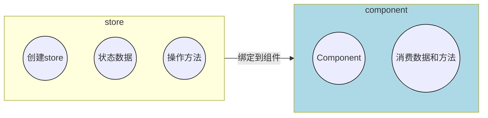
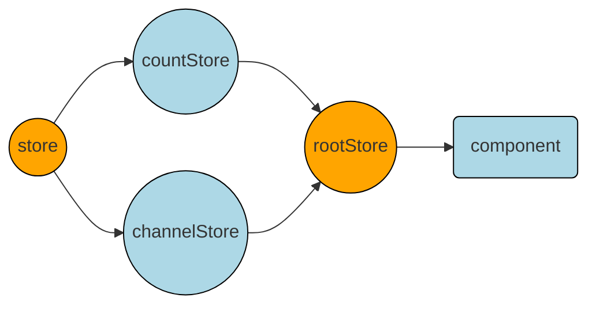

# zustand



## 基础用法

```jsx
import { create } from "zustand";

// 1. 创建 store
// 函数参数必须返回一个对象  对象内部编写状态数据和方法
// set 是用来修改数据的专门方法必须调用它来修改数据
// 语法1： 参数是函数  需要用到旧数据时
// 语法2： 参数直接时一个对象 set({count:100})
const useStore = create((set) => {
  return {
    // 状态数据
    count: 0,
    //修改状态数据的方法
    inc: () => {
      set((state) => ({ count: state.count + 1 }));
    },
    setCount: () => {
      set({ count: 100 });
    },
  };
});

//2. 绑定 store 到组件
// useStore => { count, inc, setCount }

function App() {
  const { count, inc } = useStore();
  return (
    <>
      <button onClick={inc}>{count}</button>
    </>
  );
}
```

## 异步支持

对于异步不需要特殊的操作，直接在函数中编写异步逻辑，最后只需要 **<font color="#1565c0">调用 set 方法传入新状态</font>** 即可

```javascript
const useStore = create((set) => {
  return {
    // 状态数据
    channelList: [],
    // 异步方法
    fetchChannelList: async () => {
      const res = await fetch(URL);
      const jsonData = await res.json();
      // 调用 set 方法更新状态
      set({
        channelList: jsonData.data.channelList,
      });
    },
  };
});
```

## 切片模式

场景： 当单个 store 比较大的时候，可以采用 **<font color="#1565c0">切片模式</font>** 进行模块拆分组
合，类似于模块化



```jsx
// 1. 拆分子模块 再组合起来
// store/modules/createCounterStore.js 模块
const createCounterStore = (set) => {
  return {
    // 状态数据
    count: 0,
    // 修改状态数据的方法
    inc: () => {
      set((state) => ({ count: state.count + 1 }));
    },
  };
};

// store/modules/createChannelStore.js 模块
const createChannelStore = (set) => {
  return {
    channelList:[],
    fetchGetChannel:async()=>{
        const res = await fetch(URL)
        const jsonRes = await res.json()
        console.log(jsonRes)
        set({channelList:jsonRes.channelList})
    }
  };
};

// store/index.js 模块
const useStore = create((...a)=>{
    return{
        ...createCountersStore(...a),
        ...createChannelStore(...a)
    }
})

// App.jsx 模块
function App(){
    // 2. 组件使用
    const {count,inc,channelList,fetchGetChannel} = useStore()
    return (
        <>
            <button onClick={inc}>{count}</button>
        </>
    )
}
```

**<font color="#1565c0"></font>**
