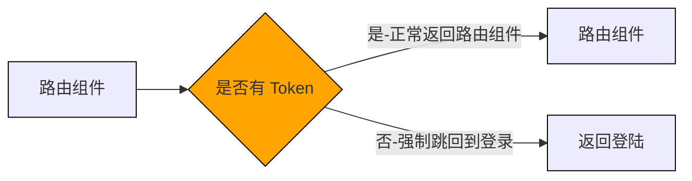

# Token 控制

## 使用 Token 做路由权限控制

有些路由页面内的内容信息比较敏感，如果用户没有经过登录获取到有效Token，是没有权限跳转的， **<font color="#1565c0">根据Token的有无控制当前路由是否可以跳转</font>** 就是路由的权限控制



### 核心思路

有 Token 时，正常跳转
无 Token 时，去登录

```jsx
//AuthRoute 组件
import { getToken } from "@/utils";
import { Navigate } from "react-router-dom";

export function AuthRoute({ children }) {
  const token = getToken();
  if (token) {
    return <>{children}</>;
  } else {
    return <Navigate to={"/login"} />;
  }
}
```

```jsx
// router 模块
import Layout from '@/pages/Layout'
import Login from '@/pages/Login'
import {AuthRoute} from '@/components/AuthRoute'
const router = createBrowserRouter([
  {
    path: "/",
    element: <AuthRoute><Layout /></AuthRoute>,
  },
  {
    path: "/login",
    element: <Login />,
  },
]);
```

## Token 失效处理

为了用户的安全和隐私考虑，在用户 **<font color="#1565c0">长时间未在网站中做任何操作</font>** 且 **<font color="#1565c0">规定的失效时间到达</font>** 之后，当前的Token就会失效，一旦失效，不能再作为用户令牌标识请求隐私数据
  
  


- **如何判断失效**
  通常在Token失效之后再去请求接口，后端会返回 **<font color="#1565c0">401状态码</font>** ，前端可以监控这个状态做后续的操作
  

- **失效后该做什么**
  **<font color="#1565c0">在axios拦截中监控401状态码</font>**
  **<font color="#1565c0">清除失效Token，跳转登录</font>**
  **<font color="#1565c0"></font>**

```javascript
// 响应拦截器统一处理
request.interceptor.response.use((response) => {
  return response.data
},(error)=>{
  //监控 401 token 失效
  if(error.response.status === 401){
    removeToken()
    router.navigate('/login')
  }
  return Promise.reject(error)
})
```