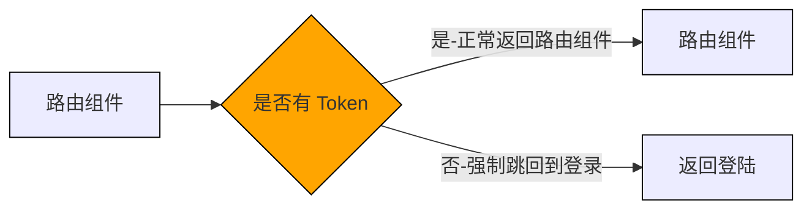

# Token 控制路由

## 使用 Token 做路由权限控制

有些路由页面内的内容信息比较敏感，如果用户没有经过登录获取到有效Token，是没有权限跳转的， **<font color="#1565c0">根据Token的有无控制当前路由是否可以跳转</font>** 就是路由的权限控制



## 核心思路

有 Token 时，正常跳转
无 Token 时，去登录

```jsx
//AuthRoute 组件
import { getToken } from "@/utils";
import { Navigate } from "react-router-dom";

export function AuthRoute({ children }) {
  const token = getToken();
  if (token) {
    return <>{children}</>;
  } else {
    return <Navigate to={"/login"} />;
  }
}
```

```jsx
// router 模块
import Layout from '@/pages/Layout'
import Login from '@/pages/Login'
import {AuthRoute} from '@/components/AuthRoute'
const router = createBrowserRouter([
  {
    path: "/",
    element: <AuthRoute><Layout /></AuthRoute>,
  },
  {
    path: "/login",
    element: <Login />,
  },
]);
```
