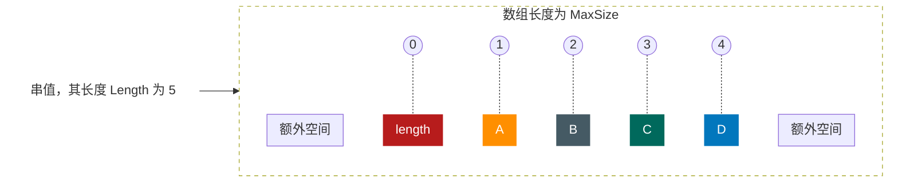
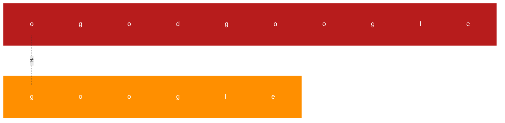
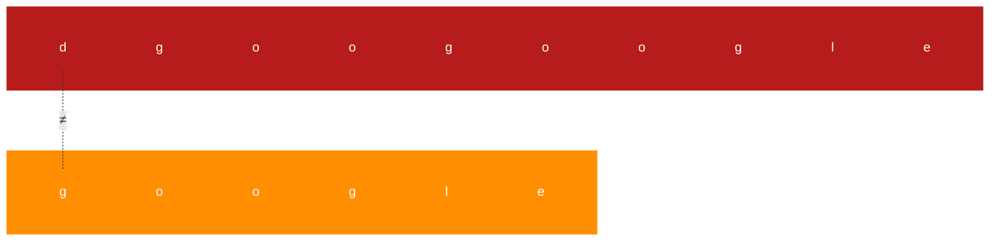
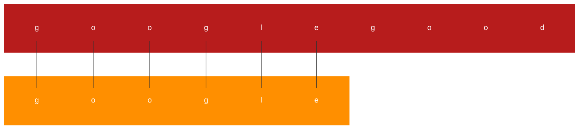
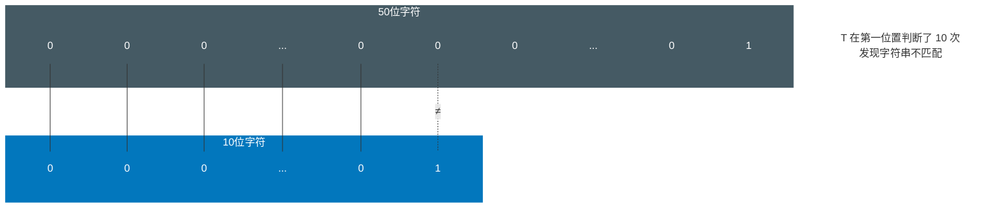
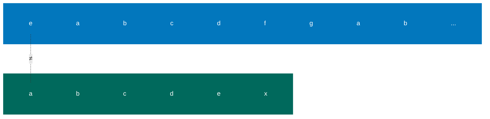
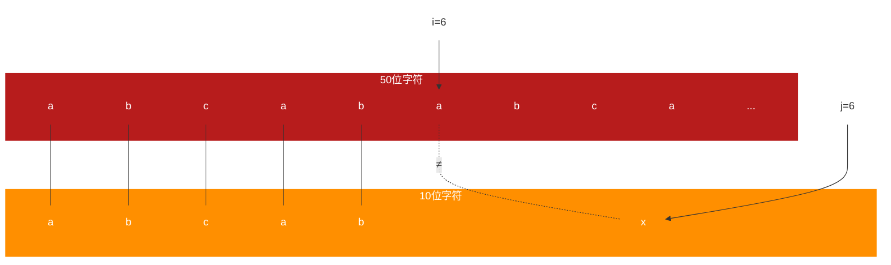
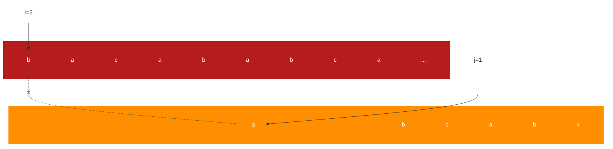

# 串

## 串的定义

**<font color="#1565c0">串：串（string）是由零个或多个字符组成的有限序列，又叫字符串</font>**

一般记为 s=“a1a2...an”（n≥0），其中，s 是串的名称，用双引号（有些书中也用单引号）括起来的字符序列是串的值，注意引号不属于串的内容。a(1≤i≤n)可以是字母、数字或其他字符，i 就是该字符在串中的位置。 **<font color="#1565c0">串中的字符数目 n 称为串的长度，</font>** 定义中谈到“有限”是指长度 n 是一个有限的数值。 **<font color="#1565c0">零个字符的串称为空串（null string），</font>** 它的长度为零，可以直接用两个双引号““””表示，也可以用希腊字母“Φ”来表示。所谓的序列，说明串的相邻字符之间具有前驱和后继的关系

空格串，是只包含空格的串。注意它与空串的区别，空格串是有内容有长度的，而且可以不止一个空格

子串与主串，串中任意个数的连续字符组成的子序列称为该串的子串，相应地，包含子串的串称为主串

子串在主串中的位置就是子串的第一个字符在主串中的序号

“over”“end”“lie”其实可以认为是“lover”“friend”“believe”这些单词字符串的子串

## 串的比较

两个数字，很容易比较大小。2 比 1 大，这完全正确，可是两个字符串如何比较？比如“silly”“stupid”这样的同样表达“愚蠢的”的单词字符串，它们在计算机中的大小其实取决于它们挨个字母的前后顺序。它们的第一个字母都是“s”，我们认为不存在大小差异，而第二个字母，由于“i”字母比“t”字母要靠前，所以“i”<“t”，于是我们说“silly”<“stupid”

事实上，串的比较是通过组成串的字符之间的编码来进行的，而字符的编码指的是字符在对应字符集中的序号

计算机中的常用字符是使用标准的 ASCII 编码，更准确一点，由 7 位二进制数表示一个字符，总共可以表示 128 个字符。后来发现一些特殊符号的出现，128 个不够用，子是扩展 ASCII 码由 8 位二进制数表示一个字符，总共可以表示 256 个字符，这已经足够满足以英语为主的语言和特殊符号进行输入、存储、输出等操作的字符需要了。可是，单我们国家就有除汉族外的满、回、藏、蒙古、维吾尔等多个少数民族文字，换作全世界估计要有成百上千种语言与文字，显然这 256 个字符是不够的，因此后来就有了 Unicode 编码，比较常用的是由 16 位的二进制数表示一个字符，这样总共就可以表示 216 个字符,约是 6.5 万多个字符，足够表示世界上所有语言的所有字符了。当然，为了和 ASCII 码兼容，Unicode 的前 256 个字符与 ASCI 码完全相同

所以如果我们要在 C 语言中比较两个串是否相等，必须是它们串的长度以及它们各个对应位置的字符都相等时，才算是相等。即给定两个串：s="a1a2…an,"，t-”"b1b2…bm”，当且仅当 n=m，且 a1=b1,a2=b2,...,an=bm 时，我们认为 s=t

那么对于两个串不相等时，如何判定它们的大小呢？我们这样定义：

**<font color="#1565c0">给定两个串：s=“a1a2...an，”，t=“b1b2...bm”，当满足以下条件之一时，s < t</font>**

1. **<font color="#1565c0">n < m，且 ai=bi (i=1,2,...n）</font>**
   例如当 s=“hap”，=“happy”，就有 s < t。因为 t 比 s 多出了两个字母
2. **<font color="#1565c0">存在某个 k≤min（m，n），使得 ai=bi,(i=1,2,...,k-1）,ak < bk</font>**
   例如当 s=“happen”，t=“happy”，因为两串的前 4 个字母均相同，而两串第 5 个字母（k 值），字母 e 的 ASCI 码是 101，而字母 y 的 ASCI 码是 121，显然 e < y，所以 s < t

英语词典，通常都是上万个单词的有序排列。就大小而言，前面的单词比后面的要小。查找单词的过程，其实就是在比较字符串大小的过程

## 串的抽象数据类型

串的逻辑结构和线性表很相似，不同之处在于串针对的是字符集，也就是串中的元素都是字符，哪怕串中的字符是由“123”这样的数字组成，或者是由“2010-10-10”这样的日期组成，它们都只能理解为长度为 3 和长度为 10 的字符串，每个元素都是字符而已

因此，对于串的基本操作与线性表是有很大差别的。线性表更关注的是单个元素的操作，比如查找一个元素，插入或删除一个元素，但串中更多的是查找子串位置、得到指定位置子串、替换子串等操作

ADT 串(string)
Data
串中元素仅由一个字符组成，相邻元素具有前驱和后继关系
Operation
StrAssign(T，\*chars)：生成一个其值等于字符串常量 chars 的串 T
StrCopy(T，S)：串 S 存在，由串 S 复制得串 T
ClearString（S）：串 S 存在，将串清空
StringEmpty(S)：若串 S 为空，返回 true，否则返回 false
StrLength（S）：返回串 S 的元素个数，即串的长度
StrCompare（S，T)：若 S > T，返回值 > 0，若 S=T，返回 0，若 S < T，返回值< 0
Concat(T，S1，S2）：用 T 返回由 S1 和 S2 联接而成的新串
SubString(Sub,S，pos，len)：串 S 存在，1≤pos≤StrLength(S),且 0≤len≤StrLength(S)-pos+1，用 Sub 返回串 S 的第 pos 个字符起长度为 len 的子串
Index（S，T，pos)：串 S 和 T 存在，T 是非空串，1≤pos≤StrLength(S)。若主串 S 中存在和 T 值相同的子串，则返回它在主串 S 中第 pos 个字符之后第一次出现的位置，否则返回 -1
Replace(S，T，V)：串 S、T 和 V 存在，T 是非空串。用 v 替换主串 S 中出现的所有与 T 相等的不重叠的子串
StrInsert(S，pos，T)：串 S 和 T 存在，1≤pos≤StrLength(S)+1。在串 S 的第 pos 个字符之前插入串 T
StrDelete(S，pos，len)：串 S 存在，1≤pos≤StrLength(S)-len+1。从串 S 中删除第 pos 个字符起长度为 1en 的子串
endADT

对于不同的高级语言，其实对串的基本操作会有不同的定义方法，不同语言除方法名称外，操作实质都是类似的。比如 JS 中，字符串操作就还有 toLowerCase 转小写、toUpperCase 转大写、indexOf 从左查找子串位置、LastIndexOf 从右查找子串位置、trim 去除两边空格等比较方便的操作，它们其实就是前面这些基本操作的扩展函数

操作 Index 的实现算法

```javascript
/*T为非空串。若主串S中第pos个字符之后存在与T相等的子串 */
/*则返回第一个这样的子串在S中的位置，否则返回-1*/
function mainIndex(S, T, pos) {
  let n, m, i;
  let sub = "";
  n = S.length;
  m = T.length;
  i = pos;
  while (i <= n - m + 1) {
    sub = S.substring(
      i,
      i + m + 1
    ); /*取主串中第1个位置开始长度与T相等的子串给sub*/
    if (sub !== T) {
      /*如果两串不相等 */
      ++i;
    } else {
      /*如果两串相等*/
      return i; /*则返回i值 */
    }
  }
  return -1; /*若无子串与T相等，返回-1*/
}
```

## 串的存储结构

串的存储结构与线性表相同，分为两种

### 串的顺序存储结构

**<font color="#1565c0">串的顺序存储结构是用一组地址连续的存储单元来存储串中的字符序列的。</font>** 按照预定义的大小，为每个定义的串变量分配一个固定长度的存储区。一般是用定长数组来定义

既然是定长数组，就存在一个预定义的最大串长度，一般可以将实际的串长度值保存在数组的 0 下标位置，如图：



有的书中也会定义存储在数组的最后一个下标位置。但也有些编程语言不想这么干，觉得存个数字占个空间麻烦。它规定在串值后面加一个不计入串长度的结束标记字符，比如“\0”来表示串值的终结，这个时候，你要想知道此时的串长度，就需要遍历计算一下才知道了，其实这还是需要占用一个空间

串的顺序存储方式其实是有问题的，因为字符串的操作，比如两串的连接（Concat）、新串的插入（StrInsert），以及字符串的替换（Replace），都有可能使得串序列的长度超过了数组的长度 MaxSize

于是对于串的顺序存储，有一些变化，串值的存储空间可在程序执行过程中动态分配而得。比如在计算机中存在一个自由存储区，叫做“堆”。这个堆可由 C 语言的动态分配函数 malloc()和 free()来管理

### 串的链式存储结构

对于串的链式存储结构，与线性表是相似的，但由于串结构的特殊性，结构中的每个元素数据是一个字符，如果也简单地应用链表存储串值，一个结点对应一个字符，就会存在很大的空间浪费。因此，一个结点可以存放一个字符，也可以考虑存放多个字符，最后一个结点若是未被占满时，可以用“#”或其他非串值字符补全，如下图所示


当然，这里一个结点存多少个字符才合适就变得很重要，这会直接影响着串处理的效率，需要根据实际情况做出选择

但串的链式存储结构除了在连接串与串操作时有一定方便之外，总的来说不如顺序存储灵活，性能也不如顺序存储结构好

## 朴素的模式匹配算法

举个例子，刚做软件开发的时候，需要阅读一些英文的文章或帮助。工作中它还是挺重要的。而只为应付考试的英语，早已经忘得差不多了。于是想在短时间内突击一下，很明显，一本词典从头开始背不是什么好的办法。要背也得背那些最常用的，至少是计算机文献中常用的，于是就想自己写一个程序，只要输入一些英文的文档，就可以计算出这当中所用频率最高的词汇是哪些。把它们都背好了，基本上阅读也就不成问题了

当然，说说容易，要实现这一需求，当中会有很多困难，有兴趣的同学，不妨去试试看。不过，这里面最重要的其实就是去找一个单词在一篇文章（相当于一个大字符串）中的定位问题。这种 **<font color="#1565c0">子串的定位操作通常称做串的模式匹配，</font>** 应该算是串中最重要的操作之一

假设我们要从下面的主串 S=“goodgoogle”中，找到 T=“google”这个子串的位置。我们通常需要下面的步骤

1. 主串 S 第一位开始，S 与 T 前三个字母都匹配成功，但 S 第四个字母是 d 而 T 的是 g。第一位匹配失败。如下图所示，其中实现连线表示相等。如下图所示


2. 主串 S 第二位开始，主串 S 首字母是 o，要匹配的 T 首字母是 g，匹配失败，如下图所示



3. 主串 S 第三位开始，主串 S 首字母是 0，要匹配的 T 首字母是 g，匹配失败，如下图所示


4. 主串 S 第四位开始，主串 S 首字母是 d，要匹配的 T 首字母是 g，匹配失败，如下图所示



5. 主串 S 第五位开始，S 与 T，6 个字母全匹配，匹配成功，如下图所示



简单地说，就是对主串的每一个字符作为子串开头，与要匹配的字符串进行匹配。对主串做大循环，每个字符开头做 T 的长度的小循环，直到匹配成功或全部遍历完成为止

前面我们已经用串的其他操作实现了模式匹配的算法 Index。现在考虑不用串的其他操作，而是只用基本的数组来实现同样的算法。注意我们假设主串 S 和要匹配的子串 T 的长度存在 S[O]与 T[0]中。实现代码如下:

```javascript
/*返回子串T在主串S中第pos个字符之后的位置。若不存在，则函数返回值为-1*
/*其中，T非空，1<=possStrLength(S)*/

function mainIndex(S, T, pos) {
  let i = pos;
  /* i用于主串S中当前位置下标值，从pos位置开始匹配 */
  let j = 1;
  /* j用于子串T中当前位置下标值 */
  while (i <= S[0] && j <= T[0]) {
    /*当i小于S的长度并且j小于T的长度时，循环继续 */
    if (S[i] == T[j]) {
      /* 两字母相等则继续 */
      ++i;
      ++j;
    } else {
      /*指针后退重新开始匹配 */
      i = i - j + 2;
      /* i退回到上次匹配首位的下一位 */
      j = 1;
      /* j退回到子串T的首位 */
    }
  }
  if (j > T[0]) {
    return i - T[0];
  } else {
    return -1;
  }
}
```

分析一下，最好的情况是什么？那就是一开始就匹配成功，比如“googlegood”中去找“google”，时间复杂度为 O(m)。稍差一些，如果像刚才例子中第二、三、四位一样，每次都是首字母就不匹配，那么对 T 串的循环就不必进行了，比如“abcdefgoogle"中去找“google”。那么时间复杂度为 O(n+m)，其中 n 为主串长度，m 为要匹配的子串长度。根据等概率原则，平均是(n+m)/2 次查找，时间复杂度为 O(n+m)。
那么最坏的情况又是什么？就是每次不成功的匹配都发生在串 T 的最后一个字符。举一个很端例。为=“00000000000000000000000000000000000000000000000001”，而要匹配的子串为 T=“0000000001”，前者是有 49 个“0”和 1 个“1”的主串，后者是 9 个“0”和 1 个“1”的子串。在匹配时，每次都得将 T 中字符循环到最后一位才发现：哦，原来它们是不匹配的。这样等于 T 串需要在 S 串的前 40 个位置都需要判断 10 次，并得出不匹配的结论，如图所示




直到最后第 41 个位置，因为全部匹配相等，所以不需要再继续进行下去，如下图所示。如果最终没有可匹配的子串，比如是 T=“0000000002”，到了第 41 位置判断不匹配后同样不需要继续比对下去。因此最坏情况的时间复杂度为 0((n-m+1)\*m)

## KMP 模式匹配算法

你们可以忍受朴素模式匹配算法的低效吗？也许不可以、也许无所谓。但在很多年前我们的科学家们，觉得像这种有多个 0 和 1 重复字符的字符串，模式匹配需要挨个遍历的算法是非常精糕的。于是有三位前辈，D.E.Knuth、J.H.Morris 和 V.R.Pratt（其中 Knuth 和 Prat 共同研究，Morris 独立研究）发表 **<font color="#1565c0">一个模式匹配算法，可以大大避免重复遍历的情况，我们把它称之为克努特-莫里斯-普拉特算法，简称 KMP 算法</font>**

### KMP 模式匹配算法的原理

如果主串 S=“abcdefgab”，其实还可以更长一些，我们就省略掉只保留前 9 位，我们要匹配的 T=“abcdex”，那么如果用前面的朴素算法的话，前 5 个字母，两个串完全相等，直到第 6 个字母，“f”与“x”不等，如下图 1 所示

图 1


图 2


图 3


图 4


图 5



图 6


接下来，按照朴素模式匹配算法，应该是如上图的流程 2 3 4 5 6。即主串 S 中当 i=2、3、4、5、6 时，首字符与子串 T 的首字符均不等

似乎这也是理所当然，原来的算法就是这样设计的。可仔细观察发现，对于要匹配的子串 T 来说，“abcdex”首字母“a”与后面的串“bcdex”中任意一个字符都不相等。也就是说，既然“a”不与自己后面的子串中任何一字符相等，那么对于上图的 1 来说，前五位字符分别相等，意味着子串 T 的首字符“a”不可能与 S 串的第 2 位到第 5 位的字符相等。在上图中，2 3 4 5 的判断都是多余

注意这里是理解 KMP 算法的关键。如果我们知道 T 串中首字符“a”与 T 中后面的字符均不相等（注意这是前提，如何判断后面再讲）。而 T 串的第二位的“b”与 S 串中第二位的“b”在上图的 ① 中已经判断是相等的，那么也就意味着，T 串中首字符“a”与 S 串中的第二位“b”是不需要判断也知道它们是不可能相等了，这样上图的 ② 这一步判断是可以省略的

同样道理，在知道 T 串中首字符“a”与 T 中后面的字符均不相等的前提下，T 串的“a”与 S 串后面的“c”“d”“e”也都可以在 1 之后就可以确定是不相等的，所以这个算法当中 2 3 4 5 没有必要，只保留 1 6 即可，如下图所示

图 1


图 6


之所以保留 6 中的判断是因为在 1 中 T[6]≠S[6]，尽管我们已经知道 T[1]≠T[6],也不能断定 T[1]一定不等于 S[6]，因此需要保留 6 这一步

有人就会问，如果 T 串后面也含有首字符“a”的字符怎么办呢？

看下面一个例子，假设 S=“abcababca”，T=“abcabx”。对于开始的判断，前 5 个字符完全相等，第 6 个字符不等，如下图的 1。此时，根据刚才的经验，T 的首字符“a”与 T 的第二位字符“b”、第三位字符“c”均不等，所以不需要做判断，下图的朴素算法步骤 2 3 都是多余的

图 1



图 2



图 3


图 4

```mermaid
graph TB
        s4---S1
        i[i=4]-->s4
        j[j=1]-->S1

        subgraph A1[  ]
            s1[a]
            s2[b]
            s3[c]
            s4[a]
            s5[b]
            s6[a]
            s7[b]
            s8[c]
            s9[a]
            s10[...]
        end
        subgraph A2[  ]
        S1[a]
        S2[b]
        S3[c]
        S4[a]
        S5[b]
        S6[x]
        end
    classDef description fill:none,stroke:none;
    classDef reset color:white,stroke:none;
    classDef transparent fill:none;
    classDef red fill:#b71c1c;
    classDef orange fill:#ff8f00;
    classDef gray fill:#455a64;
    classDef green fill:#00695c;
    classDef blue fill:#0277bd;
    class A1 red;
    class A2 orange;
    class A1,A2 reset;
    class s1,s2,s3,s4,s5,s6,s7,s8,s9,s10 transparent;
    class s1,s2,s3,s4,s5,s6,s7,s8,s9,s10 reset;
    class S1,S2,S3,S4,S5,S6 transparent;
    class S1,S2,S3,S4,S5,S6 reset;
    class i,j description;

```

图 5

```mermaid
graph TB
        s4---S1
        s5---S2
        i[i=5]-->s5
        j[j=2]-->S2
        subgraph A1[  ]
            s1[a]
            s2[b]
            s3[c]
            s4[a]
            s5[b]
            s6[a]
            s7[b]
            s8[c]
            s9[a]
            s10[...]
        end
        subgraph A2[  ]
        S1[a]
        S2[b]
        S3[c]
        S4[a]
        S5[b]
        S6[x]
        end
    classDef description fill:none,stroke:none;
    classDef reset color:white,stroke:none;
    classDef transparent fill:none;
    classDef red fill:#b71c1c;
    classDef orange fill:#ff8f00;
    classDef gray fill:#455a64;
    classDef green fill:#00695c;
    classDef blue fill:#0277bd;
    class A1 red;
    class A2 orange;
    class A1,A2 reset;
    class s1,s2,s3,s4,s5,s6,s7,s8,s9,s10 transparent;
    class s1,s2,s3,s4,s5,s6,s7,s8,s9,s10 reset;
    class S1,S2,S3,S4,S5,S6 transparent;
    class S1,S2,S3,S4,S5,S6 reset;
    class i,j description;
```

图 6

```mermaid
graph TB
        s4---S1
        s5---S2
        s6-.-|≠|S3
        i[i=6]-->s6
        j[j=3]-->S3
        subgraph A1[  ]
            s1[a]
            s2[b]
            s3[c]
            s4[a]
            s5[b]
            s6[a]
            s7[b]
            s8[c]
            s9[a]
            s10[...]
        end
        subgraph A2[  ]
        S1[a]
        S2[b]
        S3[c]
        S4[a]
        S5[b]
        S6[x]
        end
    classDef description fill:none,stroke:none;
    classDef reset color:white,stroke:none;
    classDef transparent fill:none;
    classDef red fill:#b71c1c;
    classDef orange fill:#ff8f00;
    classDef gray fill:#455a64;
    classDef green fill:#00695c;
    classDef blue fill:#0277bd;
    class A1 red;
    class A2 orange;
    class A1,A2 reset;
    class s1,s2,s3,s4,s5,s6,s7,s8,s9,s10 transparent;
    class s1,s2,s3,s4,s5,s6,s7,s8,s9,s10 reset;
    class S1,S2,S3,S4,S5,S6 transparent;
    class S1,S2,S3,S4,S5,S6 reset;
    class i,j description;
```

因为 T 的首位“a”与 T 第四位的“a”相等，第二位的“b”与第五位的“b”相等。而在 1 时，第四位的“a”与第五位的“b”已经与主串 S 中的相应位置比较过了，是相等的，因此可以断定，T 的首字符“a”、第二位的字符“b”与 S 的第四位字符和第五位字符也不需要比较了，肯定也是相等的——之前比较过了，还判断什么，所以 4 5 这两个比较得出字符相等的步骤也可以省略

也就是说，对于在子串中有与首字符相等的字符，也是可以省略一部分不必要的判断步骤。如下图所示，省略掉图 6 的 T 串前两位“a”与“b”同 S 串中的 4、5 位置字符匹配操作

对比这两个例子，我们会发现在 1 时，我们的 i 值，也就是主串当前位置的下标是 6，流程 2 3 4 5，i 值是 2、3、4、5，到了 6，i 值才又回到了 6。即我们在朴素的模式匹配算法中，主串的是不断地回溯来完成的。而我们的分析发现，这种回溯其实是可以省略的一—正所谓好马不吃回头草，KMP 模式匹配算法就是为了让这没必要的回溯不发生

既然值不回溯，也就是不可以变小，那么要考虑的变化就是 j 值了。通过观察也可以发现，我们屡屡提到了 T 串的首字符与自身后面字符的比较，发现如果有相等字符，值的变化就会不相同。也就是说，这个 j 值的变化与主串其实没什么关系，关键就取决于 T 串的结构中是否有重复的问题

比如下图中，由于 T=“abcdex”，当中没有任何重复的字符，所以就由 6 变成了 1。而上图中，由于 T=“abcabx”，前缀的“ab”与最后“x”之前串的后缀“ab”是相等的。所以就由 6 变成了 3。因此，我们可以得出规律，j 值的大小取决于 **<font color="#1565c0">当前字符之前的串的前后缀的相似度</font>**

图 1

```mermaid
graph TB
        s1---S1
        s2---S2
        s3---S3
        s4---S4
        s5---S5
        s6-.-|≠|S6
        j[j=6]-->S6
        i[i=6]-->s6
        subgraph A1[  ]
            s1[a]
            s2[b]
            s3[c]
            s4[d]
            s5[e]
            s6[f]
            s7[g]
            s8[a]
            s9[b]
            s10[...]
        end
        subgraph A2[  ]
        S1[a]
        S2[b]
        S3[c]
        S4[d]
        S5[e]
        S6[x]
        end
    classDef description fill:none,stroke:none;
    classDef reset color:white,stroke:none;
    classDef transparent fill:none;
    classDef red fill:#b71c1c;
    classDef orange fill:#ff8f00;
    classDef gray fill:#455a64;
    classDef green fill:#00695c;
    classDef blue fill:#0277bd;
    class A1 blue;
    class A2 green;
    class A1,A2 reset;
    class s1,s2,s3,s4,s5,s6,s7,s8,s9,s10 transparent;
    class s1,s2,s3,s4,s5,s6,s7,s8,s9,s10 reset;
    class S1,S2,S3,S4,S5,S6 transparent;
    class S1,S2,S3,S4,S5,S6 reset;
    class i,j description;
```

图 6

```mermaid
graph TB
        s6-.-|≠|S1
        i[i=6]-->s6
        j[j=1]-->S1
        subgraph A1[  ]
            s1[a]
            s2[b]
            s3[c]
            s4[d]
            s5[e]
            s6[f]
            s7[g]
            s8[a]
            s9[b]
            s10[...]
        end
        subgraph A2[  ]
        S1[a]
        S2[b]
        S3[c]
        S4[d]
        S5[e]
        S6[x]
        end
    classDef description fill:none,stroke:none;
    classDef reset color:white,stroke:none;
    classDef transparent fill:none;
    classDef red fill:#b71c1c;
    classDef orange fill:#ff8f00;
    classDef gray fill:#455a64;
    classDef green fill:#00695c;
    classDef blue fill:#0277bd;
    class A1 blue;
    class A2 green;
    class A1,A2 reset;
    class s1,s2,s3,s4,s5,s6,s7,s8,s9,s10 transparent;
    class s1,s2,s3,s4,s5,s6,s7,s8,s9,s10 reset;
    class S1,S2,S3,S4,S5,S6 transparent;
    class S1,S2,S3,S4,S5,S6 reset;
    class i,j description;
```

也就是说，我们 **<font color="#1565c0">在需要查找字符串前，先对要查找的字符串做一个分析，这样可以大大减少我们查找的难度，提高查找的速度。</font>**

我们把 T 串各个位置 j 值的变化定义为一个数组 next，那么 next 的长度就是 T 串的长度。于是我们可以得到下面的函数定义：

next[j] = { 0: j = 1 , Max {k | 1 < k < j, p~1~...p~k-1~ = p~j-k+1~···P~j-1~ }: 当此集合不为空时 , 1 :其他情况}

### next 数组值的推导

具体如何推导出一个串的 next 数组值呢？我们来看一些例子。

1. T=“abcdex”（如下表所示）
   | j | 123456 |
   |----|------|
   |模式串 T|abcdex|
   |next[j]|011111|

   1. 当 j=1 时，next[1]=0。
   2. 当 j=2 时，j 由 1 到 j-1 就只有字符“a”，属于其他情况 next[2]=1。
   3. 当 j=3 时，j 由 1 到 j-1 串是“ab”，显然“a”与“b”不相等，属其他情况，next[3]=1。
   4. 以后同理，所以最终此 T 串的 next[j]为 011111。

2. T=“abcabx”（如下表所示)
   | j | 123456 |
   |----|------|
   |模式串 T|abcabx|
   |next[j]|011123|

   1. 当 j=1 时，next[1]=0。
   2. 当 j=2 时，同上例说明，next[2]=1。
   3. 当 j=3 时，同上，next[3]=1。
   4. 当 j=4 时，同上，next[4]=1。
   5. 当 j=5 时，此时 j 由 1 到 j-1 的串是“abca”，前缀字符“a”与后缀字符“a”相等（前缀用下画线表示，后缀用斜体表示），因此可推算出 k 值为 2（由'P，…Pr-i'P.M“Pr1，得到 p-P)因此 next[5]=2。
   6. 当 j=6 时，j 由 1 到 j1 的串是“abcab”，由于前缀字符“ab”与后缀“ab”相等，所以 next[6]=3。
      我们可以根据经验得到如果前后缀一个字符相等，k 值是 2，两个字符相等 k 值是 3，n 个字符相等 k 值就是 n+1。

3. T=“ababaaaba”（如下表所示）
   | j | 123456789 |
   |----|------|
   |模式串 T|ababaaaba|
   |next[j]|011234223|

   1. 当 j=1 时，next[1]-0。
   2. 当 j=2 时，同上 next[2]=1。
   3. 当 j=3 时，同上 next[3]=1。
   4. 当 j=4 时，j 由 1 到 j-1 的串是“aba”，前缀字符“a”与后缀字符“a”相等 next[4]=2。
   5. 当 j=5 时，j 由 1 到 j-1 的串是“abab”，由于前缀字符“ab”与后缀“ab”相等，所以 next[5]=3。
   6. 当 j=6 时，j 由 1 到 j-1 的串是“ababa”，由于前缀字符“aba”与后缀“aba”相等，所以 next[6]=4。
   7. 当 j=7 时，j 由 1 到 j-1 的串是“ababaa”，由于前缀字符“ab”与后缀“aa”并不相等，只有“a”相等，所以 next[7]-2。
   8. 当 j=8 时，j 由 1 到 j-1 的串是“ababaaa”，只有“a”相等，所以 next[8]=2。
   9. 当 j=9 时，j 由 1 到 j-1 的串是“ababaaab”，由于前缀字符“ab”与后缀“ab”相等，所以 next[9]=3。

4. T=“aaaaaaaab”（如下表所示）
   | j | 123456789 |
   |----|------|
   |模式串 T|aaaaaaaab|
   |next[j]|012345678|

   1. 当 j=1 时，next[1]=0。
   2. 当 j=2 时，同上 next[2]=1。
   3. 当 j=3 时，j 由 1 到 j-1 的串是“aa”，前缀字符“a”与后缀字符“a”相等，next[3]=2。
   4. 当 j=4 时，j 由 1 到 j-1 的串是“aaa”，由于前缀字符“aa”与后缀“aa”相等，所 lnext[4]=3。
   5. 当 j=9 时，j 由 1 到 j-1 的串是“aaaaaaaa”，由于前缀字符“aaaaaaa”与后缀 "aaaaaaa”相等，所以 next[9]=8。

### KMP 模式匹配算法的实现

```javascript
/*通过计算返回子串T的next数组。*/
function getNext(T, next) {
  let i, k;
  i = 1;
  k = 0;
  next[1] = 0;
  while (i < T[0]) {
    /* 此处T[0]表示串T的长度 */
    if (k == 0 || T[i] == T[k]) {
      ++i;
      ++k;
      next[i] = k;
    } else {
      k = next[k];
      /*若字符不相同，则k值回溯 */
    }
  }
}
```

上面这段代码的目的就是为了计算出当前要匹配的串 T 的 next 数组

```javascript
/* 返回子串T在主串S中第pos个字符之后的位置。若不存在，则函数返回值为-1*/
/*T非空，1≤possStrLength(S)*/
function indexKMP(S, T, pos) {
  let i = pos; /* i用于主串S中当前位置下标值，从pos位置开始匹配 */
  let j = 1; /* j用于子串T中当前位置下标值 */
  const next = new Array(255); /*定义 next数组 ++++++++*/
  getNext(T, next); /* 对串T作分析，得到next数组 ++++++++*/
  while (i <= S[0] && j <= T[0]) {
    /*当i小于S的长度并且j小于T的长度时，循环继续 */
    if (j == 0 || S[i] == T[j]) {
      /*两字母相等则继续，与朴素算法相比增加了j=0的判断 */
      ++i;
      ++j;
    } else {
      /*指针后退重新开始匹配 */
      j = next[j]; /* j退回合适的位置，i值不变 ++++++++*/
    }
  }
  if (j > T[0]) {
    return i - T[0];
  } else {
    return -1;
  }
}
```

上面这段代码的 while 循环是真正在匹配查找

相对于朴素匹配算法增加的代码，改动不算大，关键就是去掉了道回溯的部分。对于 getNext 函数来说，若 T 的长度为 m，因只涉及简单的单循环，其时间复杂度为 0(m)，而由于 i 值的不回溯，使得 index_KMP 算法效率得到了提高，while 循环的时间复杂度为 O(n)。因此，整个算法的时间复杂度为 0(n+m)。相较于朴素模式匹配算法的 0((n 一 m+1)\*m)来说，是要好一些

KMP 算法仅当模式与主串之间存在许多“部分匹配”的情况下才体现出它的优势，否则两者差异并不明显

## 总结

串（string）是由零个或多个字符组成的有限序列，又叫字符串。本质上，它是一种线性表的扩展，但相对于线性表关注一个个元素来说，我们对串这种结构更多的是关注它子串的应用问题，如查找、替换等操作。现在的高级语言都有针对串的函数可以调用。在使用这些函数的时候，同时也应该理解它的原理，以便于在碰到复杂的问题时，可以更加灵活地使用，比如 KMP 模式匹配算法的学习，就是更有效地去理解 index 函数当中的实现细节。

