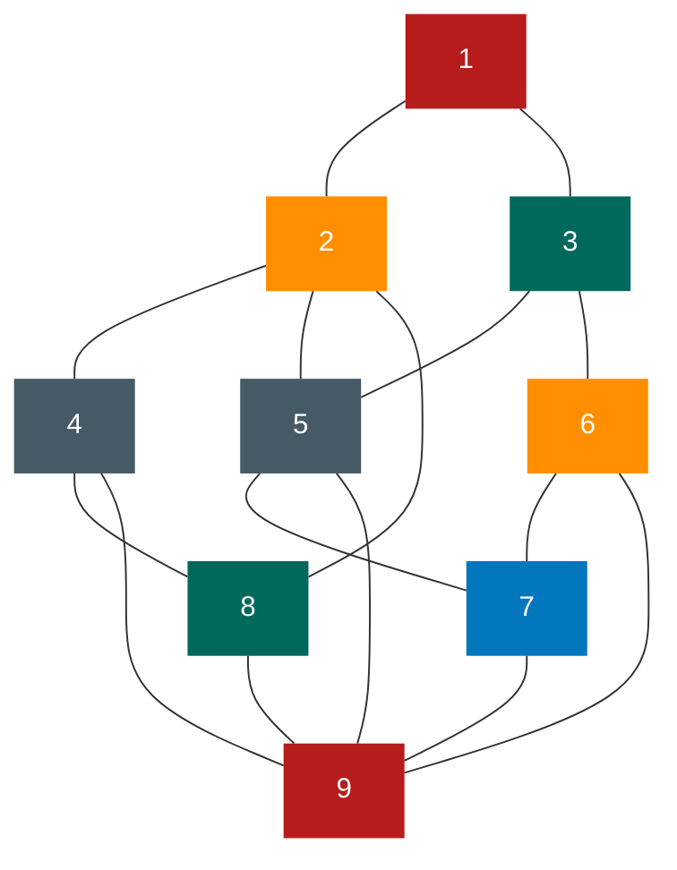
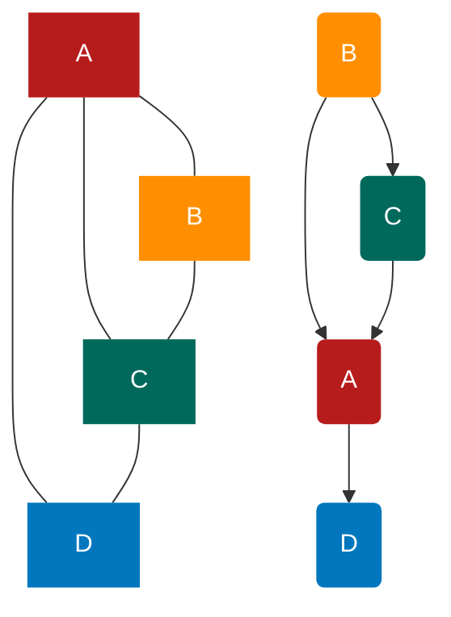
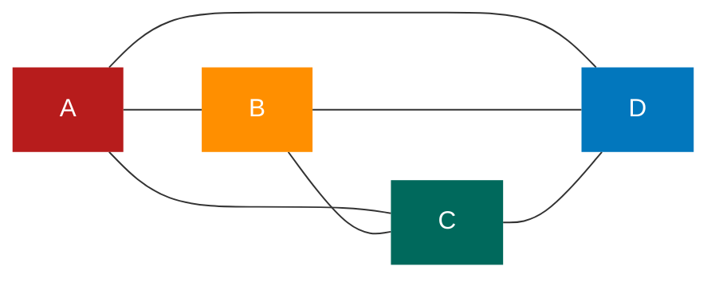
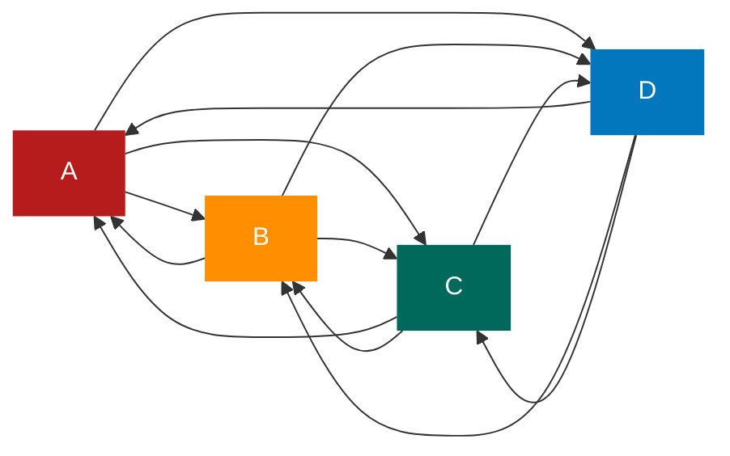
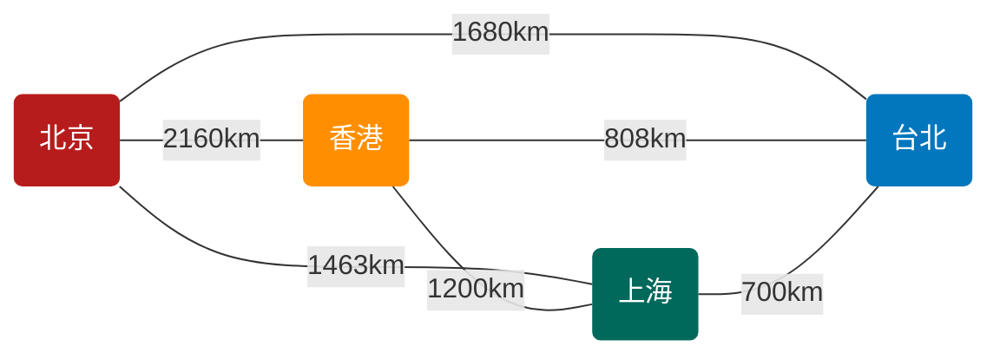
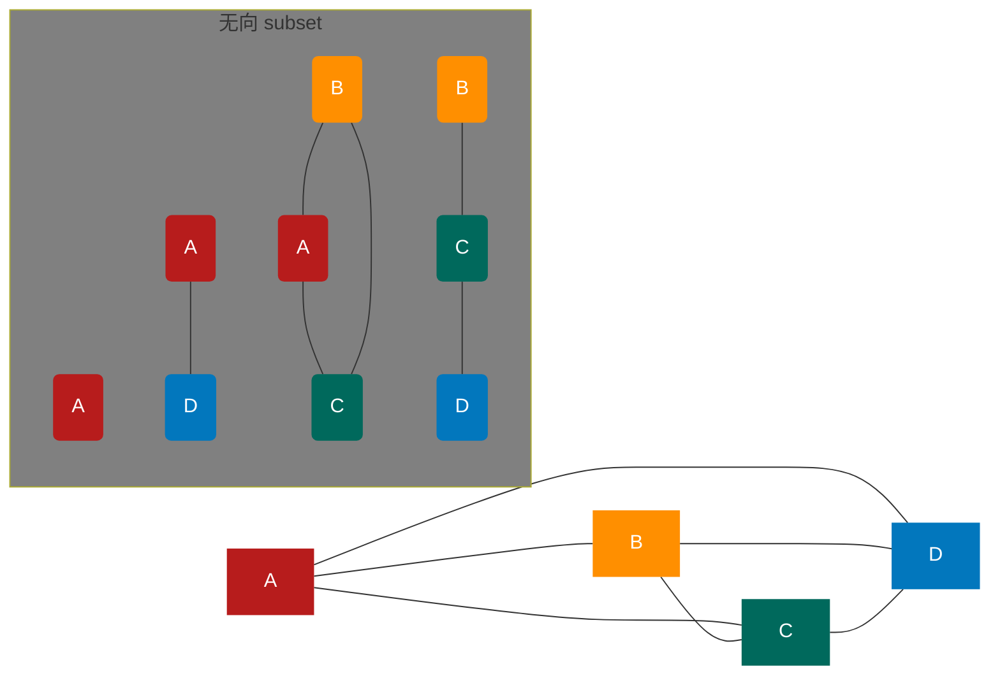
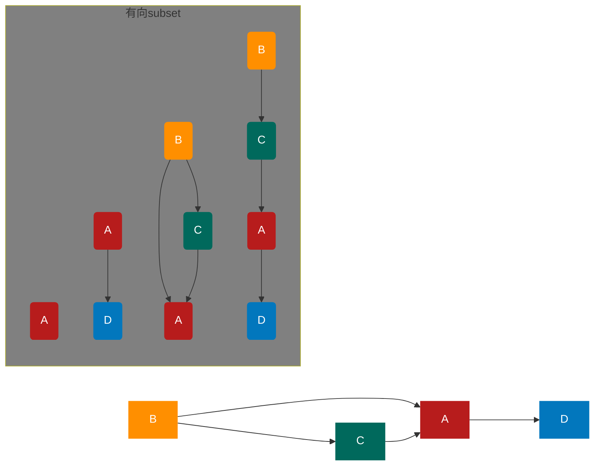

# 图

## 图的定义

**图：图（Graph）是由顶点的有穷非空集合和顶点之间边的集合组成的，通常表示为 G（V,E），其中，G 表示一个图，V 是图 G 中顶点的集合，E 是图 G 中边的集合**

对于图的定义，我们需要明确几个注意的地方

- 线性表中我们把数据元素叫元素，树中将数据元素叫结点， **在图中数据元素,我们则称之为顶点（Vertex）**
- 线性表中可以没有数据元素，称为空表。树中可以没有结点，叫做空树。在图结构中，不允许没有顶点。在定义中，若 v 是顶点的集合，则强调了顶点集合 v 有穷非空
- 线性表中，相邻的数据元素之间具有线性关系，树结构中，相邻两层的结点具有层次关系，而 **图中，任意两个顶点之间都可能有关系，顶点之间的逻辑关系用边来表示** ，边集可以是空的

### 各种图的定义

**无向边：若顶点 v~i~ 到 v~j~ 之间的边没有方向，则称这条边为无向边（Edge），用无序偶对（V~i~ ,v~j~）来表示** 。如果图中任意两个顶点之间的边都是无向边，则称该图为 **无向图 （undirected graphs）** 。左下图就是一个无向图，由于是无方向的，连接顶点 A 与 D 的边,可以表示成无序对（A,D），也可以写成（D，A）。
对于无向图 G，来说，G,=(v,{E})，其中顶点集合 V，={A,B,C,D}：边集合 E,={(A,B),(B,C),(C,D),(D,A),(A,C)}

**有向边：若从顶点 v~i~ 到 v~j~ 的边有方向，则称这条边为有向边，也称为弧（Arc）。** 用有序偶< v~i~ ，V~j~ >来表示，v~i~ 称为弧尾（Tail），v~j~ 称为弧头（Head）。如果图中任意两个项点之间的边都是有向边，则称该图为 **有向图（directed graphs）** 。右上图就是一个有向图。 **连接顶点 A 到 D 的有向边就是弧，A 是弧尾，D 是弧头，<A，D>表示弧，注意不能写成<D，A>。**

对于右上图中的有向图 G~2~ 来说，G~2~ =(v~2~ , {E~2~ })，其中顶点集合 v~2~={A,B,C,D}；弧集合 E~2~={<A,D>,<B,A>,<C,A>,<B,C>}。

看清楚了， **无向边用小括号“（）”表示，而有向边则是用尖括号“<>”表示。**

**在图中，若不存在顶点到其自身的边，且同一条边不重复出现，则称这样的图为简单图。**

****

**在无向图中，如果任意两个顶点之间都存在边，则称该图为无向完全图。** 含有 n 个顶点的无向完全图有 $\frac{n*(n-1)}{2}$ 条边。比如下图就是无向完全图，因为每个顶点都要与除它以外的顶点连线，顶点 A 与 B、C、D 三个顶点连线，共有四个顶点，自然是 4×3，但由于顶点 A 与顶点 B 连线后，计算 B 与 A 连线就是重复，因此要整体除以 2，共有 6 条边。

**在有向图中，如果任意两个顶点之间都存在方向相反的两条弧，则称该图为有向完全图。** 含有 n 个顶点的有向完全图有 n\*(n-1)条边，如下图所示。

从这里也可以得到结论，对于具有 n 个顶点和 e 条边数的图，无向图 0≤e≤n(n-1)/2，有向图 0≤e≤n(n-1)

**有很少条边或弧的图称为稀疏图，反之称为稠密图。** 这里稀疏和稠密是模糊的概念，都是相对而言的

有些图的边或弧具有与它相关的数字，这种 **与图的边或弧相关的数叫做权（Weight）。** 这些权可以表示从一个顶点到另一个顶点的距离或耗费。 **这种带权的图通常称为网（Network）。** 下图就是一张带权的图，即标志中国四大城市的直线距离的网，此图中的权就是两地的距离。

**假设有两个图 G=（V,{E})和 G'=（V',[E}），如果 v $\supseteq$ v' 且 E $\supseteq$ E'，则称 G' 为 G 的子图（Subgraph）。**
例如下图带底纹的图均为左侧无向图与有向图的子图。

### 图的顶点与边间的关系

**对于无向图 G=（V,{E}），如果边（v,v') $\in$ E，则称顶点 v 和 v'互为邻接点(Adjacent），即 v 和 v' 相邻接。边（v,v'）依附（incident）于顶点 v 和 v'，或者说（v,v'）与顶点 v 和 v' 相关联。顶点 v 的度（Degree）是和 v 相关联的边的数目，记为 TD（v）。** 例如上图的无向图，顶点 A 与 B 互为邻接点，边（A,B）依附于顶点 A 与 B 上，顶点 A 的度为 3。而此图的边数是 5，各个顶点度的和=3+2+3+2=10，推敲后发现，边数其实就是各顶点度数和的一半，多出的一半是因为重复两次记数

e = $\frac{1}{2}\sum^n_(i=1_)$ TD(V~i~)

**对于有向图 G=（V,{E}），如果弧<v，v'> $\in$ E，则称顶点 v 邻接到顶点 v'，顶点 v'邻接自顶点 v。弧<v,v'>和顶点 v，v'相关联。以顶点 v 为头的弧的数目称为 v 的入度（InDegree），记为 ID（v）；以 v 为尾的弧的数目称为 v 的出度（OutDegree），记为 OD(v)；顶点 v 的度为 TD（v）=ID（v）+OD（v）。** 例如上图的有向图，顶点 A 的入度是 2（从 B 到 A 的弧，从 C 到 A 的弧），出度是 1（从 A 到 D 的弧），所以顶点 A 的度为 2+1=3。此有向图的弧有 4 条，而各顶点的出度和=1+2+1+0=4，各顶点的入度和=2+0+1+1=4。所以得到

e = $\sum^n_(i=1_)$ ID(v~i~) = $\sum^n_(i=1_)$ OD(v~i~)

**无向图 G=（V，{E}）中从顶点 v 到顶点 V’的路径（Path）是一个顶点序列（v=V,oYin-,Yim=V），其中（V,}1V，）EE，1≤j≤m。** 例如下图中就列举了顶点 B 到顶点 D 四种不同的路径。
图 1
图 2
图 3
图 4
如果 G 是有向图，则路径也是有向的，顶点序列应满足<vij1VEE，1≤j≤m。例如下图，顶点 B 到 D 有两种路径。而顶点 A 到 B，就不存在路径。
186
树中根结点到任意结点的路径是唯一的，但是图中顶点与顶点之间的路径却是不唯一的。
路径的长度是路径上的边或弧的数目。上图中的上方图 1 和图 2 两条路径长度为 2，下方图 3 和图 4 两条路径长度为 3。上图左侧路径长为 2，右侧路径长度为 3。
第一个顶点和最后一个顶点相同的路径称为回路或环（Cycle）。序列中顶点不重复出现的路径称为简单路径。除了第一个顶点和最后一个顶点之外，其余顶点不重复出现

****
