# 图

## 图的定义

**<font color="#1565c0">图：图（Graph）是由顶点的有穷非空集合和顶点之间边的集合组成的，通常表示为 G（V,E），其中，G 表示一个图，V 是图 G 中顶点的集合，E 是图 G 中边的集合</font>**

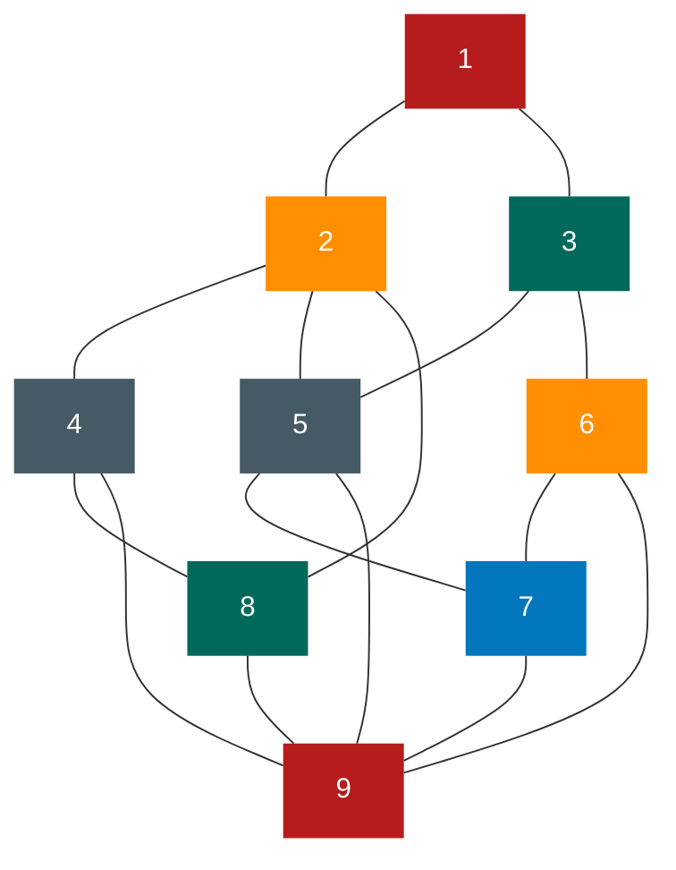

对于图的定义，我们需要明确几个注意的地方

- 线性表中我们把数据元素叫元素，树中将数据元素叫结点， **<font color="#1565c0">在图中数据元素,我们则称之为顶点（Vertex）</font>**
- 线性表中可以没有数据元素，称为空表。树中可以没有结点，叫做空树。在图结构中，不允许没有顶点。在定义中，若 V 是顶点的集合，则强调了顶点集合 V 有穷非空
- 线性表中，相邻的数据元素之间具有线性关系，树结构中，相邻两层的结点具有层次关系，而 **<font color="#1565c0">图中，任意两个顶点之间都可能有关系，顶点之间的逻辑关系用边来表示</font>** ，边集可以是空的

### 各种图的定义

**<font color="#1565c0">无向边：若顶点 V~i~ 到 V~j~ 之间的边没有方向，则称这条边为无向边（Edge），用无序偶对（V~i~ ,V~j~）来表示</font>** 。如果图中任意两个顶点之间的边都是无向边，则称该图为 **<font color="#1565c0">无向图 （undirected graphs）</font>** 。左下图就是一个无向图，由于是无方向的，连接顶点 A 与 D 的边,可以表示成无序对（A,D），也可以写成（D，A）。
对于无向图 G，来说，G,=(V,{E})，其中顶点集合 V，={A,B,C,D}：边集合 E,={(A,B),(B,C),(C,D),(D,A),(A,C)}

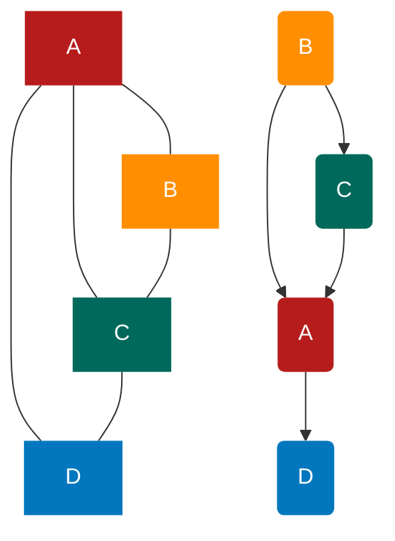

**<font color="#1565c0">有向边：若从顶点 V~i~ 到 V~j~ 的边有方向，则称这条边为有向边，也称为弧（Arc）。</font>** 用有序偶< V~i~ ，V~j~ >来表示，v~i~ 称为弧尾（Tail），v~j~ 称为弧头（Head）。如果图中任意两个项点之间的边都是有向边，则称该图为 **<font color="#1565c0">有向图（directed graphs）</font>** 。右上图就是一个有向图。 **<font color="#1565c0">连接顶点 A 到 D 的有向边就是弧，A 是弧尾，D 是弧头，<A，D>表示弧，注意不能写成<D，A>。</font>**

对于右上图中的有向图 G~2~ 来说，G~2~ =(V~2~ , {E~2~ })，其中顶点集合 V~2~={A,B,C,D}；弧集合 E~2~={<A,D>,<B,A>,<C,A>,<B,C>}。

看清楚了， **<font color="#1565c0">无向边用小括号“（）”表示，而有向边则是用尖括号“<>”表示。</font>**

**<font color="#1565c0">在图中，若不存在顶点到其自身的边，且同一条边不重复出现，则称这样的图为简单图。</font>**

**<font color="#1565c0"></font>**

**<font color="#1565c0">在无向图中，如果任意两个顶点之间都存在边，则称该图为无向完全图。</font>** 含有 n 个顶点的无向完全图有 $\frac{n*(n-1)}{2}$ 条边。比如下图就是无向完全图，因为每个顶点都要与除它以外的顶点连线，顶点 A 与 B、C、D 三个顶点连线，共有四个顶点，自然是 4×3，但由于顶点 A 与顶点 B 连线后，计算 B 与 A 连线就是重复，因此要整体除以 2，共有 6 条边。

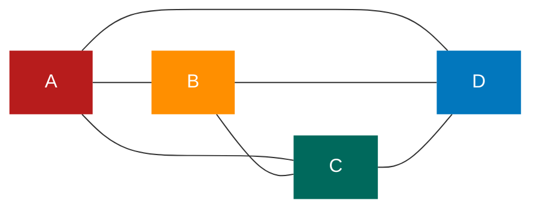

**<font color="#1565c0">在有向图中，如果任意两个顶点之间都存在方向相反的两条弧，则称该图为有向完全图。</font>** 含有 n 个顶点的有向完全图有 n\*(n-1)条边，如下图所示。

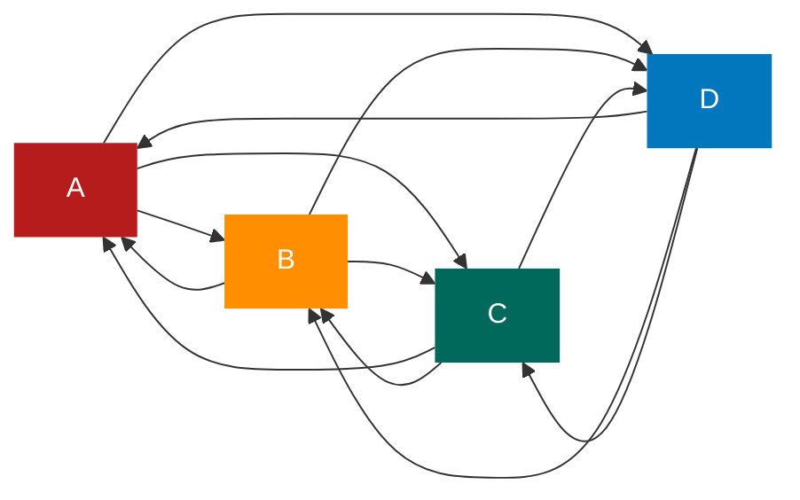

从这里也可以得到结论，对于具有 n 个顶点和 e 条边数的图，无向图 0≤e≤n(n-1)/2，有向图 0≤e≤n(n-1)

**<font color="#1565c0">有很少条边或弧的图称为稀疏图，反之称为稠密图。</font>** 这里稀疏和稠密是模糊的概念，都是相对而言的

有些图的边或弧具有与它相关的数字，这种 **<font color="#1565c0">与图的边或弧相关的数叫做权（Weight）。</font>** 这些权可以表示从一个顶点到另一个顶点的距离或耗费。 **<font color="#1565c0">这种带权的图通常称为网（Network）。</font>** 下图就是一张带权的图，即标志中国四大城市的直线距离的网，此图中的权就是两地的距离。

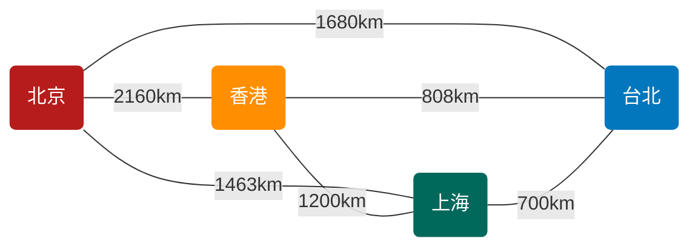

**<font color="#1565c0">假设有两个图 G=（V,{E})和 G'=（V',[E}），如果 V $\supseteq$ V' 且 E $\supseteq$ E'，则称 G' 为 G 的子图（Subgraph）。</font>**
例如下图带底纹的图均为左侧无向图与有向图的子图。

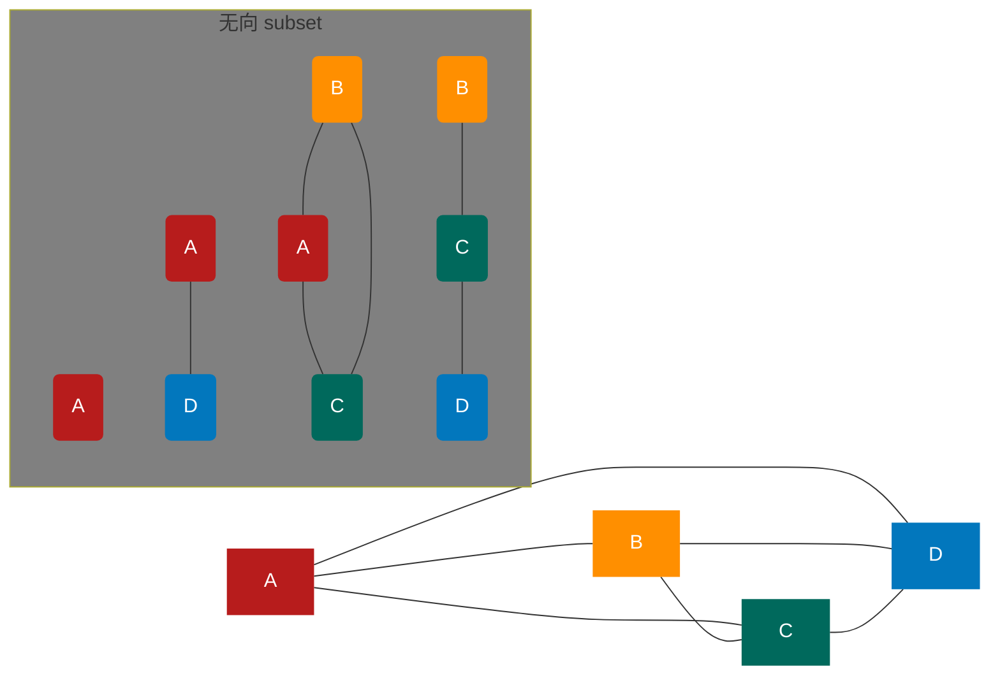

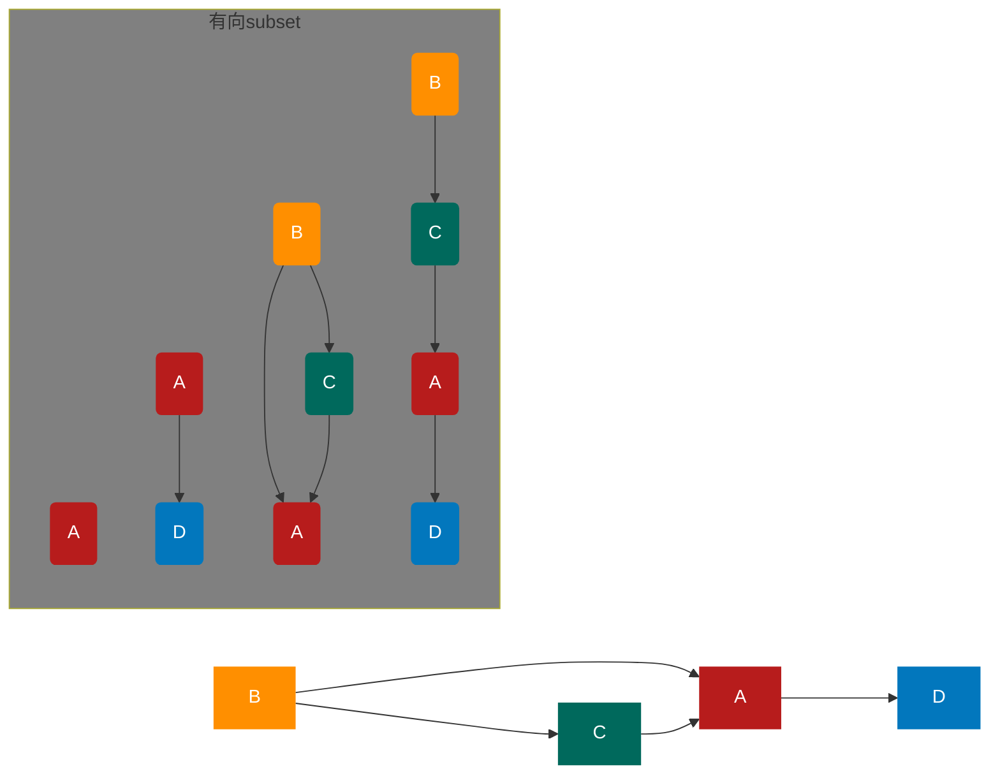

### 图的顶点与边间的关系

**<font color="#1565c0">对于无向图 G=（V,{E}），如果边（v,V') $\in$ E，则称顶点 V 和 V'互为邻接点(Adjacent），即 V 和 V' 相邻接。边（v,V'）依附（incident）于顶点 V 和 V'，或者说（v,V'）与顶点 V 和 V' 相关联。顶点 V 的度（Degree）是和 V 相关联的边的数目，记为 TD（v）。</font>** 例如上图的无向图，顶点 A 与 B 互为邻接点，边（A,B）依附于顶点 A 与 B 上，顶点 A 的度为 3。而此图的边数是 5，各个顶点度的和=3+2+3+2=10，推敲后发现，边数其实就是各顶点度数和的一半，多出的一半是因为重复两次记数

e = $\frac{1}{2}\sum^n_(i=1_)$ TD(V~i~)

**<font color="#1565c0">对于有向图 G=（V,{E}），如果弧<v，v'> $\in$ E，则称顶点 V 邻接到顶点 V'，顶点 V'邻接自顶点 v。弧<V,V'>和顶点 v，v'相关联。以顶点 V 为头的弧的数目称为 V 的入度（InDegree），记为 ID（v）；以 V 为尾的弧的数目称为 V 的出度（OutDegree），记为 OD(V)；顶点 V 的度为 TD（v）=ID（v）+OD（v）。</font>** 例如上图的有向图，顶点 A 的入度是 2（从 B 到 A 的弧，从 C 到 A 的弧），出度是 1（从 A 到 D 的弧），所以顶点 A 的度为 2+1=3。此有向图的弧有 4 条，而各顶点的出度和=1+2+1+0=4，各顶点的入度和=2+0+1+1=4。所以得到

e = $\sum^n_(i=1_)$ ID(V~i~) = $\sum^n_(i=1_)$ OD(V~i~)

**<font color="#1565c0">无向图 G=（V，{E}）中从顶点 V 到顶点 V’的路径（Path）是一个顶点序列（v=V,oYin-,Yim=V），其中（V,}1V，）EE，1≤j≤m。</font>** 例如下图中就列举了顶点 B 到顶点 D 四种不同的路径
图 1

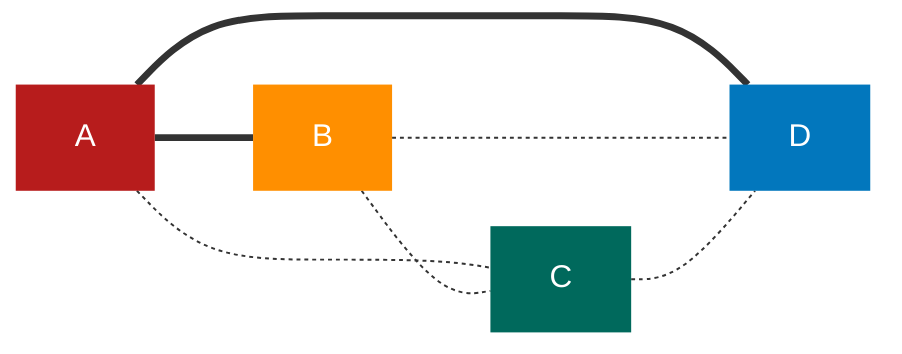

图 2

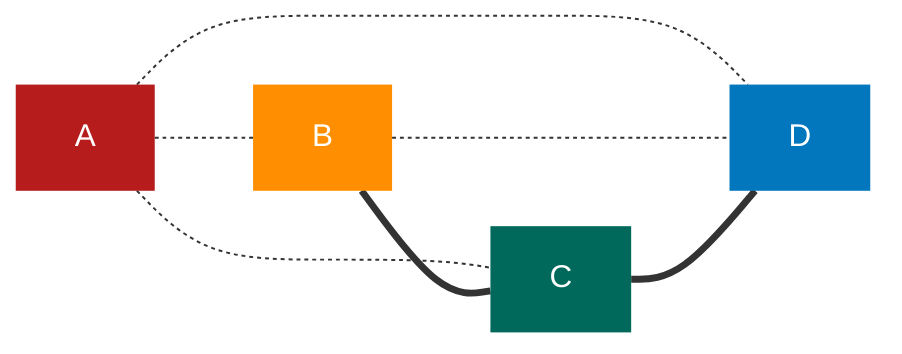

图 3

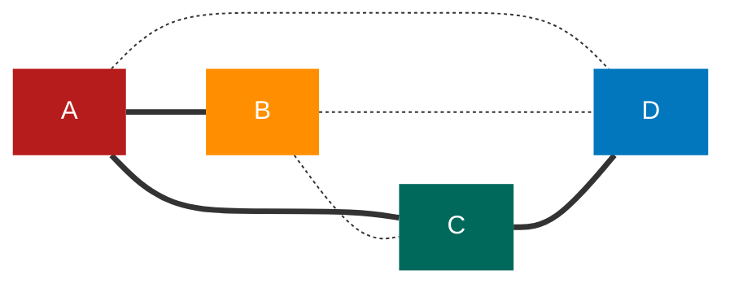

图 4

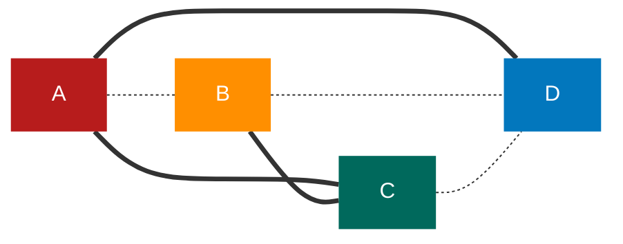

如果 G 是有向图，则路径也是有向的，顶点序列应满足 <V~i,j~1> $\in$ E，1≤j≤m。例如下图，顶点 B 到 D 有两种路径。而顶点 A 到 B，就不存在路径
图 1

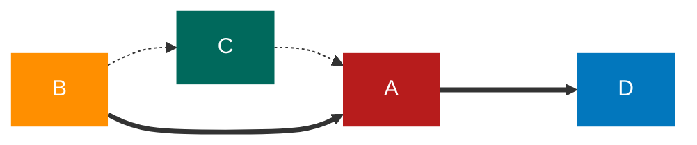

图 2

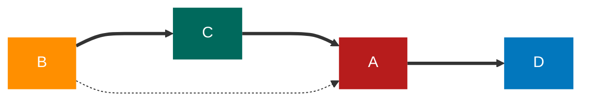

树中根结点到任意结点的路径是唯一的，但是图中顶点与顶点之间的路径却是不唯一的。
**<font color="#1565c0">路径的长度是路径上的边或弧的数目。</font>** 上图中的上方图 1 和图 2 两条路径长度为 2，下方图 3 和图 4 两条路径长度为 3。上图左侧路径长为 2，右侧路径长度为 3。

**<font color="#1565c0">第一个顶点和最后一个顶点相同的路径称为回路或环（Cycle）。序列中顶点不重复出现的路径称为简单路径。除了第一个顶点和最后一个顶点之外，其余顶点不重复出现的回路，称为简单回路或简单环。</font>** 下图中两个图的粗线都构成环，左侧的环因第一个顶点和最后一个顶点都是 B，且 C、D、A 没有重复出现，因此是一个简单环。而右侧的环,由于顶点 C 的重复，它就不是简单环了

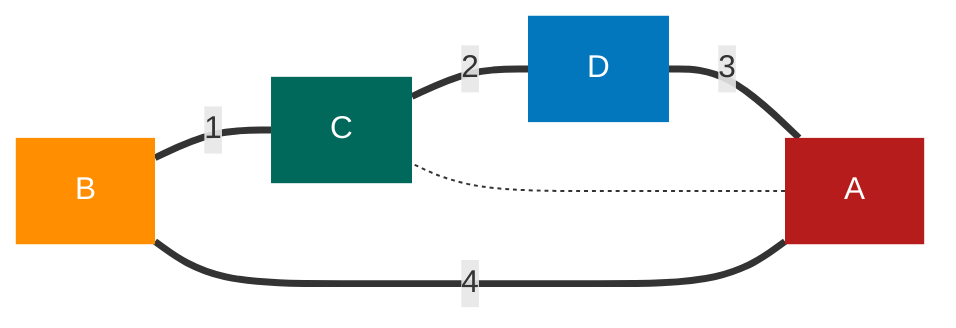

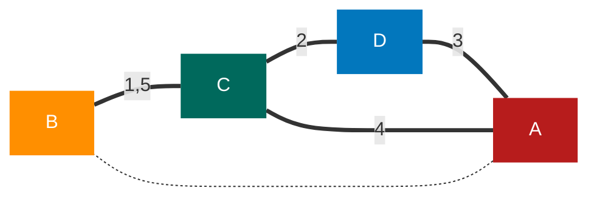

### 连通图的相关术语

**<font color="#1565c0">在无向图 G 中，如果从顶点 V 到顶点 V 有路径，则称 V 和 V‘是连通的。如果对于图中任意两个顶点 V、vEV，v 和 V 都是连通的，则称 G 是连通图（Connected Graph)。</font>** 下图的图 1，它的顶点 A 到顶点 B、C、D 都是连通的，但显然顶点 A 与顶点或 F 就无路径,因此不能算是连通图。而下图的图 2，顶点 A、B、C、D 相互都是连通的，所以它本身是连通图
图 1

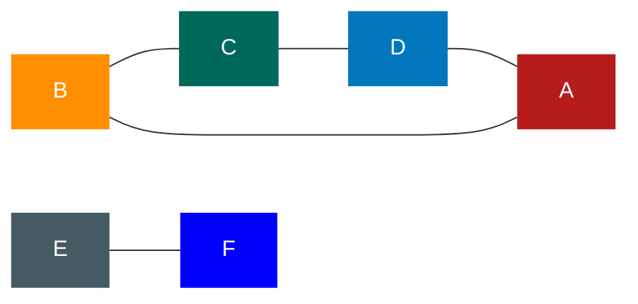

图 2

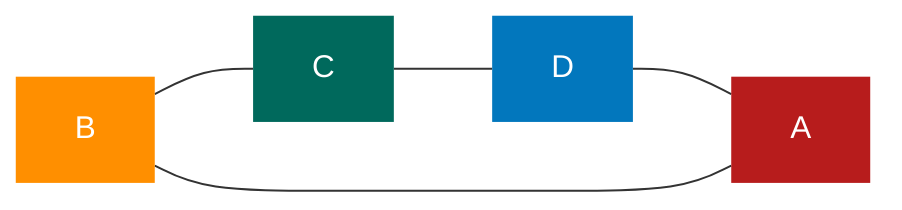

图 3


图 4


**<font color="#1565c0">无向图中的极大连通子图称为连通分量。</font>** 注意连通分量的概念，它强调：

- 要是子图;
- 子图要是连通的;
- 连通子图含有极大顶点数;
- 具有极大顶点数的连通子图包含依附于这些顶点的所有边。
  上图的图 1 是一个无向非连通图。但是它有两个连通分量，即图 2 和图 3。而图 4，尽管是图 1 的子图，但是它却不满足连通子图的极大顶点数（图 2 满足）。因此它不是图 1 的无向图的连通分量

**<font color="#1565c0">在有向图 G 中，如果对于每一对 V~i~、v~j~ $\in$ V、v~i~ ≠ V~j~，从 V~i~ 到 V~j~ 和从 V~j~ 到 V~i~ 都存在路径，则称 G 是强连通图。有向图中的极大强连通子图称做有向图的强连通分量。</font>** 例如下图中图 1 并不是强连通图，因为顶点 A 到顶点 D 存在路径，而 D 到 A 就不存在。图 2 就是强连通图，而且显然图 2 是图 1 的极大强连通子图，即是它的强连通分量

图 1

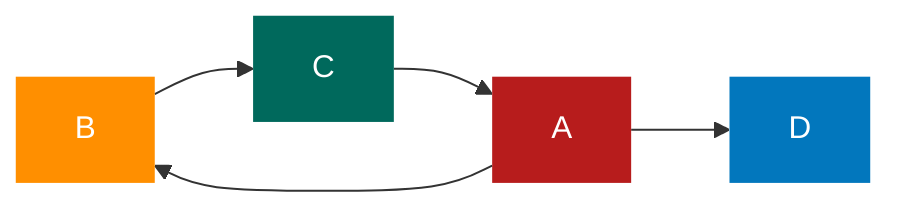

图 2

```mermaid
graph LR
    B-->C
    A-->B
    C-->A
    classDef default color:white,stroke:none;
    classDef description fill:none,stroke:none,color:black;
    classDef reset color:white,stroke:none;
    classDef transparent fill:none;
    classDef red fill:#b71c1c;
    classDef orange fill:#ff8f00;
    classDef gray fill:#455a64;
    classDef green fill:#00695c;
    classDef blue fill:#0277bd;
    class A red;
    class B orange;
    class C green;
    class D blue;
    class E gray;
```

现在我们再来看连通图的生成树的定义。
所谓 **<font color="#1565c0">一个连通图的生成树是一个极小的连通子图，它含有图中全部的 n 个顶点，但只有足以构成一棵树的 n-1 条边。</font>** 比如下图的图 1 是一普通图，但显然它不是生成树，当去掉两条构成环的边后，比如图 2 或图 3，就满足 n 个顶点 n - 1 条边且连通的定义了。它们都是一棵生成树。从这里也可知道，如果一个图有 n 个顶点和小于 n - 1 条边，则是非连通图，如果它多于 n - 1 条边，必定构成一个环，因为这条边使得它依附的那两个顶点之间有了第二条路径。比如图 2 和图 3，随便加哪两顶点的边都将构成环。不过有 n - 1 条边并不一定是生成树，比如图 4
图 1

```mermaid
graph LR
    A---B
    B---C
    C---D
    A---D
    D---E---F---G---H---E
    classDef default color:white,stroke:none;
    classDef description fill:none,stroke:none,color:black;
    classDef reset color:white,stroke:none;
    classDef transparent fill:none;
    classDef red fill:#b71c1c;
    classDef orange fill:#ff8f00;
    classDef gray fill:#455a64;
    classDef green fill:#00695c;
    classDef blue fill:#0277bd;
    class A,H red;
    class B,G orange;
    class C green;
    class D blue;
    class F gray;
    style E fill:blue;
```

图 2

```mermaid
graph LR
    B---C
    C---D
    A---D
    D---E---F
    G---H---E
    classDef default color:white,stroke:none;
    classDef description fill:none,stroke:none,color:black;
    classDef reset color:white,stroke:none;
    classDef transparent fill:none;
    classDef red fill:#b71c1c;
    classDef orange fill:#ff8f00;
    classDef gray fill:#455a64;
    classDef green fill:#00695c;
    classDef blue fill:#0277bd;
    class A,H red;
    class B,G orange;
    class C green;
    class D blue;
    class F gray;
    style E fill:blue;
```

图 3

```mermaid
graph LR
    A---B
    B---C
    C---D
    D---E---F---G---H
    classDef default color:white,stroke:none;
    classDef description fill:none,stroke:none,color:black;
    classDef reset color:white,stroke:none;
    classDef transparent fill:none;
    classDef red fill:#b71c1c;
    classDef orange fill:#ff8f00;
    classDef gray fill:#455a64;
    classDef green fill:#00695c;
    classDef blue fill:#0277bd;
    class A,H red;
    class B,G orange;
    class C green;
    class D blue;
    class F gray;
    style E fill:blue;
```

图 4

```mermaid
graph LR
    A---B
    B---C
    C---D
    E---F---G---H---E
    classDef default color:white,stroke:none;
    classDef description fill:none,stroke:none,color:black;
    classDef reset color:white,stroke:none;
    classDef transparent fill:none;
    classDef red fill:#b71c1c;
    classDef orange fill:#ff8f00;
    classDef gray fill:#455a64;
    classDef green fill:#00695c;
    classDef blue fill:#0277bd;
    class A,H red;
    class B,G orange;
    class C green;
    class D blue;
    class F gray;
    style E fill:blue;
```

**<font color="#1565c0">如果一个有向图恰有一个顶点的入度为 0，其余顶点的入度均为 1，则是一个有向树。</font>** 对有向树的理解比较容易，所谓入度为 0 其实就相当于树中的根结点，其余顶点入度为 1 就是说树的非根结点的双亲只有一个。 **<font color="#1565c0">一个有向图的生成森林由若干棵有向树组成，含有图中全部顶点，但只有足以构成若干棵不相交的有向树的弧。</font>** 如下图的图 1 是一棵有向图。去掉一些弧后，它可以分解为两棵有向树，如图 2 和图 3，这两棵就是图 1 有向图的生成森林

图 1

```mermaid
graph LR
    B-->C
    B-->A
    C-->A
    A-->D
    G-->D
    G-->C
    F-->G
    F-->E
    E-->G
    E-->D
    classDef default color:white,stroke:none;
    classDef description fill:none,stroke:none,color:black;
    classDef reset color:white,stroke:none;
    classDef transparent fill:none;
    classDef red fill:#b71c1c;
    classDef orange fill:#ff8f00;
    classDef green fill:#455a64;
    classDef gray fill:#00695c;
    classDef blue fill:#0277bd;
    class A red;
    class B orange;
    class G green;
    class D,F blue;
    class C gray;
    style E fill:blue;
```

图 2

```mermaid
graph LR
    B-->C
    B-->A
    A-->D
    classDef default color:white,stroke:none;
    classDef description fill:none,stroke:none,color:black;
    classDef reset color:white,stroke:none;
    classDef transparent fill:none;
    classDef red fill:#b71c1c;
    classDef orange fill:#ff8f00;
    classDef green fill:#455a64;
    classDef gray fill:#00695c;
    classDef blue fill:#0277bd;
    class A red;
    class B orange;
    class G green;
    class D,F blue;
    class C gray;
```

图 3

```mermaid
graph LR
    F-->E
    F-->G
    classDef default color:white,stroke:none;
    classDef description fill:none,stroke:none,color:black;
    classDef reset color:white,stroke:none;
    classDef transparent fill:none;
    classDef red fill:#b71c1c;
    classDef orange fill:#ff8f00;
    classDef green fill:#455a64;
    classDef gray fill:#00695c;
    classDef blue fill:#0277bd;
    classDef darkBlue fill:blue;
    class A red;
    class B orange;
    class G green;
    class D,F blue;
    class C gray;
    class E darkBlue;
```

### 图的定义与术语总结

图按照有无方向分为 **<font color="#1565c0">有向图和无向图</font>** 。有向图由 **<font color="#1565c0">顶点和弧</font>** 构成，无向图由 **<font color="#1565c0">顶点和边</font>** 构成。 **<font color="#1565c0">弧有弧尾和弧头</font>** 之分

图按照边或弧的多少分为 **<font color="#1565c0">稀疏图和稠密图</font>** 。如果任意两个顶点之间都存在边叫 **<font color="#1565c0">完全图</font>** ，有向的叫 **<font color="#1565c0">有向完全图</font>** 。若无重复的边或顶点到自身的边则叫 **<font color="#1565c0">简单图</font>**

图中顶点之间有 **<font color="#1565c0">邻接点、依附</font>** 的概念。无向图顶点的边数叫做度，有向图顶点分为 **<font color="#1565c0">入度和出度</font>**

图上的边或弧上 **<font color="#1565c0">带权则称为网</font>**

图中顶点间存在 **<font color="#1565c0">路径</font>** ，两顶点存在路径则说明是 **<font color="#1565c0">连通</font>** 的，如果路径最终回到起始点则称为 **<font color="#1565c0">环</font>** ，当中不重复叫 **<font color="#1565c0">简单路径</font>** 。若任意两顶点都是连通的，则图就是 **<font color="#1565c0">连通图</font>** ，有向则称 **<font color="#1565c0">强连通图</font>** 。图中有子图，若子图极大连通则就是 **<font color="#1565c0">连通分量</font>** ，有向的则称 **<font color="#1565c0">强连通分量</font>**

无向图中连通且 n 个顶点 n-1 条边叫 **<font color="#1565c0">生成树</font>** 。有向图中一顶点入度为 0 其余顶点入度为 1 的叫 **<font color="#1565c0">有向树</font>** 。一个有向图由若干棵有向树构成 **<font color="#1565c0">生成森林</font>**

```mermaid
graph LR
    A(图)
    B1(方向)
    B2(边分类)
    B3(完全图)
    B4(简单图)
    B5(顶点)
    B6(网)
    B7(路径)
    C1(无向图)
    C2(有向图)
    C3(稀疏图)
    C4(稠密图)
    C5(有向完全图)
    C6(邻接点)
    C7(依附)
    C8(权)
    C9(连通)
    C10(环)
    D1(顶点)
    D2(边)
    D3(生成树)
    D4(顶点)
    D5(弧)
    D6(有向树)
    D7(连通图)
    D8(连通分量)
    D9(简单路径)
    E1(度)
    E2(入度)
    E3(出度)
    E4(生成森林)
    E5(强连通图)
    E6(强连通分量)
    A---B1
    A---B2
    A---B3
    A---B4
    A---B5
    A---B6
    A---B7
    B1---C1
    B1---C2
    B2---C3
    B2---C4
    B3---C5
    B5---C6
    B5---C7
    B6---C8
    B7---C9
    B7---C10
    C1---D1
    C1---D2
    C1---D3
    C2---D4
    C2---D5
    C2---D6
    C9---D7
    C9---D8
    C10---D9
    D1---E1
    D4---E2
    D4---E3
    D6---E4
    D7---E5
    D8---E6

    classDef default color:white,stroke:none;
    classDef description fill:none,stroke:none,color:black;
    classDef reset color:white,stroke:none;
    classDef transparent fill:none;
    classDef red fill:#b71c1c;
    classDef orange fill:#ff8f00;
    classDef gray fill:#455a64;
    classDef green fill:#00695c;
    classDef blue fill:#0277bd;
    classDef darkBlue fill:blue;
    class A red;
    class B1,B2,B3,B4,B5,B6,B7 orange;
    class D1,D2,D3,D4,D5,D6,D7,D8,D9,E1,E2,E3,E4,E5,E6 green;
    class C1,C2,C3,C4,C5,C6,C7,C8,C9,C10 blue;
```

## 图的抽象数据类型

ADT
Data
图（Graph)
顶点的有穷非空集合和边的集合。
Operation
CreateGraph(*G，V，VB）：按照顶点集 V 和边弧集 VR 的定义构造图 G。
DestroyGraph(*G）：图 G 存在则销毁。
Locatevex（G，u)：若图 G 中存在顶点 u，则返回图中的位置。
Getvex（G，v）：返回图 G 中顶点 V 的值。
PutVex(G，v，value)：将图 G 中顶点 V 赋值 value。
FirstAdjVex(G，*v）：返回顶点 V 的一个邻接顶点，若顶点在 G 中无邻接顶点返回空。
NextAdjVex(G，v，*w)：返回顶点 V 相对于顶点 w 的下一个邻接顶点，若 w 是 V 的最后
一个邻接点则返回“空”。
Insertvex(*G，v）：在图 G 中增添新顶点 v。
Deletevex（*G，v）：删除图 G 中顶点 V 及其相关的弧。
InsertArc(*G,v，w)：在图 G 中增添弧<v，w>，若 G 是无向图，还需要增添对称弧
<w,V>o
DeleteArc(*G，v，w)：在图 G 中删除弧<v，w>，若 G 是无向图，则还删除对称弧
<w,V>o
DFSTraverse(G）：对图 G 中进行深度优先遍历，在遍历过程中对每个顶点调用。
HFSTraverse（G）：对图 G 中进行广度优先遍历，在遍历过程中对每个顶点调用。
endADT

## 图的存储结构

图的存储结构相较线性表与树来说更加复杂。“顶点的位置”或“邻接点的位置”只是一个相对的概念。其实从图的逻辑结构定义来看，图上任何一个顶点都可被看成是第一个顶点，任一顶点的邻接点之间也不存在次序关系。有时候可能顶点的位置不同，都会造成了表象上不太一样的感觉

也正由于图的结构比较复杂，任意两个顶点之间都可能存在联系，因此无法以数据元素在内存中的物理位置来表示元素之间的关系，也就是说，图不可能用简单的顺序存储结构来表示。而多重链表的方式，即以一个数据域和多个指针域组成的结点表示图中的一个顶点，尽管可以实现图结构，但其实在树中，我们也已经讨论过，这是有问题的。如果各个顶点的度数相差很大，按度数最大的顶点设计结点结构会造成很多存储单元的浪费，而若按每个顶点自己的度数设计不同的顶点结构，又带来操作的不便

### 邻接矩阵

考虑到图是由顶点和边或弧两部分组成。合在一起比较困难，那就很自然地考虑到分两个结构来分别存储。顶点不分大小、主次，所以用一个一维数组来存储是很不错的选择。而边或弧由于是顶点与顶点之间的关系，一维搞不定，那就考虑用一个二维数组来存储。于是邻接矩阵的方案就诞生了
**<font color="#1565c0"></font>**

**<font color="#1565c0">图的邻接矩阵（Adjacency Matrix）存储方式是用两个数组来表示图。一个一维数组存储图中顶点信息，一个二维数组（称为邻接矩阵）存储图中的边或弧的信息</font>**

设图 G 有 n 个顶点，则邻接矩阵是一个 nxn 的方阵，定义为：

arc[i][j] = 1 或 0
1，若（v~i~，v~j~) $\in$ E 或 < V~i~,V~j~ > $\in$ E
0，其他

看一个实例，下图就是一个无向图

```mermaid
graph LR
    V0---V1---V2---V3---V0
    V0---V2
    classDef default color:white,stroke:none;
    classDef description fill:none,stroke:none,color:black;
    classDef reset color:white,stroke:none;
    classDef transparent fill:none;
    classDef red fill:#b71c1c;
    classDef orange fill:#ff8f00;
    classDef gray fill:#455a64;
    classDef green fill:#00695c;
    classDef blue fill:#0277bd;
    class V0 red;
    class V1 orange;
    class V2 green;
    class V3 blue;
    class C gray;
```

顶点数组
[v1,v2,v3,v4]

边数组

| 边数组 | v0  | v1  | v2  | v3  |
| :----: | :-: | :-: | :-: | :-: |
|   v0   |  0  |  1  |  1  |  1  |
|   v1   |  1  |  0  |  1  |  0  |
|   v2   |  1  |  1  |  0  |  1  |
|   v3   |  1  |  0  |  1  |  0  |

V1 的度为 2

### 邻接表

邻接矩阵是不错的一种图存储结构，但是对于边数相对顶点较少的图，这种结构是存在对存储空间的极大浪费的。比如说，如果我们要处理稀疏有向图，邻接矩阵中除了极少边或弧有权值外，没有其他边或弧，其实这些存储空间都浪费掉了

因此我们考虑另外一种存储结构方式。回忆我们在学习线性表时谈到，顺序存储结构就存在预先分配内存可能造成存储空间浪费的问题，于是引出了链式存储的结构。同样的，我们也可以考虑对边或弧使用链式存储的方式来避免空间浪费的问题

再回忆树中存储结构孩子表示法，将结点存入数组，并对结点的孩子进行链式存储，不管有多少孩子，也不会存在空间浪费问题。这个思路同样适用于图的存储。我们把这种 **<font color="#1565c0">数组与链表相结合的存储方式称为链接表（Adjacency List）</font>**
邻接表的处理办法如下：

1. 图中顶点用一个一维数组存储，顶点也可以用单链表来存储，不过数组可以较容易地读取顶点信息，更加方便，对于顶点数组中，每个数据元素还需要存储指向第一个邻接点的指针，以便于查找该顶点的边信息。
2. 图中每个顶点 V~i~，的所有邻接点构成一个线性表，由于邻接点的个数不定，所以用单链表存储，无向图称为顶点 V~i~,的边表，有向图则称为顶点 V~i~,作为弧尾的出边表。


从图中我们知道，顶点表的各个结点由 data 和 firstEdge 两个域表示，data 是数据域存储顶点的信息，firstedge 是指针域，指向边表的第一个结点，即此顶点的第一个邻接点。边表结点由 adjvex 和 next 两个域组成。adjvex 是邻接点域，存储某顶点的邻接点在顶点表中的下标，next 则存储指向边表中下一个结点的指针。比如 V~1~顶点与 V~0~、v~2~ 互为邻接点，则在 V~1~,的边表中，adjvex 分别为 V~0~的 0 和 V~2~的 2

这样的结构，对于我们要获得图的相关信息也是很方便的。比如我们要想知道某个顶点的度，就去查找这个顶点的边表中结点的个数。若要判断顶点 V~i~到 V~j~是否存在边，只需要测试顶点 V~i~的边表中 adjvex 是否存在结点 V~j~的下标 j 就行了。若求顶点的所有邻接点,其实就是对此顶点的边表进行遍历，得到的 adjvex 域对应的顶点就是邻接点

若是有向图，邻接表结构是类似的。但要注意的是有向图由于有方向，是以顶点为弧尾来存储边表的，这样很容易就可以得到每个顶点的出度


但也有时为了便于确定顶点的入度或以顶点为弧头的弧，可以建立 **<font color="#1565c0">一个有向图的逆邻接表，即对每个顶点 V~i~都建立一个链接为 V~i~为弧头的表</font>** 。如下图的逆邻接表所示。


此时我们很容易就可以算出某个顶点的入度或出度是多少，判断两顶点是否存在弧也很容易实现。
对于带权值的网图，可以在边表结点定义中再增加一个 weight 的数据域，存储权值信息即可


有了这些结构的图，下面关于结点定义的代码就很好理解了。

```typescript
/*顶点表结点 */
/*顶点域，存储顶点信息*/
/*边表头指针 */

type VertexType = string;
/*顶点类型应由用户定义 */
type EdgeType = number;
/*边上的权值类型应由用户定义*/
type EdgeNode = {
  /*边表结点*/
  adjvex: number;
  /*邻接点域，存储该顶点对应的下标 */
  info: EdgeType;
  /*用于存储权值，对于非网图可以不需要*/
  next: EdgeNode;
  /*链域，指向下一个邻接点 */
};
type VertexNode = {
  data: VertexType;
  firstEdge: EdgeNode;
};
type GraphAdjLis = {
  adjList: AdjList;
  numNodes: number;
  numEdges: number;
};
```

邻接表的创建

```javascript
// G = GraphAdjList
// e = EdgeNode
function createALGraph(G) {
  let i, j, k;
  for (let i = 0; i < G.numNodes; i++) {
    G.adjList[i].firstEdge = null; // 将边表置为空
  }
  for (k = 0; k < G.numEdges; k++) {
    // 建立边表
    e.adjvex = j; // 邻接序号为 j
    e.next = G.adjList[i].firstEdge; // 将e的指针指向当前顶点指向的结点
    G.adjList[i].fistEdge = e; // 将当前顶点的指针指向e
    e.adjvex = i; // 邻接序号为 i
    e.next = G.adjList[j].fistEdge; // 将e的指针指向当前顶点指向的结点
    G.adjList[j].fistEdge = e; // 将当前顶点的指针指向e
  }
}
```

对于无向图，一条边都是对应两个顶点，所以在循环中，一次就对 i 和 j 分别进行了插入。本算法的时间复杂度，对于 n 个顶点 e 条边来说，很容易得出是 O(n+e)。

### 十字链表

**<font color="#1565c0">把邻接表与逆邻接表结合起来，就是有向图的一种存储方法：，十字链表（OrthogonalList）</font>**

我们重新定义顶点表结点结构如下表所示
|data|firstIn|fistOut|
|:-:|:-:|:-:|

其中，firstIn 表示入边表头指针，指向该顶点的入边表中第一个结点；firstOut 表示出边表头指针，指向该顶点的出边表中的第一个结点

重新定义的边表结点结构如下表所示

| tailVex | headVex | headLink | tailLink |
| :-----: | :-----: | :------: | :------: |

其中，tailvex 是指弧起点在顶点表中的下标；headvex 是指弧终点在顶点表中的下标；headlink 是指入边表指针域，指向终点相同的下一条边；taillink 是指边表指针域，指向起点相同的下一条边。如果是网，还可以再增加一个 weight 域来存储权值。
比如下图，顶点依然是存入一个一维数组{V~0~,V~1~,V~2~,V~3~}，实线箭头指针的图示与上面的邻接表的图相似。就以顶点 V~0~来说，firstout 指向的是出边表中的第一个结点 V~3~。所以 V,边表结点的 headvex = 3，而 tailvex 其实就是当前顶点 V~0~ 的下标 0，由于 V~0~ 只有一个出边顶点，所以 headlink 和 taillink 都是空


我们重点需要来解释虚线箭头的含义，它其实就是此图的逆邻接表的表示。对于 V~0~来说，它有两个顶点 V~1~ 和 V~2~ 的入边。因此 V~0~ 的 firstin 指向顶点 V~1~ 的边表结点中 headvex 为 0 的结点，如右上图中的 ①。接着由入边结点的 headlink 指向下一个入边顶点 V~2~ ，如图中的 ②。对于顶点 V~1~，它有一个入边顶点 V~2~，所以它的 frstin 指向顶点 V~2~ 的边表结点中 headvex 为 1 的结点，如图中的 ③。顶点 V~2~ 和 V~3~ 也是同样有一个入边顶点，如图中 ④ 和 ⑤

十字链表的好处就是因为把邻接表和逆邻接表整合在了一起，这样既容易找到以 V~i~ 为尾的弧，也容易找到以 V~i~ 为头的弧，因而容易求得顶点的出度和入度。而且它除了结构复杂一点外，其实创建图算法的时间复杂度是和邻接表相同的，因此，在有向图的应用中，十字链表是非常好的数据结构模型

### 邻接多重表

前面讲了有向图的优化存储结构，对于无向图的邻接表，有没有问题呢？如果我们在无向图的应用中，关注的重点是顶点，那么邻接表是不错的选择，但如果我们更关注边的操作，比如对已访问过的边做标记，删除某一条边等操作，那就意味着，需要我到这条边的两个边表结点进行操作，这其实还是比较麻烦的。比如下图，若要删除左下图的（vv）这条边，需要对邻接表结构中右边表阴影中的两个结点进行删除操作，显然这是比较烦琐的


因此，仿照十字链表的方式，对边表结点的结构进行一些改造，也许就可以避免刚才提到的问题
重新定义的边表结点结构如下表所示

| ivex | ilink | jvex | jlink |
| :--: | :---: | :--: | :---: |

其中， **<font color="#1565c0">ivex 和 jvex 是与某条边依附的两个顶点在顶点表中的下标；ilink 指向依附顶点 ivex 的下一条边；jlink 指向依附顶点 jvex 的下一条边。这就是邻接多重表结构</font>**

来看结构示意图的绘制过程，理解了它是如何连线的，也就理解邻接多重表的构造原理了。如下图所示，左下图告诉我们它有 4 个顶点和 5 条边，显然，我们就应该先将 4 个顶点和 5 条边的边表结点画出来。由于是无向图，所以 ivex 是 0、jvex 是 1 还是反过来都是无所谓的，不过为了绘图方便，都将 ivex 值设置得与一旁的顶点下标相同


开始连线，如下图。首先连线的 ①②③④ 就是将顶点的 firstEdge 指向一条边,顶点下标要与 ivex 的值相同，这很好理解。接着，由于顶点 V~0~ 的（V~0~，V~1~）边的邻边有（V~0~,V~3~)和（V~0~,V~2~)。因此 ⑤⑥ 的连线就是满足指向下一条依附于顶点 V~0~ 的边的目标，注意 ilink 指向的结点的 jvex 一定要和它本身的 ivex 的值相同。同样的道理，连线 ⑦ 就是指（V~1~,V~0~)这条边，它是相当于顶点 V~1~指向（V~1~,V~2~)边后的下一条。V~2~ 有三条边依附，所以在 ③ 之后就有了 ⑧⑨。连线 ⑩ 就是顶点 v~3~ 在连线 ④ 之后的下一条边。左图一共有 5 条边，所以右下图有 10 条连线，完全符合预期。


邻接多重表与邻接表的差别，仅仅是在于同一条边在邻接表中用两个结点表示，而在邻接多重表中只有一个结点。这样对边的操作就方便多了，若要删除左图的（V~0~,V~2~)这条边，只需要将右图的 ⑥⑨ 的连接指向改为八即可。由于各种基本操作的实现也和邻接表是相似的。

### 边集数组

**<font color="#1565c0">边集数组是由两个一维数组构成的。一个是存储顶点的信息；另一个是存储边的信息，这个边数组每个数据元素由一条边的起点下标（begin）、终点下标（end）和权（weight）组成</font>** ，如下图所示。显然边集数组关注的是边的集合，在边集数组中要查找一个顶点的度需要扫描整个边数组，效率并不高。因此它更适合对边依次进行处理的操作，而不适合对顶点相关的操作


定义的边数组结构如下表所示
|begin|end|weight|
|:--:|:--:|:--:|

其中，begin 是存储起点下标；end 是存储终点下标；weight 是存储权值。

## 图的遍历

图的遍历和树的遍历类似，我们希望 **<font color="#1565c0">从图中某一顶点出发访遍图中其余顶点，且使每一个顶点仅被访问一次，这一过程就叫做图的遍历（Traversing Graph）</font>**

树的遍历我们谈到了四种方案，应该说都还好，毕竟根结点只有一个，遍历都是从它发起，其余所有结点都只有一个双亲。可图就复杂多了，因为它的任一顶点都可能和其余的所有顶点相邻接，极有可能存在沿着某条路径搜索后，又回到原顶点，而有些顶点却还没有遍历到的情况。因此我们需要在遍历过程中把访问过的顶点打上标记，以避免访问多次而不自知。具体办法是设置一个访问数组 visited[n]，n 是图中顶点的个数，初值为 0，访问过后设置为 1。这其实在小说中常常见到，一行人在迷宫中迷了路，为了避免找寻出路时屡次重复，所以会在路口用小刀刻上标记。
对于图的遍历来说，如何避免因回路陷入死循环，就需要科学地设计遍历方案，通常有两种遍历次序方案：它们是深度优先遍历和广度优先遍历。

### 深度优先遍历

**<font color="#1565c0">深度优先遍历（Depth First Search），也有称为深度优先搜索，简称为 DFS</font>** 。它的具体思想就如同找钥匙，无论从哪一间房间开始都可以，比如主卧室，然后从房间的一个角开始，将房间内的墙角、床头柜、床上、床下、衣柜里、衣柜上、前面的电视柜等挨个寻找，做到不放过任何一个死角，所有的抽屉、储藏柜中全部都找遍，形象比喻就是翻个底朝天，然后再寻找下一间，直到找到为止

为了更好地理解深度优先遍历，我们来做一个游戏
假设你需要完成一个任务，要求你在如左下图这样的一个迷宫中，从顶点 A 开始要走遍所有的图顶点并作上标记，注意不是简单地看着这样的平面图走哦，而是如同现实般地在只有高墙和通道的迷宫中去完成任务


首先我们从顶点 A 开始，做上表示走过的记号后，面前有两条路，通向 B 和 F，我们给自己定一个原则，在没有碰到重复顶点的情况下，始终是向右手边走，于是走到了 B 顶点，整个行路过程，可参看右上图。此时发现有三条分支，分别通向顶点 C、I、G，右手通行原则，使得我们走到了 C 顶点。就这样，我们一直顺着右手通道走，一直走到 F 顶点。当我们依然选择右手通道走过去后，发现走回到顶点 A 了，因为在这里做了记号表示已经走过。此时们退回到顶点 F，走向从右数的第二条通道，到了 G 顶点，它有三条通道，发现 B 和 D 已经是走过的，于是走到 H，当我们面对通向 H 的两条通道 D 和 E 时，会发现都已经走过了

此时我们是否已经遍历了所有顶点呢？没有。可能还有很多分支的顶点没有走到，所以我们按原路返回。在顶点 H 处，再无通道没走过，返回到 G，也无未走过通道，返回到 F，没有通道，返回到 E，有一条通往 H 的通道，验证后也是走过的，再返回到顶点 D，此时还有三条道未走过，一条条来，H 走过了，G 走过了，I，哦，这是一个新顶点，没有标记，赶快记下来。继续返回，直到返回顶点 A，确认你已经完成遍历任务，找到了所有的 9 个顶点

反应快的同学一定会感觉到，深度优先遍历其实就是一个递归的过程，如果再敏感一些，会发现其实转换成如右上图后，就像是一棵树的前序遍历，没错，它就是。 **<font color="#1565c0">它从图中某个顶点 v 出发，访问此顶点，然后从 v 的未被访问的邻接点出发深度优先遍历图,直至图中所有和 v 有路径相通的顶点都被访问到。</font>** 事实上，我们这里讲到的是连通图，对于非连通图，只需要对它的连通分量分别进行深度优先遍历，即在先前一个顶点进行一次深度优先遍历后， **<font color="#1565c0">若图中尚有顶点未被访问，则另选图中一个未曾被访问的顶点作起始点，重复上述过程，直至图中所有顶点都被访问到为止。</font>**

如果我们用的是邻接矩阵的方式，则代码如下：

```javascript
//  visited [MAXVEX]: Boolean;
//邻接矩阵的深度优先递归算法
// MGraph G
// number i
function DFS(G, i) {
  let j;
  visited[i] = true;
  console.log(G.vexs[i]); // 打印顶点，也可以做其他操作
  for (j = 0; j < G.numVertexes; j++) {
    if (G.arc[i][j] == 1 && !visited[j]) DFS(G, j); // 对未访问的邻接顶点递归调用
  }
}

// 邻接矩阵的深度遍历操作
function DFSTraverse(G) {
  let i;
  for (i = 0; i < G.numVertexes; i++) {
    visited[i] = false; // 初始所有顶点状态都是未访问过状态
  }
  for (i = 0; i < G.numVertexes; i++) {
    if (!visited[i]) DFS(G, i); // 对未访问过的顶点调用 DFS，若为连通图仅执行一次
  }
}
```

代码的执行过程，其实就是我们刚才迷宫找寻所有顶点的过程
如果图结构是邻接表结构，其 DFSTraverse 函数的代码是几乎相同的，只是在递归函数中因为将数组换成了链表而有所不同，代码如下

```javascript
// 邻接表的深度优先递归算法
// GraphAdjList GL
// EdgeNode p
function DFS(GL, i) {
  let p;
  visited[i] = true;
  console.log(GL.adjList[i].data); // 打印顶点，也可以做其他操作
  p = Gl.adjList[i].firstEdge;
  while (p) {
    if (!visited[p.adjvex]) DFS(GL, p.adjvex); // 对未访问的邻接顶点递归调用
    p = p.next;
  }
}

// 邻接表的深度遍历操作
function DFSTraverse(GL) {
  let i;
  for (i = 0; i < GL.numVertexes; i++) {
    visited[i] = false; // 初始所有顶点状态都是未访问过状态
  }
  for (i = 0; i < GL.numVertexes; i++) {
    if (!visited[i]) DFS(GL, i); // 对未访问过的顶点调用 DFS，若为连通图仅执行一次
  }
}
```

对比两个不同存储结构的深度优先遍历算法，对于 n 个顶点 e 条边的图来说，邻接矩阵由于是二维数组，要查找每个顶点的邻接点需要访问矩阵中的所有元素，因此都需要 O(n^2^)的时间。而邻接表做存储结构时，找邻接点所需的时间取决于顶点和边的数量，所以是 O(n+e)。显然对于点多边少的稀疏图来说，邻接表结构使得算法在时间效率上大大提高

对于有向图而言，由于它只是对通道存在可行或不可行，算法上没有变化，是完全可以通用的

### 广度优先遍历

**<font color="#1565c0">广度优先遍历（Breadth First Search），又称为广度优先搜索，简称 BFS</font>** 。还是以找钥匙的例子为例。小孩子不太可能把钥匙丢到大衣柜顶上或厨房的油烟机里去，深度优先遍历意味着要彻底查找完一个房间才查找下一个房间，这未必是最佳方案。所以不妨先把家里的所有房间简单看一遍，看看钥匙是不是就放在很显眼的位置，如果全走一遍没有，再把小孩在每个房间玩得最多的地方或各个家具的下面找一找，如果还是没有，那看一下每个房间的抽屉，这样一步步扩大查找的范围，直到找到为止。事实上,我在全屋查找的第二遍时就在抽水马桶后面的地板上找到了。
如果说图的深度优先遍历类似树的前序遍历，那么图的广度优先遍历就类似于树的层序遍历了。我们将下图的第一幅图稍微变形，变形原则是顶点 A 放置在最上面第一层,让与它有边的顶点 B、F 为第二层，再让与 B 和 F 有边的顶点 C、I、G、E 为第三层，再将这四个顶点有边的 D、H 放在第四层，如下图的第二幅图和第三幅图所示。此时在视觉上感觉图的形状发生了变化，其实顶点和边的关系还是完全相同的


有了这些讲解，我们来看代码就非常容易了。以下是邻接矩阵结构的广度优先遍历算法

```javascript
// MGraph G
function BFSTraverse(G) {
  let i, j;
  const q = []; /*初始化一辅助用的队列*/
  for (i = 0; i < G.numVertexes; i++) {
    /*对每一个顶点做循环 */
    visited[i] = false;
  }
  for (i = 0; i < G.numVertexes; i++) {
    if (!visited[i]) {
      /*若是未访问过就处理 */
      visited[i] = true; /* 设置当前顶点访问过 */
      console.log(G.vexs[i]); /*打印顶点，也可以做其他操作 */
      q.push(i); /*将此顶点入队列 */
      while (q.length !== 0) {
        /*若当前队列不为空*/
        i = q.shift(); /* 将队首元素出队列，赋值给土 */
        for (j = 0; j < G.numVertexes; j++) {
          /*判断其他顶点，若与当前顶点存在 */
          /*边且未访问过 */
          if (G.arc[i][j] == 1 && visited[j]) {
            visited[j] = true; /* 将找到的此顶点标记为已访问 */
            console.log(G.vexs[j]); /* 打印顶点 */
            q.push(j); /* 将找到的此顶点入队列 */
          }
        }
      }
    }
  }
}
```

对于邻接表的广度优先遍历，代码与邻接矩阵差异不大，代码如下

```javascript
/* 邻接表的广度遍历算法 */
// GraphAdjList GL
// EdgeNode p
function BFSTraverse(GL) {
  let i, p;
  const q = [];
  for (i = 0; i < GL.numVertexes; i++) {
    visited[i] = false;
  }
  for (i = 0; i < GL.numVertexes; i++) {
    if (!visited[i]) {
      visited[i] = true;
      console.log(GL.adjList[i].data); /*打印顶点，也可以做其他操作 */
      q.push(i);
      while (q.length !== 0) {
        i = q.shift();
        p = GL.adjList[i].firstEdge; /*找到当前顶点的边表链的表头指针 */
        while (p) {
          if (!visited[p.adjvex]) {
            /*若此顶点未被访问 */
            visited[p.adjvex] = true; /* 将找到的此顶点标记为已访问 */
            console.log(GL.adjList[p.adjvex].data); /* 打印顶点 */
            q.push(p.adjvex); /* 将此顶点入队列*/
          }
          p = p.next; /* 指针指向下一个邻接点 */
        }
      }
    }
  }
}
```

对比图的深度优先遍历与广度优先遍历算法，它们在时间复杂度上是一样的，不同之处仅仅在于对顶点访问的顺序不同。可见两者在全图遍历上是没有优劣之分的，只是视不同的情况选择不同的算法

不过如果图顶点和边非常多，不能在短时间内遍历完成，遍历的目的是为了寻找合适的顶点，那么选择哪种遍历就要仔细斟酌了。深度优先更适合目标比较明确，以找到目标为主要目的的情况，而广度优先更适合在不断扩大遍历范围时找到相对最优解的情况

## 最小生成树

假设你是电信的实施工程师，需要为一个镇的九个村庄架设通信网络做设计，村庄位置大致如下图，其中 v0~v8 是村庄，之间连线的数字表示村与村间的可通达的直线距离，比如 v0 至 v1 就是 10 千米（个别如 v0 与 v6，v6 与 V8，v5 与 v7，未测算距离是因为有高山或湖泊，不予考虑）。你们领导要求你必须用最小的成本完成这次任务。你说怎么办？


显然这是一个带权值的图，即网结构。所谓的最小成本，就是 n 个顶点，用 n-1 条边把一个连通图连接起来，并且使得权值的和最小。在这个例子里，每多一千米就多一份成本，所以只要让线路连线的千米数最少，就是最少成本了

如果你加班加点，没日没夜设计出的结果是如下图的方案一（粗线为要架设的线路），我想你离被炒鱿鱼应该是不远了（同学微笑）。因为这个方案比后两个方案多出 60%的成本，会让老板气晕过去的


方案三设计得非常巧妙，但也只以极其微弱的优势对方案二胜出

我们在讲图的定义和术语时，曾经提到过，一个连通图的生成树是一个极小的连通子图，它含有图中全部的顶点，但只有足以构成一棵树的 n - 1 条边。显然上图的三个方案都是上上图的网图的生成树。那么 **<font color="#1565c0">我们把构造连通网的最小代价生成树称为最小生成树(Minimum Cost Spanning Tree）</font>**

找连通网的最小生成树，经典的有两种算法，普里姆算法和克鲁斯卡尔算法

### 普里姆（Prim）算法

为了能讲明白这个算法，我们先构造上面相同图的邻接矩阵，如右下图所示。


也就是说，现在我们已经有了一个存储结构为 MGraph 的 G。G 有 9 个顶点，它的 arc 二维数组如右上图所示。数组中的我们用 65535 来代表 ∞

反正也不知道从哪里开始，我们就从 v0 开始。v0 旁有两条边，10 与 11 比，10 更小一些。所以选 v0 到 v1 的边为最小生成树的第一条边，如左下图所示。然后我们看 v0 和 v1 两个顶点的其他边，有 11、16、12、18，这里面最小的是 11，所以 v0 到 v3 的边为最小生成树的第二条边，如中下图所示。然后我们看 v0,V1 和 v5 三个顶点的其他边，有 18、12、16、17、26，这里面最小的是 12，所以 v1 到 v8 的边为最小生成树的第三条边，如右下图所示。


类似的方法，我们可以得到下面的六张图。需要注意的是，事实上像下图的图 2 中的 v1 与 v2，图 3 中的 v5 与 v6 都已经有了确认的最小生成树的边。它们之间就无须再去连接了


如果你可以利用这样的推理画出这个最小生成树，这个普里姆算法的精髓基本就掌握了。现在我们来看代码。
普里姆算法代码如下，左侧数字为行号。其中 INFINITY 为权值极大值，不妨是 65535，MAXVEX 为顶点个数最大值，此处大于等于 9 即可。现在假设我们自己就是计算机，在调用 MiniSpanTree_Prim()函数，输入上述的邻接矩阵后，看看它是如何运行并打印出最小生成树的

```javascript
/*Prim算法生成最小生成树 */
//MGraph G
function miniSpanTree_Prim(G) {
  let min, i, j, k;
  const adjvex = new Array(MAXVEX);
  const lowCost = new Array(MAXVEX);
  // 保存相关顶点间边的权值点下标
  // 保存相关顶点间边的权值

  lowCost[0] = 0;
  // 初始化第一个权值为 0，即 v0 加入生成树。
  adjvex[0] = 0;
  // 初始化第一个顶点下标为 0
  for (i = 1; i < G.numVertexes; i++) {
    // 循环除下标为 0 外的全部顶点
    lowCost[i] = G.arc[0][i];
    // 将 v0 顶点与之有边的权值存入数组
    adjvex[i] = 0;
    // 初始化都为 vO 的下标
  }
  for (i = 1; i < G.numVertexes; i++) {
    min = INFINITY; // 初始化最小权值为 0，可以是较大数字如 65535 等
    j = 1;
    k = 0;
    while (j < G.numVertexes) {
      // 循环全部顶点
      if (lowCost[j] != 0 && lowCost[j] < min) {
        // 如果权值不为 0 且权值小于 min
        min = lowCost[j];
        // 则让当前权值成为最小值 ;
        k = j;
        // 将当前最小值的下标存入 k;
      }
      j++;
    }
    console.log(`(${adjvex[k]},k)`); // 打印当前顶点边中权值最小的边
    lowCost[k] = 0;
    //将当前顶点权值设置为 0，此顶点已完成任务
    for (j = 1; j < G.numVertexes; j++) {
      // 循环所有顶点
      // 如果下标为 k 的顶点的各边权值小于此前这些顶点未被加入生成树的权值
      if (lowCost[j] != 0 && G.arc[k][j] < lowCost[j]) {
        lowCost[j] = G.arc[k][j] // 将较小的权值存入 lowCost 相应位置
        adjvex[j] = k // 将下标为 K 的顶点存入 adjvex
      }
    }
  }
}
```

### 克鲁斯卡尔 ( Kruskal )算法


**<font color="#1565c0"></font>**
