# 图

## 图的定义

**<font color="#1565c0">图：图（Graph）是由顶点的有穷非空集合和顶点之间边的集合组成的，通常表示为 G（V,E），其中，G 表示一个图，V 是图 G 中顶点的集合，E 是图 G 中边的集合</font>**

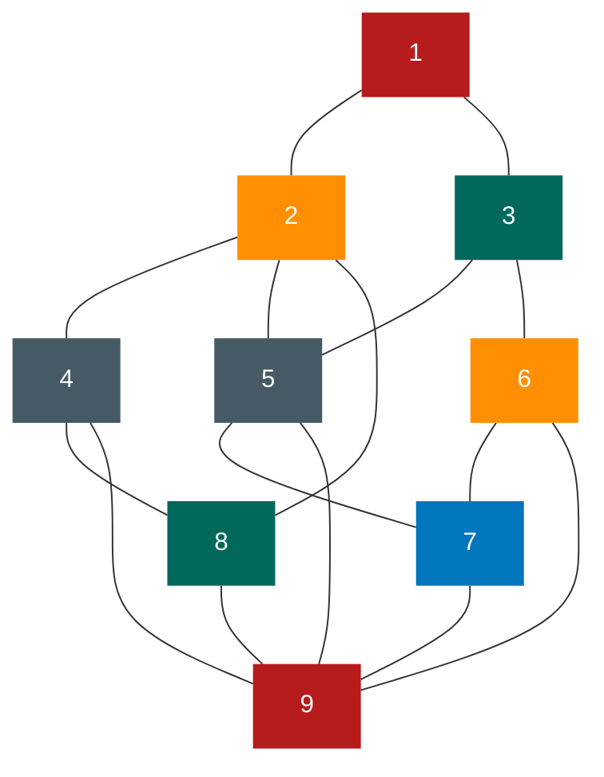

对于图的定义，我们需要明确几个注意的地方

- 线性表中我们把数据元素叫元素，树中将数据元素叫结点， **<font color="#1565c0">在图中数据元素,我们则称之为顶点（Vertex）</font>**
- 线性表中可以没有数据元素，称为空表。树中可以没有结点，叫做空树。在图结构中，不允许没有顶点。在定义中，若 v 是顶点的集合，则强调了顶点集合 v 有穷非空
- 线性表中，相邻的数据元素之间具有线性关系，树结构中，相邻两层的结点具有层次关系，而 **<font color="#1565c0">图中，任意两个顶点之间都可能有关系，顶点之间的逻辑关系用边来表示</font>** ，边集可以是空的

### 各种图的定义

**<font color="#1565c0">无向边：若顶点 v~i~ 到 v~j~ 之间的边没有方向，则称这条边为无向边（Edge），用无序偶对（V~i~ ,v~j~）来表示</font>** 。如果图中任意两个顶点之间的边都是无向边，则称该图为 **<font color="#1565c0">无向图 （undirected graphs）</font>** 。左下图就是一个无向图，由于是无方向的，连接顶点 A 与 D 的边,可以表示成无序对（A,D），也可以写成（D，A）。
对于无向图 G，来说，G,=(v,{E})，其中顶点集合 V，={A,B,C,D}：边集合 E,={(A,B),(B,C),(C,D),(D,A),(A,C)}

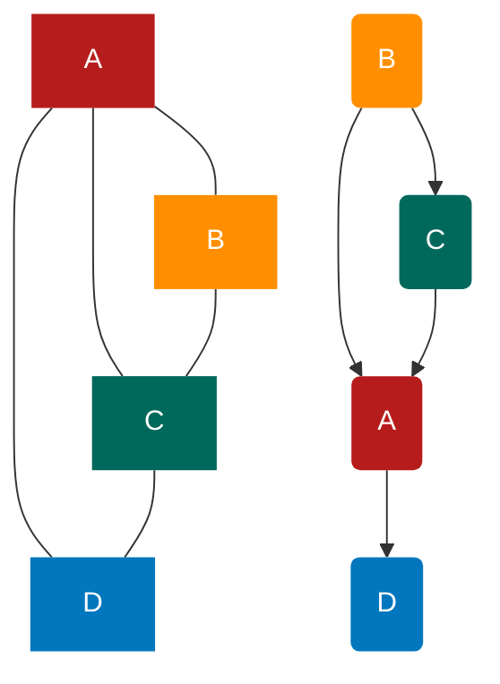

**<font color="#1565c0">有向边：若从顶点 v~i~ 到 v~j~ 的边有方向，则称这条边为有向边，也称为弧（Arc）。</font>** 用有序偶< v~i~ ，V~j~ >来表示，v~i~ 称为弧尾（Tail），v~j~ 称为弧头（Head）。如果图中任意两个项点之间的边都是有向边，则称该图为 **<font color="#1565c0">有向图（directed graphs）</font>** 。右上图就是一个有向图。 **<font color="#1565c0">连接顶点 A 到 D 的有向边就是弧，A 是弧尾，D 是弧头，<A，D>表示弧，注意不能写成<D，A>。</font>**

对于右上图中的有向图 G~2~ 来说，G~2~ =(v~2~ , {E~2~ })，其中顶点集合 v~2~={A,B,C,D}；弧集合 E~2~={<A,D>,<B,A>,<C,A>,<B,C>}。

看清楚了， **<font color="#1565c0">无向边用小括号“（）”表示，而有向边则是用尖括号“<>”表示。</font>**

**<font color="#1565c0">在图中，若不存在顶点到其自身的边，且同一条边不重复出现，则称这样的图为简单图。</font>**

**<font color="#1565c0"></font>**

**<font color="#1565c0">在无向图中，如果任意两个顶点之间都存在边，则称该图为无向完全图。</font>** 含有 n 个顶点的无向完全图有 $\frac{n*(n-1)}{2}$ 条边。比如下图就是无向完全图，因为每个顶点都要与除它以外的顶点连线，顶点 A 与 B、C、D 三个顶点连线，共有四个顶点，自然是 4×3，但由于顶点 A 与顶点 B 连线后，计算 B 与 A 连线就是重复，因此要整体除以 2，共有 6 条边。

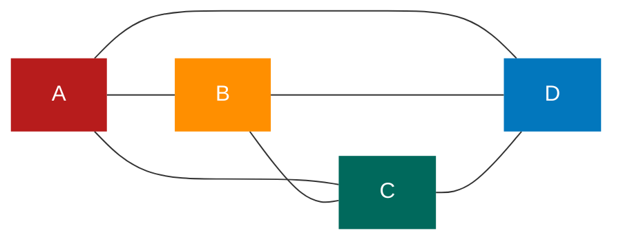

**<font color="#1565c0">在有向图中，如果任意两个顶点之间都存在方向相反的两条弧，则称该图为有向完全图。</font>** 含有 n 个顶点的有向完全图有 n\*(n-1)条边，如下图所示。

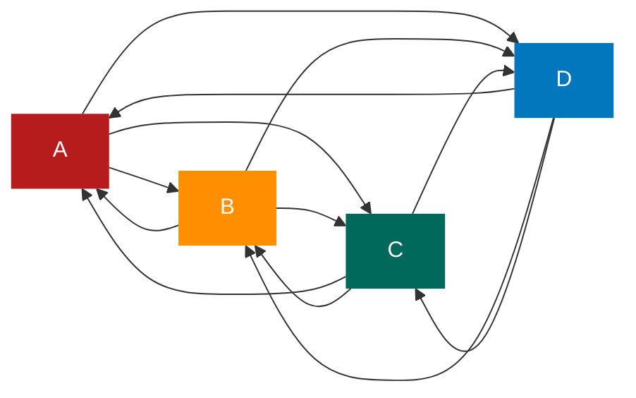

从这里也可以得到结论，对于具有 n 个顶点和 e 条边数的图，无向图 0≤e≤n(n-1)/2，有向图 0≤e≤n(n-1)

**<font color="#1565c0">有很少条边或弧的图称为稀疏图，反之称为稠密图。</font>** 这里稀疏和稠密是模糊的概念，都是相对而言的

有些图的边或弧具有与它相关的数字，这种 **<font color="#1565c0">与图的边或弧相关的数叫做权（Weight）。</font>** 这些权可以表示从一个顶点到另一个顶点的距离或耗费。 **<font color="#1565c0">这种带权的图通常称为网（Network）。</font>** 下图就是一张带权的图，即标志中国四大城市的直线距离的网，此图中的权就是两地的距离。

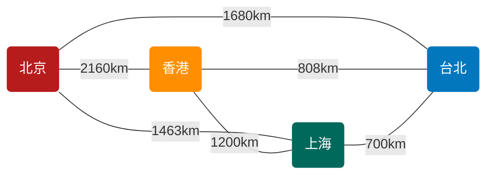

**<font color="#1565c0">假设有两个图 G=（V,{E})和 G'=（V',[E}），如果 v $\supseteq$ v' 且 E $\supseteq$ E'，则称 G' 为 G 的子图（Subgraph）。</font>**
例如下图带底纹的图均为左侧无向图与有向图的子图。

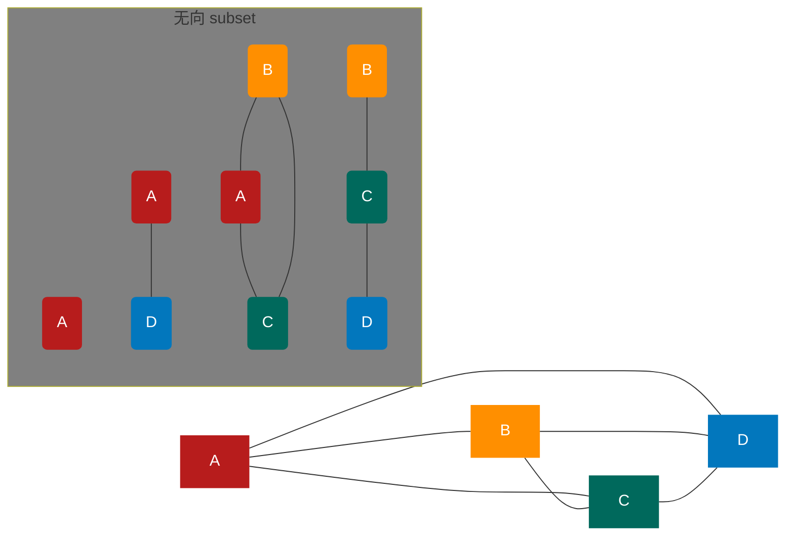

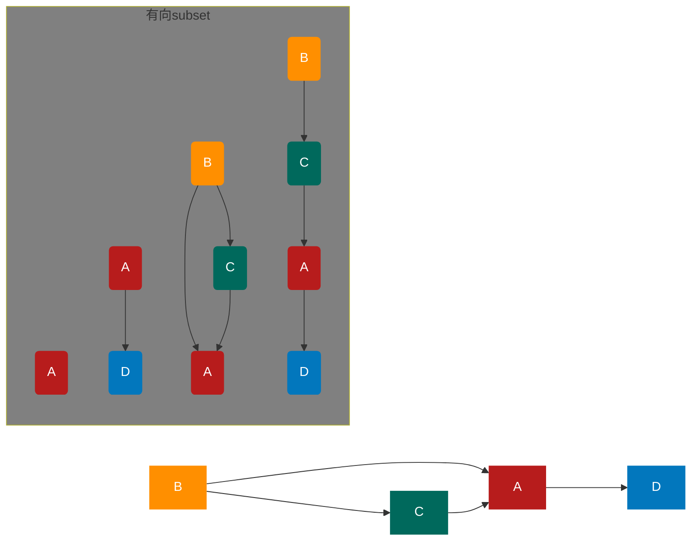

### 图的顶点与边间的关系

**<font color="#1565c0">对于无向图 G=（V,{E}），如果边（v,v') $\in$ E，则称顶点 v 和 v'互为邻接点(Adjacent），即 v 和 v' 相邻接。边（v,v'）依附（incident）于顶点 v 和 v'，或者说（v,v'）与顶点 v 和 v' 相关联。顶点 v 的度（Degree）是和 v 相关联的边的数目，记为 TD（v）。</font>** 例如上图的无向图，顶点 A 与 B 互为邻接点，边（A,B）依附于顶点 A 与 B 上，顶点 A 的度为 3。而此图的边数是 5，各个顶点度的和=3+2+3+2=10，推敲后发现，边数其实就是各顶点度数和的一半，多出的一半是因为重复两次记数

e = $\frac{1}{2}\sum^n_(i=1_)$ TD(V~i~)

**<font color="#1565c0">对于有向图 G=（V,{E}），如果弧<v，v'> $\in$ E，则称顶点 v 邻接到顶点 v'，顶点 v'邻接自顶点 v。弧<v,v'>和顶点 v，v'相关联。以顶点 v 为头的弧的数目称为 v 的入度（InDegree），记为 ID（v）；以 v 为尾的弧的数目称为 v 的出度（OutDegree），记为 OD(v)；顶点 v 的度为 TD（v）=ID（v）+OD（v）。</font>** 例如上图的有向图，顶点 A 的入度是 2（从 B 到 A 的弧，从 C 到 A 的弧），出度是 1（从 A 到 D 的弧），所以顶点 A 的度为 2+1=3。此有向图的弧有 4 条，而各顶点的出度和=1+2+1+0=4，各顶点的入度和=2+0+1+1=4。所以得到

e = $\sum^n_(i=1_)$ ID(v~i~) = $\sum^n_(i=1_)$ OD(v~i~)

**<font color="#1565c0">无向图 G=（V，{E}）中从顶点 v 到顶点 V’的路径（Path）是一个顶点序列（v=V,oYin-,Yim=V），其中（V,}1V，）EE，1≤j≤m。</font>** 例如下图中就列举了顶点 B 到顶点 D 四种不同的路径
图 1

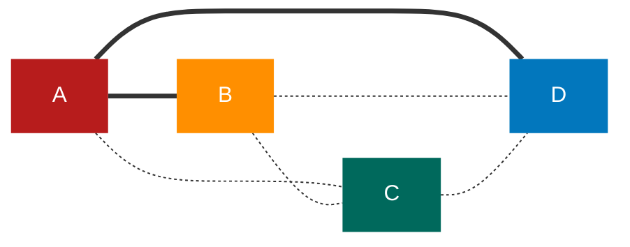

图 2

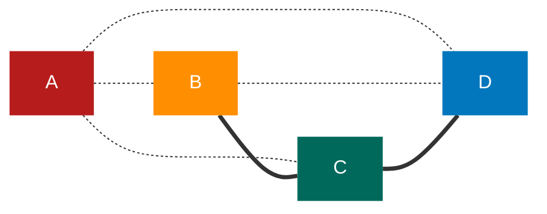

图 3

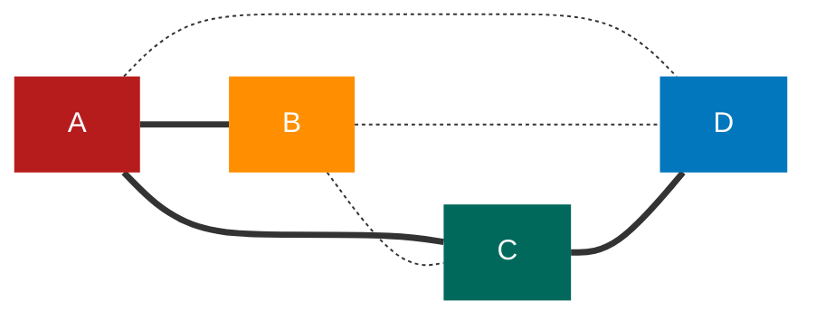

图 4

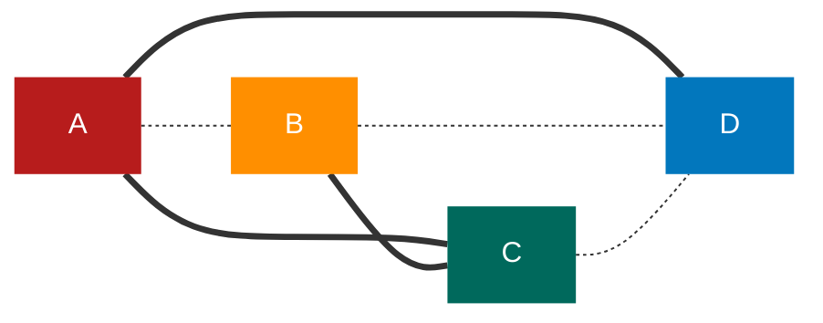

如果 G 是有向图，则路径也是有向的，顶点序列应满足 <v~i,j~1> $\in$ E，1≤j≤m。例如下图，顶点 B 到 D 有两种路径。而顶点 A 到 B，就不存在路径
图 1

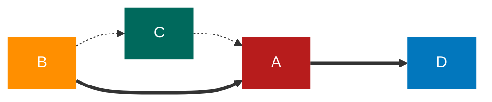

图 2

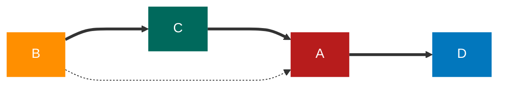

树中根结点到任意结点的路径是唯一的，但是图中顶点与顶点之间的路径却是不唯一的。
**<font color="#1565c0">路径的长度是路径上的边或弧的数目。</font>** 上图中的上方图 1 和图 2 两条路径长度为 2，下方图 3 和图 4 两条路径长度为 3。上图左侧路径长为 2，右侧路径长度为 3。

**<font color="#1565c0">第一个顶点和最后一个顶点相同的路径称为回路或环（Cycle）。序列中顶点不重复出现的路径称为简单路径。除了第一个顶点和最后一个顶点之外，其余顶点不重复出现的回路，称为简单回路或简单环。</font>** 下图中两个图的粗线都构成环，左侧的环因第一个顶点和最后一个顶点都是 B，且 C、D、A 没有重复出现，因此是一个简单环。而右侧的环,由于顶点 C 的重复，它就不是简单环了

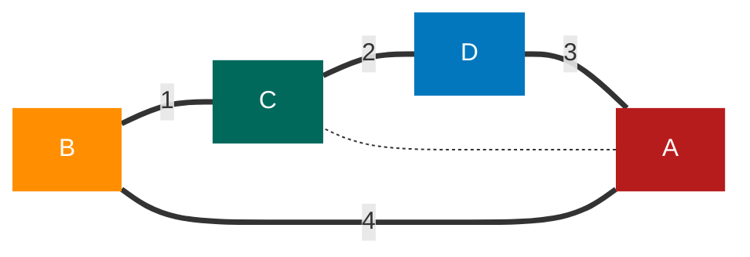

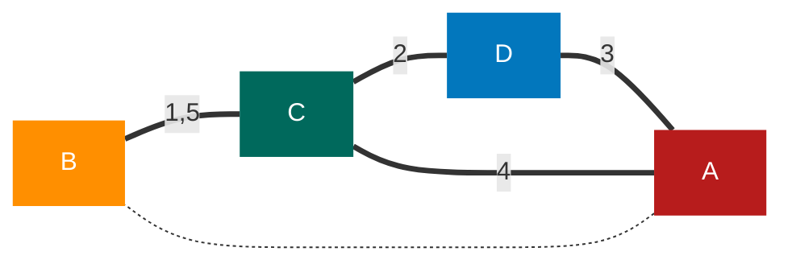

### 连通图的相关术语

**<font color="#1565c0">在无向图 G 中，如果从顶点 V 到顶点 V 有路径，则称 v 和 V‘是连通的。如果对于图中任意两个顶点 V、vEV，v 和 v 都是连通的，则称 G 是连通图（Connected Graph)。</font>** 下图的图 1，它的顶点 A 到顶点 B、C、D 都是连通的，但显然顶点 A 与顶点或 F 就无路径,因此不能算是连通图。而下图的图 2，顶点 A、B、C、D 相互都是连通的，所以它本身是连通图
图 1

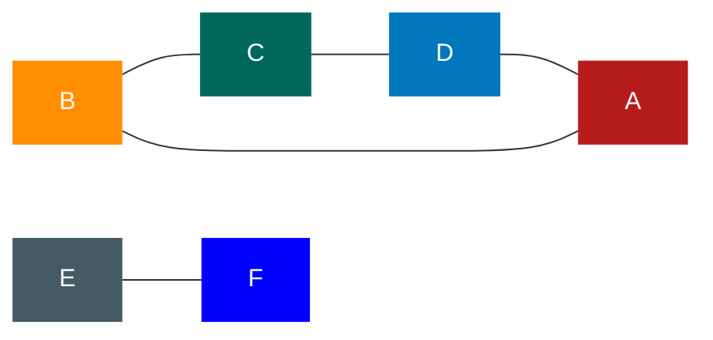

图 2

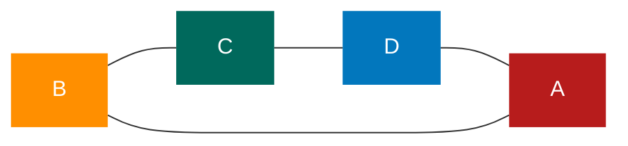

图 3


图 4


**<font color="#1565c0">无向图中的极大连通子图称为连通分量。</font>** 注意连通分量的概念，它强调：

- 要是子图;
- 子图要是连通的;
- 连通子图含有极大顶点数;
- 具有极大顶点数的连通子图包含依附于这些顶点的所有边。
  上图的图 1 是一个无向非连通图。但是它有两个连通分量，即图 2 和图 3。而图 4，尽管是图 1 的子图，但是它却不满足连通子图的极大顶点数（图 2 满足）。因此它不是图 1 的无向图的连通分量

**<font color="#1565c0">在有向图 G 中，如果对于每一对 v~i~、v~j~ $\in$ V、v~i~ ≠ v~j~，从 v~i~ 到 v~j~ 和从 v~j~ 到 v~i~ 都存在路径，则称 G 是强连通图。有向图中的极大强连通子图称做有向图的强连通分量。</font>** 例如下图中图 1 并不是强连通图，因为顶点 A 到顶点 D 存在路径，而 D 到 A 就不存在。图 2 就是强连通图，而且显然图 2 是图 1 的极大强连通子图，即是它的强连通分量

图 1

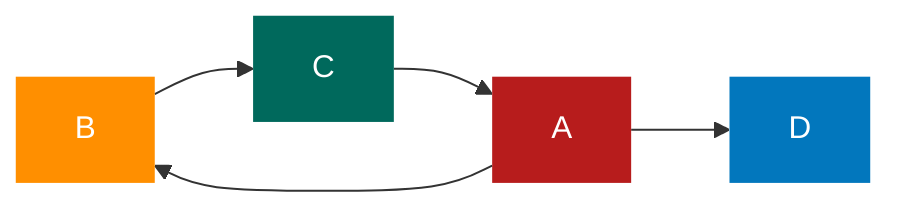

图 2

```mermaid
graph LR
    B-->C
    A-->B
    C-->A
    classDef default color:white,stroke:none;
    classDef description fill:none,stroke:none,color:black;
    classDef reset color:white,stroke:none;
    classDef transparent fill:none;
    classDef red fill:#b71c1c;
    classDef orange fill:#ff8f00;
    classDef gray fill:#455a64;
    classDef green fill:#00695c;
    classDef blue fill:#0277bd;
    class A red;
    class B orange;
    class C green;
    class D blue;
    class E gray;
```

现在我们再来看连通图的生成树的定义。
所谓 **<font color="#1565c0">一个连通图的生成树是一个极小的连通子图，它含有图中全部的 n 个顶点，但只有足以构成一棵树的 n-1 条边。</font>** 比如下图的图 1 是一普通图，但显然它不是生成树，当去掉两条构成环的边后，比如图 2 或图 3，就满足 n 个顶点 n - 1 条边且连通的定义了。它们都是一棵生成树。从这里也可知道，如果一个图有 n 个顶点和小于 n - 1 条边，则是非连通图，如果它多于 n - 1 条边，必定构成一个环，因为这条边使得它依附的那两个顶点之间有了第二条路径。比如图 2 和图 3，随便加哪两顶点的边都将构成环。不过有 n - 1 条边并不一定是生成树，比如图 4
图 1

```mermaid
graph LR
    A---B
    B---C
    C---D
    A---D
    D---E---F---G---H---E
    classDef default color:white,stroke:none;
    classDef description fill:none,stroke:none,color:black;
    classDef reset color:white,stroke:none;
    classDef transparent fill:none;
    classDef red fill:#b71c1c;
    classDef orange fill:#ff8f00;
    classDef gray fill:#455a64;
    classDef green fill:#00695c;
    classDef blue fill:#0277bd;
    class A,H red;
    class B,G orange;
    class C green;
    class D blue;
    class F gray;
    style E fill:blue;
```

图 2

```mermaid
graph LR
    B---C
    C---D
    A---D
    D---E---F
    G---H---E
    classDef default color:white,stroke:none;
    classDef description fill:none,stroke:none,color:black;
    classDef reset color:white,stroke:none;
    classDef transparent fill:none;
    classDef red fill:#b71c1c;
    classDef orange fill:#ff8f00;
    classDef gray fill:#455a64;
    classDef green fill:#00695c;
    classDef blue fill:#0277bd;
    class A,H red;
    class B,G orange;
    class C green;
    class D blue;
    class F gray;
    style E fill:blue;
```

图 3

```mermaid
graph LR
    A---B
    B---C
    C---D
    D---E---F---G---H
    classDef default color:white,stroke:none;
    classDef description fill:none,stroke:none,color:black;
    classDef reset color:white,stroke:none;
    classDef transparent fill:none;
    classDef red fill:#b71c1c;
    classDef orange fill:#ff8f00;
    classDef gray fill:#455a64;
    classDef green fill:#00695c;
    classDef blue fill:#0277bd;
    class A,H red;
    class B,G orange;
    class C green;
    class D blue;
    class F gray;
    style E fill:blue;
```

图 4

```mermaid
graph LR
    A---B
    B---C
    C---D
    E---F---G---H---E
    classDef default color:white,stroke:none;
    classDef description fill:none,stroke:none,color:black;
    classDef reset color:white,stroke:none;
    classDef transparent fill:none;
    classDef red fill:#b71c1c;
    classDef orange fill:#ff8f00;
    classDef gray fill:#455a64;
    classDef green fill:#00695c;
    classDef blue fill:#0277bd;
    class A,H red;
    class B,G orange;
    class C green;
    class D blue;
    class F gray;
    style E fill:blue;
```

**<font color="#1565c0">如果一个有向图恰有一个顶点的入度为 0，其余顶点的入度均为 1，则是一个有向树。</font>** 对有向树的理解比较容易，所谓入度为 0 其实就相当于树中的根结点，其余顶点入度为 1 就是说树的非根结点的双亲只有一个。 **<font color="#1565c0">一个有向图的生成森林由若干棵有向树组成，含有图中全部顶点，但只有足以构成若干棵不相交的有向树的弧。</font>** 如下图的图 1 是一棵有向图。去掉一些弧后，它可以分解为两棵有向树，如图 2 和图 3，这两棵就是图 1 有向图的生成森林

图 1

```mermaid
graph LR
    B-->C
    B-->A
    C-->A
    A-->D
    G-->D
    G-->C
    F-->G
    F-->E
    E-->G
    E-->D
    classDef default color:white,stroke:none;
    classDef description fill:none,stroke:none,color:black;
    classDef reset color:white,stroke:none;
    classDef transparent fill:none;
    classDef red fill:#b71c1c;
    classDef orange fill:#ff8f00;
    classDef green fill:#455a64;
    classDef gray fill:#00695c;
    classDef blue fill:#0277bd;
    class A red;
    class B orange;
    class G green;
    class D,F blue;
    class C gray;
    style E fill:blue;
```

图 2

```mermaid
graph LR
    B-->C
    B-->A
    A-->D
    classDef default color:white,stroke:none;
    classDef description fill:none,stroke:none,color:black;
    classDef reset color:white,stroke:none;
    classDef transparent fill:none;
    classDef red fill:#b71c1c;
    classDef orange fill:#ff8f00;
    classDef green fill:#455a64;
    classDef gray fill:#00695c;
    classDef blue fill:#0277bd;
    class A red;
    class B orange;
    class G green;
    class D,F blue;
    class C gray;
```

图 3

```mermaid
graph LR
    F-->E
    F-->G
    classDef default color:white,stroke:none;
    classDef description fill:none,stroke:none,color:black;
    classDef reset color:white,stroke:none;
    classDef transparent fill:none;
    classDef red fill:#b71c1c;
    classDef orange fill:#ff8f00;
    classDef green fill:#455a64;
    classDef gray fill:#00695c;
    classDef blue fill:#0277bd;
    classDef darkBlue fill:blue;
    class A red;
    class B orange;
    class G green;
    class D,F blue;
    class C gray;
    class E darkBlue;
```

### 图的定义与术语总结

图按照有无方向分为 **<font color="#1565c0">有向图和无向图</font>** 。有向图由 **<font color="#1565c0">顶点和弧</font>** 构成，无向图由 **<font color="#1565c0">顶点和边</font>** 构成。 **<font color="#1565c0">弧有弧尾和弧头</font>** 之分

图按照边或弧的多少分为 **<font color="#1565c0">稀疏图和稠密图</font>** 。如果任意两个顶点之间都存在边叫 **<font color="#1565c0">完全图</font>** ，有向的叫 **<font color="#1565c0">有向完全图</font>** 。若无重复的边或顶点到自身的边则叫 **<font color="#1565c0">简单图</font>**

图中顶点之间有 **<font color="#1565c0">邻接点、依附</font>** 的概念。无向图顶点的边数叫做度，有向图顶点分为 **<font color="#1565c0">入度和出度</font>**

图上的边或弧上 **<font color="#1565c0">带权则称为网</font>**

图中顶点间存在 **<font color="#1565c0">路径</font>** ，两顶点存在路径则说明是 **<font color="#1565c0">连通</font>** 的，如果路径最终回到起始点则称为 **<font color="#1565c0">环</font>** ，当中不重复叫 **<font color="#1565c0">简单路径</font>** 。若任意两顶点都是连通的，则图就是 **<font color="#1565c0">连通图</font>** ，有向则称 **<font color="#1565c0">强连通图</font>** 。图中有子图，若子图极大连通则就是 **<font color="#1565c0">连通分量</font>** ，有向的则称 **<font color="#1565c0">强连通分量</font>**

无向图中连通且 n 个顶点 n-1 条边叫 **<font color="#1565c0">生成树</font>** 。有向图中一顶点入度为 0 其余顶点入度为 1 的叫 **<font color="#1565c0">有向树</font>** 。一个有向图由若干棵有向树构成 **<font color="#1565c0">生成森林</font>**

```mermaid
graph LR
    A(图)
    B1(方向)
    B2(边分类)
    B3(完全图)
    B4(简单图)
    B5(顶点)
    B6(网)
    B7(路径)
    C1(无向图)
    C2(有向图)
    C3(稀疏图)
    C4(稠密图)
    C5(有向完全图)
    C6(邻接点)
    C7(依附)
    C8(权)
    C9(连通)
    C10(环)
    D1(顶点)
    D2(边)
    D3(生成树)
    D4(顶点)
    D5(弧)
    D6(有向树)
    D7(连通图)
    D8(连通分量)
    D9(简单路径)
    E1(度)
    E2(入度)
    E3(出度)
    E4(生成森林)
    E5(强连通图)
    E6(强连通分量)
    A---B1
    A---B2
    A---B3
    A---B4
    A---B5
    A---B6
    A---B7
    B1---C1
    B1---C2
    B2---C3
    B2---C4
    B3---C5
    B5---C6
    B5---C7
    B6---C8
    B7---C9
    B7---C10
    C1---D1
    C1---D2
    C1---D3
    C2---D4
    C2---D5
    C2---D6
    C9---D7
    C9---D8
    C10---D9
    D1---E1
    D4---E2
    D4---E3
    D6---E4
    D7---E5
    D8---E6

    classDef default color:white,stroke:none;
    classDef description fill:none,stroke:none,color:black;
    classDef reset color:white,stroke:none;
    classDef transparent fill:none;
    classDef red fill:#b71c1c;
    classDef orange fill:#ff8f00;
    classDef gray fill:#455a64;
    classDef green fill:#00695c;
    classDef blue fill:#0277bd;
    classDef darkBlue fill:blue;
    class A red;
    class B1,B2,B3,B4,B5,B6,B7 orange;
    class D1,D2,D3,D4,D5,D6,D7,D8,D9,E1,E2,E3,E4,E5,E6 green;
    class C1,C2,C3,C4,C5,C6,C7,C8,C9,C10 blue;
```

## 图的抽象数据类型

ADT
Data
图（Graph)
顶点的有穷非空集合和边的集合。
Operation
CreateGraph(*G，V，VB）：按照顶点集 v 和边弧集 VR 的定义构造图 G。
DestroyGraph(*G）：图 G 存在则销毁。
Locatevex（G，u)：若图 G 中存在顶点 u，则返回图中的位置。
Getvex（G，v）：返回图 G 中顶点 v 的值。
PutVex(G，v，value)：将图 G 中顶点 v 赋值 value。
FirstAdjVex(G，*v）：返回顶点 v 的一个邻接顶点，若顶点在 G 中无邻接顶点返回空。
NextAdjVex(G，v，*w)：返回顶点 v 相对于顶点 w 的下一个邻接顶点，若 w 是 v 的最后
一个邻接点则返回“空”。
Insertvex(*G，v）：在图 G 中增添新顶点 v。
Deletevex（*G，v）：删除图 G 中顶点 v 及其相关的弧。
InsertArc(*G,v，w)：在图 G 中增添弧<v，w>，若 G 是无向图，还需要增添对称弧
<w,v>o
DeleteArc(*G，v，w)：在图 G 中删除弧<v，w>，若 G 是无向图，则还删除对称弧
<w,v>o
DFSTraverse(G）：对图 G 中进行深度优先遍历，在遍历过程中对每个顶点调用。
HFSTraverse（G）：对图 G 中进行广度优先遍历，在遍历过程中对每个顶点调用。
endADT

## 图的存储结构

图的存储结构相较线性表与树来说更加复杂。“顶点的位置”或“邻接点的位置”只是一个相对的概念。其实从图的逻辑结构定义来看，图上任何一个顶点都可被看成是第一个顶点，任一顶点的邻接点之间也不存在次序关系。有时候可能顶点的位置不同，都会造成了表象上不太一样的感觉

也正由于图的结构比较复杂，任意两个顶点之间都可能存在联系，因此无法以数据元素在内存中的物理位置来表示元素之间的关系，也就是说，图不可能用简单的顺序存储结构来表示。而多重链表的方式，即以一个数据域和多个指针域组成的结点表示图中的一个顶点，尽管可以实现图结构，但其实在树中，我们也已经讨论过，这是有问题的。如果各个顶点的度数相差很大，按度数最大的顶点设计结点结构会造成很多存储单元的浪费，而若按每个顶点自己的度数设计不同的顶点结构，又带来操作的不便

### 邻接矩阵

考虑到图是由顶点和边或弧两部分组成。合在一起比较困难，那就很自然地考虑到分两个结构来分别存储。顶点不分大小、主次，所以用一个一维数组来存储是很不错的选择。而边或弧由于是顶点与顶点之间的关系，一维搞不定，那就考虑用一个二维数组来存储。于是邻接矩阵的方案就诞生了
**<font color="#1565c0"></font>**

**<font color="#1565c0">图的邻接矩阵（Adjacency Matrix）存储方式是用两个数组来表示图。一个一维数组存储图中顶点信息，一个二维数组（称为邻接矩阵）存储图中的边或弧的信息</font>**

设图 G 有 n 个顶点，则邻接矩阵是一个 nxn 的方阵，定义为：

arc[i][j] = 1 或 0
1，若（v~i~，v~j~) $\in$ E 或 < v~i~,v~j~ > $\in$ E
0，其他

看一个实例，下图就是一个无向图

```mermaid
graph LR
    V0---V1---V2---V3---V0
    V0---V2
    classDef default color:white,stroke:none;
    classDef description fill:none,stroke:none,color:black;
    classDef reset color:white,stroke:none;
    classDef transparent fill:none;
    classDef red fill:#b71c1c;
    classDef orange fill:#ff8f00;
    classDef gray fill:#455a64;
    classDef green fill:#00695c;
    classDef blue fill:#0277bd;
    class V0 red;
    class V1 orange;
    class V2 green;
    class V3 blue;
    class C gray;
```

顶点数组
[v1,v2,v3,v4]

边数组

| 边数组 | v0  | v1  | v2  | v3  |
| :----: | :-: | :-: | :-: | :-: |
|   v0   |  0  |  1  |  1  |  1  |
|   v1   |  1  |  0  |  1  |  0  |
|   v2   |  1  |  1  |  0  |  1  |
|   v3   |  1  |  0  |  1  |  0  |

V1 的度为 2

### 邻接表

邻接矩阵是不错的一种图存储结构，但是对于边数相对顶点较少的图，这种结构是存在对存储空间的极大浪费的。比如说，如果我们要处理稀疏有向图，邻接矩阵中除了极少边或弧有权值外，没有其他边或弧，其实这些存储空间都浪费掉了

因此我们考虑另外一种存储结构方式。回忆我们在学习线性表时谈到，顺序存储结构就存在预先分配内存可能造成存储空间浪费的问题，于是引出了链式存储的结构。同样的，我们也可以考虑对边或弧使用链式存储的方式来避免空间浪费的问题

再回忆树中存储结构孩子表示法，将结点存入数组，并对结点的孩子进行链式存储，不管有多少孩子，也不会存在空间浪费问题。这个思路同样适用于图的存储。我们把这种 **<font color="#1565c0">数组与链表相结合的存储方式称为链接表（Adjacency List）</font>**
邻接表的处理办法如下：

1. 图中顶点用一个一维数组存储，顶点也可以用单链表来存储，不过数组可以较容易地读取顶点信息，更加方便，对于顶点数组中，每个数据元素还需要存储指向第一个邻接点的指针，以便于查找该顶点的边信息。
2. 图中每个顶点 v~i~，的所有邻接点构成一个线性表，由于邻接点的个数不定，所以用单链表存储，无向图称为顶点 v~i~,的边表，有向图则称为顶点 v~i~,作为弧尾的出边表。


从图中我们知道，顶点表的各个结点由 data 和 firstedge 两个域表示，data 是数据域存储顶点的信息，firstedge 是指针域，指向边表的第一个结点，即此顶点的第一个邻接点。边表结点由 adjvex 和 next 两个域组成。adjvex 是邻接点域，存储某顶点的邻接点在顶点表中的下标，next 则存储指向边表中下一个结点的指针。比如 v~1~顶点与 v~0~、v~2~ 互为邻接点，则在 v~1~,的边表中，adjvex 分别为 v~0~的 0 和 v~2~的 2

这样的结构，对于我们要获得图的相关信息也是很方便的。比如我们要想知道某个顶点的度，就去查找这个顶点的边表中结点的个数。若要判断顶点 v~i~到 v~j~是否存在边，只需要测试顶点 v~i~的边表中 adjvex 是否存在结点 v~j~的下标 j 就行了。若求顶点的所有邻接点,其实就是对此顶点的边表进行遍历，得到的 adjvex 域对应的顶点就是邻接点

若是有向图，邻接表结构是类似的。但要注意的是有向图由于有方向，是以顶点为弧尾来存储边表的，这样很容易就可以得到每个顶点的出度


但也有时为了便于确定顶点的入度或以顶点为弧头的弧，可以建立 **<font color="#1565c0">一个有向图的逆邻接表，即对每个顶点 v~i~都建立一个链接为 v~i~为弧头的表</font>** 。如下图的逆邻接表所示。


此时我们很容易就可以算出某个顶点的入度或出度是多少，判断两顶点是否存在弧也很容易实现。
对于带权值的网图，可以在边表结点定义中再增加一个 weight 的数据域，存储权值信息即可


有了这些结构的图，下面关于结点定义的代码就很好理解了。

```typescript
/*顶点表结点 */
/*顶点域，存储顶点信息*/
/*边表头指针 */

type  VertexType = string;
/*顶点类型应由用户定义 */
type EdgeType = number;
/*边上的权值类型应由用户定义*/
type  EdgeNode = {
    /*边表结点*/
    adjvex:number
    /*邻接点域，存储该顶点对应的下标 */
    info:EdgeType
    /*用于存储权值，对于非网图可以不需要*/
    next:EdgeNode
    /*链域，指向下一个邻接点 */
}
type  VertexNode = {
    data:VertexType
    firstedge:EdgeNode
}
type GrapAdjLis ={
    adjList:AdjList
    numNodes:number
    numEdges:number
}
```

###  十字链表
**<font color="#1565c0"></font>**
**<font color="#1565c0"></font>**
