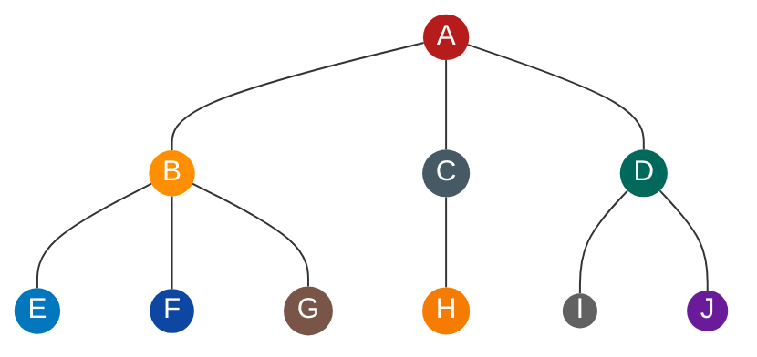
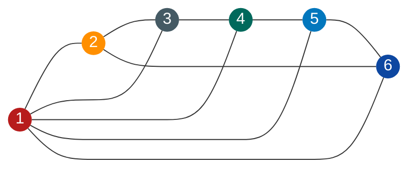
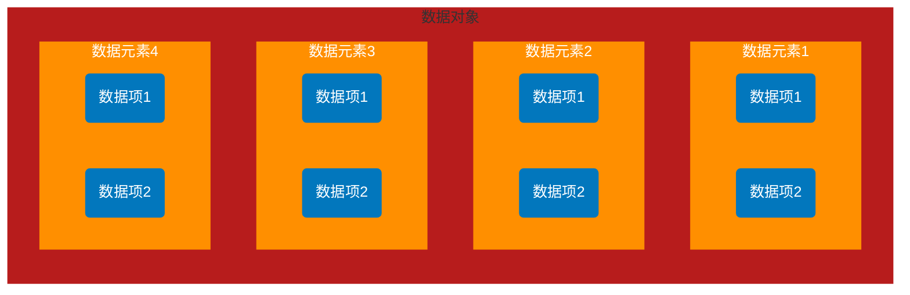

# 数据结构基本概念

“程序设计的实质是对确定的问题选择一种好的结构，加上设计一种好的算法”

## 数据

**数据是描述客观事物的符号，是计算机中可以操作的对象，是能被计算机识别，并输入给计算机处理的符号集合**
数据不仅仅包括整型、实型等数值类型，还包括字符、声音、图像、视频等非数值类型
也就是说，这里说的数据，其实就是符号，而且这些符号必须具备两个前提

- 可以输入到计算机中
- 能被计算机程序处理

对于整型、实型等数据类型，可以进行数值计算
对于字符数据类型，就需要进行非数值的处理，而声音、图像、视频等其实是可以通过编码的手段编程字符数据来处理的

## 数据元素

**数据元素是组成数据的、有一定意义的基本单位，在计算机中通常作为整体处理，也被称为记录**
比如，在人类中，人就是数据元素
畜禽类中，牛、羊、马、猪、鸡等动物就是畜禽类的数据元素

## 数据项

**一个数据元素可以由若干个数据项组成**
比如人这样的数据元素，可以由眼睛、耳朵、鼻子、嘴巴、手、脚等数据项，也可以有姓名、年龄、性别、家庭地址、联系电话、邮政编码等数据项，具体有哪些数据项，要由系统需求来决定
**数据项是数据不可分割的最小单位**

## 数据对象

**数据对象是性质相同的数据元素的集合，是数据的子集**
性质相同：是指数据元素具有相同数量和类型的数据项，比如，人都有姓名、生日、性别等相同的数据项

## 数据结构

结构，简单理解就是关系，比如分子结构，就是说组成分子的原子之间的排列方式
严格来说，结构是指各个组成部分相互搭配和排列的方式，在现实世界中， **不同数据元素之间不是独立的，而是存在特定的关系，这些关系称之为结构**
在计算机中，数据元素并不是独立的，杂乱无序的，而是具有内在联系的数据集合，数据元素之间存在一种或多种特定关系，也就是数据的组织形式
为编写一个“好”的应用程序，必须分析待处理对象的特性及各处理对象之间存在的关系，这也是研究数据结构的意义所在
**数据结构： 是相互之间存在一种或多种特定关系的数据元素的集合**

## 逻辑结构与物理结构

根据观点的不同，可以将数据结构分为逻辑结构和物理结构

### 逻辑结构

**逻辑结构是指数据对象中数据元素之间的相互关系**

1. **集合结构：集合结构中的数据元素除了同属于一个集合外，它们之间没有其他关系** ，如下：

2. **线性结构：线性结构中的数据元素之间是一对一的关系** ，如下：

3. **树形结构: 树形结构中的数据元素之间存在一对多的层次关系** ，如下：

4. **图形结构: 图形结构的数据元素是多对多的关系** ，如下：

注意:

- 将每一个数据元素看作一个节点，用圆圈表示
- 元素之间的逻辑关系用节点之间的连线表示，如果这个关系是有方向的，那么用带箭头的连线表示

### 物理结构

定义：物理结构是指数据的逻辑结构在计算机中的存储形式

数据是数据元素的集合，那么根据物理结构的定义，实际上就是如何把数据元素存储到计算机的存储器中，存储器主要是针对内存的，像硬盘等外部存储器的数据组织通常用文件结构来描述
数据的存储结构应正确反映数据元素之间的逻辑关系，这是最关键的，如何存储数据元素之间的逻辑关系，是实现物理结构的重点和难点

数据元素的存储结构形式有两种：顺序存储和链式存储

#### 顺序存储结构

**顺序存储结构：是把数据元素存放在地址连续的存储单元里，其数据间的逻辑关系和物理关系是一致的**

这种存储结构其实很简单，就是排队站位，按顺序排好，每个节点占一小段空间。数组就是这样的顺序存储结构。当告诉计算机，你要建立一个有 9 个整型数据的数组时，计算机就在内存中找了片空地，按照一个整型所占位置的大小乘以 9 ，开辟一段连续的空间，于是第一个数组数据就放在第一个位置，第二个数据放在第二个位置，依次摆放，如下：

#### 链式存储结构

当整个结构时刻都处于变化之中时，顺序存储结构就不能满足需求了，比如有人着急需要插队，或者排队的人因为上厕所之类的离开了

像银行、医院等，都设置了排队系统，也就是每个人去了先领一个号，等着叫号，叫到时才去办理业务，在等待的时候，你想在哪在哪，只要及时回来就行，你要关注的是前一个号有没有被叫到，叫到了，下一个就是你了

**链式存储结构：是把数据元素存放在任意的存储单元里，这组存储单元可以是连续的，也可以是不连续的 **

数据元素的存储关系并不能反映其逻辑关系，因此需要用一个指针存放数据元素的地址，这样通过地址可以找到相关联数据元素的位置，如下：

```mermaid
graph TB
    subgraph 连续地址
        subgraph 节点1
        end
        subgraph 节点2
        end
        subgraph 节点3
        end
        subgraph 节点4
        end
        subgraph 节点5
        end
         subgraph 节点6
        end
         subgraph 节点7
        end
         subgraph 节点8
        end
         subgraph 节点9
        end
    end
    节点1 -->|指针| 节点2 --> 节点3 --> 节点4 --> 节点5 --> 节点6 --> 节点7 --> 节点8 --> 节点9
    style 节点1 fill:#b71c1c,color:white,stroke:none;
    style 节点2 fill:#ff8f00,color:white,stroke:none;
    style 节点3 fill:#455a64,color:white,stroke:none;
    style 节点4 fill:#00695c,color:white,stroke:none;
    style 节点5 fill:#0277bd,color:white,stroke:none;
    style 节点6 fill:#0d47a1,color:white,stroke:none;
    style 节点7 fill:#795548,color:white,stroke:none;
    style 节点8 fill:#f57c00,color:white,stroke:none;
    style 节点9 fill:#616161,color:white,stroke:none;
    style 连续地址 fill:none,stroke-dashArray:5 5;
```

链式存储就灵活多了，数据存在哪里不重要，只要有一个指针存放了相应的地址就能找到它了

逻辑结构是 **面向问题** 的，而物理结构是 **面向计算机** 的，其基本的目标就是将数据及其逻辑关系存储到计算机的内存中

## 数据类型

**数据类型： 是指一组性质相同的值的集合及定义在此集合上的一些操作的总称**

- **原子类型**
  是不可以再分解的基本类型，包括整型，实型，字符型等
- **结构类型**
  由若干个类型组合而成，是可以再分解的，例如，整型数组就是由若干个整型数据组成的

比如，在 C 语言中变量声明 int a，b ，就相当于给变量 a 和 b 的赋值不能超出 int 的取值范围，变量 a 和 b 之间的运算只能是 int 类型索允许的运算

**抽象是指抽取出事物具有的普遍性的本质** ，它是抽出问题的特征而忽略非本质的细节，是对具体事物的一个概括，抽象是一种思考问题的方式，它隐藏了繁杂的细节，只保留实现目标所必须的信息

### 抽象数据类型

对已有的数据类型进行抽象，就有了抽象类型
**抽象数据类型（Abstract Data Type,ADT），一个数学模型及定义在该模型上的一组操作。** 抽象数据类型的定义仅取决于它的一组逻辑特性，而与其在计算机内部如何表示和实现无关

比如各个计算机，不管是大型机、小型机、PC、平板电脑、甚至智能手机都拥有 “ 整数 ” 类型，也需要整数间的运算，那么整型其实就是一个抽象数据类型，尽管它在上面提到的这些不同计算机中实现方法上可能不一样，但由于其定义的数学特性相同，在计算机编程者看来，它们都是相同的，因此，“ 抽象 ” 的意义在于数据类型的数学抽象特性

而且，抽象数据类型不仅仅指那些已经定义并实现的数据类型，还可以是计算机编程者在设计软件程序时自己定义的数据类型，比如在开发计算机绘图、地图类的软件系统，经常会用到坐标，总是有成对的 x 和 y ，还可能有 z ，既然这三个整型数字是始终一起出现的，那就定义一个叫 point 的抽象数据类型，它有 x、y、z 三个整形变量，这样就能方便的操作一个 point 数据变量来操作它的坐标了

**抽象数据类型体现了程序设计中的问题分解，抽象和信息隐藏的特性。** 抽象数据类型把实际生活中的问题分解为多个规模小且容易处理的问题，然后建立一个计算机能处理的数据模型，并把每个功能模块的实现细节作为一个独立的单元，从而使具体实现过程隐藏起来

## 总结

**数据结构是相互之间存在一种或多种特定关系的数据元素的集合。**  同样是结构，从不同的角度看就会有不同的分类，如下

* **逻辑结构**
    集合结构、线性结构、树形结构、图形结构
* **逻辑结构**
    顺序存储结构、链式存储结构