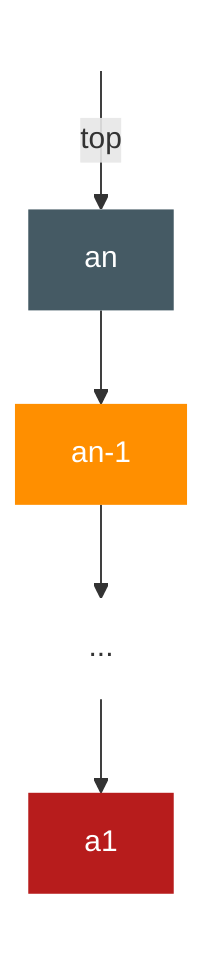
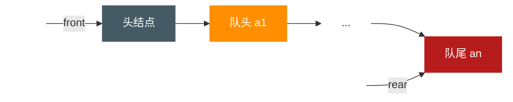

# 栈与队列

**<font color="#1565c0">栈（stack）：是固定仅在表尾进行插入和删除操作的线性表</font>**

**<font color="#1565c0">队列（queue）：是只允许在一端进行插入操作，而在另一端进行删除操作的线性表</font>**

## 栈的定义

像弹夹中的子弹一样先装进去的，却要后打出来，而后进的，反而可以先打出来的数据结构，即是栈

**<font color="#1565c0">允许插入和删除的一端称为栈顶（top），另一端称为栈底（bottom），不含任何数据元素的栈称为空栈。栈又称为后进先出（Last In First Out）的线性表，简称 LIFO 结构</font>**

首先它是一个 **<font color="#1565c0">线性表</font>** ，也就是说，栈元素具有线性关系，即前驱后继关系。只不过它是一种特殊的线性表而已。定义中说是在线性表的表尾进行插入和删除操作，这里表尾指的是栈顶，而不是栈底

他的特殊之处就在于限制了这个线性表的插入和删除位置，它始终只在栈顶进行。这也就使得：栈底是固定的，最先进栈的只能在栈底

**<font color="#1565c0">栈的插入操作，叫作进栈，也称压栈、入栈</font>**
**<font color="#1565c0">栈的删除操作，叫作出栈，有的也叫弹栈</font>**

### 进栈出栈变化形式

这个最先进栈的元素，是不是就只能是最后出栈呢？
答案是不一定，要看什么情况。栈对线性表的插入和删除的位置进行了限制，并没有对元素进出的时间进行限制，也就是说，在不是所有元素都进栈的情况下，事先进去的元素也可以出栈，只要保证是栈顶元素出栈就可以

举例来说，如果我们现在是有 3 个整型数字元素 1、2、3 依次进栈，会有哪些出栈次序呢?

- 第一种：1、2、3 进，再 3、2、1 出。这是最简单最好理解的一种，出栈次序为 3、2、1
- 第二种：1 进，1 出，2 进，2 出，3 进，3 出。也就是进一个就出一个，出栈次序为 1、2、3
- 第三种：1 进，2 进，2 出，1 出，3 进，3 出。出栈次序为 2、1、3
- 第四种：1 进，1 出，2 进，3 进，3 出，2 出。出栈次序为 1、3、2
- 第五种：1 进，2 进，2 出，3 进，3 出，1 出。出栈次序为 2、3、1

有没有可能是 3、1、2 这样的次序出栈呢？肯定不会。因为 3 先出栈，就意味着，3 曾经进栈，既然 3 都进栈了，那也就意味着，1 和 2 已经进栈了，此时，2 一定是在 1 的上面，就是更接近栈顶，那么出栈只可能是 3、2、1，不然不满足 1、2、3 依次进栈的要求，所以此时不会发生 1 比 2 先出栈的情况

从这个简单的例子就能看出，只是 3 个元素，就有 5 种可能的出栈次序，如果元素数量多，其实出栈的变化将会更多

## 栈的抽象数据类型

对于栈来讲，理论上线性表的操作特性它都具备，可由于它的特殊性，所以针对它在操作上会有些变化。特别是插入和删除操作，我们改名为 push 和 pop ，英文直译的话是压和弹，就是进栈和出栈

ADT 栈（stack)
Data
同线性表。元素具有相同的类型，相邻元素具有前驱和后继关系。
Operation
InitStack(*S)：初始化操作，建立一个空栈 S。
DestroyStack(*S）：若栈存在，则销毁它。
clearStack(*S）：将栈清空。
StackEmpty(S）：若栈为空，返回 true，否则返回 falseo
GetTop（S，*e）：若栈存在且非空，用 e 返回 S 的栈顶元素。
Push（*S，e）：若栈 S 存在，插入新元素 e 到栈 S 中并成为栈顶元素。
Pop（*S，\*e）：删除栈 S 中栈顶元素，并用 e 返回其值。
StackLength（S）：返回栈 S 的元素个数。
endADT

由于栈本身就是第一个线性表，那么线性表的顺序存储和链式存储，对于栈来说，也是同样使用的

## 栈的顺序存储结构及实现

既然栈是线性表的特例，那么 **<font color="#1565c0">栈的顺序存储</font>** 其实也是线性表顺序存储的简化，我们简称为 **<font color="#1565c0">顺序栈</font>** 。顺序表是用数组来实现的，想想看，对于栈这种只能一头插入删除的线性表来说，用数组哪一端来作为栈顶和栈底比较好？

对，没错，下标为 0 的一端作为栈底比较好，因为首元素都存在栈底，变化最小，所以让它作栈底。

我们定义一个 top 变量来指示栈顶元素在数组中的位置，top 就如同中学物理学过的游标卡尺的游标，它可以来回移动，意味着栈顶的 top 可以变大变小，但无论如何游标不能超出尺的长度。同理，若存储栈的长度为 StackSize ，则栈项位置 top 必须小于 StackSize 。当栈存在一个元素时，top 等于 0 ，因此通常把空栈的判定条件定为 top 等于-1。

栈的结构定义

```typescript
/*SElemType类型根据实际情况而定，这里假设为int */
type SElemType:number;
/*顺序栈结构 */
type sqStackStruct = {
    data: SElemType[];
    top:number /*用于栈顶指针 */
}
```

### 栈的顺序存储结构——进栈操作

对于栈的插入，即进栈操作 push

```javascript
function sqStackPush(sqStack, SElem) {
  if (sqStack.top === MAXSIZE - 1) return new Error("栈满"); // 栈满
  sqStack.top++;
  sqStack.data[sqStack.top] = SElem;
  return sqStack;
}
```

### 栈的顺序存储结构——出栈操作

```javascript
function sqStackPop(sqStack, SElem) {
  if (sqStack.top === -1) return new Error("空栈");
  SElem = sqStack.data[sqStack.top];
  sqStack.top--;
  return sqStack;
}
```

两者没有涉及任何循环语句，因此时间复杂度均是 O(1)

## 两栈共享空间

其实栈的顺序存储还是很方便的，因为它只准栈顶进出元素，所以不存在线性表插入和删除时需要移动元素的问题。不过它有一个很大的缺陷，就是必须事先确定数组存储空间大小，万一不够用了，就需要用编程手段来扩展数组的容量，非常麻烦。对于一个栈，我们也只能尽量考虑周全，设计出合适大小的数组来处理，但对于两个相同类型的栈，我们却可以做到最大限度地利用其事先开辟的存储空间来进行操作

打个比方，两个大学室友毕业同时到北京工作，开始时，他们觉得住了这么多年学校的集体宿舍，现在工作了一定要有自己的私密空间。于是他们都希望租房时能找到独住的一居室，可找来找去却发现，最便宜的一居室也要每月 3000 元，地段还行，但实在是承受不起，最终他俩还是合租了一套两居室，一共 5000 元，各出一半，还不错

如果是两个一居室，都有独立的卫生间和厨房，是私密了，但大部分空间的利用率却不高。换成一个两居室，两个人各有卧室，还共享了客厅、厨房和卫生间，房间的利用率就显著提高，而且租房成本也大大下降了

同样的道理，如果有两个相同类型的栈，为它们各自开辟了数组空间，极有可能是第一个栈已经满了，再进栈就溢出了，而另一个栈还有很多存储空间空闲。这又何必呢？完全可以用一个数组来存储两个栈，充分利用这个数组占用的内存空间。只不过如何实现需要点小技巧

数组有两个端点，两个栈有两个栈底，让一个栈的栈底为数组的始端，即下标为 0 处，另一个栈底为数组的末端，即下标为数组长度 n-1 处。这样，两个栈如果增加元素，就是两端点向中间延伸。

其实关键思路是：它们是在数组的两端，向中间靠拢。top1 和 top2 是栈 1 和栈 2 的栈顶指针，可以想象，只要它们俩不见面，两个栈就可以一直使用

从这里也就可以分析出来，栈 1 为空时，就是 top1 等于-1 时；而当 top2 等于 n 时，即是栈 2 为空时，那什么时候栈满呢？

想想极端的情况，若栈 2 是空栈，栈 1 的 top1 等于 n-1 时，就是栈 1 满了。反之，当栈 1 为空栈时，top2 等于 0 时，栈 2 满。但更多的情况，其实就是我刚才说的，两个栈见面之时，也就是两个指针之间相差 1 时，即 top1+1=top2 为栈满

两栈共享空间结构如下：

```typescript
/*两栈共享空间结构 */
type SqDoubleStackStruct = {
  data: SElemType[];
  top1: number; // 栈1栈顶指针
  top2: number; // 栈2栈顶指针
};
```

对于两栈共享空间的 push 方法，我们除了要插入元素值参数外，还需要有一个判断是栈 1 还是栈 2 的栈号参数 stackNumber 。插入元素的代码如下

```javascript
/*插入元素e为新的栈顶元素 */
function sqDoubleStackPush(s, e, stackNumber) {
  if (s.top1 + 1 === s.top2) return new Error("栈满");
  if (stackNumber === 1) {
    /*栈1有元素进栈*/
    s.data[++s.top1] = e; /*若是栈1则先top1+1后给数组元素赋值 */
  } else if (stackNumber === 2)
    s.data[--s.top2] = e; /*若是栈2则先top2-1后给数组元素赋值 */
  return s;
}
```

因为在代码开始时已经判断了是否有栈满的情况，所以后面的 top1+1 或 top2-1 是不担心溢出问题的

对于两栈共享空间的 pop 方法，参数就只是判断栈 1 栈 2 的参数 stackNumber，代码如下:

```javascript
/*若栈不空，则删除s的栈顶元素，用e返回其值，并返回s；否则返回ERROR */

function sqDoubleStackPop(s, e, stackNumber) {
  if (stackNumber === 1) {
    if (s.top1 === -1) return new Error("栈1已经是空栈");
    e = s.data[s.top1--]; /*将栈1的栈顶元素出栈 */
  } else if (stackNumber === 2) {
    if (s.top2 === MAXSIZE) return new Error("栈2已经是空栈");
    e = s.data[s.top2++]; /*将栈2的栈顶元素出栈 */
  }
  return s;
}
```

事实上，使用这样的数据结构，通常都是当两个栈的空间需求有相反关系时，也就是一个栈增长时另一个栈在缩短的情况。就像买卖股票一样，你买入时，一定是有一个你不知道的人在做卖出操作。有人赚钱，就一定是有人赔钱。这样使用两栈共享空间存储方法才有比较大的意义。否则两个栈都在不停地增长，那很快就会因栈满而溢出了。

当然，这只是针对两个具有相同数据类型的栈的一个设计上的技巧，如果是不相同数据类型的栈，这种办法不但不能更好地处理问题，反而会使问题变得更复杂，要注意这个前提

## 栈的链式存储结构及实现

### 栈的链式存储结构

**<font color="#1565c0">栈的链式存储结构，简称为链栈</font>**

想想看，栈只是栈顶来做插入和删除操作，栈顶放在链表的头部还是尾部呢？由于单链表有头指针，而栈顶指针也是必需的，那干嘛不让它俩合二为一呢？所以比较好的办法是把栈顶放在单链表的头部（如下图所示）



另外，都已经有了栈顶在头部了，单链表中比较常用的头结点也就失去了意义，通常对于链栈来说，是不需要头结点的

对于链栈来说，基本不存在栈满的情况，除非内存已经没有可以使用的空间，如果真的发生，那此时的计算机操作系统已经面临死机崩溃的情况，而不是这个链栈是否溢出的问题

但对于空栈来说，链表原定义是头指针指向空，那么链栈的空其实就是 top=NULL 的时候

链栈的结构代码如下：

```typescript
/** 链栈结构 */
type stackNode = {
  data: SElemType[];
  next: stackNode;
};

type linkStack = {
  top: linkStackPtr;
  count: number;
};
```

链栈的操作绝大部分都和单链表类似，只是在插入和删除上，特殊一些

### 栈的链式存储结构——进栈操作

对于链栈的进栈 push 操作，假设元素值为 e 的新结点是 s，top 为栈顶指针，代码如下：

```javascript
/**S 为 linkStack */
/*插入元素e为新的栈顶元素 */
function linkStackPush(S, e) {
  let s;
  s.data = e;
  s.next = S.top; /* 把当前的栈顶元素赋值给新结点的直接后继*/
  S.top = s; /*将新的结点s赋值给栈顶指针*/
  S.count++;
  return S;
}
```

### 栈的链式存储结构——出栈操作

至于链栈的出栈 pop 操作，也是很简单的三句操作。假设变量 p 用来存储要删除的栈顶结点，将栈顶指针下移一位，最后释放 p 即可

```javascript
/*若栈不空，则删除S的栈顶元素，用e返回其值，并返回OK；否则返回ERROR*/
function linkStackPop(S, e) {
  let p;
  if (StackEmpty(S)) return new Error("Stack empty");
  e = S.top.data;
  p = S.top; /*将栈顶结点赋值给p*/
  S.top = S.top.next; /*使得栈顶指针下移一位，指向后一结点*/
  free(p); /*释放结点p*/
  S.count--;
  return OK;
}
```

链栈的进栈 push 和出栈 pop 操作都很简单，没有任何循环操作，时间复杂度均为 0(1)

对比一下顺序栈与链栈，它们在时间复杂度上是一样的，均为 0(1)。对于空间性能，顺序栈需要事先确定一个固定的长度，可能会存在内存空间浪费的问题，但它的优势是存取时定位很方便，而链栈则要求每个元素都有指针域，这同时也增加了一些内存开销，但对于栈的长度无限制。所以它们的区别和线性表中讨论的一样， **<font color="#1565c0">如果栈的使用过程中元素变化不可预料，有时很小，有时非常大，那么最好是用链栈，反之，如果它的变化在可控范围内，建议使用顺序栈会更好一些</font>**

## 栈的作用

有人可能会觉得，用数组或链表直接实现功能不就行了吗？干嘛要引入栈这样的数据结构呢？

其实这和我们明明有两只脚可以走路，干嘛还要乘汽车、火车、飞机一样。理论上，陆地上的任何地方，你都是可以靠双脚走到的，可那需要多少时间和精力呢？我们更关注的是到达而不是如何去的过程

**<font color="#1565c0">栈的引入简化了程序设计的问题，划分了不同关注层次，使得思考范围缩小，更加聚焦于我们要解决的问题核心。</font>** 而像线性表顺序存储结构用到的数组，因为要分散精力去考虑数组的下标增减等细节问题，反而掩盖了问题的本质

所以现在的许多高级语言都有对栈结构的封装，你可以不用关注它的实现细节，直接使用 Stack 的 push 和 pop 方法，非常方便

## 栈的应用——递归

栈有一个很重要的应用：在程序设计语言中实现了递归。那么什么是递归呢？

当你往镜子前面一站，镜子里面就有一个你的像。但你试过两面镜子对着一起照吗？如果 A、B 两面镜子相互面对面放着，你往中间一站，嘿，两面镜子里都有你的千百个“化身”。为什么会有这么奇妙的现象呢？原来，A 镜子里有 B 镜子的像，B 镜子里也有 A 镜子的像，这样反反复复，就会产生一连串的“像中像”。这是一种递归现象

先来看一个经典的递归例子：斐波那契数列（Fibonacci）。为了说明这个数列，这位斐老还举了一个很形象的例子

### 斐波那契数列

斐老说如果兔子在出生两个月后，就有繁殖能力，一对兔子每个月能生出一对小兔子来。假设所有兔子都不死，那么一年以后可以繁殖多少对兔子呢？

我们拿新出生的一对小兔子分析一下：第一个月小兔子没有繁殖能力，所以还是一对；两个月后，生下一对小兔子共有两对；三个月以后，老兔子又生下一对，因为小兔子还没有繁殖能力，所以一共是三对……以此类推可以列出下表

| 所经过的月数 | 1   | 2   | 3   | 4   | 5   | 6   | 7   | 8   | 9   | 10  | 11  | 12  |
| :----------: | --- | --- | --- | --- | --- | --- | --- | --- | --- | --- | --- | --- |
|   兔子对数   | 1   | 1   | 2   | 3   | 5   | 8   | 13  | 21  | 34  | 55  | 89  | 144 |

表中数字 1，1，2，3，5，8，13，…构成了一个序列。这个数列有个十分明显的特点，那就是：前面相邻两项之和，构成了后一项

可以发现，编号 1 的一对兔子经过 6 个月就变成 8 对兔子了。如果我们用数学函数来定义就是

F(n) = { 0: n=0 , 1 : n=1 , F(n-1)+F(n)-2 : n>1 }

先考虑一下，如果我们要实现这样的数列用常规的迭代的办法如何实现？假设我们需要打印出前 40 位的斐波那契数列。代码如下：

```javascript
function main() {
  let i;
  let a = new Array(40);
  a[0] = 0;
  a[1] = 1;
  console.log(a[0]);
  console.log(a[1]);
  for (i = 2; i < 40; i++) {
    a[i] = a[i - 1] + a[i - 2];
    console.log(a[i]);
  }
  return "ok";
}
```

代码很简单，几乎不用做什么解释。但如果用递归来实现，还可以更简单

```javascript
function Fbi(i) {
  if (i < 2) return i == 0 ? 0 : 1;
  return Fbi(i - 1) + Fbi(i - 2); /*这里Fbi就是函数自己，等于在调用自己 */
}

function main() {
  let i;
  for (i = 0; i < 40; i++) {
    console.log(Fbi(i));
  }
  return "ok";
}
```

怎么样？相比较迭代的代码，是不是干净很多？嘿嘿，不过要弄懂它得费点脑子。函数怎么可以自己调用自己？听起来有些难以理解，不过你可以不要把一个递归函数中调用自己的函数看作是在调用自己，就当它是在调用另一个函数。只不过，这个函数和自己长得一样而已

### 递归的定义

在高级语言中，调用自己和其他函数并没有本质的不同。我们 **<font color="#1565c0">把一个直接调用自己或通过一系列的调用语句间接地调用自己的函数，称做递归函数</font>**

当然，写递归程序最怕的就是陷入永不结束的无穷递归中，所以， **<font color="#1565c0">每个递归定义必须至少有一个条件，满足时递归不再进行，即不再引用自身而是返回值退出。</font>** 比如刚才的例子，总有一次递归会使得 i < 2 的，这样就可以执行 return i 的语句而不用继续递归了

对比了两种实现斐波那契的代码。迭代和递归的区别是：迭代使用的是循环结构,递归使用的是选择结构。递归能使程序的结构更清晰、更简洁、更容易让人理解，从而减少读懂代码的时间。但是大量的递归调用会建立函数的副本，会耗费大量的时间和内存。迭代则不需要反复调用函数和占用额外的内存。因此我们应该视不同情况选择不同的代码实现方式

递归和栈有什么关系呢？这得从计算机系统的内部说起

前面已经看到递归是如何执行它的前行和退回阶段的。递归过程退回的顺序是它前行顺序的逆序。在退回过程中，可能要执行某些动作，包括恢复在前行过程中存储起来的某些数据

这种存储某些数据，并在后面又以存储的逆序恢复这些数据，以提供之后使用的需求，显然很符合栈这样的数据结构，因此，编译器使用栈实现递归就没什么好惊讶的了

简单地说，就是在前行阶段，对于每一层递归，函数的局部变量、参数值以及返回地址都被压入栈中。在退回阶段，位于栈顶的局部变量、参数值和返回地址被弹出，用于返回调用层次中执行代码的其余部分，也就是恢复了调用的状态

当然，对于现在的高级语言，这样的递归问题是不需要用户来管理这个栈的，一切都由系统代劳了

## 栈的应用——四则运算表达式求值

### 后缀（逆波兰）表示法的定义

栈的现实应用也很多，我们再来重点讲一个比较常见的应用：数学表达式的求值

我们小学学数学的时候，有一句话是老师反复强调的，“先乘除，后加减，从左算到右，先括号内后括号外”。这个大家都不陌生。我记得我小时候，天天做这种加减乘除的数学作业，很烦，于是就偷偷拿了老爸的计算器来帮着算答案，对于单纯的两个数的加减乘除，的确是省心不少，我也因此潇洒了一两年。可后来要求做加减乘除，甚至还有带有大中小括号的四则运算，我发现老爸那个简陋的计算器不好使了。比如 9+(3-1)x3+10÷2，这是一个非常简单的题目，心算也可以很快算出是 20。可就这么简单的题目，计算器却不能在一次输入后马上得出结果，很是不方便

当然，后来出的计算器就高级多了，它引入了四则运算表达式的概念，也可以输入括号了，所以现在的 00 后的小朋友们，更加容易偷懒、抄近路做数学作业了

那么在新式计算器中或者计算机中，它是如何实现的呢？如果让你用高级语言实现对数学表达式的求值，你打算如何做?

这里面的困难就在于乘除在加减的后面，却要先运算，而加入了括号后，就变得更加复杂。不知道该如何处理

但仔细观察后发现，括号都是成对出现的，有左括号就一定会有右括号，对于多重括号，最终也是完全嵌套匹配的。这用栈结构正好合适，只要碰到左括号，就将此左括号进栈，不管表达式有多少重括号，反正遇到左括号就进栈，而后面出现右括号时，就让栈顶的左括号出栈，期间让数字运算，这样，最终有括号的表达式从左到右巡查一遍，栈应该是由空到有元素，最终再因全部匹配成功后成为空栈

但对于四则运算，括号也只是当中的一部分，先乘除后加减使得问题依然复杂，如何有效地处理它们呢？伟大的科学家想到了好办法

20 世纪 50 年代，波兰逻辑学家 Jan Eukasiewicz，当时也和我们现在一样，困惑于如何才可以搞定这个四则运算，不知道他是否也像牛顿被苹果砸到头而想到万有引力的原理，总之他也是灵感突现，想到了 **<font color="#1565c0">一种不需要括号的后缀表达法，把它称为逆波兰（Reverse Polish Notation,RPN）表示。</font>** 这种后缀表示法，是表达式的一种新的显示方式，非常巧妙地解决了程序实现四则运算的难题

我们先来看看，对于“9+(3-1)×3+10÷2”，要用后缀表示法应该是什么样子
正常数学表达式：9+(3-1)×3+10÷2
后缀表达式：9 3 1-3*+10 2 / +
“9 3 1-3 * + 10 2 / +”，这样的表达式称为 **<font color="#1565c0">后缀表达式</font>** ，叫后缀的原因在于 **<font color="#1565c0">所有的符号都是在要运算数字的后面出现。</font>** 显然，这里没有了括号。对于从来没有接触过后缀表达式的同学来讲，这样的表述是很难受的。不过你不喜欢，有“人”喜欢，比如聪明的计算机。

### 后缀表达式的计算结果

为了解释后缀表达式的好处，我们先来看看，计算机如何应用后缀表达式计算出最终的结果 20 的

后缀表达式：9 3 1-3 \* + 10 2 / +
规则：从左到右遍历表达式的每个数字和符号，遇到是数字就进栈，遇到是符号，就将处于栈顶两个数字出栈，进行运算，运算结果进栈，一直到最终获得结果

1. 初始化一个空栈。此栈用来对要运算的数字进出使用
2. 后缀表达式中前三个都是数字，所以 9、3、1 进栈
3. 接下来是“-”，所以将栈中的 1 出栈作为减数，3 出栈作为被减数，并运算 3-1 得到 2，再将 2 进栈
4. 接着是数字 3 进栈
5. 后面是“\*”，也就意味着栈中 3 和 2 出栈， 2 与 3 相乘，得到 6，并将 6 进栈
6. 下面是“+”，所以栈中 6 和 9 出栈，9 与 6 相加，得到 15 ，将 15 进栈
7. 接着是 10 与 2 两数字进栈
8. 接下来是符号“/”，因此，栈顶的 2 与 10 出栈， 10 与 2 相除，得到 5，将 5 进栈
9. 最后一个是符号“+”，所以 15 与 5 出栈并相加，得到 20，将 20 进栈
10. 结果是 20 出栈，栈变为空

后缀表达法可以很顺利地解决计算的问题。就是这个后缀表达式“931-3*+ 102/+”是怎么出来的？这个问题不搞清楚，等于没有解决。所以下面我们就来推导如何让“9+(3-1)x3+10÷2”转化为“93 1-3*+102/+”

### 中缀表达式转后缀表达式

我们把平时所用的 **<font color="#1565c0">标准四则运算表达式</font>** ，即“9+(3-1)×3+10÷2” **<font color="#1565c0">叫做中缀表达式</font>** 。因为所有的运算符号都在两数字的中间，现在我们的问题就是中级到后缀的转化

中级表达式“9+(3-1)×3+10÷2”转化为后级表达式“931-3\*+102/+”。
规则：从左到右遍历中缀表达式的每个数字和符号，若是数字就输出，即成为后缀表达式的一部分；若是符号，则判断其与栈顶符号的优先级，是右括号或优先级不高于栈顶符号（乘除优先加减）则栈顶元素依次出栈并输出，并将当前符号进栈，一直到最终输出后级表达式为止

1. 初始化一空栈，用来对符号进出栈使用
2. 第一个字符是数字 9，输出 9，后面是符号“+”，进栈
3. 第三个字符是“（”，依然是符号，因其只是左括号，还未配对，故进栈
4. 第四个字符是数字 3，输出，总表达式为 93，接着是“”，进栈
5. 接下来是数字 1，输出，总表达式为 93 1，后面是符号“）”，此时，我们需要去匹配此前的“（”，所以栈顶依次出栈，并输出，直到“（”出栈为止。此时左括号上方只有“-”，因此输出“-”。总的输出表达式为 931-
6. 紧接着是符号“×”，因为此时的栈顶符号为“+”，优先级低于“×”，因此不输出，“\*”进栈。接着是数字 3，输出，总的表达式为 9 31-3
7. 之后是符号“+”，此时当前栈顶元素“ _ ” 比这个“+”的优先级高，因此栈中元素出栈并输出（没有比“+”更低的优先级，所以全部出栈），总输出表达式为 931-3_+。然后将当前这个符号“+”进栈。也就是说，前 6 次栈底的“+”是指中缀表达式中开头的 9 后面那个“+”,而新的栈底（也是栈顶）的“+”是指“9+(3-1)×3+”中的最后一个“+”。
8. 紧接着数字 10，输出，总表达式变为 931-3\*+10。后是符号“÷”，所以“1”进栈
9. 最后一个数字 2，输出，总的表达式为 931-3\*+102
10. 因为已经到最后，所以将栈中符号全部出栈并输出。最终输出的后级表达式结果为 931-3\*+102/+

从刚才的推导中你会发现，要想让计算机具有处理我们通常的标准（中缀）表达式的能力，最重要的就是以下两步：

1. 将中缀表达式转化为后缀表达式（栈用来进出运算的符号）
2. 将后缀表达式进行运算得出结果（栈用来进出运算的数字）

整个过程，都充分利用了栈的后进先出特性来处理，理解好它其实也就理解好了栈这个数据结构

## 队列的定义

你们在用电脑时有没有经历过，机器有时会处于疑似死机的状态，鼠标点什么似乎都没用，双击任何快捷方式都不动弹。就当你失去耐心，打算 reset 时，突然它像酒醒了一样，把你刚才单击的所有操作全部都按顺序执行了一遍。这是因为操作系统在当时可能 CPU 一时忙不过来，等前面的事忙完后，后面多个指令需要通过一个通道输出，按先后次序排队执行造成的结果

再比如像移动、联通、电信等客服电话，客服人员与客户相比总是少数，在所有的客服人员都占线的情况下，客户会被要求等待，直到有某个客服人员空下来，才能让最先等待的客户接通电话。这里也是将所有当前拨打客服电话的客户进行了排队处理

操作系统和客服系统中，都是应用了一种数据结构来实现刚才提到的先进先出的排队功能，这就是队列

**<font color="#1565c0">队列（queue）是只允许在一端进行插入操作，而在另一端进行删除操作的线性表。</font>**

**<font color="#1565c0">队列是一种先进先出（First In First Out）的线性表，简称 FIFO。允许插入的一端称为队尾，允许删除的一端称为队头。</font>** 假设队列是 q=(a1,a2，…,an，)，那么 a1 就是队头元素，而 an 是队尾元素。这样我们就可以删除时总是从 a1 开始，而插入时，列在最后

队列在程序设计中用得非常频繁。前面我们已经举了两个例子，再比如用键盘进行各种字母或数字的输入，到显示器上如记事本软件上的输出，其实就是队列的典型应用，假如你本来和女友聊天，想表达你是我的上帝，输入的是 god，而屏幕上却显示 dog 发了出去

## 队列的抽象数据类型

同样是线性表，队列也有类似线性表的各种操作，不同的就是插入数据只能在队尾进行，删除数据只能在队头进行

ADT 队列(Queue)
Data
同线性表。元素具有相同的类型，相邻元素具有前驱和后继关系
Operation
InitQueue（*Q）：初始化操作，建立一个空队列 Q
DestroyQueue（*Q）：若队列 Q 存在，则销毁它
ClearQueue(*Q）：将队列 Q 清空
QueueEmpty(Q)：若队列 Q 为空，返回 true，否则返回 falseo
GetHead(Q，*e）：若队列 Q 存在且非空，用 e 返回队列 Q 的队头元素
EnQueue（*Q,e）：若队列 Q 存在，插入新元素 e 到队列 Q 中并成为队尾元素
DeQueue(*Q，\*e）：删除队列 Q 中队头元素，并用 e 返回其值
QueueLength（Q）：返回队列 Q 的元素个数
endADT

## 循环队列

线性表有顺序存储和链式存储，栈是线性表，具有这两种存储方式。同样，队列作为一种特殊的线性表，也同样存在这两种存储方式。先看队列的顺序存储结构

### 队列顺序存储的不足

假设一个队列有 n 个元素，则顺序存储的队列需建立一个大于 n 的数组，并把队列的所有元素存储在数组的前 n 个单元，数组下标为 0 的一端即是队头。所谓的入队列操作，其实就是在队尾追加一个元素，不需要移动任何元素，因此时间复杂度为 O(1)

与栈不同的是，队列元素的出列是在队头，即下标为 0 的位置，那也就意味着，队列中的所有元素都得向前移动，以保证队列的队头，也就是下标为 0 的位置不为空，此时时间复杂度为 O(n)

在现实中也是如此，一群人在排队买票，前面的人买好了离开，后面的人就要全部向前一步，补上空位，似乎这也没什么不好
可有时想想，为什么出队列时一定要全部移动呢，如果不去限制队列的元素必须存储在数组的前 n 个单元这一条件，出队的性能就会大大增加。也就是说，队头不需要一定在下标为 0 的位置

为了避免当只有一个元素时，队头和队尾重合使处理变得麻烦，所以引入两个指针，front 指针指向队头元素，rear 指针指向队尾元素的下一个位置，这样当 front 等于 rear 时，此队列不是还剩一个元素，而是空队列

假设是长度为 5 的数组，初始状态，空队列，front 与 rear 指针均指向下标为 0 的位置。然后入队 a1、a2、a3、a4，front 指针依然指向下标为 0 位置，而 rear 指针指向下标为 4 的位置

出队 a1、a2，则 front 指针指向下标为 2 的位置，rear 不变，再入队 a5,此时 front 指针不变，rear 指针移动到数组之外。嗯？数组之外，那将是哪里？

问题还不止于此。假设这个队列的总个数不超过 5 个，但目前如果接着入队的话，因数组末尾元素已经占用，再向后加，就会产生数组越界的错误，可实际上，队列在下标为 0 和 1 的地方还是空闲的。把这种现象叫做“假溢出”

现实当中，你上了公交车，发现前排有两个空座位，而后排所有座位都已经坐满，你会怎么做？立马下车，并对自己说，后面没座了，我等下一辆？
前面有座位，当然也是可以坐的，除非坐满了，才会考虑下一辆

### 循环队列的定义

所以解决假溢出的办法就是后面满了，就再从头开始，也就是头尾相接的循环。我们 **<font color="#1565c0">把队列的这种头尾相接的顺序存储结构称为循环队列。</font>**

刚才的例子继续，之前的 rear 可以改为指向下标为 0 的位置，这样就不会造成指针指向不明的问题了

接着入队 a6，将它放置于下标为 0 处，rear 指针指向下标为 1 处。若再入队 a7，则 rear 指针就与 front 指针重合，同时指向下标为 2 的位置

- 此时问题又出来了，刚才说，空队列时，front 等于 rear，现在当队列满时，也是 front 等于 rear，那么如何判断此时的队列究竟是空还是满呢？
- 办法一是设置一个标志变量 flag，当 front=rear，且 flag=0 时为队列空，当 front=rear，且 flag=1 时为队列满。
- 办法二是当队列空时，条件就是 front=rear，当队列满时，我们修改其条件,保留一个元素空间。也就是说，队列满时，数组中还有一个空闲单元。我们就认为此队列已经满了，也就是说，我们不允许队列元素全部被占满

我们重点来讨论第二种方法，由于 rear 可能比 front 大，也可能比 front 小，所以尽管它们只相差一个位置时就是满的情况，但也可能是相差整整一圈。所以若队列的最大尺寸为 QueueSize，那么队列满的条件是（rear+1）% QueueSize == front(取模“%”的目的就是为了整合 rear 与 front 大小为一个问题）。比如，QueueSize=5，front=0，而 rear=4，(4+1)%5=0，所以此时队列满，front=2 而 rear=l。(1+1)%5=2，所以此时队列也是满的。而对于 front=2，rear=0，（0+1)%5 = 1，1≠2，所以此时队列并没有满

另外，当 rear>front 时，此时队列的长度为 rear-front。但当 rear < front 时，队列长度分为两段，一段是 QueueSize-front，另一段是 0+rear，加在一起，队列长度为 rear-front+QueueSize

**<font color="#1565c0">因此通用的计算队列长度的公式为：</font>**
(rear - front + QueueSize)%QueueSize
循环队列的顺序存储结构代码如下：

```typescript
/* QElemType类型根据实际情况而定，这里假设为number */
/*循环队列的顺序存储结构 */
type SqQueueStruct = {
  data: QElemType[];
  front: number /*头指针 */;
  rear: number /* 尾指针，若队列不空，指向队列尾元素的下一个位置 */;
};
```

循环队列的初始化代码如下：

```javascript
/* 初始化一个空队列Q */
function initQueue(Q) {
  Q.front = 0;
  Q.rear = 0;
  return "ok";
}
```

循环队列求队列长度的代码如下：

```javascript
/*返回Q的元素个数，也就是队列的当前长度 */
function queueLength(Q) {
  return (Q.rear - Q.front + MAXSIZE) % MAXSIZE;
}
```

循环队列的入队列操作代码如下：

```javascript
/*若队列未满，则插入元素e为Q新的队尾元素 */
function enQueue(Q, e) {
  if ((Q.rear + 1) % MAXSIZE === Q.front) return new Error("队满");
  Q.data[Q.rear] = e; /*将元素e赋值给队尾 */
  Q.rear = (Q.rear + 1) % MAXSIZE; /* rear指针向后移一位置 */
  /*若到最后则转到数组头部*/
  return "ok";
}
```

循环队列的出队列操作代码如下：

```javascript
/*若队列不空，则删除Q中队头元素，用e返回其值 */
function deQueue(Q, e) {
  if (Q.front === Q.rear) return new Error("队伍空");
  e = Q.data[Q.front]; /*将队头元素赋值给e*/
  Q.front = (Q.front + 1) % MAXSIZE; /*front指针向后移一位置 */
  /*若到最后则转到数组头部*/
  return "ok";
}
```

单是顺序存储，若不是循环队列，算法的时间性能是不高的，但循环队列又面临着数组可能会溢出的问题，所以再看看不需要担心队列长度的链式存储结构

## 队列的链式存储结构及实现

**<font color="#1565c0">队列的链式存储结构，其实就是线性表的单链表，只不过它只能尾进头出而已，我们把它简称为链队列</font>** 。为了操作上的方便，我们将队头指针指向链队列的头结点，而队尾指针指向终端结点，如下图所示



空队列时，front和rear都指向头结点

链队列的结构为：

```typescript
/*QElemType类型根据实际情况而定，这里假设为int*/
/*结点结构*/
type QNode = {
    data: QElemType[]
    next: QNode
}

/*队列的链表结构*/
type linkQueue ={
    /*队头、队尾指针 */
    front:number
    rear:number
}
```

### 队列的链式存储结构——入队操作

```javascript
function enQueue(Q,e){
    let s
    s.data = e
    s.next = null
    Q.rear.next = s /*把拥有元素e的新结点s赋值给原队尾结点的后继*/
    Q.rear = s /*把当前的s设置为队尾结点，rear指向s*/
    return 'ok'
}
```

### 队列的链式存储结构——出队操作

出队操作时，就是头结点的后继结点出队，将头结点的后继改为它后面的结点，若链表除头结点外只剩一个元素，则需将rear指向头结点

```javascript
/* 若队列不空，删除Q的队头元素，用e返回其值，并返回0K，否则返回ERROR */
function deQueue(Q,e){
    let p
    if(Q.front == Q.rear) return new Error('空队列')
    p = Q.front.next /*将欲删除的队头结点暂存给p*/
    e = p.data /*将欲删除的队头结点的值赋值给e*/
    Q.front.next = p.next /* 将原队头结点的后继p->next赋值给头结点后继*/
    if(Q.rear == p)Q.rear = Q.front /*若队头就是队尾，则删除后将rear指向头结点*/
    free(p)
    return 'ok'
}
```

**<font color="#1565c0">对于循环队列与链队列的比较，可以从两方面来考虑，从时间上，其实它们的基本操作都是常数时间，即都为O(1)的，不过循环队列是事先申请好空间，使用期间不释放，而对于链队列，每次申请和释放结点也会存在一些时间开销，如果入队出队频繁,则两者还是有细微差异。对于空间上来说，循环队列必须有一个固定的长度，所以就有了存储元素个数和空间浪费的问题。而链队列不存在这个问题，尽管它需要一个指针域，会产生一些空间上的开销，但也可以接受。所以在空间上，链队列更加灵活</font>**

总的来说， **<font color="#1565c0">在可以确定队列长度最大值的情况下，建议用循环队列，如果你无法预估队列的长度，则用链队列。</font>**

## 总结

栈和队列，它们都是特殊的线性表，只不过对插入和删除操作做了限制

栈（stack）是限定仅在表尾进行插入和删除操作的线性表

队列（queue）是只允许在一端进行插入操作，而在另一端进行删除操作的线性表

它们均可以用线性表的顺序存储结构来实现，但都存在着顺序存储的一些弊端。因此它们各自有各自的技巧来解决这个问题

对于栈来说，如果是两个相同数据类型的栈，则可以用数组的两端作栈底的方法来让两个栈共享数据，这就可以最大化地利用数组的空间

对于队列来说，为了避免数组插入和删除时需要移动数据，于是就引入了循环队列，使得队头和队尾可以在数组中循环变化。解决了移动数据的时间损耗，使得本来插入和删除是 O(n) 的时间复杂度变成了 O(1)

它们也都可以通过链式存储结构来实现，实现原则上与线性表基本相同，如下所示

<font color="#1565c0">

- 栈
    * 顺序栈
        * 两栈共享空间
    * 链栈
- 队列
    * 顺序队列
        * 循环队列
    * 链队列

</font>
