# 树

## 树的定义

**<font color="#1565c0">树：树（Tree）是 n（n≥0）个结点的有限集。n=0 时称为空树。在任意一棵非空树中，有且仅有一个特定的称为根（Root）的结点；当 n>1 时，其余结点可分为 m（m>0）个互不相交的有限集 T、T2、…、Tm，其中每一个集合本身又是一棵树，并且称为根的子树（SubTree）</font>**

1. n>0 时根结点是唯一的，不可能存在多个根结点，数据结构中的树是只能有一个根结点
2. m>0 时，子树的个数没有限制，但它们一定是互不相交的。

### 结点的分类

树的结点包含一个数据元素及若干指向其子树的分支。 **<font color="#1565c0">结点拥有的子树数称为结点的度（Degree）。度为 0 的结点称为叶结点（Leaf）或终端结点；度不为 0 的结点称为非终端结点或分支结点。除根结点之外，分支结点也称为内部结点。树的度是树内各结点的度的最大值。</font>**

### 结点间的关系

**<font color="#1565c0">结点的子树的根称为该结点的孩子（Child），相应地，该结点称为孩子的双亲（Parent）。同一个双亲的孩子之间互称兄弟（Sibling）。结点的祖先是从根到该结点所经分支上的所有结点。</font>**

### 树的其他相关概念

**<font color="#1565c0">结点的层次（Level）从根开始定义起，根为第一层，根的孩子为第二层。</font>** 若某结点在第 l 层，则其子树就在第 l+1 层。其双亲在同一层的结点互为兄弟。 **<font color="#1565c0">树中结点的最大层次称为树的深度（Depth）或高度</font>**

**<font color="#1565c0">如果将树中结点的各子树看成从左至右是有次序的，不能互换的，则称该树为有序树，否则称为无序树</font>**

**<font color="#1565c0">森林（Forest）是 m（m≥0）棵互不相交的树的集合。</font>** 对树中每个结点而言，其子树的集合即为森林。

对比线性表与树的结构，它们有很大的不同，如下图所示。

- 线性结构
  - 第一个数据元素：无前驱
  - 最后一个数据元素：无后继
  - 中间元素：一个前驱一个后继
- 树结构
  - 根节点：无双亲，唯一
  - 叶节点：无孩子，可以多克
  - 中间节点：一个双亲多个孩子

## 树的抽象数据类型

ADT 树（tree)
Data
树是由一个根结点和若干棵子树构成的。树中结点具有相同数据类型及层次关系
Operation
InitTree（*T）：构造空树 T
DestroyTree（*T）：销毁树 T
CreateTree(*T,definition)：按 definition 中给出树的定义来构造树
ClearTree（*T）：若树 T 存在，则将树 T 清为空树
TreeEmpty(T)：若 T 为空树，返回 true，否则返回 false
TreeDepth(T）：返回 T 的深度
Root（T）：返回 T 的根结点
Value（T，cur_e)：cur_e 是树 T 中一个结点，返回此结点的值
Assign(T，cur_e,value)：给树 T 的结点 cur_e 赋值为 value
Parent(T，cur_e)：若 cur_e 是树 T 的非根结点，则返回它的双亲，否则返回空
LeftChild(T,cur_e)：若 cur_e 是树 T 的非叶结点，则返回它的最左孩子，否则返回空
RightSibling(T,cur_e)：若 cur_e 有右兄弟，则返回它的右兄弟，否则返回空
InsertChild(*T，*p，i，c)：其中 p 指向树 T 的某个结点，i 为所指结点 p 的度加上 1，非空树 c 与 T 不相交，操作结果为插入 c 为树 T 中 p 所指结点的第 i 棵子树
DeleteChild(*T，*p，i)：其中 p 指向树 T 的某个结点，i 为所指结点 p 的度，操作结果
为删除中 p 所指结点的第 i 棵子树
endADT

## 树的存储结构

### 双亲表示法

除了根节点外，其余每个结点，它不一定有孩子，但是一定有且仅有一个双亲。

我们假设以一组连续空间存储树的结点，同时在 **<font color="#1565c0">每个结点中，附设一个指示器指示其双亲结点在数组中的位置。</font>** 也就是说，每个结点除了知道自己是谁以外，还知道它的双亲在哪里。它的结点结构如下所示

| data | parent |
| ---- | ------ |

其中，data 是数据域，存储结点的数据信息；parent 是指针域，存储该结点的双亲在数组中的下标

双亲表示法的结点结构定义代码：

```typescript
/*树的双亲表示法结点结构定义 */
type TElemType = number; /*树结点的数据类型，目前暂定为数字型 */
type PTNode = {
  /*结点结构 */
  data: TElemType /*结点数据*/;
  parent: number /*双亲位置*/;
};

type PTree = {
  /*树结构 */
  nodes: PTNode[] /*结点数组 */;
  r: number /*根的位置和*/;
  n: number /*结点数 */;
};
```

有了这样的结构定义，我们就可以来实现双亲表示法了。由于根结点是没有双亲的，所以我们约定根结点的位置域设置为-1，这也就意味着，我们所有的结点都存有它双亲的位置。如下图中的树结构可用下表中的树双亲表示

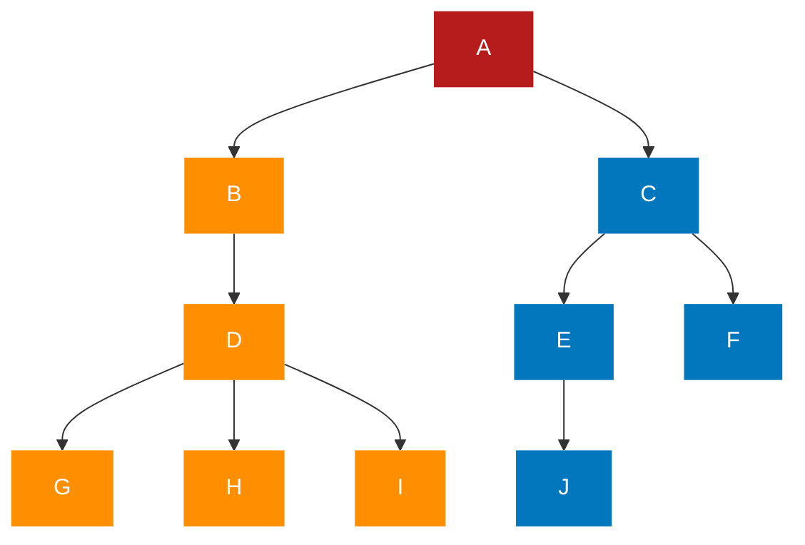

| 下标 | data | parent |
| :--: | :--: | :----: |
|  0   |  A   |   -1   |
|  1   |  B   |   0    |
|  2   |  C   |   0    |
|  3   |  D   |   1    |
|  4   |  E   |   2    |
|  5   |  F   |   2    |
|  6   |  G   |   3    |
|  7   |  H   |   3    |
|  8   |  I   |   3    |
|  9   |  J   |   4    |

这样的存储结构，我们可以根据结点的 parent 指针很容易找到它的双亲结点，所用的时间复杂度为 0(1)，直到 parent 为-1 时，表示找到了树结点的根。可如果我们要知道结点的孩子是什么，对不起，请遍历整个结构才行

我们增加一个结点最左边孩子的域，不妨叫它长子域，这样就可以很容易得到结点的孩子。如果没有孩子的结点，这个长子域就设置为-1，如下表所示

| 下标 | data | parent | firstChild |
| :--: | :--: | :----: | :--------: |
|  0   |  A   |   -1   |     1      |
|  1   |  B   |   0    |     3      |
|  2   |  C   |   0    |     4      |
|  3   |  D   |   1    |     6      |
|  4   |  E   |   2    |     9      |
|  5   |  F   |   2    |     -1     |
|  6   |  G   |   3    |     -1     |
|  7   |  H   |   3    |     -1     |
|  8   |  I   |   3    |     -1     |
|  9   |  J   |   4    |     -1     |

对于有 0 个或 1 个孩子的结点来说，这样的结构是解决了要找结点孩子的问题了。甚至是有 2 个孩子，知道了长子是谁，另一个当然就是次子了

另外一个问题场景，我们很关注各兄弟之间的关系，双亲表示法无法体现这样的关系，那我们怎么办？嗯，可以增加一个右兄弟域来体现兄弟关系，也就是说，每一个结点如果它存在右兄弟，则记录下右兄弟的下标。同样地，如果右兄弟不存在，则赋值为一 1，如下表所示

| 下标 | data | parent | firstChild | rightSib |
| :--: | :--: | :----: | :--------: | :------: |
|  0   |  A   |   -1   |     1      |    -1    |
|  1   |  B   |   0    |     3      |    2     |
|  2   |  C   |   0    |     4      |    -1    |
|  3   |  D   |   1    |     6      |    -1    |
|  4   |  E   |   2    |     9      |    5     |
|  5   |  F   |   2    |     -1     |    -1    |
|  6   |  G   |   3    |     -1     |    7     |
|  7   |  H   |   3    |     -1     |    8     |
|  8   |  I   |   3    |     -1     |    -1    |
|  9   |  J   |   4    |     -1     |    -1    |

但如果结点的孩子很多，超过了 2 个。我们又关注结点的双亲、又关注结点的孩子、还关注结点的兄弟，而且对时间遍历要求还比较高，那么我们还可以把此结构扩展为有双亲域、长子域、再有右兄弟域。 **<font color="#1565c0">存储结构的设计是一个非常灵活的过程。一个存储结构设计得是否合理，取决于基于该存储结构的运算是否适合、是否方便，时间复杂度好不好等。</font>** 注意也不是越多越好，有需要时再设计相应的结构。复杂的结构意味着更多时间与空间的开销，简单的设计对应着快速的查找与增删，确实要根据实际情况来做出取舍

### 孩子表示法

换一种完全不同的考虑方法。由于树中每个结点可能有多棵子树，可以考虑用多重链表，即 不过，**<font color="#1565c0">每个结点有多个指针域，其中每个指针指向一棵子树的根结点，我们把这种方法叫做多重链表表示法。</font>** 树的每个结点的度，也就是它的孩子个数是不同的。所以可以设计两种方案来解决。

- 方案一
  一种是指针域的个数就等于树的度，复习一下，树的度是树各个结点度的最大值。其结构如下表所示
  | data | child1 | child2 |child2 | ... | childD |
  | :--: | :--: | :----: | :----: | :----: | :------: |

  其中，data 是数据域；child1~childD 是指针域，用来指向该结点的孩子结点
  比如树的度是 3，所以我们的指针域的个数是 3

  这种方法对于树中各结点的度相差很大时，显然是很浪费空间的，因为有很多的结点，它的指针域都是空的。不过如果树的各结点度相差很小时，那就意味着开辟的空间被充分利用了，这时存储结构的缺点反而变成了优点

  既然很多指针域都可能为空，为什么不按需分配空间呢？于是我们有了第二种方案

- 方案二
  第二种方案每个结点指针域的个数等于该结点的度，我们专门取一个位置来存储结点指针域的个数，其结构如下表所示
  | data | degree | child1 |child2 | ... | childD |
  | :--: | :--: | :----: | :----: | :----: | :------: |

  其中，data 为数据域；degree 为度域，也就是存储该结点的孩子结点的个数；child1~childd 为指针域，指向该结点的各个孩子的结点

  这种方法克服了浪费空间的缺点，对空间利用率是很高了，但是由于各个结点的链表是不相同的结构，加上要维护结点的度的数值，在运算上就会带来时间上的损耗

  能否有更好的方法，既可以减少空指针的浪费又能使结点结构相同

  仔细观察，我们为了要遍历整棵树，把每个结点放到一个顺序存储结构的数组中是合理的，但每个结点的孩子有多少是不确定的，所以我们再对每个结点的孩子建立一个单链表体现它们的关系

  这就是 **<font color="#1565c0">孩子表示法。</font>** 具体办法是， **<font color="#1565c0">把每个结点的孩子结点排列起来，以单链表作存储结构，则 n 个结点有个孩子链表，如果是叶子结点则此单链表为空。然后 n 个头指针又组成一个线性表,采用顺序存储结构，存放进一个一维数组中，</font>**

  ```mermaid
  graph LR
    T1[0 A]-->EXAB
    T2[1 B]-->EXBD
    T3[2 C]-->EXCE
    T4[3 D]-->EXDG
    T5[4 E]-->EXEJ
    T6[5 F]
    T7[6 G]
    T8[7 H]
    T9[8 I]
    T10[9 J]
    EXAB[1]-->EXABC[2]
    EXBD[3]
    EXCE[4]-->EXCEF[5]
    EXDG[6]-->EXDGH[7]-->EXDGHI[8]
    EXEJ[9]
    classDef description fill:none,stroke:none;
    classDef reset color:white,stroke:none;
    classDef default color:white,stroke:none;
    classDef transparent fill:none;
    classDef red fill:#b71c1c;
    classDef orange fill:#ff8f00;
    classDef gray fill:#455a64;
    classDef green fill:#00695c;
    classDef blue fill:#0277bd;
    class T1,EXAB,EXABC red;
    class T2,EXBD orange;
    class T3,EXCE,EXCEF,T6 gray;
    class T4,EXDG,EXDGH,EXDGHI,T7,T8,T9 green;
    class T5,EXEJ,T10 blue;
  ```

  为此，设计两种结点结构，一个是孩子链表的孩子结点，如下表所示

  | child | next |
  | :---: | :--: |

  其中，child 是数据域，用来存储某个结点在表头数组中的下标；next 是指针域，用来存储指向某结点的下一个孩子结点的指针
  另一个是表头数组的表头结点，如下表所示

  | data | firstChild |
  | :--: | :--------: |

  其中，data 是数据域，存储某结点的数据信息；firstchild 是头指针域，存储该结点的孩子链表的头指针
  孩子表示法的结构定义代码:

  ```typescript
  /*树的孩子表示法结构定义 */
  type CTNode = {
    /* 孩子结点 */
    child: number;
    next: CTNode;
  };
  type CTBox = {
    /*表头结构*/
    data: TElemType;
    firstChild: CTNode;
  };
  type CTree = {
    /* 树结构*/
    nodes: CTBox[];
    /* 结点数组 */
    r: number;
    n: number;
    /* 根的位置和结点数 */
  };
  ```

  这样的结构对于我们要查找某个结点的某个孩子，或者找某个结点的某个孩子的兄弟，只需要查找这个结点的孩子单链表即可。对于遍历整棵树也是很方便的，对头结点的数组循环即可

### 孩子兄弟表示法

**<font color="#1565c0">任意一棵树，它的结点的第一个孩子如果存在就是唯一的，它的右兄弟如果存在也是唯一的。因此，我们设置两个指针，分别指向该结点的第一个孩子和此结点的右兄弟</font>**
结点结构如下表所示

| data | firstChild | rightSib |
| :--: | :--------: | :------: |

其中，data 是数据域；firstchild 为指针域，存储该结点的第一个孩子结点的存储地址；rightsib 是指针域，存储该结点的右兄弟结点的存储地址
结构定义代码如下：

```typescript
/*树的孩子兄弟表示法结构定义 */
type CSNode = {
  data: TElemType;
  firstChild: CSNode;
  rightSib: CSNode;
};
```

这种表示法，给查找某个结点的某个孩子带来了方便，只需要通过 frstchild 找到此结点的长子，然后再通过长子结点的 rightsib 找到它的二弟，接着一直下去，直到找到具体的孩子

## 二叉树的定义

**<font color="#1565c0">二叉树（Binary Tree）是 n（n≥0）个结点的有限集合，该集合或者为空集（称为空二叉树），或者由一个根结点和两棵互不相交的、分别称为根结点的左子树和右子树的二叉树组成</font>**

### 二叉树的特点

二叉树的特点有：

- 每个结点最多有两棵子树，所以二叉树中不存在度大于 2 的结点。注意不是只有
  两棵子树，而是最多有。没有子树或者有一棵子树都是可以的
- 左子树和右子树是有顺序的，次序不能任意颠倒。就像人有双手、双脚，但显然左手、左脚和右手、右脚是不一样的，右手戴左手套、右脚穿左鞋都会极其别扭和难受
- 即使树中某结点只有一棵子树，也要区分它是左子树还是右子树

二叉树具有以下五种基本形态：

1. 空二叉树
2. 只有一个根结点
3. 根结点只有左子树
4. 根结点只有右子树
5. 根结点既有左子树又有右子树

### 特殊的二叉树

#### 斜树

**<font color="#1565c0">所有的结点都只有左子树的二叉树叫左斜树。所有结点都只有右子树的二叉树叫右斜树。这两者统称为斜树。</font>**

斜树有很明显的特点，就是每一层都只有一个结点，结点的个数与二叉树的深度相同
其实线性表结构就可以理解为是树的一种极其特殊的表现形式

#### 满二叉树

**<font color="#1565c0">在一棵二叉树中，如果所有分支结点都存在左子树和右子树，并且所有叶子都在同一层上，这样的二叉树称为满二叉树。</font>**

单是每个结点都存在左右子树，不能算是满二叉树，还必须要所有的叶子都在同一层上，这就做到了整棵树的平衡。因此，满二叉树的特点有:

1. 叶子只能出现在最下一层。出现在其他层就不可能达到平衡
2. 非叶子结点的度一定是 2。否则就是“缺胳膊少腿”了
3. 在同样深度的二叉树中，满二叉树的结点个数最多，叶子数最多

#### 完全二叉树

**<font color="#1565c0">对一棵具有 n 个结点的二叉树按层序编号，如果编号为 i（1≤i≤n）的结点与同样深度的满二叉树中编号为 i 的结点在二叉树中位置完全相同，则这棵二叉树称为完全二叉树</font>**

完全二叉树的特点:

1. 叶子结点只能出现在最下两层
2. 最下层的叶子一定集中在左部连续位置
3. 倒数第二层，若有叶子结点，一定都在右部连续位置
4. 如果结点度为 1，则该结点只有左孩子，即不存在只有右子树的情况
5. 同样结点数的二叉树，完全二叉树的深度最小

看着树的示意图，心中默默给每个结点按照满二叉树的结构逐层顺序编号，如果编号出现空档，就说明不是完全二叉树，否则就是

## 二叉树的性质

- **<font color="#1565c0">性质 1：在二叉树的第 i 层至多有 2^1-1^个结点（i≥1）</font>**
- **<font color="#1565c0">性质 2：深度为 k 的二叉树至多有 2^k^-1 个结点（k≥1）</font>**
- **<font color="#1565c0">性质 3：对任何一棵二叉树 T，如果其终端结点数为 n~0~，度为 2 的结点数为 n~2~，则 n~0~=n~2~+1</font>**
- **<font color="#1565c0">性质 4：具有 n 个结点的完全二叉树的深度为 [log~2~n]+1（[x]表示不大于 x 的最大整数）</font>**
- **<font color="#1565c0">性质 5：如果对一棵有 n 个结点的完全二叉树（其深度为[log~2~n]+1）的结点按层序编号（从第 1 层到第 [log~2~n]+1 层，每层从左到右），对任一结点 i（1≤i≤n）有:</font>**
  **<font color="#1565c0">（1）如果 i=1，则结点/是二叉树的根，无双亲；如果 >= 1，则其双亲是结点[i/2]</font>**
  **<font color="#1565c0">（2）如果 2i>n，则结点/无左孩子（结点）为叶子结点）；否则其左孩子是结点 2i</font>**
  **<font color="#1565c0">（3）如果 2i+1>n，则结点/无右孩子；否则其右孩子是结点 2i+1</font>**

## 二叉树的存储结构

### 二叉树的顺序存储结构

二叉树是一种特殊的树，由于它的特殊性，使得用顺序存储结构也可以实现

二叉树的顺序存储结构就是用一维数组存储二叉树中的结点，并且结点的存储位置，也就是数组的下标要能体现结点之间的逻辑关系，比如双亲与孩子的关系，左右兄弟的关系等

考虑一种极端的情况，一棵深度为 k 的右斜树，它只有 k 个结点，却需要分配 2^4^-1 个存储单元空间，这显然是对存储空间的浪费。所以，顺序存储结构一般只用于完全二叉树

### 二叉链表

**<font color="#1565c0">二叉树每个结点最多有两个孩子，所以为它设计一个数据域和两个指针域</font>** 是比较自然的想法，我们称 **<font color="#1565c0">这样的链表叫做二叉链表。</font>** 结点结构图如下表所示

| LChild | data | RChild |
| :----: | :--: | :----: |

其中，data 是数据域；LChild 和 RChild 都是指针域，分别存放指向左孩子和右孩子的指针
二叉链表的结点结构定义代码：

```typescript
/* 二叉树的二叉链表结点结构定义 */
type BiTNode = {
  /*结点结构 */
  data: TElemType;
  LChild: BiTNode;
  RChild: BiTNode;
  /* 左右孩子指针 */
};
```

## 遍历二叉树

### 二叉树的遍历原理

**<font color="#1565c0">二叉树的遍历（traversing binary tree）是指从根结点出发，按照某种次序依次访问二叉树中的所有结点，使得每个结点被访问一次且仅被访问一次</font>**

### 二叉树的遍历方法

#### 前序遍历

**<font color="#1565c0">规则是若二叉树为空，则空操作返回，否则先访问根结点，然后前序遍历左子树，再前序遍历右子树。如下图所示，遍历的顺序为 ABDGHCEIF</font>**

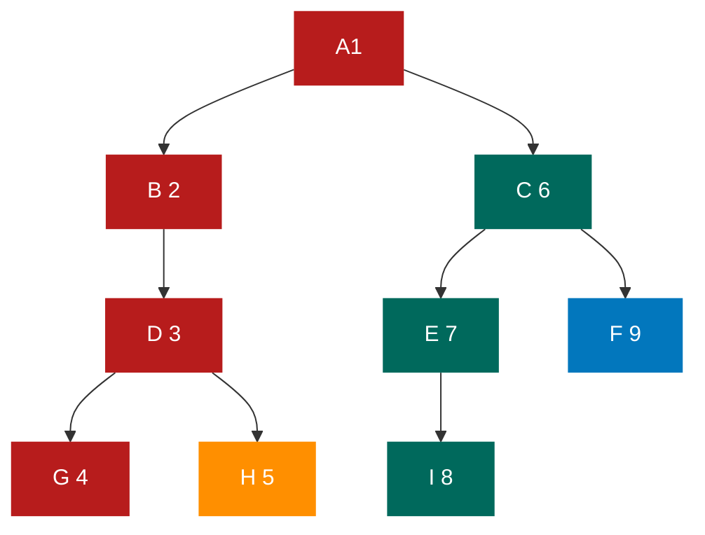

#### 中序遍历

**<font color="#1565c0">规则是若树为空，则空操作返回，否则从根结点开始（注意并不是先访问根结点），中序遍历根结点的左子树，然后是访问根结点，最后中序遍历右子树</font>**
如下图所示，遍历的顺序为 GDHBAEICF

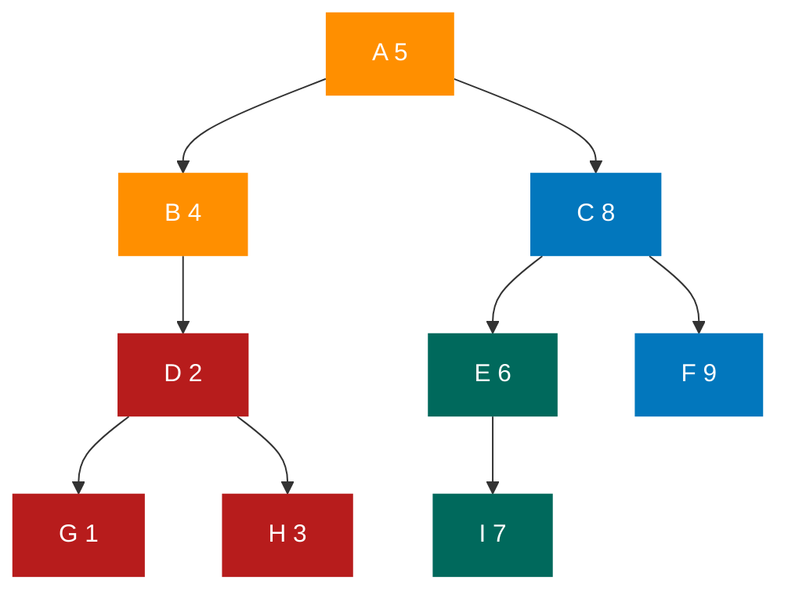

3.后序遍历
**<font color="#1565c0">规则是若树为空，则空操作返回，否则从左到右先叶子后结点的方式遍历访问左右子树，最后是访问根结点</font>**
如下图所示，遍历的顺序为 GHDBIEFCA

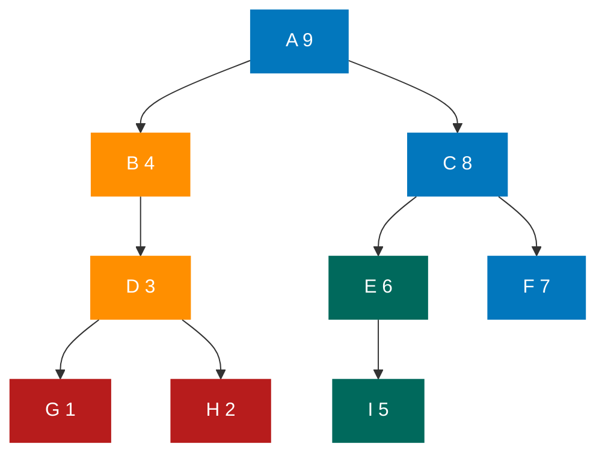

4.层序遍历
**<font color="#1565c0">规则是若树为空，则空操作返回，否则从树的第一层，也就是根结点开始访问，从上而下逐层遍历，在同一层中，按从左到右的顺序对结点逐个访问</font>**
如下图所示，遍历的顺序为 ABCDEFGHI

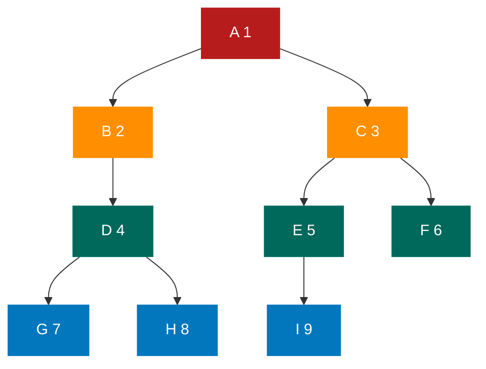

### 遍历算法

#### 前序遍历

```javascript
/**二叉树的前序遍历递归算法 */
/** 初始条件：二叉树T存在 */
/** 操作结果：前序递归遍历T */
function PreOrderTraverse(T) {
  if (T == null) return;
  console.log(T.data); /*显示结点数据*/
  PreOrderTraverse(T.LChild); /*先序遍历左子树 */
  PreOrderTraverse(T.RChild); /*先序遍历右子树 */
}
```

#### 中序遍历

```javascript
/*二叉树的中序遍历递归算法 */
/*初始条件：二叉树T存在 */
/*操作结果：中序递归遍历T */
function InOrderTraverse(T) {
  if (T == null) return;
  InOrderTraverse(T.LChild);
  console.log(T.data);
  InOrderTraverse(T.RChild);
}
```

#### 后续遍历

```javascript
/*二叉树的后序遍历递归算法 */
/*初始条件：二叉树T存在 */
/*操作结果：后序递归遍历T*/
function PostOrderTraverse(T) {
  if (T == null) return;
  PostOrderTraverse(T.LChild);
  PostOrderTraverse(T.RChild);
  console.log(T.data);
}
```

## 线索二叉树

### 线索二叉树的原理

首先我们要来看看这空指针有多少个呢？对于一个有 n 个结点的二叉链表，每个结点有指向左右孩子的两个指针域，所以一共是 2n 个指针域。而 n 个结点的二叉树一#有 n-1 条分支线数，也就是说，其实是存在 2n-(n-1)=n+1 个空指针域。比如上图有 10 个结点，而带有“八”的空指针域为 11。这些空间不存储任何事物，白白浪费着内存的资源

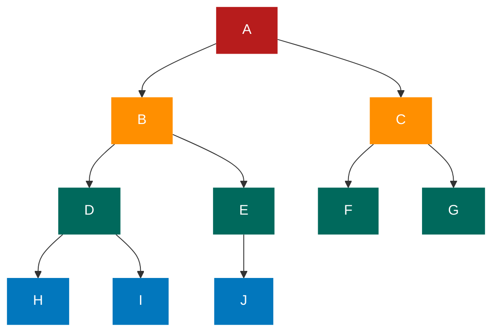

另一方面，我们在做遍历时，比如对上图做中序遍历时，得到了 HDIBJEAFCG 这样的字符序列，遍历过后，我们可以知道，结点 I 的前驱是 D，后继是 B，结点 F 的前驱是 A，后继是 C。也就是说，我们可以很清楚地知道任意一个结点，它的前驱和后继是哪一个结点

可是这是建立在已经遍历过的基础之上的。在二叉链表上，我们只能知道每个结点指向其左右孩子结点的地址，而不知道某个结点的前驱是谁，后继是谁。要想知道，必须遍历一次。以后每次需要知道时，都必须先遍历一次。为什么不考虑在创建时就记住这些前驱和后继呢？

综合刚才两个角度的分析，我们可以考虑利用那些空地址，存放指向结点在某种遍历次序下的前驱和后继结点的地址。就好像 GPS 导航仪一样，我们开车的时候，哪怕我们对具体目的地的位置一无所知，但它每次都可以告诉我从当前位置的下一步应该走向哪里。这就是我们现在要研究的问题。我们把这种 **<font color="#1565c0">指向前驱和后继的指针称为线索，加上线索的二叉链表称为线索链表，相应的二叉树就称为线索二叉树（Threaded Binary Tree)</font>**

请看下图，我们把这棵二叉树进行中序遍历后，将所有的空指针域中的 RChild，改为指向它的后继结点。于是我们就可以通过指针知道 H 的后继是 D（图中 1），I 的后继是 B（图中 2），J 的后继是 E（图中 3），E 的后继是 A（图中 4），F 的后继是 C（图中 5），G 的后继因为不存在而指向 NULL（图中 6）。此时共有 6 个空指针域被利用

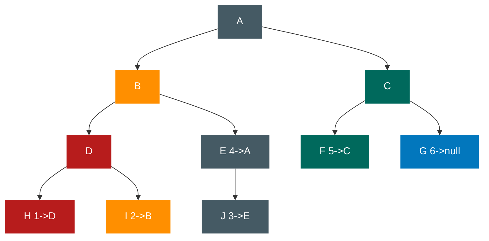

再看下图，我们将这棵二叉树的所有空指针域中的 LChild，改为指向当前结点的前驱。因此 H 的前驱是 NULL（图中 1），I 的前驱是 D（图中 2），J 的前驱是 B（图中 3），F 的前驱是 A（图中 4），G 的前驱是 C（图中 5）。一共 5 个空指针域被利用，正好和上面的后继加起来是 11 个

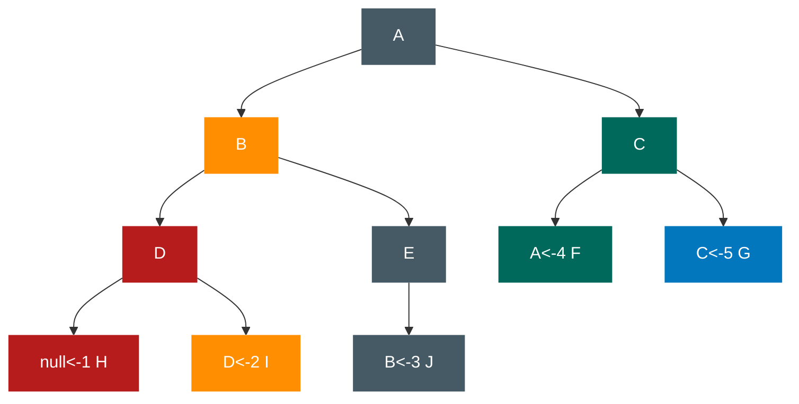

通过下图（黑点虚线为前驱，蓝箭头虚线为后继），就更容易看出，其实线索二叉树，等于是把一棵二叉树转变成了一个双向链表，这样就为我们的插入删除结点、查找某个结点都带来了方便。所以我们 **<font color="#1565c0">对二叉树以某种次序遍历使其变为线索二叉树的过程称做是线索化</font>**

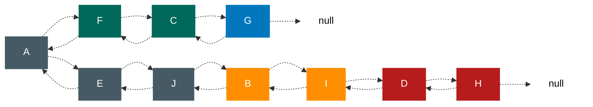

问题并没有彻底解决。我们如何知道某一结点的 LChild 是指向它的左孩子还是指向前驱？RChild 是指向右孩子还是指向后继？比如 E 结点的 LChild 是指向它的左孩子 J，而 RChild 却是指向它的后继 A。显然我们在决定 LChild 是指向左孩子还是前驱，RChild 是指向右孩子还是后继上是需要一个区分标志的。因此，我们在每个结点再增设两个标志域 LTag 和 RTag，注意 LTag 和 RTag 只是存放 0 或 1 数字的布尔型变量，其占用的内存空间要小于像 LChild 和 RChild 的指针变量。结点结构如下表所示

| LChild | LTag | data | RTag | RChild |
| :----: | :--: | :--: | :--: | :----: |

- LTag 为 0 时指向该结点的左孩子，为 1 时指向该结点的前驱。
- RTag 为 0 时指向该结点的右孩子，为 1 时指向该结点的后继。

因此对于下图 1 的二叉链表图可以修改为下图 2 的样子。

图一


图二

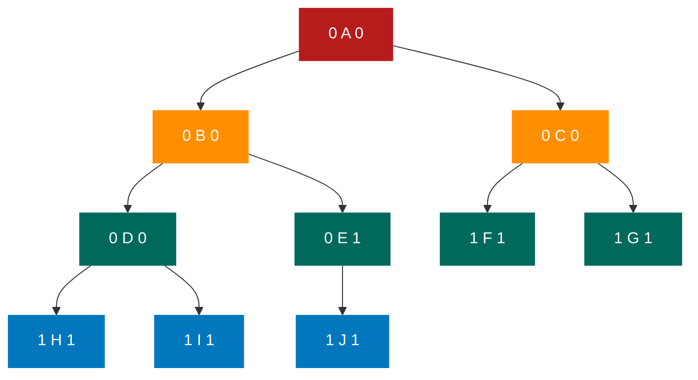

### 线索二叉树结构的实现

由此二叉树的线索存储结构定义代码如下：

```typescript
/* 二叉树的二叉线索存储结构定义 */
enum PointerTag = {Link,Thread}
/*Link=0表示指向左右孩子指针，※/
/* Thread=1表示指向前驱或后继的线索 */
type BiThrNode = {
  data:TElemType
  /*结点数据 */
  LChild:BiThrNode
  RChild:BiThrNode
  /*左右孩子指针 */
  LTag:PointerTag
  RTag:PointerTag
  /*左右标志*/
}

```

线索化的实质就是将二叉链表中的空指针改为指向前驱或后继的线索。由于前驱和后继的信息只有在遍历该二叉树时才能得到，所以 **<font color="#1565c0">线索化的过程就是在遍历的过程中修改空指针的过程</font>**

中序遍历线索化的递归函数代码如下：

```javascript
// BiThrNode pre
/*全局变量，始终指向刚刚访问过的结点*/
/*中序遍历进行中序线索化 */
function InThreading(p) {
  if (p) {
    InThreading(p.LChild);
    if (!p.LChild) {
      /* 没有左孩子 */
      p.LTag = Thread; /*前驱线索*/
      p.LChild = pre; /*左孩子指针指向前驱*/
    }
    if (!pre.RChild) {
      /*前驱没有右孩子*/
      pre.RTag = Thread; /*后继线索*/
      pre.RChild = p; /* 前驱右孩子指针指向后继（当前结点p）*/
    }
    pre = p; /*保持pre指向p的前驱*/
    InThreading(p.RChild); /*递归右子树线索化 */
  }
}
```

if(!p->LChild)表示如果某结点的左指针域为空，因为其前驱结点刚刚访问过，赋值给了 pre，所以可以将 pre 赋值给 p->LChild，并修改 p->LTag=Thread（也就是定义为 1）以完成前驱结点的线索化

后继就要稍稍麻烦一些。因为此时 p 结点的后继还没有访问到，因此只能对它的前驱结点 pre 的右指针 RChild 做判断，if(!pre->RChild)表示如果为空，则 p 就是 pre 的后继，于是 pre->RChild-p，并且设置 pre->RTag-Thread，完成后继结点的线索化

完成前驱和后继的判断后，别忘记将当前的结点 p 赋值给 pre，以便于下一次使用。有了线索二叉树后，我们对它进行遍历时发现，其实就等于是操作一个双向链表结构

和双向链表结构一样，在二叉树线索链表上添加一个头结点，如下图所示，并令其 LChild 域的指针指向二叉树的根结点（图中的 1），其 RChild 域的指针指向中序遍历时访问的最后一个结点（图中的 2）。反之，令二叉树的中序序列中的第一个结点中，LChild 域指针和最后一个结点的 RChild 域指针均指向头结点（图中的 3 和 4）。这样定义的好处就是我们既可以从第一个结点起顺后继进行遍历，也可以从最后一个结点起顺前驱进行遍历。

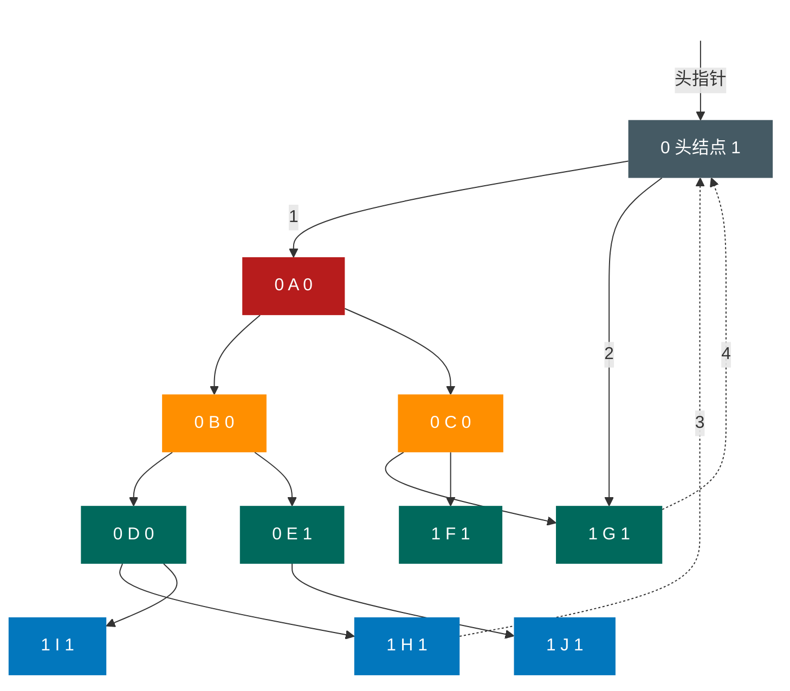

遍历的代码如下：

```javascript
/*T指向头结点，头结点左链LChild指向根结点，头结点右链RChild指向中序遍历的
 最后一个结点。中序遍历二叉线索链表表示的二叉树T*/
function InorderTraverseThr(T) {
  let p;
  p = T.LChild;
  /* P指向根结点*/
  while (p != T) {
    /* 空树或遍历结束时，p==T*/
    while (p.LTag == Link) {
      /*当LTag==0时循环到中序序列第一个结点 */
      p = p.LChild;
    }
    console.log(p.data);
    /*显示结点数据，可以更改为其他对结点的操作 */
    while (p.RTag == Thead && p.RChild != T) {
      p = p.RChild;
      console.log(p.data);
      /* 访问后继结点*/
    }
    p = p.RChild;
    /*p进至其右子树根 */
  }
  return "ok";
}
```

1. 代码中，第 6 行，p=T.LChild；意思就是上图中的 1，让 p 指向根结点开始遍历
2. 第 7~18 行，while(p!=T)意思就是循环直到图中的 4 的出现，此时意味着 p 指向了头结点，于是与 T 相等（T 是指向头结点的指针），结束循环，否则一直循环下去进行遍历操作
3. 第 9 行和第 11 行，while(p.LTag==Link)这个循环，就是由 A→B→D→H，此时 H 结点的 LTag 不是 Link（就是不等于 0），所以结束此循环
4. 第 13 行，打印 H
5. 第 15 ～ 17 行，while(p.RTag==Thread && p.RChild!=T)，由于结点 H 的 RTag==Thread（就是等于 1），且不是指向头结点。因此打印 H 的后继 D，之后因为 D 的 RTag 是 Link，因此退出循环
6. 第 20 行，p=p.RChild；意味着 p 指向了结点 D 的右孩子 I
7. …，就这样不断循环遍历，路径参照下图，直到打印出 HDIBJEAFCG，结束遍历操作


从这段代码也可以看出，它等于是一个链表的扫描，所以时间复杂度为 O(n)
由于它充分利用了空指针域的空间（这等于节省了空间），又保证了创建时的一次追历就可以终生受用前驱后继的信息（这意味着节省了时间）。所以在实际问题中，**<font color="#1565c0">如果所用的二叉树需经常遍历或查找结点时需要某种遍历序列中的前驱和后继，那么采用线索二叉链表的存储结构就是非常不错的选择</font>**

## 树、森林与二叉树的转换

### 树转换为二叉树

树如下图所示：

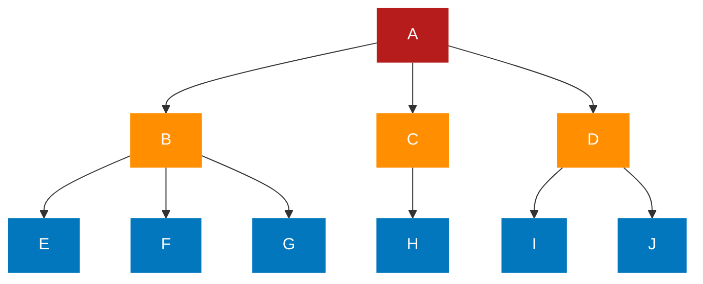

将树转化为二叉树的步骤如下：

1. 加线，在所有兄弟节点之间加一条线，如下图所示

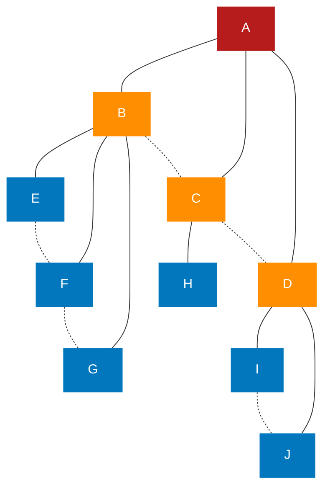

2. 去线。对树中每个结点，只保留它与第一个孩子结点的连线，删除它与其他孩
   子结点之间的连线。如下图所示


3. 层次调整。以树的根结点为轴心，将整棵树顺时针旋转一定的角度，使之结构层次分明。注意第一个孩子是二叉树结点的左孩子，兄弟转换过来的孩子是结点的右孩子。如下图所示

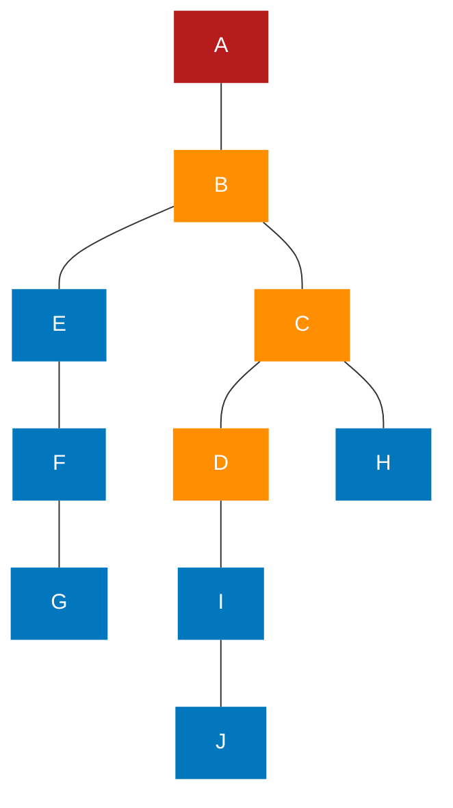

例如上面几幅图，一棵树经过三个步骤转换为一棵二叉树。初学者容易犯的错误就是在层次调整时，弄错了左右孩子的关系。比如图中 F、G 本都是树结点 B 的孩子，是结点 E 的兄弟，因此转换后，F 就是二叉树结点 E 的右孩子,G 是二叉树结点 F 的右孩子

### 森林转换为二叉树

森林是由若干棵树组成的，所以完全可以理解为，森林中的每一棵树都是兄弟，可以按照兄弟的处理办法来操作

例如下图，我们要将森林的三棵树转化为一棵二叉树

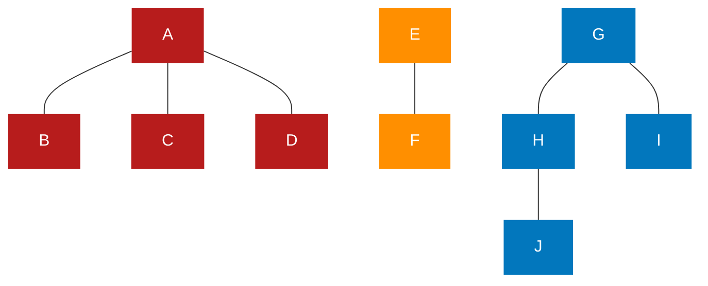

转化步骤如下

1. 把每个树转换为二叉树。如下图所示

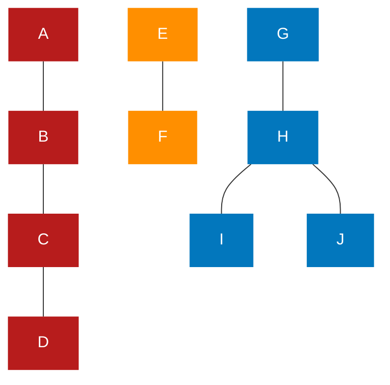

2. 第一棵二叉树不动，从第二棵二叉树开始，依次把后一棵二叉树的根结点作为前一棵二叉树的根结点的右孩子，用线连接起来。当所有的二叉树连接起来后就得到了由森林转换来的二叉树。如下图所示

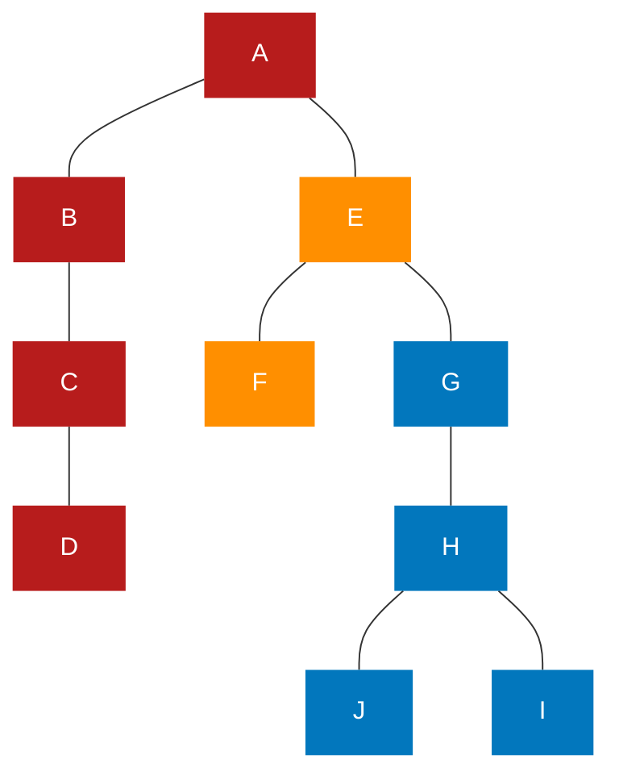

### 二叉树转换为树

二叉树转换为树是树转换为二叉树的逆过程，也就是反过来做而已。比如下图的二叉树。
转化为树的步骤如下

```mermaid
graph TB
    A[A]
    B[B]
    C[C]
    D[D]
    E[E]
    F[F]
    G[G]
    A---B---E---F
    B---C---D---G
    classDef default color:white,stroke:none;
    classDef description fill:none,stroke:none;
    classDef reset color:white,stroke:none;
    classDef transparent fill:none;
    classDef red fill:#b71c1c;
    classDef orange fill:#ff8f00;
    classDef gray fill:#455a64;
    classDef green fill:#00695c;
    classDef blue fill:#0277bd;
    class A red;
    class B orange;
    class E,C gray;
    class F,D green;
    class G blue;
```

1. 加线。若某结点的左孩子结点存在，则将这个左孩子的右孩子结点、右孩子的右孩子结点、右孩子的右孩子的右孩子结点……哈，反正就是左孩子的 n 个右孩子结点都作为此结点的孩子。将该结点与这些右孩子结点用线连接起来。如下图所示

```mermaid
graph TB
    A[A]
    B[B]
    C[C]
    D[D]
    E[E]
    F[F]
    G[G]
    A---B---E---F
    B---C---D---G
    A===C
    A===D
    B===F
    classDef default color:white,stroke:none;
    classDef description fill:none,stroke:none;
    classDef reset color:white,stroke:none;
    classDef transparent fill:none;
    classDef red fill:#b71c1c;
    classDef orange fill:#ff8f00;
    classDef gray fill:#455a64;
    classDef green fill:#00695c;
    classDef blue fill:#0277bd;
    class A red;
    class B orange;
    class E,C gray;
    class F,D green;
    class G blue;
```

2. 去线。删除原二叉树中所有结点与其右孩子结点的连线。如下图所示。

```mermaid
graph TB
    A[A]
    B[B]
    C[C]
    D[D]
    E[E]
    F[F]
    G[G]
    A---B---E-.-F
    B-.-C-.-D---G
    A---C
    A---D
    B---F
    classDef default color:white,stroke:none;
    classDef description fill:none,stroke:none;
    classDef reset color:white,stroke:none;
    classDef transparent fill:none;
    classDef red fill:#b71c1c;
    classDef orange fill:#ff8f00;
    classDef gray fill:#455a64;
    classDef green fill:#00695c;
    classDef blue fill:#0277bd;
    class A red;
    class B orange;
    class E,C gray;
    class F,D green;
    class G blue;
```

3. 层次调整。使之结构层次分明。如下图所示

```mermaid
graph TB
    A[A]
    B[B]
    C[C]
    D[D]
    E[E]
    F[F]
    G[G]
    A---B---E
    D---G
    A---C
    A---D
    B---F
    classDef default color:white,stroke:none;
    classDef description fill:none,stroke:none;
    classDef reset color:white,stroke:none;
    classDef transparent fill:none;
    classDef red fill:#b71c1c;
    classDef orange fill:#ff8f00;
    classDef gray fill:#455a64;
    classDef green fill:#00695c;
    classDef blue fill:#0277bd;
    class A red;
    class B orange;
    class E,C gray;
    class F,D green;
    class G blue;
```

### 二叉树转换为森林

判断一棵二叉树能够转换成一棵树还是森林，标准很简单，那就是只要看这棵二叉
树的根结点有没有右孩子，有就是森林，没有就是一棵树。
比如下图这个二叉树：

```mermaid
graph TB
    A[A]
    B[B]
    C[C]
    D[D]
    E[E]
    F[F]
    G[G]
    H[H]
    I[I]
    J[J]
    A---B---C---D
    A---E---F
    E---G
    G---H---J
    H---I
    classDef default color:white,stroke:none;
    classDef description fill:none,stroke:none;
    classDef reset color:white,stroke:none;
    classDef transparent fill:none;
    classDef red fill:#b71c1c;
    classDef orange fill:#ff8f00;
    classDef gray fill:#455a64;
    classDef green fill:#00695c;
    classDef blue fill:#0277bd;
    class A red;
    class B,C,D orange;
    class E,F gray;
    class G,H,I,J green;
```

转换成森林的步骤如下

1. 从根结点开始，若右孩子存在，则把与右孩子结点的连线删除。如下图所示

```mermaid
graph TB
    A[A]
    B[B]
    C[C]
    D[D]
    E[E]
    F[F]
    G[G]
    H[H]
    I[I]
    J[J]
    A---B---C---D
    A-.-E---F
    E-.-G
    G---H---J
    H---I
    classDef default color:white,stroke:none;
    classDef description fill:none,stroke:none;
    classDef reset color:white,stroke:none;
    classDef transparent fill:none;
    classDef red fill:#b71c1c;
    classDef orange fill:#ff8f00;
    classDef gray fill:#455a64;
    classDef green fill:#00695c;
    classDef blue fill:#0277bd;
    class A red;
    class B,C,D orange;
    class E,F gray;
    class G,H,I,J green;
```

2. 再查看分离后的二叉树，若右孩子存在，则连线删除……，直到所有右孩子连线都删除为止，得到分离的二叉树。如下图所示

```mermaid
graph TB
    A[A]
    B[B]
    C[C]
    D[D]
    E[E]
    F[F]
    G[G]
    H[H]
    I[I]
    J[J]
    A---B---C---D
    E---F
    G---H---J
    H---I
    classDef default color:white,stroke:none;
    classDef description fill:none,stroke:none;
    classDef reset color:white,stroke:none;
    classDef transparent fill:none;
    classDef red fill:#b71c1c;
    classDef orange fill:#ff8f00;
    classDef gray fill:#455a64;
    classDef green fill:#00695c;
    classDef blue fill:#0277bd;
    class A red;
    class B,C,D orange;
    class E,F gray;
    class G,H,I,J green;
```

3. 再将每棵分离后的二叉树转换为树即可。如下图所示

```mermaid
graph TB
    A[A]
    B[B]
    C[C]
    D[D]
    E[E]
    F[F]
    G[G]
    H[H]
    I[I]
    J[J]
    A---B
    A---C
    A---D
    E---F
    G---H---J
    G---I
    classDef default color:white,stroke:none;
    classDef description fill:none,stroke:none;
    classDef reset color:white,stroke:none;
    classDef transparent fill:none;
    classDef red fill:#b71c1c;
    classDef orange fill:#ff8f00;
    classDef gray fill:#455a64;
    classDef green fill:#00695c;
    classDef blue fill:#0277bd;
    class A red;
    class B,C,D orange;
    class E,F gray;
    class G,H,I,J green;
```

### 树与森林的遍历

树的遍历分为两种方式

1. 先根遍历树。即先访问树的根结点，然后依次先根遍历根的每棵子树
2. 后根遍历。即先依次后根遍历每棵子树，然后再访问根结点。比如下图的树，它的先根遍历序列为 ABEFCDG，后根遍历序列为 EFBCGDA

```mermaid
graph TB
    A[A]
    B[B]
    C[C]
    D[D]
    E[E]
    F[F]
    G[G]
    A---B
    A---C
    A---D
    B---E
    B---F
    D---G
    classDef default color:white,stroke:none;
    classDef description fill:none,stroke:none;
    classDef reset color:white,stroke:none;
    classDef transparent fill:none;
    classDef red fill:#b71c1c;
    classDef orange fill:#ff8f00;
    classDef gray fill:#455a64;
    classDef green fill:#00695c;
    classDef blue fill:#0277bd;
    class A red;
    class B orange;
    class C,E gray;
    class D,F green;
    class G blue;
```

森林的遍历也分为两种方式

1. **<font color="#1565c0">前序遍历：</font>** 先访问森林中第一棵树的根结点，然后再依次先根遍历根的每模子树，再依次用同样方式遍历除去第一棵树的剩余树构成的森林。比如下图三棵树的森林，前序遍历序列的结果就是 ABCDEFGHJI

```mermaid
graph TB
    A[A]
    B[B]
    C[C]
    D[D]
    E[E]
    F[F]
    G[G]
    H[H]
    I[I]
    J[J]
    A---B
    A---C
    A---D
    E---F
    G---H---J
    G---I
    classDef default color:white,stroke:none;
    classDef description fill:none,stroke:none;
    classDef reset color:white,stroke:none;
    classDef transparent fill:none;
    classDef red fill:#b71c1c;
    classDef orange fill:#ff8f00;
    classDef gray fill:#455a64;
    classDef green fill:#00695c;
    classDef blue fill:#0277bd;
    class A red;
    class B,C,D orange;
    class E,F gray;
    class G,H,I,J green;
```

2. **<font color="#1565c0">后序遍历：</font>** 是先访问森林中第一棵树，后根遍历的方式遍历每棵子树，然后再访问根结点，再依次同样方式遍历除去第一棵树的剩余树构成的森林。比如下图三棵树的森林，后序遍历序列的结果就是 BCDAFEJHIG。可如果我们对下图的二叉树进行分析就会发现， **<font color="#1565c0">森林的前序遍历和二叉树的前序遍历结果相同，森林的后序遍历和二叉树的中序遍历结果相同</font>**

```mermaid
graph TB
    A[A]
    B[B]
    C[C]
    D[D]
    E[E]
    F[F]
    G[G]
    H[H]
    I[I]
    J[J]
    A---B---C---D
    A---E---F
    E---G
    G---H---J
    H---I
    classDef default color:white,stroke:none;
    classDef description fill:none,stroke:none;
    classDef reset color:white,stroke:none;
    classDef transparent fill:none;
    classDef red fill:#b71c1c;
    classDef orange fill:#ff8f00;
    classDef gray fill:#455a64;
    classDef green fill:#00695c;
    classDef blue fill:#0277bd;
    class A red;
    class B,C,D orange;
    class E,F gray;
    class G,H,I,J green;
```

这也就告诉我们，当以二叉链表作树的存储结构时，树的先根遍历和后根遍历完全可以借用二叉树的前序遍历和中序遍历的算法来实现。这其实也就证实，我们找到了对树和森林这种复杂问题的简单解决办法

## 哈夫曼树及其应用

### 哈夫曼树

在计算机和互联网技术中，文本压缩就是一个非常重要的技术。玩电脑的人几乎都会应用压缩和解压缩软件来处理文档。因为它除了可以减少文档在磁盘上的空间外，还有重要的一点，就是我们可以在网络上以压缩的形式传输大量数据，使得保存和传递都更加高效

那么压缩而不出错是如何做到的呢？简单说，就是把我们要压缩的文本进行重新编吗，以减少不必要的空间。尽管现在最新技术在编码上已经很好很强大，但这一切都来自于曾经的技术积累，我们今天就来介绍一下最基本的压缩编码方法——哈夫曼编码

在介绍哈夫曼编码前，必须得介绍哈夫曼树，而介绍哈夫曼树，我们又不得不提这样一个人，美国数学家哈夫曼（David Huffman），也有的翻译为赫夫曼。他在 1952 年发明了哈夫曼编码，为了纪念他的成就，于是就把他在编码中用到的特殊的二叉树称之为哈夫曼树，他的编码方法称为哈夫曼编码。也就是说，现在介绍的知识全都来自于近 70 年前这位伟大科学家的研究成果，而我们平时所用的压缩和解压缩技术也都是基于哈夫曼的研究之上发展而来的

什么叫做哈夫曼树呢？我们先来看一个例子。
过去我们小学、中学一般考试都是用百分制来表示学科成绩的。这带来了一个弊端，就是很容易让学生、家长，甚至老师自己都以分取人，让分数代表了一切。有时想想也对，90 分和 95 分也许就只是一道题目对错的差距，但却让两个孩子可能受到完全不同的待遇，这并不公平。于是在如今提倡素质教育的背景下，我们很多的学科，特别是小学的学科成绩都改作了优秀、良好、中等、及格和不及格这样模糊的词语，不再通报不过对于老师来讲，他在对试卷评分的时候，显然不能凭感觉给优良或及格不及格等成绩，因此一般都还是按照百分制算出每个学生的成绩后，再根据统一的标准换算得出五级分制的成绩。比如下面的代码就实现了这样的转换

```javascript
if (a<60){
b=“不及格“
}else if (a<70){
b=“及格“
}else if (a<80){
b=“中等“
}else if (a<90){
b=“良好“
}else{
b=“优秀”
}
```

下图粗略看没什么问题，可是通常都认为，一张好的考卷应该是让学生成绩大部分处于中等或良好的范围，优秀和不及格都应该较少才对。而上面这样的程序，就使得所有的成绩都需要先判断是否及格，再逐级而上得到结果。输入量很大的时候，其实算法是有效率问题的。

```mermaid
graph TB
    A[a<60]
    AT[ 不及格 ]
    B[ a<70 ]
    BT[及格]
    C[a<80]
    CT[中等]
    D[a<90]
    DT[良好]
    E[优秀]
    A-->|Y|AT
    A-->|N|B-->|Y|BT
    B-->|N|C-->|Y|CT
    C-->|N|D-->|Y|DT
    D-->|N|E
    classDef default color:white,stroke:none;
    classDef description fill:none,stroke:none,color:black;
    classDef reset color:white,stroke:none;
    classDef transparent fill:none;
    classDef red fill:#b71c1c;
    classDef orange fill:#ff8f00;
    classDef gray fill:#455a64;
    classDef green fill:#00695c;
    classDef blue fill:#0277bd;
    class E red;
    class DT orange;
    class CT gray;
    class BT green;
    class AT blue;
    class A,B,C,D description;
```

如果在实际的学习生活中，学生的成绩在 5 个等级上的分布规律如下表所示

|   分数   | 0-59 | 60-69 | 70-79 | 80-89 | 90-100 |
| :------: | :--: | :---: | :---: | :---: | :----: |
| 所占比例 |  5%  |  15%  |  40%  |  30%  |  10%   |

那么 70 分以上大约占总数 80%的成绩都需要经过 3 次以上的判断才可以得到结果，这显然不合理
有没有好一些的办法，仔细观察发现，中等成绩（70~79 分）比例最高，其次是良好成绩，不及格的所占比例最少。我们把上图这棵二叉树重新进行分配。改成如下图的
做法试试看

```mermaid
graph TB
    A[a<60]
    AT[ 不及格 ]
    B[ a<70 ]
    BT[及格]
    C[a<80]
    CT[中等]
    D[a<90]
    DT[良好]
    E[优秀]
    C-->|Y|B
    C-->|N|D
    D-->|Y|DT
    D-->|N|E
    B-->|Y|A
    B-->|N|CT
    A-->|Y|AT
    A-->|N|BT
    classDef default color:white,stroke:none;
    classDef description fill:none,stroke:none,color:black;
    classDef reset color:white,stroke:none;
    classDef transparent fill:none;
    classDef red fill:#b71c1c;
    classDef orange fill:#ff8f00;
    classDef gray fill:#455a64;
    classDef green fill:#00695c;
    classDef blue fill:#0277bd;
    class E red;
    class DT orange;
    class CT gray;
    class BT green;
    class AT blue;
    class A,B,C,D description;
```

从图中感觉，应该效率要高一些了，到底高多少呢？这样的二叉树又是如何设计出来的呢？我们来看看哈夫曼大叔是如何说的吧

### 哈夫曼树的定义与原理

我们先把这两棵二叉树简化成叶子结点带权的二叉树（注：树结点间的边相关的数叫做权 Weight），如下图所示。其中 A 表示不及格、B 表示及格、C 表示中等、D 表示良好、E 表示优秀。每个叶子的分支线上的数字就是刚才我们提到的五级分制的成绩所占百分比

二叉树 a

```mermaid
graph TB
    A[A]
    AT[ ]
    B[ B ]
    BT[ ]
    C[C]
    CT[ ]
    D[ D]
    DT[ ]
    E[E]
    AT---|5|A
    AT---BT
    BT---|15|B
    BT---CT
    CT---|40|C
    CT---DT
    DT---|30|D
    DT---|10|E
    classDef default color:white,stroke:none;
    classDef description fill:none,stroke:black,color:black;
    classDef reset color:white,stroke:none;
    classDef transparent fill:none;
    classDef red fill:#b71c1c;
    classDef orange fill:#ff8f00;
    classDef gray fill:#455a64;
    classDef green fill:#00695c;
    classDef blue fill:#0277bd;
    class E red;
    class D orange;
    class C gray;
    class B green;
    class A blue;
    class AT,BT,CT,DT description;
```

二叉树 b

```mermaid
graph TB
    A[A]
    AT[ ]
    B[ B ]
    BT[ ]
    C[C]
    CT[ ]
    D[ D]
    DT[ ]
    E[E]
    BT---CT
    BT---DT
    CT---|15|B
    CT---AT
    DT---|30|D
    DT---|10|E
    AT---|5|D
    AT---|15|E
    classDef default color:white,stroke:none;
    classDef description fill:none,stroke:black,color:black;
    classDef reset color:white,stroke:none;
    classDef transparent fill:none;
    classDef red fill:#b71c1c;
    classDef orange fill:#ff8f00;
    classDef gray fill:#455a64;
    classDef green fill:#00695c;
    classDef blue fill:#0277bd;
    class E red;
    class D orange;
    class C gray;
    class B green;
    class A blue;
    class AT,BT,CT,DT description;
```

哈夫曼大叔说， **<font color="#1565c0">从树中一个结点到另一个结点之间的分支构成两个结点之间的路径，路径上的分支数目称做路径长度。</font>** 上图的第一个二叉树中，根结点到结点 D 的路径长度就为 4，第二个二叉树中根结点到结点 D 的路径长度为 2。 **<font color="#1565c0">树的路径长度就是从树根到每一结点的路径长度之和。</font>** 二叉树 a 的路径长度就为 1+1+2+2+3+3+4+4=20。二叉树 b 的路径长度就为 1+2+3+3+2+1+2+2=16

如果考虑到带权的结点，结点的带权的路径长度为从该结点到树根之间的路径长度与结点上权的乘积。树的带权路径长度为树中所有叶子结点的带权路径长度之和。假设有 n 个权值{w，w2…,w}，构造一棵有 n 个叶子结点的二叉树，每个叶子结点带权 w，每个叶子结点的路径长度为 1，则其中 **<font color="#1565c0">带权路径长度 WPL 最小的二叉树称做哈夫曼树</font>** 。有不少书中也称为最优二叉树，我个人觉得为了纪念做出巨大贡献的科学家，既然用他们的名字命名，就应该坚持用他们的名字称呼，哪怕“最优”更能体现这棵树的品质也应该只作为别名

二叉树 a 的 WPL=5x1+15x2+40×3+30×4+10x4=315

**<font color="#1565c0">注意：这里 5 是 A 结点的权，1 是 A 结点的路径长度，其他同理</font>**

这样的结果意味着什么呢？如果我们现在有 10000 个学生的百分制成绩需要计算五级分制成绩，用二叉树 a 的判断方法，需要做 31500 次比较，而用二叉树 b 的判断方法，只题要 22000 次比较，差不多少了三分之一，在性能上提高不是一点点

二叉树 b 的 WPL=5x3+15×3+40x2+30×2+10×2=220

那么现在的问题就是，上图的二叉树 b 这样的树是如何构造出来的，这样的二叉树是不是就是最优的哈夫曼树呢？别急，哈夫曼大叔给了我们解决的办法

（1)先把有权值的叶子结点按照从小到大的顺序排列成一个有序序列，即 A5,E10, B15, D30, C40
（2）取头两个最小权值的结点作为一个新结点 N~1~ 的两个子结点，注意相对较小的是左孩子，这里就是 A 为 N~1~ 的左孩子，E 为 N~1~的右孩子。新结点的权值为两个叶子权值的和 5+10=15
（3）将 N~1~ 替换 A 与 E，插入有序序列中，保持从小到大排列。即 N~1~ 15，B15，D30，C40
（4）重复步骤（2）。将 N~1~ 与 B 作为一个新结点 N~2~ 的两个子结点。N~2~ 的权值=15+15=30
（5）将 N~2~ 替换 N~1~ 与 B，插入有序序列中，保持从小到大排列。即 N~2~ 30，D30，C40
（6）重复步骤（2）。将 N~2~ 与 D 作为一个新结点 N~3~ 的两个子结点。N~3~ 的权值=30+30=60
（7)将 N~3~ 替换 N~2~ 与 D，插入有序序列中，保持从小到大排列。即 C40，N~3~ 60
（8）重复步骤（2）。将 C 与 N~3~ 作为一个新结点 T 的两个子结点。由于 T 即是根结点，完成哈夫曼树的构造

此时新的二叉树的带权路径长度 WPL=40×1+30×2+15×3+10x4+5×4=205。与原先二叉树的 WPL=5×3+15×3+40×2+30×2+10x2=220 相比，还少了 15。显然此时构造出来的二叉树才是最优的哈夫曼树

新二叉树

```mermaid
graph TB
    A
    N1
    B
    N2
    C
    N3
    D
    T
    E
    T---|40|C
    T---|60|N3
    N3---|30|D
    N3---|30|N2
    N2---|15|B
    N2---|15|N1
    N1---|5|A
    N1---|10|E
    classDef default color:white,stroke:none;
    classDef description fill:none,stroke:none,color:black;
    classDef reset color:white,stroke:none;
    classDef transparent fill:none;
    classDef red fill:#b71c1c;
    classDef orange fill:#ff8f00;
    classDef gray fill:#455a64;
    classDef green fill:#00695c;
    classDef blue fill:#0277bd;
    class A red;
    class E orange;
    class N1,N2,N3 gray;
    class B,D green;
    class C,T blue;

```

不过现实总是比理想要复杂得多，新二叉树虽然是哈夫曼树，但就当前例子而言有点特殊性，由于每次判断都要两次比较（如根结点就是 a<80 && a>=70，两次比较才能得到 y 或 n 的结果），所以总体性能上，反而不如原先的二叉树性能高（如根结点只需比较 a<80）。当然这并不是要讨论的重点了
通过刚才的步骤，我们可以得出构造哈夫曼树的哈夫曼算法的描述
（1）根据给定的 n 个权值{w~1~ ，w~2~ ，··· ,W~n~ }构成 n 棵二叉树的集合 F={T~1~ ,T~2~ , ··· ,T~n~ }，其中每棵二叉树 T,中只有一个带权为 w~1~ 的根结点，其左右子树均为空
（2）在 F 中选取两棵根结点的权值最小的树作为左右子树构造一棵新的二叉树，且置新的二叉树的根结点的权值为其左右子树上根结点的权值之和
（3）在 F 中删除这两棵树，同时将新得到的二叉树加入 F 中
（4）重复步骤（2）和（3），直到 F 只含一棵树为止。这棵树便是哈夫曼树

## 总结

开头提到了树的定义，递归在树定义中的应用。提到了如子树、结点、度、叶子、分支结点、双亲、孩子、层次、深度、森林等诸多概念，这些都是需要在理解的基础上去记忆的

树的存储结构：双亲表示法、孩子表示法、孩子兄弟表示法等不同的存储结构
并由孩子兄弟表示法引出其中最重要一种树——二叉树

二叉树每个结点最多两棵子树，有左右之分。提到了斜树、满二叉树、完全二叉树等特殊二叉树的概念
之后介绍了二叉树的各种性质，这些性质给研究二叉树带来了方便

二叉树的存储结构由于其特殊性使得既可以用顺序存储结构又可以用链式存储结松表示
遍历是二叉树最重要的一门学问，前序、中序、后序以及层序遍历都是需要熟练掌握的知识。要学会用计算机的运行思维去模拟递归的实现，可以加深对递归的理解。不过，并非二叉树遍历就一定要用到递归，只不过递归的实现比较优雅而已。这点需要明确
二叉树的建立自然也是可以通过递归来实现的

研究中也发现，二叉链表有很多浪费的空指针可以利用，查找某个结点的前驱和后继为什么非要每次遍历才可以得到，这就引出了如何构造一棵线索二叉树的问题。线索二叉树给二叉树的结点查找和遍历带来了高效率

树、森林看似复杂，其实它们都可以转化为简单的二叉树来处理，前面介绍了树、森林与二叉树的互相转换的办法，这样就使得面对树和森林的数据结构时，编码实现成为了可能

最后，提到了关于二叉树的一个应用，哈夫曼树，对带权路径的二叉树做了描述，初步理解数据压缩的原理，并明白其是如何做到无损编码和无错解码的

