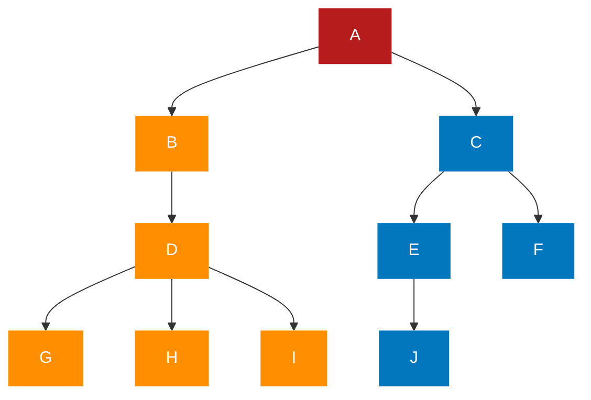
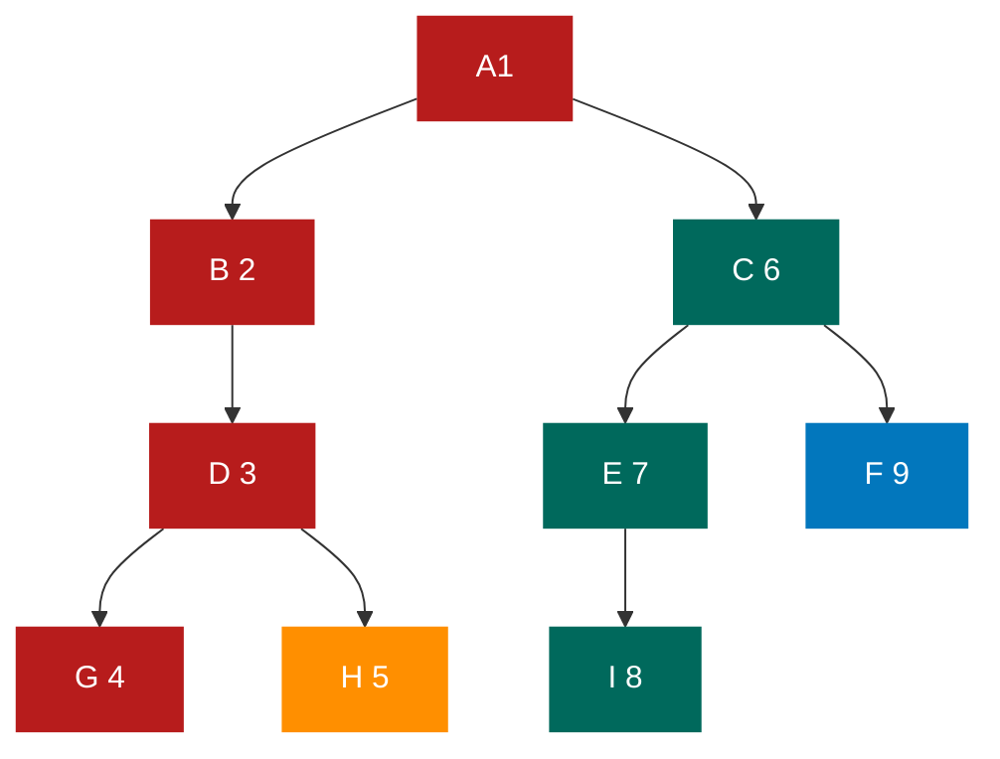
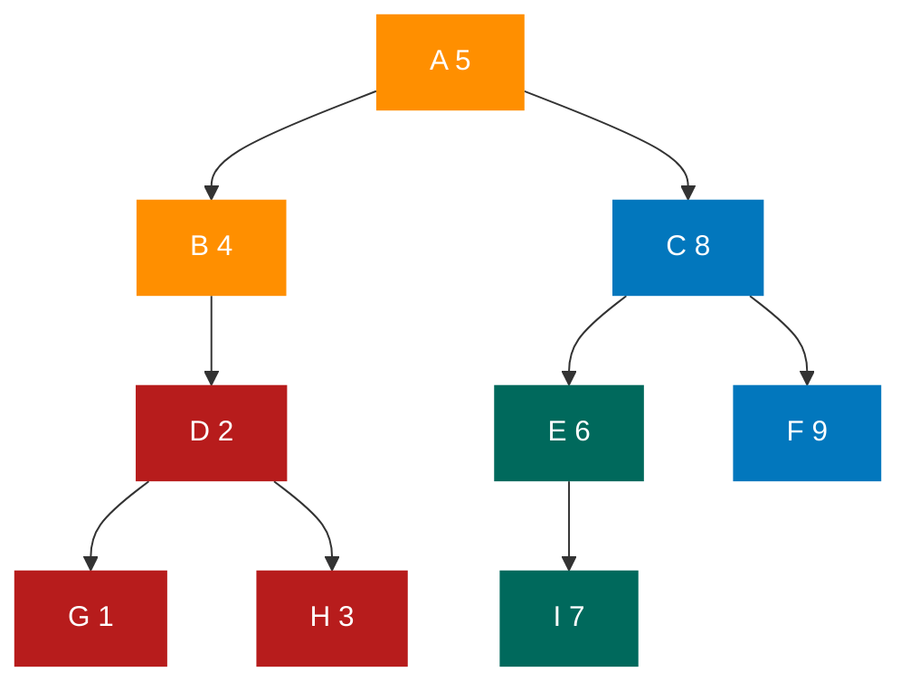
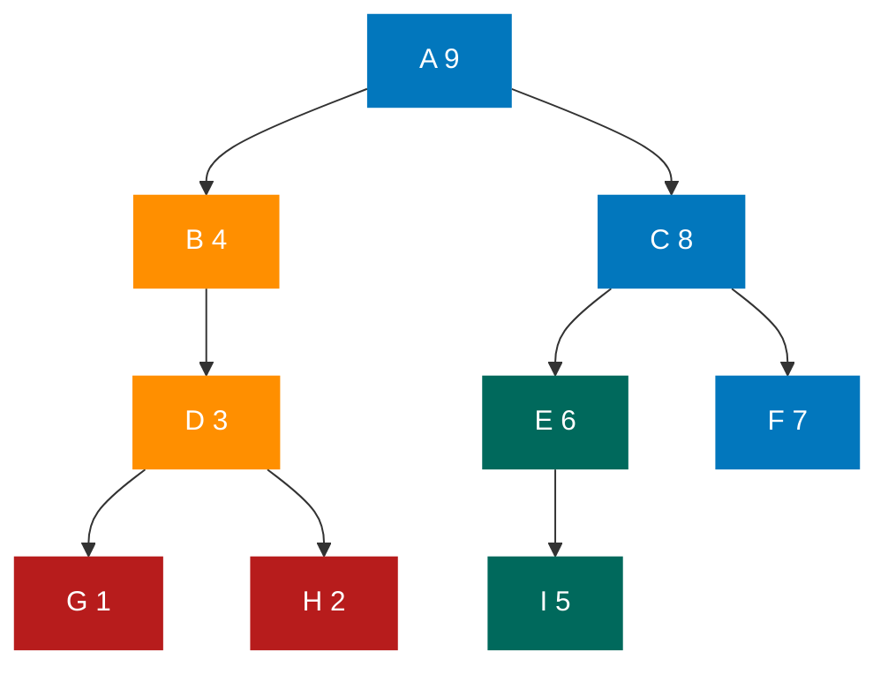
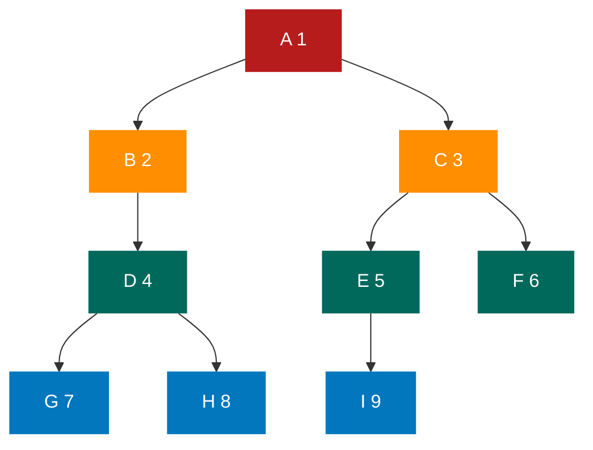

# 树

## 树的定义

**<font color="#1565c0">树：树（Tree）是 n（n≥0）个结点的有限集。n=0 时称为空树。在任意一棵非空树中，有且仅有一个特定的称为根（Root）的结点；当 n>1 时，其余结点可分为 m（m>0）个互不相交的有限集 T、T2、…、Tm，其中每一个集合本身又是一棵树，并且称为根的子树（SubTree）</font>**

1. n>0 时根结点是唯一的，不可能存在多个根结点，数据结构中的树是只能有一个根结点
2. m>0 时，子树的个数没有限制，但它们一定是互不相交的。

### 结点的分类

树的结点包含一个数据元素及若干指向其子树的分支。 **<font color="#1565c0">结点拥有的子树数称为结点的度（Degree）。度为 0 的结点称为叶结点（Leaf）或终端结点；度不为 0 的结点称为非终端结点或分支结点。除根结点之外，分支结点也称为内部结点。树的度是树内各结点的度的最大值。</font>**

### 结点间的关系

**<font color="#1565c0">结点的子树的根称为该结点的孩子（Child），相应地，该结点称为孩子的双亲（Parent）。同一个双亲的孩子之间互称兄弟（Sibling）。结点的祖先是从根到该结点所经分支上的所有结点。</font>**

### 树的其他相关概念

**<font color="#1565c0">结点的层次（Level）从根开始定义起，根为第一层，根的孩子为第二层。</font>** 若某结点在第 l 层，则其子树就在第 l+1 层。其双亲在同一层的结点互为兄弟。 **<font color="#1565c0">树中结点的最大层次称为树的深度（Depth）或高度</font>**

**<font color="#1565c0">如果将树中结点的各子树看成从左至右是有次序的，不能互换的，则称该树为有序树，否则称为无序树</font>**

**<font color="#1565c0">森林（Forest）是 m（m≥0）棵互不相交的树的集合。</font>** 对树中每个结点而言，其子树的集合即为森林。

对比线性表与树的结构，它们有很大的不同，如下图所示。

- 线性结构
  - 第一个数据元素：无前驱
  - 最后一个数据元素：无后继
  - 中间元素：一个前驱一个后继
- 树结构
  - 根节点：无双亲，唯一
  - 叶节点：无孩子，可以多克
  - 中间节点：一个双亲多个孩子

## 树的抽象数据类型

ADT 树（tree)
Data
树是由一个根结点和若干棵子树构成的。树中结点具有相同数据类型及层次关系
Operation
InitTree（*T）：构造空树 T
DestroyTree（*T）：销毁树 T
CreateTree(*T,definition)：按 definition 中给出树的定义来构造树
ClearTree（*T）：若树 T 存在，则将树 T 清为空树
TreeEmpty(T)：若 T 为空树，返回 true，否则返回 false
TreeDepth(T）：返回 T 的深度
Root（T）：返回 T 的根结点
Value（T，cur_e)：cur_e 是树 T 中一个结点，返回此结点的值
Assign(T，cur_e,value)：给树 T 的结点 cur_e 赋值为 value
Parent(T，cur_e)：若 cur_e 是树 T 的非根结点，则返回它的双亲，否则返回空
LeftChild(T,cur_e)：若 cur_e 是树 T 的非叶结点，则返回它的最左孩子，否则返回空
RightSibling(T,cur_e)：若 cur_e 有右兄弟，则返回它的右兄弟，否则返回空
InsertChild(*T，*p，i，c)：其中 p 指向树 T 的某个结点，i 为所指结点 p 的度加上 1，非空树 c 与 T 不相交，操作结果为插入 c 为树 T 中 p 所指结点的第 i 棵子树
DeleteChild(*T，*p，i)：其中 p 指向树 T 的某个结点，i 为所指结点 p 的度，操作结果
为删除中 p 所指结点的第 i 棵子树
endADT

## 树的存储结构

### 双亲表示法

除了根节点外，其余每个结点，它不一定有孩子，但是一定有且仅有一个双亲。

我们假设以一组连续空间存储树的结点，同时在 **<font color="#1565c0">每个结点中，附设一个指示器指示其双亲结点在数组中的位置。</font>** 也就是说，每个结点除了知道自己是谁以外，还知道它的双亲在哪里。它的结点结构如下所示

| data | parent |
| ---- | ------ |

其中，data 是数据域，存储结点的数据信息；parent 是指针域，存储该结点的双亲在数组中的下标

双亲表示法的结点结构定义代码：

```typescript
/*树的双亲表示法结点结构定义 */
type TElemType = number; /*树结点的数据类型，目前暂定为数字型 */
type PTNode = {
  /*结点结构 */
  data: TElemType /*结点数据*/;
  parent: number /*双亲位置*/;
};

type PTree = {
  /*树结构 */
  nodes: PTNode[] /*结点数组 */;
  r: number /*根的位置和*/;
  n: number /*结点数 */;
};
```

有了这样的结构定义，我们就可以来实现双亲表示法了。由于根结点是没有双亲的，所以我们约定根结点的位置域设置为-1，这也就意味着，我们所有的结点都存有它双亲的位置。如下图中的树结构可用下表中的树双亲表示



| 下标 | data | parent |
| :--: | :--: | :----: |
|  0   |  A   |   -1   |
|  1   |  B   |   0    |
|  2   |  C   |   0    |
|  3   |  D   |   1    |
|  4   |  E   |   2    |
|  5   |  F   |   2    |
|  6   |  G   |   3    |
|  7   |  H   |   3    |
|  8   |  I   |   3    |
|  9   |  J   |   4    |

这样的存储结构，我们可以根据结点的 parent 指针很容易找到它的双亲结点，所用的时间复杂度为 0(1)，直到 parent 为-1 时，表示找到了树结点的根。可如果我们要知道结点的孩子是什么，对不起，请遍历整个结构才行

我们增加一个结点最左边孩子的域，不妨叫它长子域，这样就可以很容易得到结点的孩子。如果没有孩子的结点，这个长子域就设置为-1，如下表所示

| 下标 | data | parent | firstChild |
| :--: | :--: | :----: | :--------: |
|  0   |  A   |   -1   |     1      |
|  1   |  B   |   0    |     3      |
|  2   |  C   |   0    |     4      |
|  3   |  D   |   1    |     6      |
|  4   |  E   |   2    |     9      |
|  5   |  F   |   2    |     -1     |
|  6   |  G   |   3    |     -1     |
|  7   |  H   |   3    |     -1     |
|  8   |  I   |   3    |     -1     |
|  9   |  J   |   4    |     -1     |

对于有 0 个或 1 个孩子的结点来说，这样的结构是解决了要找结点孩子的问题了。甚至是有 2 个孩子，知道了长子是谁，另一个当然就是次子了

另外一个问题场景，我们很关注各兄弟之间的关系，双亲表示法无法体现这样的关系，那我们怎么办？嗯，可以增加一个右兄弟域来体现兄弟关系，也就是说，每一个结点如果它存在右兄弟，则记录下右兄弟的下标。同样地，如果右兄弟不存在，则赋值为一 1，如下表所示

| 下标 | data | parent | firstChild | rightSib |
| :--: | :--: | :----: | :--------: | :------: |
|  0   |  A   |   -1   |     1      |    -1    |
|  1   |  B   |   0    |     3      |    2     |
|  2   |  C   |   0    |     4      |    -1    |
|  3   |  D   |   1    |     6      |    -1    |
|  4   |  E   |   2    |     9      |    5     |
|  5   |  F   |   2    |     -1     |    -1    |
|  6   |  G   |   3    |     -1     |    7     |
|  7   |  H   |   3    |     -1     |    8     |
|  8   |  I   |   3    |     -1     |    -1    |
|  9   |  J   |   4    |     -1     |    -1    |

但如果结点的孩子很多，超过了 2 个。我们又关注结点的双亲、又关注结点的孩子、还关注结点的兄弟，而且对时间遍历要求还比较高，那么我们还可以把此结构扩展为有双亲域、长子域、再有右兄弟域。 **<font color="#1565c0">存储结构的设计是一个非常灵活的过程。一个存储结构设计得是否合理，取决于基于该存储结构的运算是否适合、是否方便，时间复杂度好不好等。</font>** 注意也不是越多越好，有需要时再设计相应的结构。复杂的结构意味着更多时间与空间的开销，简单的设计对应着快速的查找与增删，确实要根据实际情况来做出取舍

### 孩子表示法

换一种完全不同的考虑方法。由于树中每个结点可能有多棵子树，可以考虑用多重链表，即 不过，**<font color="#1565c0">每个结点有多个指针域，其中每个指针指向一棵子树的根结点，我们把这种方法叫做多重链表表示法。</font>** 树的每个结点的度，也就是它的孩子个数是不同的。所以可以设计两种方案来解决。

- 方案一
  一种是指针域的个数就等于树的度，复习一下，树的度是树各个结点度的最大值。其结构如下表所示
  | data | child1 | child2 |child2 | ... | childD |
  | :--: | :--: | :----: | :----: | :----: | :------: |

  其中，data 是数据域；child1~childD 是指针域，用来指向该结点的孩子结点
  比如树的度是 3，所以我们的指针域的个数是 3

  这种方法对于树中各结点的度相差很大时，显然是很浪费空间的，因为有很多的结点，它的指针域都是空的。不过如果树的各结点度相差很小时，那就意味着开辟的空间被充分利用了，这时存储结构的缺点反而变成了优点

  既然很多指针域都可能为空，为什么不按需分配空间呢？于是我们有了第二种方案

- 方案二
  第二种方案每个结点指针域的个数等于该结点的度，我们专门取一个位置来存储结点指针域的个数，其结构如下表所示
  | data | degree | child1 |child2 | ... | childD |
  | :--: | :--: | :----: | :----: | :----: | :------: |

  其中，data 为数据域；degree 为度域，也就是存储该结点的孩子结点的个数；child1~childd 为指针域，指向该结点的各个孩子的结点

  这种方法克服了浪费空间的缺点，对空间利用率是很高了，但是由于各个结点的链表是不相同的结构，加上要维护结点的度的数值，在运算上就会带来时间上的损耗

  能否有更好的方法，既可以减少空指针的浪费又能使结点结构相同

  仔细观察，我们为了要遍历整棵树，把每个结点放到一个顺序存储结构的数组中是合理的，但每个结点的孩子有多少是不确定的，所以我们再对每个结点的孩子建立一个单链表体现它们的关系

  这就是 **<font color="#1565c0">孩子表示法。</font>** 具体办法是， **<font color="#1565c0">把每个结点的孩子结点排列起来，以单链表作存储结构，则 n 个结点有个孩子链表，如果是叶子结点则此单链表为空。然后 n 个头指针又组成一个线性表,采用顺序存储结构，存放进一个一维数组中，</font>**

  ```mermaid
  graph LR
    T1[0 A]-->EXAB
    T2[1 B]-->EXBD
    T3[2 C]-->EXCE
    T4[3 D]-->EXDG
    T5[4 E]-->EXEJ
    T6[5 F]
    T7[6 G]
    T8[7 H]
    T9[8 I]
    T10[9 J]
    EXAB[1]-->EXABC[2]
    EXBD[3]
    EXCE[4]-->EXCEF[5]
    EXDG[6]-->EXDGH[7]-->EXDGHI[8]
    EXEJ[9]
    classDef description fill:none,stroke:none;
    classDef reset color:white,stroke:none;
    classDef default color:white,stroke:none;
    classDef transparent fill:none;
    classDef red fill:#b71c1c;
    classDef orange fill:#ff8f00;
    classDef gray fill:#455a64;
    classDef green fill:#00695c;
    classDef blue fill:#0277bd;
    class T1,EXAB,EXABC red;
    class T2,EXBD orange;
    class T3,EXCE,EXCEF,T6 gray;
    class T4,EXDG,EXDGH,EXDGHI,T7,T8,T9 green;
    class T5,EXEJ,T10 blue;
  ```

  为此，设计两种结点结构，一个是孩子链表的孩子结点，如下表所示

  | child | next |
  | :---: | :--: |

  其中，child 是数据域，用来存储某个结点在表头数组中的下标；next 是指针域，用来存储指向某结点的下一个孩子结点的指针
  另一个是表头数组的表头结点，如下表所示

  | data | firstChild |
  | :--: | :--------: |

  其中，data 是数据域，存储某结点的数据信息；firstchild 是头指针域，存储该结点的孩子链表的头指针
  孩子表示法的结构定义代码:

  ```typescript
  /*树的孩子表示法结构定义 */
  type CTNode = {
    /* 孩子结点 */
    child: number;
    next: CTNode;
  };
  type CTBox = {
    /*表头结构*/
    data: TElemType;
    firstChild: CTNode;
  };
  type CTree = {
    /* 树结构*/
    nodes: CTBox[];
    /* 结点数组 */
    r: number;
    n: number;
    /* 根的位置和结点数 */
  };
  ```

  这样的结构对于我们要查找某个结点的某个孩子，或者找某个结点的某个孩子的兄弟，只需要查找这个结点的孩子单链表即可。对于遍历整棵树也是很方便的，对头结点的数组循环即可

### 孩子兄弟表示法

**<font color="#1565c0">任意一棵树，它的结点的第一个孩子如果存在就是唯一的，它的右兄弟如果存在也是唯一的。因此，我们设置两个指针，分别指向该结点的第一个孩子和此结点的右兄弟</font>**
结点结构如下表所示

| data | firstChild | rightSib |
| :--: | :--------: | :------: |

其中，data 是数据域；firstchild 为指针域，存储该结点的第一个孩子结点的存储地址；rightsib 是指针域，存储该结点的右兄弟结点的存储地址
结构定义代码如下：

```typescript
/*树的孩子兄弟表示法结构定义 */
type CSNode = {
  data: TElemType;
  firstChild: CSNode;
  rightSib: CSNode;
};
```

这种表示法，给查找某个结点的某个孩子带来了方便，只需要通过 frstchild 找到此结点的长子，然后再通过长子结点的 rightsib 找到它的二弟，接着一直下去，直到找到具体的孩子

## 二叉树的定义

**<font color="#1565c0">二叉树（Binary Tree）是 n（n≥0）个结点的有限集合，该集合或者为空集（称为空二叉树），或者由一个根结点和两棵互不相交的、分别称为根结点的左子树和右子树的二叉树组成</font>**

### 二叉树的特点

二叉树的特点有：

- 每个结点最多有两棵子树，所以二叉树中不存在度大于 2 的结点。注意不是只有
  两棵子树，而是最多有。没有子树或者有一棵子树都是可以的
- 左子树和右子树是有顺序的，次序不能任意颠倒。就像人有双手、双脚，但显然左手、左脚和右手、右脚是不一样的，右手戴左手套、右脚穿左鞋都会极其别扭和难受
- 即使树中某结点只有一棵子树，也要区分它是左子树还是右子树

二叉树具有以下五种基本形态：

1. 空二叉树
2. 只有一个根结点
3. 根结点只有左子树
4. 根结点只有右子树
5. 根结点既有左子树又有右子树

### 特殊的二叉树

#### 斜树

**<font color="#1565c0">所有的结点都只有左子树的二叉树叫左斜树。所有结点都只有右子树的二叉树叫右斜树。这两者统称为斜树。</font>**

斜树有很明显的特点，就是每一层都只有一个结点，结点的个数与二叉树的深度相同
其实线性表结构就可以理解为是树的一种极其特殊的表现形式

#### 满二叉树

**<font color="#1565c0">在一棵二叉树中，如果所有分支结点都存在左子树和右子树，并且所有叶子都在同一层上，这样的二叉树称为满二叉树。</font>**

单是每个结点都存在左右子树，不能算是满二叉树，还必须要所有的叶子都在同一层上，这就做到了整棵树的平衡。因此，满二叉树的特点有:

1. 叶子只能出现在最下一层。出现在其他层就不可能达到平衡
2. 非叶子结点的度一定是 2。否则就是“缺胳膊少腿”了
3. 在同样深度的二叉树中，满二叉树的结点个数最多，叶子数最多

#### 完全二叉树

**<font color="#1565c0">对一棵具有 n 个结点的二叉树按层序编号，如果编号为 i（1≤i≤n）的结点与同样深度的满二叉树中编号为 i 的结点在二叉树中位置完全相同，则这棵二叉树称为完全二叉树</font>**

完全二叉树的特点:

1. 叶子结点只能出现在最下两层
2. 最下层的叶子一定集中在左部连续位置
3. 倒数第二层，若有叶子结点，一定都在右部连续位置
4. 如果结点度为 1，则该结点只有左孩子，即不存在只有右子树的情况
5. 同样结点数的二叉树，完全二叉树的深度最小

看着树的示意图，心中默默给每个结点按照满二叉树的结构逐层顺序编号，如果编号出现空档，就说明不是完全二叉树，否则就是

## 二叉树的性质

- **<font color="#1565c0">性质 1：在二叉树的第 i 层至多有 2^1-1^个结点（i≥1）</font>**
- **<font color="#1565c0">性质 2：深度为 k 的二叉树至多有 2^k^-1 个结点（k≥1）</font>**
- **<font color="#1565c0">性质 3：对任何一棵二叉树 T，如果其终端结点数为 n~0~，度为 2 的结点数为 n~2~，则 n~0~=n~2~+1</font>**
- **<font color="#1565c0">性质 4：具有 n 个结点的完全二叉树的深度为 [log~2~n]+1（[x]表示不大于 x 的最大整数）</font>**
- **<font color="#1565c0">性质 5：如果对一棵有 n 个结点的完全二叉树（其深度为[log~2~n]+1）的结点按层序编号（从第 1 层到第 [log~2~n]+1 层，每层从左到右），对任一结点 i（1≤i≤n）有:</font>**
  **<font color="#1565c0">（1）如果 i=1，则结点/是二叉树的根，无双亲；如果 >= 1，则其双亲是结点[i/2]</font>**
  **<font color="#1565c0">（2）如果 2i>n，则结点/无左孩子（结点）为叶子结点）；否则其左孩子是结点 2i</font>**
  **<font color="#1565c0">（3）如果 2i+1>n，则结点/无右孩子；否则其右孩子是结点 2i+1</font>**

## 二叉树的存储结构

### 二叉树的顺序存储结构

二叉树是一种特殊的树，由于它的特殊性，使得用顺序存储结构也可以实现

二叉树的顺序存储结构就是用一维数组存储二叉树中的结点，并且结点的存储位置，也就是数组的下标要能体现结点之间的逻辑关系，比如双亲与孩子的关系，左右兄弟的关系等

考虑一种极端的情况，一棵深度为 k 的右斜树，它只有 k 个结点，却需要分配 2^4^-1 个存储单元空间，这显然是对存储空间的浪费。所以，顺序存储结构一般只用于完全二叉树

### 二叉链表

**<font color="#1565c0">二叉树每个结点最多有两个孩子，所以为它设计一个数据域和两个指针域</font>** 是比较自然的想法，我们称 **<font color="#1565c0">这样的链表叫做二叉链表。</font>** 结点结构图如下表所示

| LChild | data | RChild |
| :----: | :--: | :----: |

其中，data 是数据域；LChild 和 RChild 都是指针域，分别存放指向左孩子和右孩子的指针
二叉链表的结点结构定义代码：

```typescript
/* 二叉树的二叉链表结点结构定义 */
type BiTNode = {
  /*结点结构 */
  data: TElemType;
  LChild: BiTNode;
  RChild: BiTNode;
  /* 左右孩子指针 */
};
```

## 遍历二叉树

### 二叉树的遍历原理

**<font color="#1565c0">二叉树的遍历（traversing binary tree）是指从根结点出发，按照某种次序依次访问二叉树中的所有结点，使得每个结点被访问一次且仅被访问一次</font>**

### 二叉树的遍历方法

#### 前序遍历

**<font color="#1565c0">规则是若二叉树为空，则空操作返回，否则先访问根结点，然后前序遍历左子树，再前序遍历右子树。如下图所示，遍历的顺序为 ABDGHCEIF</font>**



#### 中序遍历

**<font color="#1565c0">规则是若树为空，则空操作返回，否则从根结点开始（注意并不是先访问根结点），中序遍历根结点的左子树，然后是访问根结点，最后中序遍历右子树</font>**
如下图所示，遍历的顺序为 GDHBAEICF



3.后序遍历
**<font color="#1565c0">规则是若树为空，则空操作返回，否则从左到右先叶子后结点的方式遍历访问左右子树，最后是访问根结点</font>**
如下图所示，遍历的顺序为 GHDBIEFCA



4.层序遍历
**<font color="#1565c0">规则是若树为空，则空操作返回，否则从树的第一层，也就是根结点开始访问，从上而下逐层遍历，在同一层中，按从左到右的顺序对结点逐个访问</font>**
如下图所示，遍历的顺序为 ABCDEFGHI



### 遍历算法

#### 前序遍历

```javascript
/**二叉树的前序遍历递归算法 */
/** 初始条件：二叉树T存在 */
/** 操作结果：前序递归遍历T */
function PreOrderTraverse(T) {
  if (T == null) return;
  console.log(T.data); /*显示结点数据*/
  PreOrderTraverse(T.LChild); /*先序遍历左子树 */
  PreOrderTraverse(T.RChild); /*先序遍历右子树 */
}
```

#### 中序遍历

```javascript
/*二叉树的中序遍历递归算法 */
/*初始条件：二叉树T存在 */
/*操作结果：中序递归遍历T */
function InOrderTraverse(T){
    if(T == null)return
    InOrderTraverse(T.LChild)
    console.log(T.data)
    InOrderTraverse(T.RChild)
}
```

#### 后续遍历

```javascript
/*二叉树的后序遍历递归算法 */
/*初始条件：二叉树T存在 */
/*操作结果：后序递归遍历T*/
function PostOrderTraverse(T){
    if(T == null)return
    PostOrderTraverse(T.LChild)
    PostOrderTraverse(T.RChild)
    console.log(T.data)
}
```

## 线索二叉树

### 线索二叉树的原理


**<font color="#1565c0"></font>**
