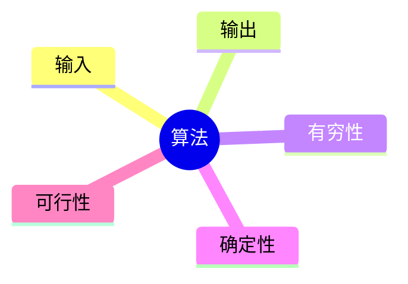

# 算法

## 定义

**算法是解决特定问题求解步骤的描述，在计算机中表现为指令的有限序列，并且每条指令表示一个或多个操作**

就像高斯的故事那样，对于给定的问题，是可以有多种算法来解决的
算法定义中提到了指令，指令能被人或机器等计算装置执行，它可以是计算机指令，也可以是语言文字
为了解决某个或某类问题，需要把指令表示成一定的操作序列，操作序列包括一组操作，每一个操作都完成特定的功能，这就是算法了

## 算法的特性

算法具有五个基本特性：输入、输出、有穷性、确定性和可行性

### 输入输出

**算法具有零个或多个输入** ，尽管对于绝大多数算法来说，输入参数都是必要的，但对于个别情况，例如打印 "hello world" 这样的代码，不需要任何输入参数，因此算法的输入参数可以是零个， **算法至少要有一个或多个输出** ，算法是一定需要输出的，不然就没用了，输出的形式可以是打印输出也可以是返回一个或多个值等

### 有穷性

**有穷性：指算法在执行有限的步骤之后，自动结束而不会出现无限循环，并且每一个步骤在可接受的时间内完成。** 现实中经常会写出死循环的代码，这就是不满足有穷性，当然这里有穷的概念并不是纯数学意义的，而是在实际应用当中合理的，可以接收的 “有边界” ，要是写一个算法，计算机需要执行上三十年，一定会结束，它在数学意义上是有穷了，可现实中就废了，算法的意义也不大了

### 确定性

**确定性：算法的每一步骤都具有确定性的含义，不会出现二义性。** 算法在一定条件下，只有一条执行路径，相同的输入只能有唯一的输出结果，算法的每个步骤被精确定义而无歧义

### 可行性

**可行性：算法的每一步都必须是可行的，也就是说，每一步都能够通过执行有限次数完成。** 可行性意味着算法可以转换为程序上机运行，并得到正确的结果

## 算法设计的要求

算法不是唯一的，也就是说，同一个问题，可以有多种解决问题的算法，虽然没有标准答案，尽管算法也不唯一，但相对好的算法还是存在的，掌握好的算法，对解决问题很有帮助，否则前人的智慧不能利用，就得自己从头研究了

### 正确性

**正确性：算法的正确性是指算法至少应该具有输入、输出和加工处理无歧义性，能正确反映问题的需求，能够得到问题的正确答案。**

但是算法的 “正确” 通常在用法上有很大差异，大体分为以下四个层次

1. 算法程序没有语法错误
2. 算法程序对于合法的输入数据能够产生满足需求的输出结果
3. 算法程序对于非法的输入数据能够得出满足规格说明的结果
4. 算法程序对于精心选择的，甚至刁难的测试数据都有满足需求的输出结果

对于这四层的含义，层次 1 要求最低，但是仅仅没有语法错误实在谈不上是好算法，这就如同仅仅解决温饱，不能算是生活幸福一样，而层次 4 是最困难的，几乎不可能逐一验证所有的输入都得到正确的结果

因此算法的正确性在大部分情况下都不可能用程序来证明，而是用数学方法证明的，证明一个复杂算法在所有层次上都是正确的，代价非常高，所以一般情况下，把层次 3 作为一个算法是否正确的标准

### 可读性

**可读性：算法设计的另一目的就是为了便于阅读、理解和交流**

可读性高有助于人们理解算法，晦涩难懂的算法往往隐含错误，不易被发现，并且难于调试和修改

写代码的目的，一方面是为了让计算机执行，还有一个重要的目的就是为了便于他人阅读，让人理解和交流，自己将来也可能阅读，如果可读性不好，时间长了自己都不知道写了什么，可读性是算法（也包括实现它的代码）好坏很重要的标志

### 健壮性

一个好的算法还应该能对输入数据不合法的情况做适当的处理，比如输入的时间或距离不应该是负数等

**健壮性：当输入数据不合法时，算法也能做出相关处理，而不是产生异常或莫名其妙的结果**

### 时间效率高和存储量低

好的算法还应该具备时间效率高和存储量低的特点

时间效率指的是算法的执行时间，对于同一个问题，如果有多个算法能够解决，最大执行时间越短的算法效率越高，存储量需求指的是算法在执行过程中需要的最大存储空间，主要指算法程序运行时所占用的内存或外部硬盘存储空间， **设计算法应该尽量满足时间效率高和存储量低的需求** 。在生活中，都希望花最少的钱，用最短的时间，办最大的事，算法也是一样的思想，能用最少的存储空间，花最少的时间，办同样的事就是好算法。比如，求 100 个人的高考成绩平均分，与求全省的所有考生的成绩平均分在占用时间和内存存储上是有非常大的差异的，自然就是追求可以高效率和低存储量的算法来解决问题

综上，好的算法，应该具有正确性、可读性、健壮性、高效率和低存储量的特征

## 算法效率的度量方法

正所谓 “是骡子是马，拉出来溜溜”，比较容易想到的方法就是，通过对算法的数据测试，利用计算机的计时功能，来计算不同算法的效率是高还是低

### 事后统计方法

****
