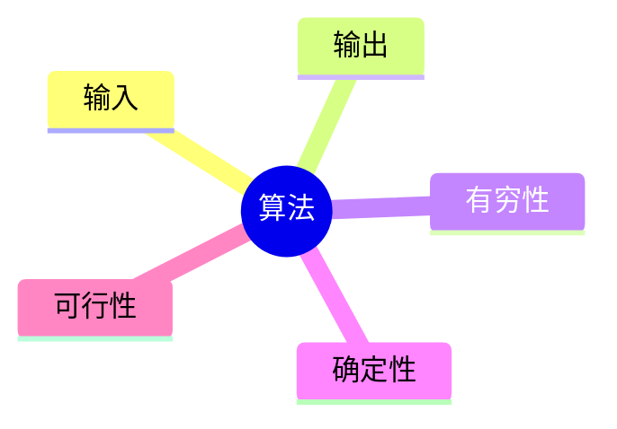
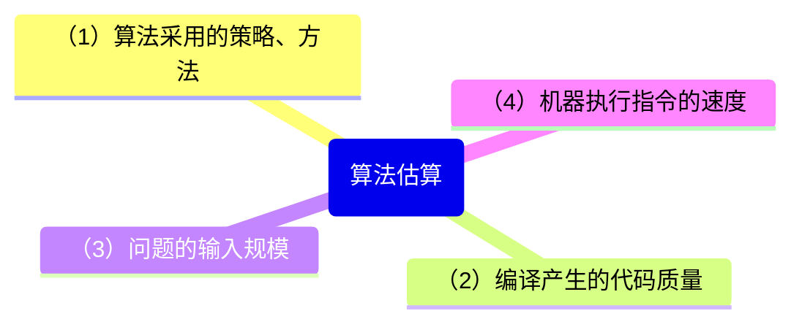
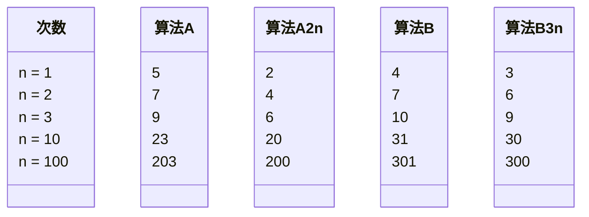
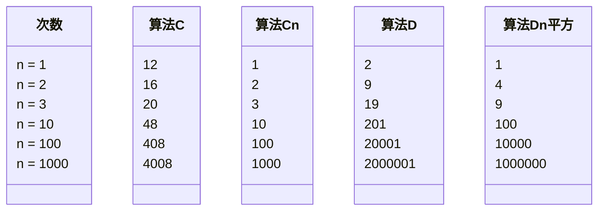
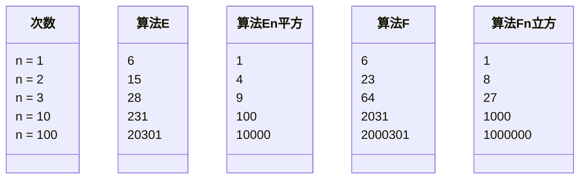
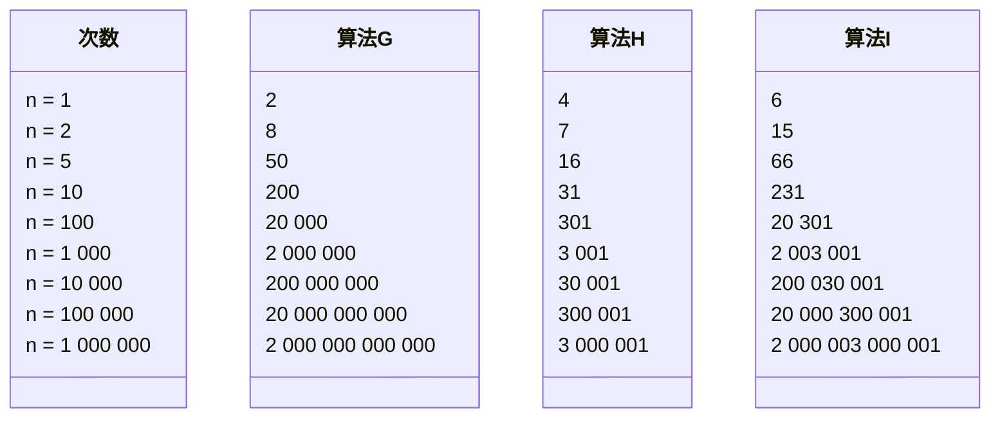
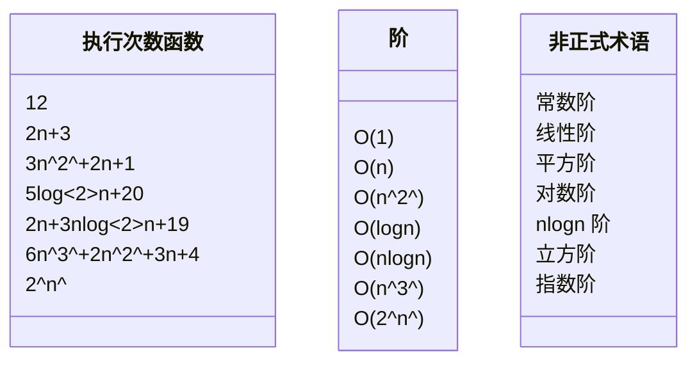

# 算法

## 定义

**<font color="#1565c0">算法是解决特定问题求解步骤的描述，在计算机中表现为指令的有限序列，并且每条指令表示一个或多个操作</font>**

就像高斯的故事那样，对于给定的问题，是可以有多种算法来解决的
算法定义中提到了指令，指令能被人或机器等计算装置执行，它可以是计算机指令，也可以是语言文字
为了解决某个或某类问题，需要把指令表示成一定的操作序列，操作序列包括一组操作，每一个操作都完成特定的功能，这就是算法了

## 算法的特性

算法具有五个基本特性：输入、输出、有穷性、确定性和可行性



### 输入输出

**<font color="#1565c0">算法具有零个或多个输入</font>** ，尽管对于绝大多数算法来说，输入参数都是必要的，但对于个别情况，例如打印 "hello world" 这样的代码，不需要任何输入参数，因此算法的输入参数可以是零个， **<font color="#1565c0">算法至少要有一个或多个输出</font>** ，算法是一定需要输出的，不然就没用了，输出的形式可以是打印输出也可以是返回一个或多个值等

### 有穷性

**<font color="#1565c0">有穷性：指算法在执行有限的步骤之后，自动结束而不会出现无限循环，并且每一个步骤在可接受的时间内完成。</font>** 现实中经常会写出死循环的代码，这就是不满足有穷性，当然这里有穷的概念并不是纯数学意义的，而是在实际应用当中合理的，可以接收的 “有边界” ，要是写一个算法，计算机需要执行上三十年，一定会结束，它在数学意义上是有穷了，可现实中就废了，算法的意义也不大了

### 确定性

**<font color="#1565c0">确定性：算法的每一步骤都具有确定性的含义，不会出现二义性。</font>** 算法在一定条件下，只有一条执行路径，相同的输入只能有唯一的输出结果，算法的每个步骤被精确定义而无歧义

### 可行性

**<font color="#1565c0">可行性：算法的每一步都必须是可行的，也就是说，每一步都能够通过执行有限次数完成。</font>** 可行性意味着算法可以转换为程序上机运行，并得到正确的结果

## 算法设计的要求

算法不是唯一的，也就是说，同一个问题，可以有多种解决问题的算法，虽然没有标准答案，尽管算法也不唯一，但相对好的算法还是存在的，掌握好的算法，对解决问题很有帮助，否则前人的智慧不能利用，就得自己从头研究了

### 正确性

**<font color="#1565c0">正确性：算法的正确性是指算法至少应该具有输入、输出和加工处理无歧义性，能正确反映问题的需求，能够得到问题的正确答案。</font>**

但是算法的 “正确” 通常在用法上有很大差异，大体分为以下四个层次

1. 算法程序没有语法错误
2. 算法程序对于合法的输入数据能够产生满足需求的输出结果
3. 算法程序对于非法的输入数据能够得出满足规格说明的结果
4. 算法程序对于精心选择的，甚至刁难的测试数据都有满足需求的输出结果

对于这四层的含义，层次 1 要求最低，但是仅仅没有语法错误实在谈不上是好算法，这就如同仅仅解决温饱，不能算是生活幸福一样，而层次 4 是最困难的，几乎不可能逐一验证所有的输入都得到正确的结果

因此算法的正确性在大部分情况下都不可能用程序来证明，而是用数学方法证明的，证明一个复杂算法在所有层次上都是正确的，代价非常高，所以一般情况下，把层次 3 作为一个算法是否正确的标准

### 可读性

**<font color="#1565c0">可读性：算法设计的另一目的就是为了便于阅读、理解和交流</font>**

可读性高有助于人们理解算法，晦涩难懂的算法往往隐含错误，不易被发现，并且难于调试和修改

写代码的目的，一方面是为了让计算机执行，还有一个重要的目的就是为了便于他人阅读，让人理解和交流，自己将来也可能阅读，如果可读性不好，时间长了自己都不知道写了什么，可读性是算法（也包括实现它的代码）好坏很重要的标志

### 健壮性

一个好的算法还应该能对输入数据不合法的情况做适当的处理，比如输入的时间或距离不应该是负数等

**<font color="#1565c0">健壮性：当输入数据不合法时，算法也能做出相关处理，而不是产生异常或莫名其妙的结果</font>**

### 时间效率高和存储量低

好的算法还应该具备时间效率高和存储量低的特点

时间效率指的是算法的执行时间，对于同一个问题，如果有多个算法能够解决，最大执行时间越短的算法效率越高，存储量需求指的是算法在执行过程中需要的最大存储空间，主要指算法程序运行时所占用的内存或外部硬盘存储空间， **<font color="#1565c0">设计算法应该尽量满足时间效率高和存储量低的需求</font>** 。在生活中，都希望花最少的钱，用最短的时间，办最大的事，算法也是一样的思想，能用最少的存储空间，花最少的时间，办同样的事就是好算法。比如，求 100 个人的高考成绩平均分，与求全省的所有考生的成绩平均分在占用时间和内存存储上是有非常大的差异的，自然就是追求可以高效率和低存储量的算法来解决问题

综上，好的算法，应该具有正确性、可读性、健壮性、高效率和低存储量的特征

## 算法效率的度量方法

正所谓 “是骡子是马，拉出来溜溜”，比较容易想到的方法就是，通过对算法的数据测试，利用计算机的计时功能，来计算不同算法的效率是高还是低

### 事后统计方法

**<font color="#1565c0">事后统计法：这种方法主要是通过设计好的测试程序和数据，利用计算机计时器对不同的算法编制的程序的运行时间进行比较，从而确定算法效率的高低</font>**

但这总方法显然是有很大缺陷的：

- 必须依据算法事先编制好程序，这通常需要花费大量的时间和精力，如果编制出来发现它根本就是很糟糕的算法，不是竹篮打水一场空吗？
- 时间的比较依赖计算机硬件和软件等环境因素，有时会覆盖算法本身的优劣。要知道，现在一台四核处理器的计算机，跟当年 老爷辈的计算机相比，在处理算法的运算速度上，是不能相提并论的；所用的操作系统、编译器、运行框架等软件的不同，也可能影响它们的结果；就算是同一台机器，CPU 使用效率和内存占用情况不一样，也会造成细微的差异
- 算法的测试数据设计困难，并且程序的运行时间往往还与测试数据的规模有很大关系，效率高的算法在小的测试数据面前往往得不到体现，比如 10 个数字的排序，不管用什么算法，差异几乎是零，而如果有一百万个随机数字排序，那不同算法的差异就非常大了，而随机的散乱程度有好有坏，会使得算法比较变得不够客观，那么为了比较算法，到底用多少数据来测试？测试多少次才算可以？这是很难判断的问题

基于事后统计方法有这样那样的缺陷，考虑不予采纳

### 事前分析估算方法

**<font color="#1565c0">事前分析估算方法：在计算机程序编制前，依据统计方法对算法进行估算</font>**

经过分析，一个用高级程序语言编写的程序在计算机上运行时所消耗的时间取决于下列因素：



（1）当然是算法好坏的根本，（2）要由软件来支持，（4）要看硬件性能。也就是说，抛开这些计算机硬件、软件有关的因素， **<font color="#1565c0">一个程序的运行时间，依赖于算法的好坏和问题的输入规模，所谓问题的输入规模是指，输入量的多少</font>**

比如：

第一种算法

```javascript
let i,
  sum = 0,
  n = 100; // 执行 1 次
for (i = 1; i <= n; i++) {
  // 执行 n + 1 次
  sum = sum + i; // 执行 n 次
}
console.log(sum); // 执行 1 次
```

第二种算法

```javascript
let sum = 0,
  n = 100; // 执行 1 次
sum = ((1 + n) * n) / 2; // 执行 1 次
console.log(sum); //执行 1 次
```

显然，第一种算法，执行了 1 + (n+1) + n + 1 = 2n + 3 次；而第二种算法，是 1 + 1 + 1 = 3 次

事实上两个算法的第一条和最后一条语句是一样的，所以我们关注的代码其实是中间的部分，我们把循环看作一个整体，忽略头尾循环判断的开销，那么这两个算法歧视就是 n 次与 1 次的差距，算法好坏显而易见；

再延伸一下上面的例子

```javascript
let i,
  j,
  x = 0,
  sum = 0,
  n = 100; //执行 1 次
for (i = 1; i <= n; i++) {
  for (j = 1; j <= n; j++) {
    x++;
    sum = sum + x; //执行了 n*n 次
  }
}
console.log(sum); // 执行了 1 次
```

在这个例子中，i 从 1 到 100，每次都要让 j 循环 100 次，而当中的 x++ 和 sum = sum + x; 其实就是 1+2+3+...+10000,也就是 100² 次，所以这个算法当中，循环部分的代码整体需要执行 n² （忽略循环体头尾的开销）次，显然这个算法的执行次数对于同样的输入规模 n = 100，要多于前面两种算法，这个算法的执行时间随着 n 的增加也将远远多余前面两个

此时可以看到，测定运行时间最可靠的方法就是计算对运行时间有消耗的基本操作的执行次数，运行时间与这个计数成正比

我们不关心编写程序所用的程序设计语言是什么，也不关心这些程序跑在什么样的计算机中，我们只关心它所实现的算法。这样，不计那些循环索引的递增和循环终止条件，变量声明，打印结果等操作， **<font color="#1565c0">最终，在分析程序的运行时间时，最重要的是把程序看成是独立于程序设计语言的算法或一些列步骤</font>**

可以从问题描述中得到启示，同样问题的输入规模是 n ，求和算法的第一种，求 1+2+...+n 需要一段代码运行 n 次，那么这个问题的输入规模使得操作数量是 f(n) = n，显然运行 100 次的同一段代码规模是运算 10 次的 10 倍，而第二种，无论 n 为多少，运行次数都为 1，即 f(n) = 1；第三种，运算 100 次是运算 10 次的 100 倍，因为他是 f(n) = n²

在分析一个算法的运行时间时，重要的是把基本操作的数量与输入规模关联起来，即基本操作的数量必须表示成输入规模的函数

可以这样认为，随着 n 值的越来越大，它们在时间效率上的差异也就越来越大

## 函数的渐进增长

判断一下以下两个算法 A 和 B 哪个更好，假设两个算法的输入规模都是 n ，算法 A 要做 2n+3 次操作，可以理解为先有一个 n 次循环，执行完成后，再有一个 n 次循环，最后有三次赋值或者运算，共 2n+3 次操作，算法 B 要做 3n+1 次操作，你觉得谁更快
答案是不一定的



当 n = 1 时，算法 A 的效率不如算法 B （次数比算法 B 要多一些），而当 n = 2 时，两者效率相同，当 n > 2 时，算法 A 就开始优于算法 B 了，随着 n 的增加，算法 A 比算法 B 越来越好了（执行次数比 B 要少）。于是可以得出，算法 A 总体上要好过算法 B

此时我们给出这样的定义，输入规模 n 在没有限制的情况下，只要超过一个数值 N ，这个函数就总是大于另一个函数，我们称函数是渐近增长的

**<font color="#1565c0">函数的渐近增长：给定两个函数 f(n) 和 g(n) ，如果存在一个整数 N ，使得对于所有的 n>N ， f(n) 总是比 g(n) 大，那么，我们说 f(n) 的增长渐近快于 g(n)</font>**

从中可以发现，随着 n 的增大，后面的 +3 还是 +1 其实是不影响最终的算法变化的，例如算法 A’ 与算法 B’，所以， **<font color="#1565c0">我们可以忽略这些加法常数。</font>**

再看第二个例子，算法 C 是 4n + 8，算法 D 是 2n² + 1



当 n <= 3 的时候，算法 C 要差于算法 D （因为算法 C 次数比较多），但当 n>3 后，算法 C 就越来越优于算法 D 了，到后来更是远远胜过，而当后面的常数去掉后，我们发现其实结果没有发生改变，甚至再观察发现，哪怕去掉与 n 相乘的常数，这样的结果也没发生改变，算法 Cn 的次数随着 n 的增长，还是远小于算法 Dn 平方 。也就是说， **<font color="#1565c0">与最高次项相乘的常数并不重要。</font>**

再看第三个例子。算法 E 是 2n²+3n+1，算法 F 是 2n³+3n+1



当 n = 1 的时候，算法 E 与算法 F 结果相同，但当 n > 1 后，算法 E 的优势就要开始优于算法 F，随着 n 的增大，差异越来越明显，通过观察发现， **<font color="#1565c0">最高次项的指数越大，函数随着 n 的增长，结果也会增长更快</font>**

再看最后一个例子，算法 G 是 2n²，算法 H 是 3n + 1，算法 I 是 2n²+3n+1



这组数据应该就能看的很清楚。当 n 的值越来越大时，就会发现，3n+1 已经没法和 2n² 的结果相比较，最终几乎可以忽略不计，也就是说，随着 n 值变得非常大以后，算法 G 其实已经很趋近于算法 I 。于是就可以得到这样一个结论。 **<font color="#1565c0">判断一个算法的效率时，函数中的常数和其他次要项常常可以忽略，而更应该关注主项（最高阶项）的阶数</font>**

判断一个算法好不好，只通过少量的数据是不能做出准确判断的。根据刚才的几个样例，可以发现，如果可以对比这几个算法的关键执行次数函数的渐近增长性，基本就可以分析出： **<font color="#1565c0">某个算法，随着 n 的增大，它会越来越优于另一个算法，或者越来越差于另一算法。</font>** 这其实就是事前估算方法的理论依据，通过算法时间复杂度来估算算法时间效率

## 算法时间复杂度

### 算法时间复杂度定义

**<font color="#1565c0">在进行算法分析时，语句总的执行次数 T(n) 是关于问题规模 n 的函数，进而分析 T(n) 随 n 的变化情况并确定 T(n) 的数量级，算法的时间复杂度，也就是算法的时间量度，记作 T(n) = O(f(n)) ，它表示随问题规模 n 的增大，算法执行时间的增长率和 f(n) 的增长率相同，称作算法的渐近时间复杂度，简称为时间复杂度。其中 f(n) 是时间规模 n 的某个函数</font>**

这样用大写 O() 来体现算法时间复杂度的记法，我们称之为 **<font color="#1565c0">大 O 记法</font>**

一般情况下，随着 n 的增大，T(n) 增长最慢的算法为最优算法

显然，由此算法时间复杂度的定义可知，之前的三个求和算法的时间复杂度分别为 O(n),O(1),O(n2)。这里分别给他们取了非官方的名称，O(1) 叫常数阶、O(n) 叫线性阶、O(n²) 叫平方阶

### 推导大 O 阶的方法

如何分析一个算法的时间复杂度？即如何推导大 O 阶？如下的推导方法，基本上，就是总结了之前的例子

推导大 O 阶

1. 用常数 1 取代运行时间中的所有加法常数
2. 在修改后的运行次数函数中，只保留最高阶项
3. 如果最高阶项存在且其系数不是 1，则去除这个项相乘的系数

得到的结果就是大 O 阶
再看几个例子

### 常数阶级

首先介绍顺序结构的时间复杂度，下面这个算法也就是刚才提到的第二种算法（高斯算法），为什么时间复杂度不是 O(3)，而是 O(1)

```javascript
let sum = 0,
  n = 100; // 执行一次
sum = ((1 + n) * n) / 2; // 执行一次
console.log(sum); // 执行一次
```

这个算法的运行次数函数是 f(n) = 3。根据我们推导大 O 阶的方法，第一步就是把常数项 3 改为 1，在保留最高阶项时发现，它根本没有最高阶项，所以这个算法的时间复杂度为 O(1)

另外，我们试想一下，如果这个算法当中的语句 sum= (1+n)\*n/2 有 10 句，即：

```javascript
let sum = 0,
  n = 100; // 执行1次
sum = ((1 + n) * n) / 2; //执行第1次
sum = ((1 + n) * n) / 2; //执行第2次
sum = ((1 + n) * n) / 2; //执行第3次
sum = ((1 + n) * n) / 2; //执行第4次
sum = ((1 + n) * n) / 2; //执行第5次
sum = ((1 + n) * n) / 2; //执行第6次
sum = ((1 + n) * n) / 2; //执行第7次
sum = ((1 + n) * n) / 2; //执行第8次
sum = ((1 + n) * n) / 2; //执行第9次
sum = ((1 + n) * n) / 2; //执行第10次
console.log(sum); // 执行1次
```

事实上无论 n 为多少，上面的两段代码就是 3 次和 12 次执行的差异。这种与问题的大小（n 的大小）无关，执行时间恒定的算法，我们称之为具有 O(1) 的时间复杂度，又叫常数阶

**<font color="#1565c0">注意：不管这个常数是多少，都记作 O(1) ，而不是 O(3)、O(2)等其他任何数字，这是初学者常常犯的错误。</font>**

对于分支结构而言，无论是真，还是假，执行的次数都是恒定的，不会随着 n 的变大而发生变化，所以单纯的分支结构（不包含在循环结构中），其时间复杂度也是 O(1)

### 线性阶

线性阶的循环结构会复杂很多，要确定某个算法的阶次，常常需要确定某个特定语句或某个语句集运行的次数，因此，我们要 **<font color="#1565c0">分析算法的复杂度，关键就是要分析循环结构的运行情况。</font>**

下面这段代码，它的循环的时间复杂度为 O(n) 因为循环体中的代码需要执行 n 次

```javascript
let i;
for (i = 0; i < n; i++) {
  //时间复杂度为 O(1)的程序步骤序列
}
```

### 对数阶

下面这段代码的时间复杂度又是多少呢？

```javascript
let count = 1;
while (count < n) {
  count = count * 2;
  //时间复杂度为 O(1) 的程度步骤序列
}
```

由于每次 count 乘以 2 之后，就距离 n 更近了一分，也就是说，有多少个 2 相乘后大于 n ，则会退出循环，由 2^x = n 得到 x = logn（底数为 2），所以这个循环的时间复杂度为 O(logn)

### 平方阶

下面例子是一个循环嵌套，它的内循环刚才已经分析过，时间复杂度为 O(n)

```javascript
let i, j;
for (i = 0; i < n; i++) {
  for (j = 0; j < n; j++) {
    //时间复杂度为 O(1) 的程序步骤序列
  }
}
```

而对于外层的循环，不过是内部这个时间复杂度为 O(n) 的语句，再循环 n 次，所以这段代码的时间复杂度为 O(n²)

如果外循环的循环次数改为了 m ，时间复杂度就变为了 O(m\*n)

```javascript
let i, j;
for (i = 0; i < m; i++) {
  for (j = 0; j < n; j++) {
    //时间复杂度为 O(1) 的程序步骤序列
  }
}
```

所以可以总结得出，循环的时间复杂度等于循环体的复杂度乘以该循环运行的次数，那么下面这个循环嵌套，它的时间复杂度是多少呢？

```javascript
let i, j;
for (i = 0; i < n; i++) {
  for (j = i; j < n; j++) {
    //注意 j = i 而不是 0
    //时间复杂度为 O(1) 的程序步骤序列
  }
}
```

由于当 i = 0 时，内循环执行了 n 次，当 i = 1 时，执行了 n-1 次，当 i = n-1 时，执行了 1 次，所以总的执行次数为：

n + (n-1) + (n-2) + ... + 1 = n(n+1)/2 = n²/2 + n/2

用推导大 O 阶的方法，第一条，没有加法常数不予考虑；第二条，只保留最高阶项，因此保留 n²/2；第三条，去除这个项相乘的常数，也就是去除 1/2 ，最终这段代码的时间复杂度为 O(n²)

从这个例子，可以得到一个经验，其实 **<font color="#1565c0">理解大 O 阶推导并不算难，难的是对数列的一些相关运算，这更多的是考察数学知识的能力</font>**

继续看例子，对于方法调用的时间复杂度如何分析

```javascript
let i, j;
for (i = 0; i < n; i++) {
  f1(i);
}
```

上面这段代码调用了一个函数 f1()

```javascript
function f1(count) {
  console.log(count);
}
```

函数体是打印 count 这个参数，其实这很好理解 f1() 函数的时间复杂度是 O(1)，所以整体的时间复杂度是 O(n)

假如 f1() 是下面这样的：

```javascript
function f1(count) {
  let j;
  for (j = count; ja, n; j++) {
    // 时间复杂度为 O(1) 的程序步骤序列
  }
}
```

事实上，这和刚才举的例子是一样的，只是因为把嵌套内循环放到了函数中，所以最终的时间复杂度为 O(n²)

下面这段相对复杂的语句：

```javascript
n++; // 执行次数为 1
f1(n); // 执行次数为 n
let i, j;
for (i = 0; i < n; i++) {
  // 执行次数为 n*n
  f1(i);
}
for (i = 0; i < n; i++) {
  //执行次数为 n(n+1)/2
  for (j = i; j < n; j++) {
    //时间复杂度为 O(1) 的程序步骤序列
  }
}
```

它的执行次数 f(n) = 1 + n + n² + n(n+1)/2 = 3n²/2 + 3n/2 + 1 ，根据推导大O阶的方法，最终这段代码的时间复杂度也是 O(n²)

## 常见的时间复杂度



常用的时间复杂度所耗费的时间从小到大依次是：

**<font color="#1565c0">O(1) < O(logn) < O(n) < O(nlogn) < O(n²) < O(n³) < O(2^n^) < O(n!) < O(n^n^)</font>**

前面已经谈到了 O(1) 常数阶、O(logn) 对数阶、O(n) 线性阶、O(n^2^) 平方阶等，像 O(n^2^)，过大的 n 都会使得结果变得不现实，同样指数阶 O(2^n^) 和阶乘阶 O(n!) 等除非是很小的 n 值，否则哪怕 n 只有 100 ，都是非常恐怖的运行时间，所以这种不切实际的算法时间复杂度，一般不会讨论涉及

## 最坏情况与平均情况

当你早晨上班出门后突然想起来，手机忘记带了，这年头，钥匙、手机两大件，出门哪件也不能少。于是回家找，打开门一看，手机就在门口玄关的台子上，原来是出门穿鞋时忘记拿了，这当然是比较好，基本没花什么时间寻找，可如果不在那里，你就得进去到处找，找完客厅找卧室，找完卧室找厨房，找完厨房找卫生间，就是找不到，时间一分一秒地过去，你突然想起来，可以用家里座机打一下手机，循着手机铃声来找，真实笨，终于找到了，在床上枕头下面，你再去上班，迟到，靠，这一年的全勤奖，就因为找手机给黄了

找东西有运气好的时候，也有怎么也找不着的时候，但在现实中，通常既不会最好也不会最坏，所以算下来是平均情况居多

算法的分析也是类似，我们查找一个有 n 个随机数字数组中的某个数字，最好的情况是第一个数字就是，那算法时间复杂度就是 O(1) ，但也有可能这个数字在最后一个位置，那么算法的时间复杂度就是 O(n)，这就是最坏的情况了

最坏情况运行时间时一种保证，那就是运行时间不会再慢了，在应用中，这是一种最重要的需求，通常，除非特别指定，我们提到的运行时间都是最坏情况的运行时间

而平均运行时间也就是从概率的角度来看，这个数字在每一个位置的可能性都是相同的，所以平均的查找时间为 (n+1)/2 次后发现这个目标元素

**<font color="#1565c0">平均运行时间是所有情况中最有意义的，因为它是期望的运行时间</font>** 。也就是说，我们运行一段程序代码时，是希望看到平均时间的，可现实中，平均运行时间很难通过分析得到，一般都是通过运行一定数量的实验数据估算出来的

对算法的分析，一种方法是计算所有情况的平均值，这种时间复杂度的计算方法称为平均时间复杂度，另一种方法是计算最坏情况下的时间复杂度，这种方法称为最坏时间复杂度。 **<font color="#1565c0">一般在没有特殊说明的情况下，都是指最坏时间复杂度</font>**


## 算法空间复杂度

我们在写代码时，完全可以用空间来换取时间，比如说，要判断某某年是不是闰年，你可能会花一点心思写了一个算法，而且由于是一个算法，也就意味着，每次给一个年份，都是要通过计算得到是否是闰年的结果。还有另一个办法就是，事先建立一个有2050个元素的数组（年数略比现实多一点），然后把所有的年份按下标的数字对应，如果是闰年，此数组项的值就是1，如果不是则值为0。这样，所谓的判断某一年是否是闰年，就变成了查找这个数组的某一项的值是多少的问题。此时，我们的运算是最小化了，但是硬盘上或者内存中需要存储这2050个0或1的数字

这是以存储空间来换取计算时间的小技巧。到底哪一个好，其实要看你用在什么地方

算法的空间复杂度通过计算算法所需的存储空间实现，算法空间复杂度的计算公式记作：S(n)=O(f(n))，其中，n为问题的规模，fn)为语句关于n所占存储空间的函数

一般情况下，一个程序在机器上执行时，除了需要存储程序本身的指令、常数、变量和输入数据外，还需要存储对数据操作的存储单元。若输入数据所占空间只取决于问题本身，和算法无关，这样只需要分析该算法在实现时所需的辅助单元即可。若算法执行时所需的辅助空间相对于输入数据量而言是个常数，则称此算法为原地工作，空间复杂度为0(1)

通常，我们都使用“时间复杂度”来指运行时间的需求，使用“空间复杂度”指空间需求。当不用限定词地使用“复杂度”时，通常都是指时间复杂度

## 总结

算法的定义：算法是解决特定问题求解步骤的描述，在计算机中为指令的有限序列，并且每条指令表示一个或多个操作

算法的特性： 有穷性、确定性、可行性、输入、输出

算法的设计的要求：正确性、可读性、健壮性、高效率和低存储量需求
算法特性与算法设计容易混，需要对比记忆

算法的度量方法：事后统计方法（不科学、不准确）、事前分析估算方法
在说明如何用事前分析估算方法之前，先给出了函数渐近增长的定义

函数渐近增长：给定两个函数 f(n) 和 g(n)，如果存在一个整数 N ，使得对于所有的 n > N ，f(n) 总是比 g(n) 大，那么，就说 f(n) 的增长渐近快于 g(n)，于是可以得出一个结论，判断一个算法好不好，只通过少量的数据是不能做出准确判断的，如果可以对比算法的关键执行次数函数的渐进增长性，基本就可以分析出：某个算法，随着 n 的变大，它会越来越优于另一算法，或者越来越差于另一算法
然后给出了算法时间复杂度的定义和推导大O阶的步骤

推导大O阶：
1. 用常数1取代运行时间中的所有加法常数
2. 在修改后的运行次数函数中，只保留最高阶项
3. 如果最高阶项存在且其系数不是1，则去除这个与项相乘的系数

得到的结果就是大O阶
通过这些步骤，可以再得到算法的运行次数表达式后，很快得到它的时间复杂度，即大O阶。其实推导大O阶很容易，但如何得到运行次数的表达式却是需要数学功底的

接着给出了常见的时间复杂度所耗时间的大小排列：

**<font color="#1565c0">O(1) < O(logn) < O(n) < O(nlogn) < O(n^2^) < O(n^3^) < O(2^n^) < O(n!) < O(n^n^)</font>**

最后，得到了关于算法最坏情况和平均情况的概念，以及空间复杂度的概念