# 线性表

## 线性表的定义

**<font color="#1565c0">线性表（List）：零个或多个数据元素的有限序列</font>**

首先它是一个序列，也就是说，元素之间是有顺序的，若元素存在多个，则第一个元素无前驱，最后一个元素无后驱，其他每一个元素都有且只有一个前驱和后驱

然后，线性表强调是有限的，事实上，计算机中处理的对象都是有限的，那种无限的数列，只存在于数学模型

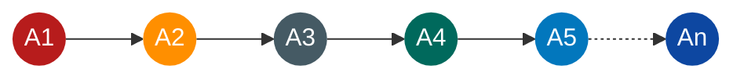

A2 为 A3 **<font color="#1565c0">的直接前驱元素</font>** ，A2 为 A1 的 **<font color="#1565c0">直接后继元素</font>**

线性表元素的个数 n (n >= 0) 定义为 **<font color="#1565c0">线性表的长度</font>** ，当 n = 0 时，称为 **<font color="#1565c0">空表</font>**

在非空表中的每个数据元素都有一个确定的位置，如 A1 是第一个数据元素，An 是最后一个数据元素，Ai 是第 i 个数据元素，称 i 为数据元素 Ai 在线性表中的 **<font color="#1565c0">位序</font>**

举个例子，一些数据集，判断一下是否是线性表

一年里的星座列表，算不算线性表呢，如下图：


当然算，星座通常都是用白羊座打头，双鱼座收尾，当中的星座都有前驱和后继，而且一共也只有 12 个，所以它完全符合线性表的定义

**<font color="#1565c0">在较为复杂的线性表中，一个数据元素可以由若干个数据项组成</font>** ，如图：

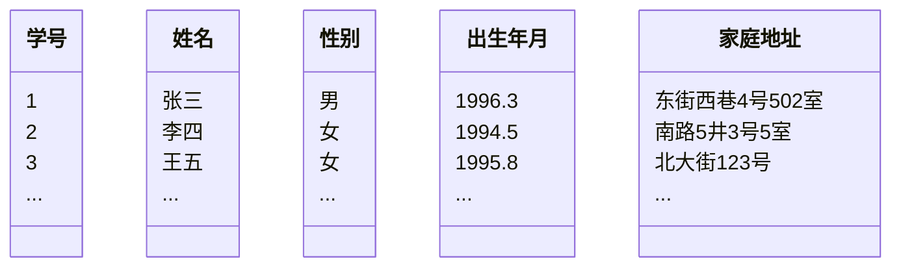

## 线性表的抽象数据类型 ADT

比如，老师为了让小朋友有秩序地出入，所以就考虑给他们排一个队，并且是长期使用的顺序，这个考虑和安排的过程其实就是一个线性表的 **<font color="#1565c0">创建和初始化</font>** 的过程

一开始没经验，把小朋友排好队后，发现有的高有的矮，队伍不好看，于是就让小朋友解散重新排————这是一个线性表 **<font color="#1565c0">重置为空</font>** 的操作

排好了队，随时可以叫出队伍某一位置的小朋友名字及他的具体情况。比如有家长问，队伍里的第五个孩子，怎么这么调皮，他叫什么名字啊，老师可以很快告诉这位家长，这就是万叶的儿子，叫千叶，我在旁边就非常扭捏，看来是我给儿子的名字没取好，儿子让班级脚趾扣地了，这种可以 **<font color="#1565c0">根据位序得到数据元素</font>** 也是一种很重要的线性表操作

还有什么呢？有时我们想知道，某个小朋友，比如可莉是否是班里的小朋友，老师会告诉我说，不是，可莉在蒲公英幼儿园里，不在我们幼儿园。这种 **<font color="#1565c0">查找某个元素是否存在</font>** 的操作很常用

而后有家长问老师，班里现在到底有多少个小朋友呀，这种获得 **<font color="#1565c0">线性表长度</font>** 的问题也很普遍

显然，对于一个幼儿园来说，加入一个新的小朋友到队列中，或因某个小朋友生病，需要移除某个位置，都是很正常的情况。对于一个线性表来说， **<font color="#1565c0">插入数据和删除数据</font>** 都是必须的操作

所以，线性表的抽象数据类型定义如下：

ADT 线性表（List)
Data
线性表的数据对象集合为（A1，A2，……，An)，每个元素的类型均为 DataType。其中，除第一个元素 A1 外，每一个元素有且只有一个直接前驱元素，除了最后一个元素 An 外，每一个元素有且只有一个直接后继元素。数据元素之间的关系是一对一的关系。

```
Operation
InitList(L）：初始化操作，建立一个空的线性表工
ListEmpty(L)：若线性表为空，返回true，否则返回falseo
ClearList(L）：将线性表清空
GetElem（L，1，e）：将线性表工中的第个位置元素值返回给e
locateElem（L，e)：在线性表工中查找与给定值e相等的元素，如果查找成功，返回
该元素在表中序号表示成功；否则，返回0表示失败
Listinsert(L，i,e）：在线性表工中的第个位置插入新元素e
ListDelete(L，i，e)：删除线性表工中第主个位置元素，并用e返回其值
ListLength(L）：返回线性表工的元素个数
```

## 线性表的顺序存储结构

### 顺序存储的定义

**<font color="#1565c0">线性表的顺序存储结构，指的是用一段地址连续的存储单元依次存储线性表的数据元素</font>**

线性表（A1,A2,...,An） 的顺序存储结构如下：

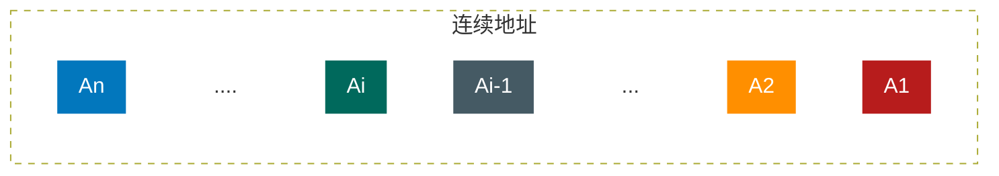

### 顺序存储方式

比如，在大学时，某宿舍有一个同学，人特别老实、热心，时常会帮舍友去图书馆占座，一个宿舍连他共有九个人。他每次一吃完早饭就冲去图书馆，挑一个好地儿，把他书包里的书，一本一本地按座位放好，若书包里的书不够，他会把他的饭盒、水杯、水笔都用上，长长一排，九个座硬是被他占了

线性表的顺序存储结构，和上面例子一样，就是在内存中找了块地儿，通过占位的形式，把一定内存空间给占了，然后把相同数据类型的数据元素依次存放在这块空地中。既然线性表的每个数据元素的类型都相同，所以可以用 **<font color="#1565c0">一维数组来实现顺序存储结构</font>** ，即把第一个数据元素存到数组下标为 0 的位置中，接着把线性表相邻的元素存储在数组中相邻的位置

那同学占座时，如果图书馆里空座很多，他当然不必一定要选择第一排第一个位子，而是可以选择环境好的地儿。找到后，放一个书包在第一个位置，就表示从这开始，这地方暂时归我了。为了建立一个线性表，要在内存中找一块地，于是这块地的第一个位置就非常关键，它是 **<font color="#1565c0">存储空间的起始位置</font>**

接着，因为一共九个人，所以他需要占九个座。线性表中，我们估算这个线性表的最大存储容量，建立一个数组，数组的长度就是这个 **<font color="#1565c0">最大存储容量</font>**

可现实中，宿舍总有那么几个不是很好学的人，为了游戏，为了恋爱，就不去图书馆自习了。假设有九个人，去了六个，真正被使用的座位也就只是六个，另三个是空的。同样地，已经有了起始的位置，也有了最大的容量，于是我们可以在里面增加数据了。随着数据的插入，我们线性表的长度开始变大，不过线性表的当前长度不能超过 **<font color="#1565c0">存储容量</font>** ，即数组的长度。想想也是，如果我们有十个人，只有九个座，自然是坐不下的

到现在为止，发现描述顺序存储结构需要三个属性：

- 存储空间的起始位置：如数组的存储位置就是存储空间的存储位置
- 线性表的最大存储容量：如数组最大长度
- 线性表的当前长度

### 数组长度与线性表长度的区别

这里有两个概念“数组的长度”和“线性表的长度”需要区分一下

数组的长度是存放线性表的存储空间的长度，存储分配后这个量一般是不变的。有人可能会问，数组的大小一定不可以变吗？我怎么看到有书中谈到可以动态分配的一维数组。是的，一般高级语言，比如 C、VB、C++都可以用编程手段实现动态分配数组，不过这会带来性能上的损耗

线性表的长度是线性表中数据元素的个数， **<font color="#1565c0">随着线性表插入和删除操作</font>** 的进行，这个量是 **<font color="#1565c0">变化</font>** 的

在任意时刻，线性表的长度应该 **<font color="#1565c0">小于等于数组的长度</font>**

### 地址计算方法

由于我们数数都是从 1 开始数的，线性表的定义也不能免俗，起始也是 1，可不管是 C 还是 JS 等语言中的数组却是从 0 开始第一个下标的，于是线性表的第 i 个元素是要存储在数组下标为 i -1 的位置，即数据元素的序号和存放它的数组下标之间存在对应关系

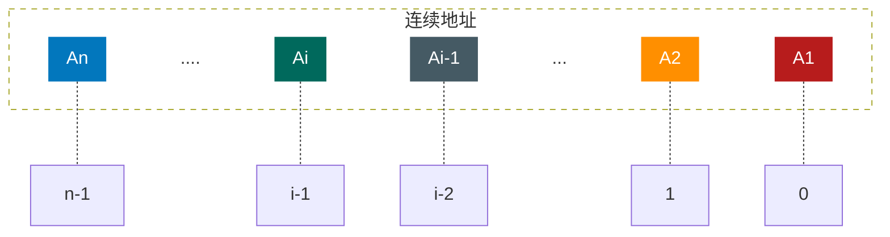

用数组存储顺序表意味着要分配固定长度的数组空间，由于线性表中可以进行插入和删除操作，因此分配的数组空间要大于等于当前线性表的长度

其实，内存中的地址，就和图书馆或电影院里的座位一样，都是有编号的。 **<font color="#1565c0">存储器中的每个存储单元都有自己的编号，这个编号称为地址</font>** 。当我们占座后，占座的第一个位置确定后，后面的位置都是可以计算的。试想一下，我是班级成绩第五名，我后面的 10 名同学成绩名次是多少呢？当然是 6，7，…，15，由于每个数据元素，不管它是整型、实型还是字符型，它都是需要占用一定的存储单元空间的。假设每个数据元素占用的是 c 个存储单元，那么线性表中第 i+1 个数据元素的存储位置和第 i 个数据元素的存储位置满足下列关系（LOC 表示获得存储位置的函数）

**<font color="#1565c0">LOC(A~i+1~) = LOC(A~i~) + c</font>**

所以对于第 i 个数据元素 A~i~，的存储位置可以由 A~1~，推算得出：

**<font color="#1565c0">LOC(A~i~) = LOC(A~1~) + (i-1) \* c</font>**

通过这个公式，你可以随时算出线性表中任意位置的地址，不管它是第一个还是最后一个，都是相同的时间。那么我们对每个线性表位置的存入或者取出数据，对于计算机来说都是相等的时间，也就是一个常数，因此用算法中学到的时间复杂度的概念来说，它的存取时间性能为 O(1)。我们通常把具有这一特点的存储结构称为 **<font color="#1565c0">随机存取结构</font>**

## 顺序存储结构的插入与删除

### 获取元素操作

对于线性表的顺序存储结构来说，如果我们要实现 GetElem 操作，即将线性表 L 中的第 i 个位置元素值返回，其实是非常简单的。就程序而言，只要 i 的数值在数组下标范围内，就是把数组第 i-1 下标的值返回即可

```typescript
#define OK 1
#define ERROR 0
/*Status是函致的类型，其值是函数结果状态代码，如OK等 */
type Status = OK | ERROR;
/*初始条件：顺序线性表L已存在，1si≤ListLength(L）*/
/*操作结果：用e返回L中第1个数据元素的值，注意i是指位置，第1个位置的数组是从0开始*/
function GetElem(L:Array,i:number,e):Status{
    if(L.length==0 || i <1 || i>=L.length)return Error;
    e=L[i-1];
    return e;
}
```

### 插入操作

刚才我们也谈到，这里的时间复杂度为 O(1)

举个例子，本来我们在春运时去买火车票，大家都排队排得好好的。这时来了一个抱着孩子的年轻妈妈，对着队伍中排在第三位的你说，“大哥，求求你帮帮忙，我家母亲有病，我得急着回去看她，你看我还抱着孩子，这队伍这么长，你可否让我排在你的前面？”你心一软，就同意了。这时，你必须得退后一步，否则她是没法进到队伍里来的。这可不得了，后面的人像蠕虫一样，全部都得退一步。骂声四起。但后面的人也不清楚这加塞是怎么回事，没什么办法

这个例子其实已经说明了线性表的顺序存储结构，在插入数据时的实现思路:

1. 如果插入位置不合理，抛出异常
2. 如果线性表长度大于等于数组长度，则抛出异常或动态增加容量
3. 从最后一个元素开始向前遍历到第 i 个位置，分别将它们都向后移动一个位置
4. 将要插入元素填入位置 i 处
5. 表长加 1

```typescript
/*初始条件：顺序线性表L已存在，1si≤ListLength(L)，*/
/*操作结果：在L中第i个位置之前插入新的数据元素e，L的长度加1*/
function ListInsert(L: Array, i: number, e): Status {
  let k;
  if (L.length == MAXSIZE) return ERROR;
  if (i < 1 || i > L.length + 1) return ERROR;
  if (i <= L.length) {
    for (k = L.length - 1; k >= i - 1; k--) {
      L[k + 1] = L[k];
    }
  }
  L[i - 1] = e;
  L.length++;
  return L;
}
```

### 删除操作

思路：

1. 如果删除位置不合理，抛出异常
2. 取出删除元素
3. 从删除元素位置开始遍历到最后一个元素位置，分别将它们都向前移动一个位置
4. 表长减 1

```javascript
/*初始条件：顺序线性表L已存在，1si≤ListLength(L)，*/
/*操作结果：删除L的第i个数据元素，并用e返回其值，L的长度减1*/
function listDelete(L, i, e) {
  let k;
  if (L.length == 0) return Error;
  if (i < 1 || i > L.length) return Error;
  e = L[i - 1];
  if (i < L.length) {
    for (k = i; k < L.length; k++) {
      L[k - 1] = L[k];
    }
  }
  L.length--;
  return e;
}
```

分析一下，插入和删除的时间复杂度

先看最好的情况，如果元素要插入到或删除最后一个元素，此时时间复杂度为 O(1) ,因为不需要移动元素，就如同来了一个新人要正常排队，当然是排在最后，如果此时他又不想排了，那么他一个人离开就好了，不影响任何人

最坏的情况呢，如果元素要插入到第一个位置或者删除第一个元素，此时时间复杂度是多少呢？这就意味着要移动所有的元素向后或者向前，所以这个时间复杂度为 O(n)

至于平均的情况，由于元素插入到第 i 个位置，或删除第 i 个元素，需要移动 n 一 i 个元素。根据概率原理，每个位置插入或删除元素的可能性是相同的，也就说位置靠前，移动元素多，位置靠后，移动元素少。最终平均移动次数和最中间的那个元素的移动次数相等，为 $$\frac{n-1}{2}$$

算法篇有学过时间复杂度的推导，可以得出，平均时间复杂度还是 O(n)

这说明线性表的顺序存储结构，在读数据时，不管是哪个位置，时间复杂度都是 O(1)；而插入或删除时，时间复杂度都是 O(n)。这就说明，它比较适合元素个数不太变化，而更多是存取数据的应用。当然，它的优缺点还不只这些

### 线性表顺序存储结构的优缺点

**优点** ：

- 无须为表示表中元素之间的逻辑关系而增加额外的存储空间
- 可以快速地存取表中任一位置的元素

**缺点** ：

- 插入和删除操作需要移动大量元素
- 当线性表长度变化较大时，难以确定存储空间的容量
- 造成存储空间的“碎片”

## 线性表的链式存储结构

### 顺序存储结构不足的解决办法

前面线性表的顺序存储结构，最大的缺点就是插入和删除时需要移动大量元素，这显然就需要耗费时间

要解决这个问题，就得考虑一下导致这个问题的原因

为什么当插入和删除时，需要移动大量元素，仔细分析后，发现原因就在于相邻两元素的存储位置也具有邻居关系，它们的编号是 1,2,3，...，n，它们在内存中的位置也是挨着的，中间没有空隙，当然就无法快速插入，而删除后，当中就会留出空隙，自然需要弥补，问题就出在这里

A 同学思路：让当中每个元素之间都留有一个空位置，这样要插入时，就不至于移动。可一个空位置如何解决多个相同位置插入数据的问题呢？所以这个想法显然不行

B 同学思路：那就让当中每个元素之间都留足够多的位置，根据实际情况制定空隙大小，比如 10 个，这样插入时，就不需要移动了。万一 10 个空位用完了，再考虑移动使得每个位置之间都有 10 个空位置。如果删除，就直接删掉，把位置留空即可。这样似乎暂时解决了插入和删除的移动数据问题。可这对于超过 10 个同位置数据的插入，效率上还是存在问题。对于数据的遍历，也会因为空位置太多而造成判断时间上的浪费。而且显然这里空间复杂度还增加了，因为每个元素之间都有若干个空位置

**<font color="#1565c0">C 同学思路</font>** ：我们反正也是要让相邻元素间留有足够余地，那干脆所有的元素都不要考虑相邻位置了，哪有空位就到哪里，而只是让每个元素知道它下一个元素的位置在哪里，这样，我们可以在第一个元素时，就知道第二个元素的位置（内存地址），而找到它；在第二个元素时，再找到第三个元素的位置（内存地址）。这样所有的元素我们就都可以通过遍历而找到

好！太棒了，这个想法非常好！C 同学，你可惜生晚了几十年，不然，你的想法对于数据结构来讲就是划时代的意义。我们要的就是这个思路。

### 线性表链式存储结构定义

线性表的链式存储结构的特点是用一组任意的存储单元存储线性表的数据元素，这组存储单元可以是连续的，也可以是不连续的。这就意味着，这些数据元素 **<font color="#1565c0">可以存在内存未被占用的任意位置</font>**

以前在顺序结构中，每个数据元素只需要存储数据元素信息就可以了。现在链式结构中，除了要存储数据元素信息外，还要存储它的 **<font color="#1565c0">后继元素的存储地址</font>**

因此，为了表示每个数据元素 A,与其直接后继数据元素 A，之间的逻辑关系，对数据元素 A 来说，除了存储其本身的信息之外，还需存储一个指示其直接后继的信息（即直接后继的存储位置）我们把存储数据元素信息的域称为 **<font color="#1565c0">数据域</font>** ，把存储直接后继位置的域称为 **<font color="#1565c0">指针域</font>** 。指针域中存储的信息称作 **<font color="#1565c0">指针或链</font>** 。这两部分信息组成数据元素 A 的 **<font color="#1565c0">存储映像</font>** ，称为 **<font color="#1565c0">结点 (Node）</font>**

**<font color="#1565c0">n 个结点（A~1~的存储映像）链结成一个链表，即为线性表（A~1~,A~2~，...，A~n~）的链式存储结构</font>** ，因为此链表的每个结点中只包含一个指针域，所以叫做单链表。单链表正是通过每个结点的指针域将线性表的数据元素按其逻辑次序链接在一起

对于线性表来说，总得有个头有个尾，链表也不例外。我们把 **<font color="#1565c0">链表中第一个结点的存储位置叫做头指针</font>** ，那么整个链表的存取就必须是从头指针开始进行了。之后的每一个结点，其实就是上一个的后继指针指向的位置。想象一下，最后一个结点，它的指针指向哪里？

最后一个，当然就意味着直接后继不存在了，所以我们规定，线性链表的最后一个结点指针为“空”

有时，我们为了更加方便地对链表进行操作，会在 **<font color="#1565c0">单链表的第一个结点前附设一个结点，称为头结点</font>** 。头结点的数据域可以不存储任何信息，谁叫它是第一个呢，有这个特权。也可以存储如线性表的长度等附加信息，头结点的指针域存储指向第一个结点的指针

### 头指针与头结点的异同

<font color="#1565c0">

头指针：

- 头指针是指链表指向第一个结点的指针，若链表有头结点，则是指向头结点的指针
- 头指针具有标志作用，所以常用头指针冠以链表的名字
- 无论链表是否为空，头指针均不为空。头指针是链表的必要元素

头结点：

- 头结点是为了操作的统一和方便而设立的，放在第一元素的结点之前，其数据域一般无意义（也可存放链表的长度）
- 有了头结点，对在第一元素结点前插入结点和删除第一结点，其操作与其他结点的操作就统一了
- 头结点不一定是链表必需要素
  </font>

## 单链表的读取

在线性表的顺序存储结构中，要计算任意一个元素的存储位置是很容易的，但在单链表中，由于第 i 个元素到底在哪没办法一开始就知道，必须从头开始找，因此，会相对麻烦一些

思路：

1. 声明一个指针 p 指向链表的第一个结点，初始化 j 从 1 开始
2. 当 j < i 时，就遍历链表，让 p 的指针向后移动，不断指向下一结点，j 累加 1
3. 若到链表末尾 p 为空，则说明第 i 个结点不存在
4. 否则查找成功，返回结点 p 的数据

```javascript
function GetElem(L, i, e) {
  let j, p; //声明结点 p
  p = L.next; //让 p 指向链表 L 的第一个结点
  j = 1; //j 为计数器
  while (p && j < i) {
    p = p.next; // 让 p 指向下一个结点
    ++j;
  }
  if (!p || j > i) return new Error("err"); //第 i 个元素不存在
  e = p.data; //取得第 i 个元素的数据
  return e;
}
```

说白了，就是从头开始找，直到第 i 个结点为止。由于这个算法的时间复杂度取决于 i 的位置，当 1 时，则不需遍历，第一个就取出数据了，而当 i 一 n 时则遍历 n-1 次才可以。因此最坏情况的时间复杂度是 0(n)

由于单链表的结构中没有定义表长，所以不能事先知道要循环多少次，因此也就不方便使用 for 来控制循环。其主要核心思想就是“工作指针后移”，这其实也是很多算法的常用技术

## 单链表的插入与删除

### 单链表的插入

假设存储元素 e 的结点为 s，要实现结点 p、p->next 和 s 之间逻辑关系的变化，只需将结点 s 插入到结点 p 和 p->next 之间即可。可如何插入呢

根本用不着惊动其他结点，只需要让 s->next 和 p->next 的指针做一点改变即可

```javascript
s.next = p.next; //将 p 的后继结点赋值给 s 的后继
p.next = s; //将 s 赋值给 p 的后继
```

单链表第 i 个数据插入结点的算法思路：

1. 声明一指针 p 指向链表头结点，初始化 j 从 1 开始
2. 当 j < i 时，就遍历链表，让 p 的指针向后移动，不断指向下一结点，j 累加 1
3. 若到链表末尾 p 为空，则说明第 i 个结点不存在
4. 否则查找成功，在系统中生成一个空节点 s
5. 将数据元素 e 赋值到 s.data
6. 单链表的插入标准语句 s.next = p.next; p.next = s
7. 返回成功数据

```javascript
function ListInsert(L, i, e) {
  let j, p, s;
  p = L;
  j = 1;
  while (p ** j < i) {
    p = p.next;
    ++j;
  }
  if (!p || j > i) return new Error("err");
  s.data = e;
  s.next = p.next;
  p.next = s;
  return L;
}
```

### 单链表的删除

其实就是将要删除的链表结点的前驱结点的指针绕过，指向它的后继结点即可

要做的实际上就两步

```javascript
q = p.next;
p.next = q.next;
```

算法思路：

1. 声明一指针 p 指向链表头结点，初始化 j 从 1 开始
2. 当水时，就遍历链表，让 p 的指针向后移动，不断指向下一个结点，j 累加 1
3. 若到链表末尾 p 为空，则说明第 i 个结点不存在
4. 否则查找成功，将欲删除的结点 p.next 赋值给 q
5. 单链表的删除标准语句 p.next=q.next
6. 将 q 结点中的数据赋值给 e，作为返回
7. 释放 q 结点
8. 返回成功

```javascript
function ListDelete(L, i, e) {
  let j, p, q;
  p = L;
  j = 1;
  while (p.next && j < i) {
    p = p.next;
    ++j;
  }
  if (!p.next || j > i) return new Error("err");
  q = p.next;
  p.next = q.next;
  e = q.data;
  return e;
}
```

分析一下单链表插入和删除算法，可以发现，它们其实都是由两部分组成：第一部分就是遍历查找第 i 个结点；第二部分就是插入和删除结点

从整个算法来说，我们很容易推导出：它们的时间复杂度都是 O(n)。如果我们不知道第 i 个结点的指针位置，单链表数据结构在插入和删除操作上，与线性表的顺序存储结构是没有太大优势的。但如果我们希望从第 i 个位置，插入 10 个结点，对于顺序存储结构意味着，每一次插入都需要移动 n-i 个结点，每次都是 O(n)。而单链表，我们只需要在第一次时，找到第 i 个位置的指针，此时为 O(n)，接下来只是简单地通过赋值移动指针而已，时间复杂度都是 0（1)。显然， **<font color="#1565c0">对于插入或删除数据越频繁的操作，单链表的效率优势就越明显</font>**

## 单链表结构与顺序存储结构的优缺点

简单地对单链表结构和顺序存储结构做对比：
**<font color="#1565c0">存储分配方式：</font>**

- 顺序存储结构用一段连续存储单元依次存储线性表的数据元素
- 单链表采用链式存储结构，用一组任意的存储单元存放线性表的元素

**<font color="#1565c0">时间性能：</font>**

- 查找:
  - 顺序存储结构 O(1)
  - 单链表 O(n)
- 插入和删除
  - 顺序存储结构需要平均移动表长一半的元素，时间复杂度为 O(n)
  - 单链表在找出位置的指针后，插入和删除时间复杂度仅为 O(1)

**<font color="#1565c0">空间性能：</font>**

- 顺序存储结构需要预分配存储空间，分大了，浪责，分小了易发生上溢
- 单链表不需要分配存储空间，只要有就可以分配，元素个数也不受限制

通过上面的对比，可以得出一些经验性的结论：

**<font color="#1565c0">若线性表需要频繁查找，很少进行插入和删除操作时，宜采用顺序存储结构。</font>** 若需要频繁插入和删除时，宜采用单链表结构。比如说游戏开发中，对于用户注册的个人信息，除了注册时插入数据外，绝大多数情况都是读取，所以应该考虑用顺序存储结构。而游戏中的玩家的武器或者装备列表，随着玩家的游戏过程中，可能会随时增加或删除，此时再用顺序存储就不太合适了，单链表结构就可以大展拳脚。当然，这只是简单的类比，现实中的软件开发，要考虑的问题会复杂得多

**<font color="#1565c0">当线性表中的元素个数变化较大或者根本不知道有多大时，最好用单链表结构。</font>** 这样可以不需要考虑存储空间的大小问题。而如果事先知道线性表的大致长度，比如一年 12 个月，一周就是星期一至星期日共七天，这种用顺序存储结构效率会高很多

总之，线性表的顺序存储结构和单链表结构各有其优缺点，不能简单地说哪个好，哪个不好，需要根据实际情况，来综合平衡采用哪种数据结构更能满足和达到需求和性能

## 循环链表

对于单链表，由于每个结点只存储了向后的指针，到了尾标志就停止了向后链的操作,这样，当中某一结点就无法找到它的前驱结点了

比如，你是一业务员，家在上海。需要经常出差，行程就是上海到北京一路上的城市，找客户谈生意或分公司办理业务。你从上海出发，乘火车途经多个城市停留后，再乘飞机返
回上海，以后，每隔一段时间，你基本还要按照这样的行程开展业务,如下图所示


有一次，你先到南京开会，接下来要将以上的城市走一遍，此时有人对你说，不行，你得从上海开始，因为上海是第一站。你会对这人说什么？神经病。哪有这么傻的，直接回上海根本没有必要，你可以从南京开始，下一站蚌埠，直到北京，之后再考虑走完上海及苏南的几个城市。显然这表示你是从当中一结点开始遍历整个链表，这都是原来的单链表结构解决不了的问题

事实上，把北京和上海之间连起来，形成一个环就解决了前面所面临的困难。如下图所示。这就是循环链表

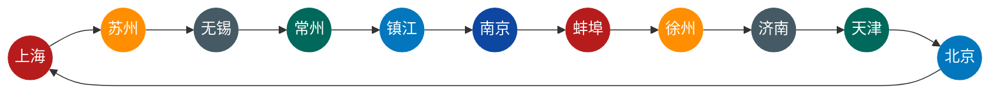

将单链表中终端结点的指针端由空指针改为指向头结点，就使整个单链表形成一个环，这种头尾相接的单链表称为 **<font color="#1565c0">单循环链表，简称循环链表（circular linked list）</font>**

从刚才的例子可以总结出，循环链表解决了一个很麻烦的问题。如何从当中一个结点出发，访问到链表的全部结点

为了使空链表与非空链表处理一致，我们通常设一个头结点，当然，这并不是说,循环链表一定要头结点，这需要注意。循环链表带有头结点的空链表如下图所示

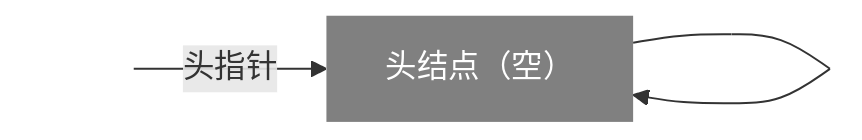

对于非空的循环链表就如下图所示

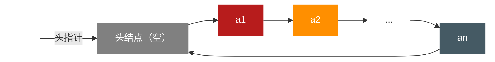

其实循环链表和单链表的主要差异就在于循环的判断条件上，原来是判断 p->next 是否为空，现在则是 p->next 不等于头结点，则循环未结束

在单链表中，我们有了头结点时，我们可以用 O(1)的时间访问第一个结点，但对于要访问到最后一个结点，却需要 O(n)时间，因为我们需要将单链表全部扫描一遍

有没有可能用 O(1)的时间由链表指针访问到最后一个结点呢？当然可以

不过需要改造一下这个循环链表，不用头指针，而是用指向终端结点的尾指针来表示循环链表（如下图所示），此时查找开始结点和终端结点都很方便了

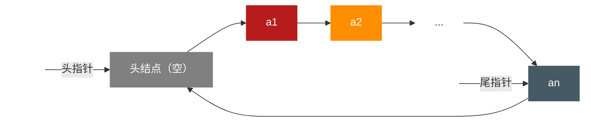

从上图中可以看到，终端结点用尾指针 rear 指示，则查找终端结点的时间复杂度是 O(1)，而开始结点，其实就是 rear->next->next，其时间复杂也为 O(1)

举个程序的例子，要将两个循环链表合并成一个表时，有了尾指针就非常简单了。比如下面的这两个循环链表，它们的尾指针分别是 rearA 和 rearB，如下图所示。

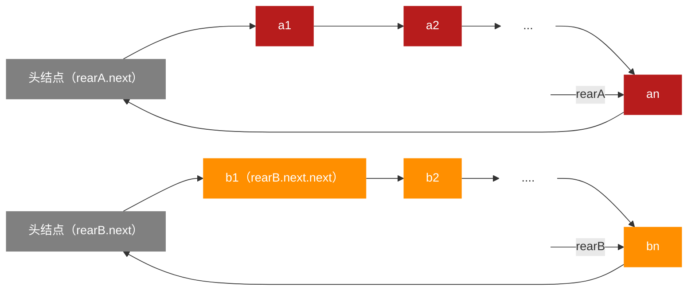

要想把它们合并，只需要如下的操作即可

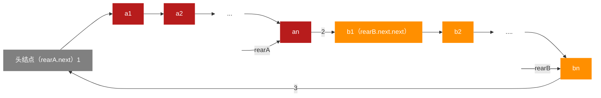

```javascript
p = rearA.next;
rearA.next = rearB.next.next;

q = rearB.next;
rearB.next = p;
```

## 双向链表

继续我们刚才的例子，你平时都是从上海一路停留到北京的，可是这一次，你得先到北京开会，谁叫北京是首都呢，会就是多。开完会后，你需要例行公事，走访各个城市，此时你怎么办?
有人又出主意了，你可以先飞回上海，一路再乘火车走遍这几个城市，到了北京后，你再飞回上海，如下图所示


你会感慨，人生中为什么总会有这样出馊主意的人存在呢？真要气死人才行。哪有这么麻烦，我一路从北京坐火车或汽车倒着一个城市一个城市回去不就完了嘛。如下图所示


对呀，其实生活中类似的小智慧比比皆是，并不会那么的死板教条。我们的单链表，总是从头到尾找结点，难道就不可以正反遍历都可以吗？当然可以，只不过需要加点东西而已

我们在单链表中，有了 next 指针，这就使得我们要查找下一结点的时间复杂度为 0(1)。可是如果我们要查找的是上一结点的话，那最坏的时间复杂度就是 0(n)了，因为我们每次都要从头开始遍历查找

为了克服单向性这一缺点，老科学家们，设计出了双向链表。 **<font color="#1565c0">双向链表(double linked list）是在单链表的每个结点中，再设置一个指向其前驱结点的指针域。</font>** 所以在双向链表中的结点都有两个指针域，一个指向直接后继，另一个指向直接前驱。例如刚才那个例子，我们可以双向连接。如上图所示

既然单链表也可以有循环链表，那么双向链表当然也可以是循环表
双向链表的循环带头结点的空链表如下图所示

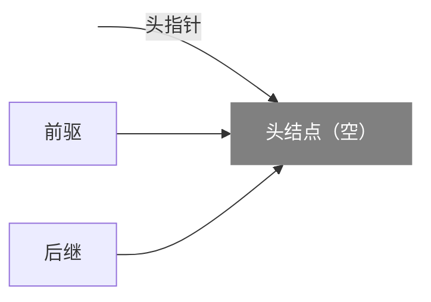

非空的循环带头结点的双向链表如下图所示。

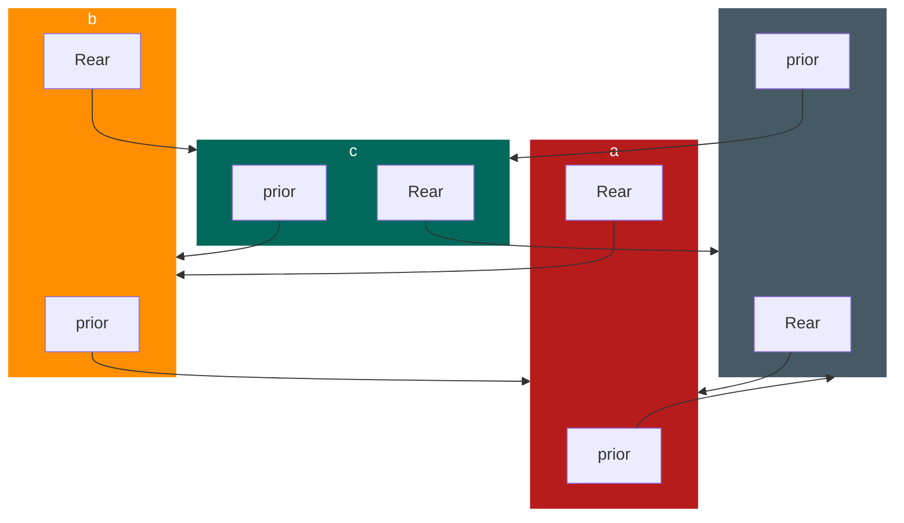

由于这是双向链表，那么对于链表中的某一个结点 p，它的后继的前驱是谁？当然还是它自己。它的前驱的后继自然也是它自己，即:

```javascript
p.next.prior = p = p.prior.next;
```

这就如同上海的下一站是苏州，那么上海的下一站的前一站是哪里？哈哈，有点废话的感觉

双向链表是单链表中扩展出来的结构，所以它的很多操作是和单链表相同的，比如求长度的 ListLength，查找元素的 GetElem，获得元素位置的 LocateElem 等，这些操作都只要涉及一个方向的指针即可，另一指针多了也不能提供什么帮助

就像人生一样，想享乐就得先努力，欲收获就得付代价。双向链表既然是比单链表多了如可以反向遍历查找等数据结构，那么也就需要付出一些小的代价：在插入和删除时，需要更改两个指针变量

插入操作时，其实并不复杂，不过顺序很重要，千万不能写反了

我们现在假设存储元素 e 的结点为 s，要实现将结点 s 插入到结点 p 和 p.next 之间需要下面几步

```javascript
s.prior = p; //把p赋值给s的前驱
s.next = p.next; //把p.next赋值给s的后继
p.next.prior = s; //把s赋值给p.next的前驱
p.next = s; //把s赋值给p的后继
```

关键在于它们的顺序，由于第 2 步和第 3 步都用到了 p.next。如果第 4 步先执行，则会使得 p.next 提前变成了 s，使得插入的工作完不成。所以我们不妨把上面这张图在理解的基础上记忆，顺序是先搞定 s 的前驱和后继，再搞定后结点的前驱，最后解决前结点的后继

若要删除，只需要两个步骤

```javascript
p.prior.next = p.next; //把p.next赋值给p.prior的后继
p.next.prior = p.prior; //把p.prior赋值给p.next的前驱
```

简单总结一下，双向链表相对于单链表来说，要更复杂一些，毕竟它多了 prior 指针，对于插入和删除，需要格外小心。另外它由于每个结点都需要记录两份指针，所以在空间上是要占用略多一些的。不过，由于它良好的对称性，使得为某个结点的前后结点的操作带来了方便，可以有效提高算法的时间性能。说白了，就是用空间来换时间

## 总结

先是比较容易的顺序存储结构，指的是用一段地址连续的存储单元依次存储线性表的数据元素。通常是用数组来实现这一结构的

之后由于顺序存储结构的插入和删除操作不方便，引出了链式存储结构。它具有不受固定的存储空间限制，可以比较快捷地插入和删除操作的特点。然后分别介绍了链式存储结构的不同形式，如单链表、循环链表和双向链表

线性表的这两种结构（如下图所示）是后面其他数据结构的基础


**<font color="#1565c0"></font>**
