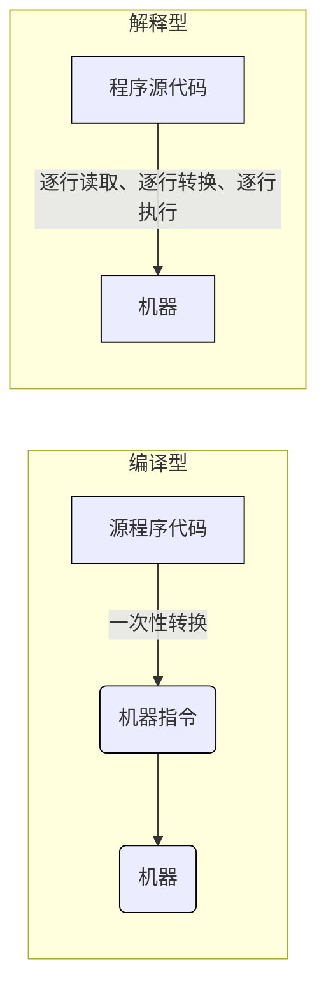

# 编译性和解释性语言

## 区别

### 对比

- 编译性语言不如解释性语言跨平台性好
- 编译型语言运行性能更好

### 共同点

都需要转换成二进制代码才能执行，但转换方式不同

### 不同点

- 执行和生成结果
  - 编译型语言要等全部写完后通过编译器去生成一个类似\*.exe 的二进制文件，然后执行这个文件才可以看到效果
  - 解释型语言并没生成类似\*.exe 文件，而是直接生成效果

- 运行的时候是否需要编译器的伴随
  - 编译型语言运行的是最终生成的二进制代码，所以不需要编译器伴随
  - 解释型语言则一边解释一边运行，所以运行的时候很可能还有部分代码没有解释好，所以需要编译器伴随（解释型语言把该工具叫做解释器）

- 执行速度
  - 编译型语言运行的已经是完全的二进制内容，运行起来十分干净利落，所以速度很快
  - 解释型语言运行的不一定是完全的二进制内容，因为它是一边解释成二进制一边运行

- 可移植性
  - 编译型语言是运行二进制内容，所以一旦CPU指令系统改变，那么之前的二进制文件可能运行不了。比如，如果到其他硬件平台上运行，就可能出现错误，就需要根据该平台重新编译出新的二进制文件。所以可移植性、平台兼容性比较差
  - 解释型语言则没有弄成什么二进制内容，而是在需要的时候才开始编译、运行。所以它自然具有可移植性，即在任何平台都可以马上运行起来

- 版本迭代
  - 编译型语言弄出来的二进制文件若要升级，自然要重新下载一个新的二进制文件。所以重新下载、安装、覆盖是最大的特点。比如微信的升级，就是要重新下载、重新安装、重新覆盖，等个半天而且很耗费CPU资源，体验性就不大好。
  - 解释型的语言只要重新写好源代码即可，用户想要最新的效果，只要刷新一下即可，所以体验性好。比如：某网站平台升级了，用户只要重新刷新一下

- 应用领域
  - 编译型语言应用领域通常是那些安装软件，例如桌面上的安装软件
  - 解释型的语言的应用领域通常是互联网、网站等那种刷新了一下就可以看到最新效果的领域。

## 总结

两类编程语言都各有优劣，无对错之分

